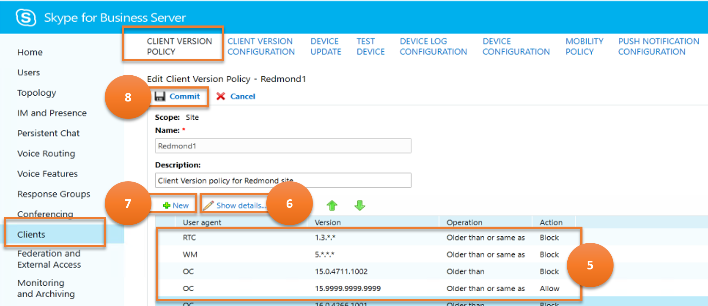

## Client Version Policy

 Returns information about the clients that are supported in your Skype for Business Server environment. Client version policies enable you to specify those clients who will be able to log on to your Skype for Business Server system.

Let us consider various scenarios and how do they map to Skype for Business cmdlets.

---
> **Scenario 1 :** List all the client version policies


***Cmdlet***

[Get-CsClientVersionPolicy](https://docs.microsoft.com/en-us/powershell/module/skype/get-csclientversionpolicy?view=skype-ps)

***Example***

```powershell
 Get-CsClientVersionPolicy
```

---

> **Scenario 2 :** Create a new client version policy


***Cmdlet***

[New-CsClientVersionPolicy](https://docs.microsoft.com/en-us/powershell/module/skype/new-csclientversionpolicy?view=skype-ps)  

***Example***

```powershell
 New-CsClientVersionPolicy -Identity site:Redmond
```

---

> **Scenario 3 :** Get details of a selected client version policy


***Cmdlet***

[Get-CsClientVersionPolicy](https://docs.microsoft.com/en-us/powershell/module/skype/get-csclientversionpolicy?view=skype-ps)

***Example***

```powershell
 Get-CsClientVersionPolicy -Identity site:Redmond
```

---

> **Scenario 4 :** Delete selected client version policies


***Cmdlet***

[Remove-CsClientVersionPolicy](https://docs.microsoft.com/en-us/powershell/module/skype/remove-csclientversionpolicy?view=skype-ps)

***Example***

```powershell
 Remove-CsClientVersionPolicy -Identity site:Redmond
```

> **Scenario 5 :** Update client version policy



- **annotation 5**

    ***Cmdlet***

    [Get-CsClientVersionPolicyRule](https://docs.microsoft.com/en-us/powershell/module/skype/get-csclientversionpolicyrule?view=skype-ps)

    ***Example***

    ```powershell
    Get-CsClientVersionPolicyRule -Filter "Global/*"
    ```

- **annotation 6**

    ***Cmdlet***

    [Get-CsClientVersionPolicyRule](https://docs.microsoft.com/en-us/powershell/module/skype/get-csclientversionpolicyrule?view=skype-ps)

    ***Example***

    ```powershell
    Get-CsClientVersionPolicyRule -Identity "Global/2336c611-a243-4c5d-994b-eea8a524d0e4"
    ```

- **annotation 7**

    ***Cmdlet***

    [New-CsClientVersionPolicyRule](https://docs.microsoft.com/en-us/powershell/module/skype/new-csclientversionpolicyrule?view=skype-ps)

    ***Example***

    ```powershell
    $x = \[guid\]::NewGuid()

    New-CsClientVersionPolicyRule -Parent "site:Redmond" -RuleId $x -MajorVersion 4 -UserAgent InHouse
    ```

- **annotation 8**

    ***Cmdlet***

    [Set-CsClientVersionPolicy](https://docs.microsoft.com/en-us/powershell/module/skype/set-csclientversionpolicy?view=skype-ps)

    ***Example***

    ```powershell
    Set-CsClientVersionPolicy -Identity site:Redmond -Rules $Null

    $x = Get-CsClientVersionPolicy -Identity site:Dublin | Select-Object -ExpandProperty Rules

    Set-CsClientVersionPolicy -Identity site:Redmond -Rules $x
    ```

---
## Client Version Configuration

 Returns information about the clients that are supported in your Skype for Business Server environment. Client version policies enable you to specify those clients who will be able to log on to your Skype for Business Server system.

Let us consider various  scenarios and how do they map to Skype for Business cmdlets.

---
> **Scenario 1 :** List all the client version configurations


***Cmdlet***

[Get-CsClientVersionConfiguration](https://docs.microsoft.com/en-us/powershell/module/skype/get-csclientversionconfiguration?view=skype-ps)

***Example***

```powershell
 Get-CsClientVersionConfiguration
```

---

> **Scenario 2 :** Create a new client version configuration


***Cmdlet***

[New-CsClientVersionConfiguration](https://docs.microsoft.com/en-us/powershell/module/skype/new-csclientversionconfiguration?view=skype-ps)  

***Example***

```powershell
 New-CsClientVersionConfiguration -Identity site:Redmond -Enabled $False
```

---

> **Scenario 3 :** Get details of a selected client version configuration


***Cmdlet***

[Get-CsClientVersionConfiguration](https://docs.microsoft.com/en-us/powershell/module/skype/get-csclientversionconfiguration?view=skype-ps)

***Example***

```powershell
 Get-CsClientVersionConfiguration -Identity site:Redmond
```

---

> **Scenario 4 :** Delete selected client version policies


***Cmdlet***

[Remove-CsClientVersionConfiguration](https://docs.microsoft.com/en-us/powershell/module/skype/remove-csclientversionconfiguration?view=skype-ps)

***Example***

```powershell
 Remove-CsClientVersionConfiguration -Identity site:Redmond
```

> **Scenario 5 :** Update client version configurations


***Cmdlet***

[Set-CsClientVersionConfiguration](https://docs.microsoft.com/en-us/powershell/module/skype/set-csclientversionconfiguration?view=skype-ps)

***Example***

```powershell
Get-CsClientVersionConfiguration | Set-CsClientVersionConfiguration -DefaultURL "https://litwareinc.com/csclients"
```

---

> **Scenario 6 :** Enable/disable client version configurations

[Set-CsClientVersionConfiguration](https://docs.microsoft.com/en-us/powershell/module/skype/set-csclientversionconfiguration?view=skype-ps)

***Example***

```powershell
Set-CsClientVersionConfiguration -Identity site:Redmond -Enabled $False
```

## Test Device

Test devices provide a way for administrators to test firmware updates before those updates are distributed to all the devices in an organization

Let us consider various  scenarios and how do they map to Skype for Business cmdlets.

---
> **Scenario 1 :** Lists all the test devices


***Cmdlet***

[Get-CsTestDevice](https://docs.microsoft.com/en-us/powershell/module/skype/get-cstestdevice?view=skype-ps)

***Example***

```powershell
 Get-CsTestDevice
```

---

> **Scenario 2 :** Create a new test device


***Cmdlet***

[New-CsTestDevice](https://docs.microsoft.com/en-us/powershell/module/skype/new-cstestdevice?view=skype-ps)  

***Example***

```powershell
 New-CsTestDevice -Identity site:Redmond/UCPhone -IdentifierType SerialNumber -Identifier "07823-A345"
```

---

> **Scenario 3 :** Get details of a selected test device


***Cmdlet***

[Get-CsTestDevice](https://docs.microsoft.com/en-us/powershell/module/skype/get-cstestdevice?view=skype-ps)

***Example***

```powershell
 Get-CsTestDevice -Identity site:Redmond/UCPhone
```

---

> **Scenario 4 :** Delete a selected test device


***Cmdlet***

[Remove-CsTestDevice](https://docs.microsoft.com/en-us/powershell/module/skype/remove-cstestdevice?view=skype-ps)

***Example***

```powershell
 Remove-CsTestDevice -Identity site:Redmond
```

> **Scenario 5 :** Update a test device


***Cmdlet***

[Set-CsTestDevice](https://docs.microsoft.com/en-us/powershell/module/skype/set-cstestdevice?view=skype-ps)

***Example***

```powershell
Set-CsTestDevice -Identity site:Redmond/UCPhone -IdentifierType SerialNumber -Identifier "09768-ABDR-83295"
```

---

## Device Log Configuration

These settings help manage the Device Update Web service, a Skype for Business Server component that enables administrators to distribute firmware updates to telephones and other devices running Skype for Business.

Let us consider various  scenarios and how do they map to Skype for Business cmdlets.

---
> **Scenario 1 :** List all the device log configurations


***Cmdlet***

[Get-CsDeviceUpdateConfiguration](https://docs.microsoft.com/en-us/powershell/module/skype/get-csdeviceupdateconfiguration?view=skype-ps)

***Example***

```powershell
 Get-CsDeviceUpdateConfiguration
```

---

> **Scenario 2 :** Create a new device log configuration


***Cmdlet***

[New-CsDeviceUpdateConfiguration](https://docs.microsoft.com/en-us/powershell/module/skype/new-csdeviceupdateconfiguration?view=skype-ps)  

***Example***

```powershell
 New-CsDeviceUpdateConfiguration -Identity site:Redmond "07823-A345"
```

---

> **Scenario 3 :** Get details of a selected device log configuration


***Cmdlet***

[Get-CsDeviceUpdateConfiguration](https://docs.microsoft.com/en-us/powershell/module/skype/get-csdeviceupdateconfiguration?view=skype-ps)

***Example***

```powershell
 Get-CsDeviceUpdateConfiguration -Identity Global
```

---

> **Scenario 4 :** Delete selected device log configurations


***Cmdlet***

[Remove-CsDeviceUpdateConfiguration](https://docs.microsoft.com/en-us/powershell/module/skype/remove-csdeviceupdateconfiguration?view=skype-ps)

***Example***

```powershell
 Remove-CsTestDevice -Identity site:Redmond
```

> **Scenario 5 :** Update device log configurations


***Cmdlet***

[Set-CsDeviceUpdateConfiguration](https://docs.microsoft.com/en-us/powershell/module/skype/set-csdeviceupdateconfiguration?view=skype-ps)

***Example***

```powershell
Set-CsDeviceUpdateConfiguration -Identity global -MaxLogFileSize 2048000 -MaxLogCacheLimit 1024000
```

---
