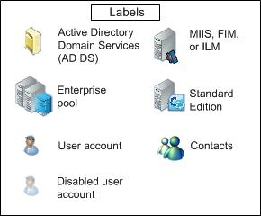

[!INCLUDE [disclaimer](disclaimer.md)]


# Formatting Cheat Sheet

## Headings

Use heading formatting to create hierarchy in articles. To create a heading, add one to six # symbols before your heading text. The number of # you use will determine the level of the heading. We use a single hashtag for the article title, so subordinate levels use level plus one hashtags.

# Article Title 
## Head level1
### Head level2
#### Head level3
##### Head level4
###### Head level5  

 On docs.microsoft.com, level-2 headings automatically show up in an **In this article** section in the right rail, so you can use level-2 headings to auto-matically create navigation for your article. 

If you only need 1 heading levels, you can use the = (for article title) and – (for H1) characters under the heading lines to create headings. This may not get caught by the "in this article" function. Please test it out.

Article title
=== 
Heading - first level header
--- 

## Office voice guidelines

Use the [Office Voice guidelines](https://worldready.cloudapp.net/Styleguide/Read?id=2665&topicid=29059) for writing style (including voice & tone), word choice, article organization, keywording for SEO, and so much more!

Check out the [Office Style Guide](http://aka.ms/OfficeStyleGuide) for the nitty gritty.

Text styles
===
Indicate emphasis with bold, italic, or strikethrough text.

**bold text**

*italicized text*

~~This text has a strikethrough line~~

**This text is bold _and italic_**

Code examples
===
Enclose inline code or a command within a sentence with single backticks.
Use `git status` to list all new or modified files that haven't yet been committed.
Use triple backticks ` or triple tildes ~ to format a block of code.
Some basic Git commands are:
```
git status
git add
git commit
```
Lists
===
You can make an unordered list by preceding one or more lines of text with a single  - , +, or *.  Changing the character you use starts a new list.

- George Washington
- John Adams
- Thomas Jefferson

To order your list, precede each line with a number followed by a period.
1. James Madison
2. James Monroe
3. John Quincy Adams

Nested Lists
---
You can also create nested lists by aligning your list visually with the list above it.
Type space characters until the list marker character (-, + or *) lies directly below the first character of the text in the list item above it.
1. First level item in first line.
   - First level nested list item
     + Second level nested list item

Task lists
---
To create a task list, preface list items with [ ]. To mark a task as complete, use [x].
- [x] Finish my changes
- [ ] Push my commits to GitHub
- [ ] Open a pull request

Links
===
Create an inline link by wrapping link text in square brackets [ ], and then wrapping the URL in parentheses ( ).
This site was built using [GitHub Pages](https://pages.github.com/).

Section links
---
Link directly to a section in a rendered file by hovering over the section heading to expose the link. Copy and paste the link and add link text as usual. 

Relative links
---
Define relative links and image paths in your rendered files to help readers navigate to other files in your repository.

A relative link is a link that is relative to the current file. For example, if you want to link to the [disclaimer](disclaimer.md) file included at the beginning of this file. 

GitHub will automatically transform your relative link or image path based on whatever branch you're currently on, so that the link or path always works. You can use all relative link operands, such as ./ and ../.
Relative links are easier for users who clone your repository. Absolute links may not work in clones of your repository. 

URLs
---
GitHub automatically creates links from standard URLs in inline text. The http:// is optional so long as www is present and followed by a valid domain. For example:

Visit https://github.com

Visit www.github.com

Quoting text
===
Indicate quoted text with a > character.

In the words of Abraham Lincoln:
> Pardon my French

Paragraphs and line breaks
===
You can create a new paragraph by leaving a blank line between lines of text.

A backslash at the end of the line creates a hard line break.

Lorem ipsum dolor sit amet, \
consectetur adipiscing elit, sed do eiusmod tempor incididunt ut labore et dolore magna aliqua. \
Ut enim ad minim veniam, quis nostrud exercitation ullamco laboris nisi ut aliquip ex ea commodo consequat. \
Duis aute irure dolor in reprehenderit in voluptate velit esse cillum dolore eu fugiat nulla pariatur. \
Excepteur sint occaecat cupidatat non proident, sunt in culpa qui officia deserunt mollit anim id est laborum.

     Leading spaces at the beginning of the next line are ignored.

Line breaks can occur inside emphasis, links, and other constructs that allow inline content.

Line breaks do not occur inside code spans or HTML tags.

Tables
===
Create tables with pipes | and hyphens -. Hyphens separate a column's header from the body rows, pipes separate columns from each other. Always include a blank line before your table.

| Header cell1 | Header cell2 |
| ---          | ---          |
| Content Cell | Content Cell |
| Content Cell | Content Cell |

The pipes on either end of the table are optional.
Cells can vary in width and do not need to align within columns. There must be at least three hyphens in each column of the header row. 

You can align text to the left, right, or center of a column by including colons to the left, right, or on both sides of the hyphens within the row separating the header.

| Left-Align  | Centered  | Right-aligned  |
| :---        |  :---:    |    ---:        |
  status      | status    | status         |
  diff        |   diff    | diff 

HTML
===
It’s possible to use blocks of well-formed HTML in a markdown document. See https://github.github.com/gfm/#raw-html  and https://github.github.com/gfm/#disallowed-raw-html-extension- 

<a name="xrefs">Cross references</a>
---
You can create a named link anchor/target using the HTML syntax shown below. You can link to the named location in the same file, or from another file.   
```
Take me to <a href="#pookie">pookie</a>

... 

<a name="pookie">this is pookie</a>
```
We had this functionality in DX, with the limitation that it had to be in a section heading. That limitation doesn't appear to apply in Markdown, but as a best practice it may be a good idea to do it that way anyway.

Special characters
---
Markdown supports using HTML Symbols for special characters. Some examples you might need include:

&#x2713;  &#x2714;  supported checkmark, alternates:  &#x2611;  \
&#x2717; &#x2718; unsupported cross-out (or leave blank) &#x2610; &#x2612; \
&dagger; dagger  &Dagger; Double Dagger   \
&copy; copyright 
&#8482; or &trade; TRADEMARK \
&#174; or &reg; REGISTERED SIGN \
&#x2013; en dash &#x2014; em dash \
&#8226; or &bull; or &#8227; or  &#9702;  Bullet (usable in tables)\
&nbsp;&nbsp;&nbsp; nonbreaking space \
&sect; Section character \
&sup1; &sup2; &sup3; superscript numbers \
&hellip; Ellipsis \
&frac14; &frac12; &frac34;  Fractions \
&#8544; &#8545; &#8546; &#8547; &#8548;  &#8549; &#8550; &#8551; &#8552; &#8553; \
&#8560; &#8561; &#8562; &#8563; &#8564; &#8565; &#8566; &#8567; &#8568; &#8569;\
&#x2776; &#x2777; &#x2778; &#x2780; &#x2781; &#x2782; &#x278A; &#x278B; &#x278C; 

It's possible to trick a Markdown table into looking like it contains a bullet list using HTML symbols and just the  linebreak tag:

| Header cell1 | Header cell2 |
| ---          | ---          |
| Content Cell |intro text  <br>&nbsp;&nbsp;&nbsp; &bull;&nbsp;&nbsp; list item1<br> &nbsp;&nbsp;&nbsp; &bull;&nbsp;&nbsp; list item2     |
| Content Cell | Content Cell |

## Apostrophes and quotation marks

If you copy from Word into a Markdown editor, the text might contain "smart" (curly) apostrophes or quotation marks. These need to be encoded or changed to a basic apostrophe/quotation mark, otherwise you end up with things like this when the file is published: It’s
 
Here are the encodings for the "smart" versions of these punctuation marks:

Left (opening) quote mark: &#8220; \
Right (closing) quote mark: &#8221; \
Right closing single quote/apostrophe: &#8217; \
Left opening single quote (rarely used): &#8216; \

## Angle brackets
If you use angle brackets in text (not code) in your file, for example to denote a placeholder, you need to manually encode the angle brackets--otherwise, Markdown thinks that they're intended to be an HTML tag.

For example, encode \<script name\> as &lt;script name&gt;

Text comments
---
<!-- This is a Markdown text comment, it uses the same syntax as XML and HTML  -->
This is a not a Markdown text comment


Horizontal Rules
---
You can produce a horizontal rule by placing three or more asterisks on a line by themselves. If you wish, you may use spaces between the asterisks.  

* * *

***

*****
<!-- This usage does not appear in the GitHub Flavored Markdown Spec. Nevertheless it renders as desired in Visual Studio Code preview, so for the moment we can consider it usable until demonstrated otherwise. -->


Images
===
Syntax for images resembles the syntax for links, with these differences: 
+	The link starts with 

Ignoring Markdown formatting
===
You can tell GitHub to ignore (or escape) Markdown formatting by using \ before the Markdown character.

Let's rename \*our-new-project\* to \*our-old-project\*.

Any ASCII punctuation character may be backslash-escaped:

\!\"\#\$\%\&\'\(\)\*\+\,\-\.\/\:\;\<\=\>\?\@\[\\\]\^\_\`\{\|\}\~

Backslashes before other characters render as literal backslashes:

\→\A\a\ \3\φ\«

\* If you want to use a plain ol' asterisk, precede it with a \ character.

\*\*Same thing for 2 asterisks...

More info
===
https://github.github.com/gfm/


Alerts
===

> [NOTE]
> Here's a note. It's a very nice note.

> [!IMPORTANT]
> Here's an Important alert change again

> [!WARNING]
> Here's a warning

> [!TIP]
> Here's a tip. it's fifty cents.

Here's a link to a graphic:



