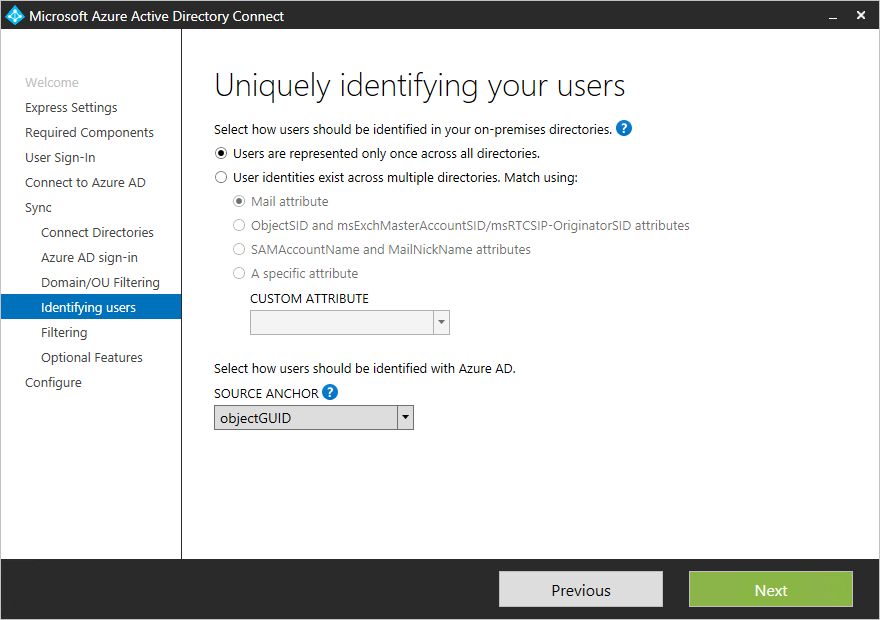

# Appendix: Detailed steps for cloud consolidation

This appendix includes detailed steps for cloud consolidation, including updating the edge certificate, disabling hybrid to complete migration to the cloud, and updating ADD Connect to include more than one forest. See [Cloud Consolidation for Teams and Skype for Business](cloud-consolidation.md) for more information.

## Updating the edge certificate

This is the key step to ensure that an on-prem environment with SipDomain1 can join a cloud environment with SipDomain2 and ensure proper routing in a shared address space environment across the twi sip domains. In our examples, SipDomain1 is AcquiredCompany.<span>com and SipDomain2 is OriginalCompany.<span>com.

The subject alternate name (SAN) of the certificate on all edge servers in the on-premises environment must be updated to include all sip domains that exist in the pure online tenant (excluding any onmicrosoft.<span>com domains), in the form “sip.\<domain>”.  In our example, this is sip.OriginalCompany.<span>com. This step is critical to do before migrating any users to the cloud.

**Steps:**

1.	Obtain a new External Edge certificate for the edge that has all existing entries plus additional entries in the SAN for all sip domains in the cloud environment in the form “sip.<DomainName>”.
2.	Install the certificate locally on each edge server and assign it to the Skype Edge service on each of the edge service.  For detailed steps, see the section “External Edge interface certificates” in [Deploy Edge Service in Skype for Business Server 2015](https://technet.microsoft.com/en-us/library/dn951368.aspx).
3.	Restart the Edge service on each of the edge servers. You can do this for a single box with the following PowerShell commands:

    ```
    Stop-CsWindowsService
    Start-CsWindowsService
    ```

## Disabling hybrid to complete migration to the cloud

After you have moved all users from on-premises to the cloud, you can decommission the on-premises Skype for Business deployment. Aside from removing any hardware, a critical step is to logically separate that on-premises deployment from Office 365 by disabling hybrid. Disabling hybrid consists of 3 steps:

1.	Disable split domain in the Office 365 tenant.
2.	Disable ability in on-prem to communicate with Office 365.
3.	Update DNS records to point to Office 365.

These steps should be done together as a unit. Details are provided below.

> [!Note] 
> Any federated organizations that have an allowed domain entry for your sip domain(s) will need to update their allowed domain entries to remove the proxy FQDN. We recommend that you send all your federated partners a communication about this as you prepare to complete your migration to the cloud.

1.	*Disable shared SIP address space in Office 365 tenant.*
The command below needs to be done from a Skype for Business Online PowerShell window.

    `Set-CsTenantFederationConfiguration -SharedSipAddressSpace $false`
 
2.	*Disable ability in on-prem to communicate with Office 365.*  
The command below needs to be done from an on-premises PowerShell window.  If you have previously imported a Skype for Business Online session, start a new Skype for Business PowerShell session.

    `Get-CsHostingProvider|Set-CsHostingProvider -Enabled $false`

3.	*Update DNS to point to Office 365.*
The organization’s external DNS for the on-premises organization needs to be updated so that Skype for Business records point to Office 365 instead of the on-premises deployment. Specifically:

    |Record type|Name|TTL|Value|
    |---|---|---|---|
    |SRV|_sipfederationtls._tcp|3600|100 1 5061 sipfed.online.lync.<span>com|
    |SRV|_sip._tls|3600|100 1 443 sipdir.online.lync.<span>com|
    |CNAME|	lyncdiscover|	3600|	webdir.online.lync.<span>com|
    |CNAME|	sip|	3600|	sipdir.online.lync.<span>com|
    |CNAME|	meet|	3600|	webdir.online.lync.<span>com|
    |CNAME|	dialin	|3600|	webdir.online.lync.<span>com|

 
## Updating AAD Connect to include more than one forest

Azure AD Connect supports [syncing from multiple forests](https://docs.microsoft.com/en-us/azure/active-directory/connect/active-directory-aadconnect-topologies). However, it supports only one instance of Azure AD Connect syncing to AAD. Therefore, in cases where Azure AD is already installed in one forest, the existing instance of AAD Connect must be updated to sync from the additional forest.

 - If all identities are represented only once across both forests (that is, you haven’t made any mail-enabled contacts), then you can simply re-run the AAD Connect wizard, choose “Customize synchronization options,” and then on the **Connect Your Directories** page, enter the name of the additional forest and creds.<br><br>
 
 - However, if users can exist in more than one directory and you’ll be merging the data (for example, if contact objects exist in a forest corresponding to users in another forest), you will need to uninstall Azure AD Connect and re-install it.  This is because the cross-forest join rules condition can only be configured during the first install. This is done on the following page:<br><br>
 
 
