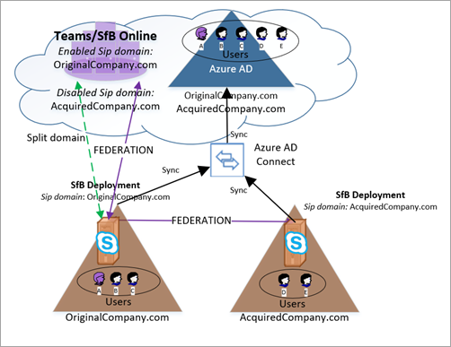
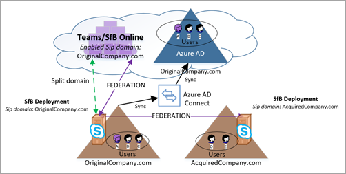

# Cloud consolidation for Teams and Skype for Business

Many large enterprises have more than one on-premises AD forest, and in some cases, customers have more than one Exchange and/or Lync deployment. In addition, even organizations with only one on-premises forest could find themselves in a similar situation via acquisition. As these customers move to the cloud, they want to consolidate the multiple instances of a given on-premises workload into the cloud into a single Office 365 tenant. This article describes how to achieve that consolidation for organizations with on-premises deployment(s) of Skype for Business (or Lync) who want to move to move their UC workload to the Microsoft cloud, e.g., Microsoft Teams and/or Skype for Business Online.

Historically, the guidance has been for customers in this situation to consolidate deployments on-premises first and then move to the cloud. While this is still an option, this article describes a solution based on new functionality that enables organizations with multiple Skype for Business deployments to migrate one deployment at a time into a single Office 365 tenant, without doing on-premises consolidation. Note that even with this new functionality, Skype for Business Online and Microsoft Teams do not support multiple Skype/Lync forests in hybrid mode with a single Office 365 tenant. 

## Overview of cloud consolidation

Consolidation of all users from on-premises into the cloud in a single Office 365 tenant can be achieved for any organization with multiple Skype for Business deployments, provided that the following key requirements are met:

- There must be at most one Office 365 tenant involved. Consolidation in scenarios with more than one Office 365 tenant is not supported.
- At any given time, only one on-premises Skype for Business forest can be in hybrid mode (shared sip address space). All other on-premises Skype for Business forests must remain on-premises (and presumably federated with each other).  Note that these other on-premises organizations *can* sync to AAD if desired with [new functionality to disable online SIP domains](https://docs.microsoft.com/en-us/powershell/module/skype/disable-csonlinesipdomain?view=skype-ps) available as of November 2018.

Customers with deployments of Skype for Business in multiple forests must fully migrate each Skype for Business forest individually into the Office 365 tenant using split-domain (Shared Sip Address Space) functionality, and then disable hybrid with the on-premises deployment, before moving on to migrate the next on-premises Skype for Business deployment. Furthermore, prior to being migrated to the cloud, on-premises users remain in a federated state with any users that are not represented in the same user’s on-premises directory.  

## Canonical example of cloud consolidation

Consider an organization with two separate federated on-premises deployments of Skype for Business that wants to consolidate them in Microsoft Teams.

|Original state details |Desired state details |
|---------|---------|
|<ul><li>2 independent Skype for Business on-premises deployments in separate AD forests<li>At most 1 forest is in hybrid with Skype for Business Online <li> Orgs are federated with each other <li>Users are not synced across these forests<li> The org may have an Office 365 tenant and may be syncing their directory</ul>|<ul> <li>1 Office 365 tenant<li>No more on-premises deployments, so no hybrid remaining<li>All users from on-premises are now Teams-only users <li>No on-premises footprint of Skype for Business anywhere <li>Users still have on-premises authentication</ul> |

  

The basic steps to get from the original state to the desired end state are below.  Note that some organizations may find that their starting point is somewhere in the middle of these steps. See [Other starting points](#other-starting-points), later in this article. Finally, in some cases the order can be adjusted, depending on need. [Key constraints and limitations](#limitations) are described later.

1.	Get an Office 365 tenant if one does not yet exist.
2.	Make sure all relevant SIP domains across both on-premises deployments are verified Office 365 domains.
3.	Pick one Skype for Business deployment that will be hybrid with Office 365. In this example, we’ll use OriginalCompany.com.
4.	[Enable AAD Connect for the forest](configure-azure-ad-connect.md) that will first become hybrid (OriginalCompany.com). 
5.	It is recommended at this point (but not yet required until step 10) to [enable AAD Connect for the other forest](cloud-consolidation-aad-connect.md) (AcquiredCompany.com). Assuming AAD Connect is enabled in both forests, the org looks like **[Figure A](#figure-a)**, which may be a common starting point for some orgs. 
6.	For any SIP domains hosted by other on-premises deployments (in this case, AcquiredCompany.com), [disable these SIP domains in online](https://docs.microsoft.com/en-us/powershell/module/skype/disable-csonlinesipdomain) using Disable-CsOnlineSipDomain in PowerShell. (This is new functionality as of Nov 2018.)
7.	[Configure Skype for Business hybrid](configure-federation-with-skype-for-business-online.md) for OriginalCompany.com (the one deployment that still has enabled online sip domains).
8.	Start moving users from Skype for Business on-premises in OriginalCompany.com to the cloud (whether Teams Only or not) so that account is homed in Skype for Business Online. Now the organization looks like **[Figure B](#figure-b)**. The key changes from Figure A are:
    - Users from both on-premises directories are now in AAD.
    - AcquiredCompany.com is a disabled sip domain in Teams.
    - Some users have been moved online to Teams. (See purple user A.)
9.	Once all users are moved to the cloud, [disable hybrid with the Skype for Business on-premises deployment](cloud-consolidation-disabling-hybrid.md) for OriginalCompany.com from Office 365:  
    - Disable split domain in the Office 365 tenant.
    - Disable the ability to communicate with Office 365 in OriginalCompany.com on-premises.
    - Update DNS records for OriginalCompany.com to point to Office 365.
10.	If not done already, [enable AAD Connect for the next forest](cloud-consolidation-aad-connect.md) that will go hybrid (AcquiredCompany.com). At this point, the organization looks like **[Figure C](#figure-c)**. This may be another common starting point for some organizations.
11.	In PowerShell, [enable the sip domains for the next on-premises deployment](https://docs.microsoft.com/en-us/powershell/module/skype/enable-csonlinesipdomain?view=skype-ps) that will go hybrid, AcquiredCompany.com. This is done using Enable-CsOnlineSipDomain, which is new functionality available as of Nov 2018.
12.	Update the on-premises environment to accept any SIP domains from the online tenant, so they match.
    - [Update the SAN in all edge certs](cloud-consolidation-edge-certificates.md) to be the same value as before, plus values for any existing online SIP domains, in this case, Sip.OriginalCompany.com.
    - Make sure OriginalCompany.com is an allowed domain in the on-premises deployment, AcquiredCompany.
13.	[Enable Skype for Business hybrid](configure-federation-with-skype-for-business-online.md) between on-premises AcquiredCompany.com and the cloud.
14.	As desired, migrate users from on-premises to the cloud.   You can migrate users either directly to TeamsOnly mode or you can migrate them first to Skype for Business Online. During this state, the organization looks like **[Figure D](#figure-d)**.
15.	Once all users are migrated, [disable hybrid with the on-premises environment](cloud-consolidation-disabling-hybrid.md) to *make the organization pure cloud*!

The diagrams below show the configuration at various key points during this process.

##### Figure A:
- Both organizations sync via AAD Connect, so AAD now has all users from both on-premises deployments.
- All users homed on-premises.  
- Skype for Business Hybrid is *not* yet configured.
- If users in either deployment use Teams, they won’t be able to federate with each or (or any organization), nor will they be able interop with any Skype for Business users. Microsoft recommends using Teams for Channels only while in this stage.  
    

##### Figure B:
- AcquiredCompany.com is a disabled online sip domain in Teams/Skype for Business Online. All users are on-premises. If they use Teams they do not have federation or interop. Microsoft recommends using Teams for Channels only while in this stage.
- Skype for Business Hybrid has been enabled for one of the on-premises organizations.
- Some users in hybrid organization have been moved to the cloud (user A as indicated by purple shading). These users can be Teams Only users with full interop and federation support.  
    

##### Figure C:
- All users from OriginalCompany.com are now in the cloud (homed in Skype for Business Online). It’s recommended that they also be Teams Only.
- Skype for Business hybrid configuration with the OriginalCompany.com deployment has been disabled. The on-premises deployment is gone.
- If AcquiredCompany.com wasn’t previously syncing to AAD, to continue from here it needs to be synced now. But it is not yet hybrid (split domain).  
    

##### Figure D:
- AcquiredCompany.com is now enabled as an online sip domain in Teams.
- On-premises is updated to accept OriginalCompany.com (both allowed domain, and edge certs updated).
- Split domain is enabled between AcquiredCompany.com and Office 365 tenant.
- Some users in the hybrid organization may have been moved to the cloud, such as User D below (indicated by purple shading).  
    

## Other starting points

The steps in the canonical example above assume that the organization starts with two federated on-premises deployments with no Office 365 presence. However, some organizations may have an existing Office 365 footprint, and there can be different entry points into the sequence above. There are four typical configurations:

- Multiple federated on-premises organizations with no Office 365 tenant. In this case, start at step 1.
- Multiple federated on-premises organizations that are already syncing multiple Skype for Business forest into a single Azure AD tenant. Such an organization resembles the hypothetical organization in Figure A, which has completed steps 1-5 and should start at step 6.
- A hybrid organization that federates with 1 or more other pure on-premises organizations, none of which sync to AAD. Such an organization would resemble the hypothetical organization in **Figure E**, shown below.
    - This organization is similar to Figure B, which has completed steps 1-8, except:
        - Its non-hybrid Skype for Business deployments are *NOT* yet syncing to Azure AD.
        -  Online sip domains are not yet disabled. 
    - These organizations should either:
        - Complete migration of the existing hybrid organization and enter the above sequence at step 9.  OR,
        - If it is desired to sync any other Skype for Business forests into AAD prior to completing migration of the hybrid organization, then the organization must perform step 6 (disable all online sip domains in any other on-premises Skype for Business deployment that will sync into AAD) and then enable AAD Connect, and only then continue with step 9 (decommission the original hybrid deployment).       
                **FigureE** 
                
- A pure Skype for Business Online organization (which may or may not be using Teams) that federates with a separate on-premises Skype for Business organization. Such an organization resembles the hypothetical organization shown in **[Figure C](#figure-c)** that has completed steps 1-9 and possibly 10, depending on whether the on-premises organization is already syncing to AAD.

## Limitations

- There must be at most one Office 365 tenant involved. Consolidation in scenarios with more than one Office 365 tenant is not supported.
- Only one on-premises Skype for Business forest can be in hybrid mode (shared sip address space) at a time. All other on-premises Skype for Business forests must remain purely on-premises and should be federated with each other and the Office 365 tenant.
- Prior to being migrated to the cloud, there is an asymmetric experience for users in this deployment, because not all users in online are represented on-premises:
    - The experience can be summed up as follows:
        - Any user homed online will interact with on-premises users in the hybrid environment as if the user is hybrid.
        - On-premises users in the hybrid deployment will interact with online users who are represented in their on-premises directory as if they were hybrid. 
        - On-premises users in the hybrid deployment will interact with online users who are not represented in on-premises AD as federated.
    - In **[Figure D](#figure-d)** above, user E is on-premises in AcquiredCompany.com.  User E will interact with User D (homed online) using the standard hybrid experience,  but user E will have a federated experience with users A, B, and C because they are not represented in the on-premises directory. However, users A, B, and C will interact with user E as if the user were in hybrid.
    - Implications of interaction being hybrid vs. federation:
        - Presence is not automatically subscribed to for federated users unless the user is marked as a contact.
        - Call forwarding does not work between federated domains.
        - Call transfer scenarios are more limited.
        - Throttling may be applied to federated traffic.
- Given this asymmetric experience, official support for calling functionality in cross-premises scenarios between an on-premises user and a cloud user that is not in the on-premises directory is limited to peer to peer only. 
    - Call forwarding, transfer, call queues, etc. between these users is not supported.
    - These non-supported calling scenarios will still appear enabled, but in many cases they will fail in unpredictable ways. 
    - In **[Figure D](#figure-d)** above, user E is on-premises, and calls with users A, B, or C will be supported only as peer to peer. (Calls with user D would not have support limitations.)  However, after the on-premises user E is moved to the cloud, this restriction no longer applies.
- If you have more than one deployment of Skype for Business Server 2019 in your environment, only 1 of those deployment can be configured to use Organizational Auto Attendant, since that feature requires Skype for Business Server hybrid configuration. 
- The order of some of the previous steps can be adjusted. The key requirement that must be met is that if all of these are true:
    - More than one on-premises Skype for Business forest syncing to a single AAD tenant
    - Split domain is enabled with one on-premises forest
    - At least one user in the hybrid organization has been migrated to the cloud    Then, you *must* disable all other online sip domains from any other on-premises Skype for Business forest. Otherwise, federation between online users in the hybrid organization and on-premises users in other organizations will break in one direction.

## Implications

- Because there are limitations in support for advanced calling functionality as described above, **organizations should treat these asymmetric states as transitory as part of migration, and not pursue them as steady state**.  
- Organizations with multiple on-premises Skype for Business deployments should generally start with a deployment that can be fully migrated to the cloud, so that consolidation can continue. It is understood that in some cases there will be holdouts of certain user groups for whom it’s not yet viable to move to Teams. When this is a consideration in scenarios involving multiple Skype for Business forests, start migrating with another forest that does not have these limitations, if at all possible.
- When moving from on-premises to the cloud, users that have delegation relationships and/or are typically are involved in call forwarding scenarios should be moved together as a unit.

## See also

[Update the edge certificate](cloud-consolidation-edge-certificates.md)

[Update AAD Connect to include more than one forest](cloud-consolidation-aad-connect.md)

[Disable hybrid to complete migration to the cloud](cloud-consolidation-disabling-hybrid.md)