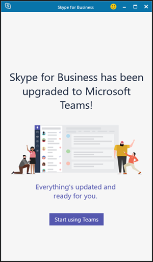
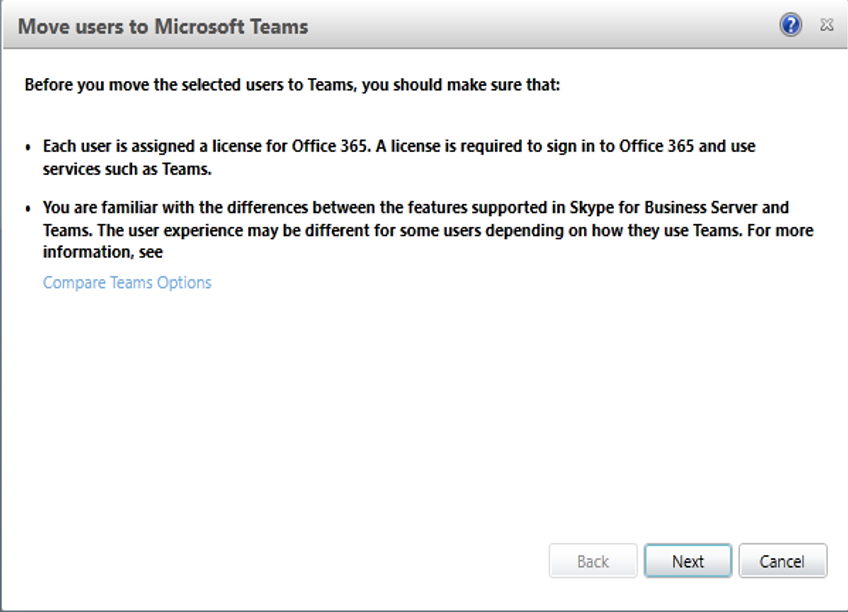
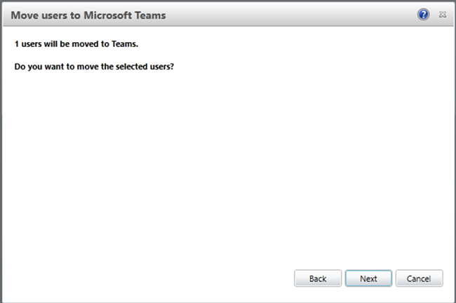
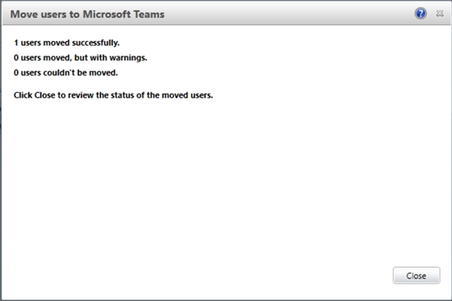
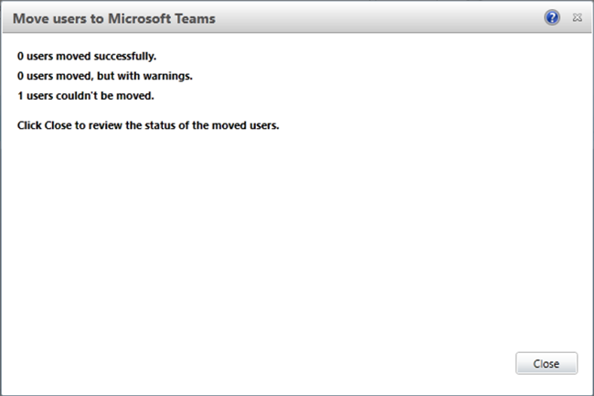

# Move users from on-premises to Teams

With Skype for Business Server 2019, you can migrate your on-premises users to Teams as described in this article.

Be aware that after moving your users to Teams: 
 
- Their meetings are migrated to Skype for Business Online, and their contacts are migrated to Teams. 
- They can join Skype meetings through the Skype for Business rich client (users are not prompted for sign-in each time) or through the Skype Meetings App (requires a one-time download and sign-in). When a user clicks on a Skype for Business meeting link within Teams, the meeting will launch in the appropriate app.

- On Mobile, your users will be able to join existing Skype for Business meetings using the native app only.

> [!NOTE]
> After a user is moved to TeamsOnly mode, the user is homed in Skype for Business Online.

## Prerequisites for moving on-premises users to Teams 

This section describes the prerequisites for moving your on-premises users to Teams. You must:
- [Set up hybrid connectivity](#set-up-hybrid-connectivity) (if you have not already done so)
- [Notify your users of the move to Teams](#notify-your-users-of-the-move-to-teams) (optional)
- [Ensure that your users have a valid license](#make-sure-your-users-have-a-valid-license)
- [Be aware of voice configuration requirements](#voice-configuration-requirements)
- [Assign a Teams Upgrade policy](#assign-a-teams-upgrade-policy) (optional)

## Set up hybrid connectivity
Before you migrate your users, if you have not already done so, you must ensure that you have configured hybrid connectivity between your Skype for Business Server on-premises environment and Skype for Business Online. Hybrid connectivity requires Active Directory synchronization, configuring federation, and so on. For more information, see [Plan hybrid connectivity](plan-hybrid-connectivity.md) and [Configure hybrid connectivity](configure-hybrid-connectivity.md).

## Notify your users of the move to Teams 
This is an optional step, but one that you should consider. To notify users of the pending Teams upgrade, you can use the on-premises TeamsUpgradePolicy and TeamsUpgradeConfiguration cmdlets. You can also configure silent auto-download of Teams in the background prior to upgrade (Win32 clients only). 

For example, to notify users that they are being upgraded to Teams, use the on-premises TeamsUpgradePolicy cmdlet with the -NotifySbUser parameter. You can set the policy on a global, site, pool, or user level. The following command creates and grants a user-level policy:
 
```
New-CsTeamsUpgradePolicy -Identity UpgradeNotice -NotifySfbUser $true 
Grant-CsTeamsUpgradePolicy -Identity user01 -PolicyName “UpgradeNotice”
```

You can check this policy by using the Get-csTeamsUpgradePolicy cmdlet.

Your users will see a notification of the impending move to Teams. The notification occurs on Win32, Mac, Mobile, and Web Clients (with the right version).

You can specify automatic download of Teams (for Win32 clients) for users being upgraded by using the on-premises TeamsUpgradeConfiguration cmdlet with the DownloadTeams parameter. You set this policy at the tenant level, and it can be applied on a global, site, and pool level. For example, the following command sets the policy at the site level:

```
New-CsTeamsUpgradeConfiguration -Identity “site:redmond1” 
```

By default, the value of DownloadTeams is True, but you must also set NotifySfbUser to True to enable Teams for a given user. 

## Make sure your users have a valid license  
Before migration, the on-premises user must be given a valid license, as follows:

- 	User must have a Teams license.
-	If the user is configured to use on-premises Enterprise Voice, they must have an online voice license when moving. 
-	If the user is configured for on-premises dial-in conferencing, they must have a license for Phone System (Cloud PBX).

## Voice configuration requirements

If your on-premises users have on-premises voice, you have two options:

-  **Migrate users with telephony capabilities.** Users can make and receive calls using the Teams client.  You can choose either Microsoft Calling Plan or Direct Routing to connect the telephony services to Teams.  

    -  Microsoft Calling Plan provides an all-in-the-cloud voice solution. For more information about Microsoft Calling Plan, see (link coming soon). 
    -  Direct Routing lets you use virtually any PSTN trunk,  and you can configure interoperability between customer-owned telephony equipment and Microsoft Phone System.  For more information, see [Plan Direct Routing](https://docs.microsoft.com/MicrosoftTeams/direct-routing-plan) and [Configure Direct Routing](https://docs.microsoft.com/MicrosoftTeams/direct-routing-configure).

-  **Migrate users without telephony capabilities.** If you migrate users without preserving  telephony capabilities, make sure users have appropriate licenses in the cloud. 

## Assign a Teams Upgrade policy  
You can use online tools to manage user policies, such as to control routing of incoming messages and calls. For more information, see (link coming soon).

## Move on-premises users to Teams

You can move your on-premises users to Teams by using PowerShell cmdlets or by using the Skype for Business Server 2019 Control Panel.

### Move users by using PowerShell
To move your users to Teams by using PowerShell, you’ll use the Move-CsUser cmdlet with the moveToTeams parameter as follows:

```
Move-CsUser -Identity user0 -Target sipfed.online.lync.com -moveToTeams -credentials $cred. 
```

($cred = get-Credentials. You must provide Office 365 admin credentials.)

> [!NOTE]
> This command sets the TeamsInteropPolicy to Teams and sets the TeamsUpgradePolicy to TeamsOnly mode. 
 
After the move to Teams is successful, the user’s Skype for Business client will display the following message: 



Note that Skype for Business will no longer be available to the user except to join a meeting. 

In rare cases, when moving your users to Teams, you might want to override dial-in conferencing and cloud voice functionality. You can do this by using the following parameters with the Move-CsUser command:
- **BypassAudioConferencingCheck:** If a user has dial-in conferencing enabled for on-premises, the user must also have an AudioConf license assigned in Office 365 before migrating. Once migrated to the cloud, the user will be provisioned for audio conferencing in the cloud. If, for some reason, you want to move a user to the cloud, but not use the audio conferencing functionality, you can override it by specifying this parameter.
- **ByPassEnterpriseVoice:** If a user has Enterprise Voice enabled for on-premises, the user must have an Enterprise Voice license assigned in Office 365 before migrating. After migration to the cloud, the user will be provisioned for voice in the cloud. If, for some reason, you want to move a user to the cloud but not use cloud voice functionality, you can override cloud voice by specifying this parameter.
 
### Move users by using the Skype for Business Server Control Panel 

To move users to Teams by using the Skype for Business Control Panel:

1. Open the Skype for Business Control Panel and sign in to your Office 365 account.

2. Select **Users** in the left navigation, and select the users to migrate. 
     
3. On the **Action** menu, choose **Move selected users to Teams**. 

    
    
4. Click **Next** to confirm your migration. 

After the user is moved to Teams, you will see  confirmations like the following:


<br/><br/>


If the move was not successful, you will see a message like the following:


