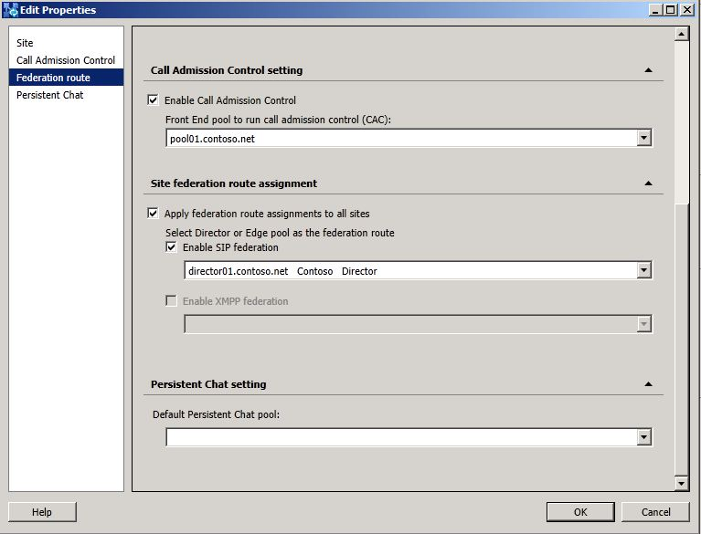
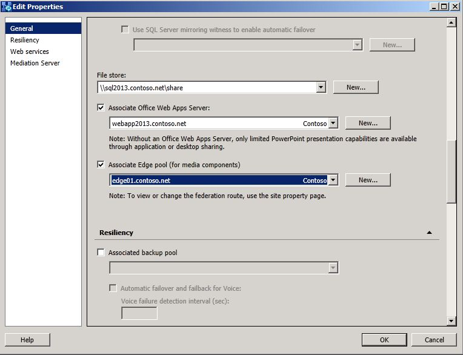

# Connect pilot pool to legacy Edge Servers [W14 to W15]
[]
After deploying Lync Server 2013, you need to configure a federation route for your site. In order to use the federated route that is being used by Lync Server 2010, Lync Server 2013 must be configured to use this route. 
  
To enable the Lync Server 2013 site to use the Director and Edge Server of the Lync Server 2010 deployment, use Topology Builder to associate the legacy Edge pool.
  
## To associate the legacy Edge pool by using Topology Builder

1. Open **Topology Builder**. 
    
2. Select your site, which is directly below the **Lync Server** node. 
    
3. On the **Actions** menu, click **Edit Properties**.
    
4. In the left pane, select **Federation route**.
    
5. Under **Site federation route assignment**, select **Enable SIP federation**, and then select the Lync Server 2010 Director, or the Lync Server 2010 Edge Server if no Director is listed.
    
     
  
6. Click **OK** to close the **Edit Properties** page. 
    
7. In Topology Builder, under the Lync Server 2013 node, navigate to the **Standard Edition server** or **Enterprise Edition Front End pools**, right-click the pool, and then click **Edit Properties**.
    
8. Under **Associations**, select the check box next to **Associate Edge pool (for media components)**. 
    
9. From the list, select the legacy Edge Server. 
    
     
  
10. Click **OK** to close the **Edit Properties** page. 
    
11. In **Topology Builder**, select the top-most node, **Lync Server**.
    
12. From the **Action** menu, click **Publish Topology**, and then click **Next**.
    
13. When the **Publishing wizard** completes, click **Finish**.
    

