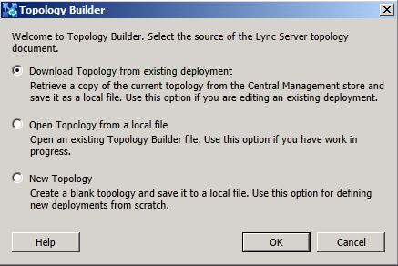
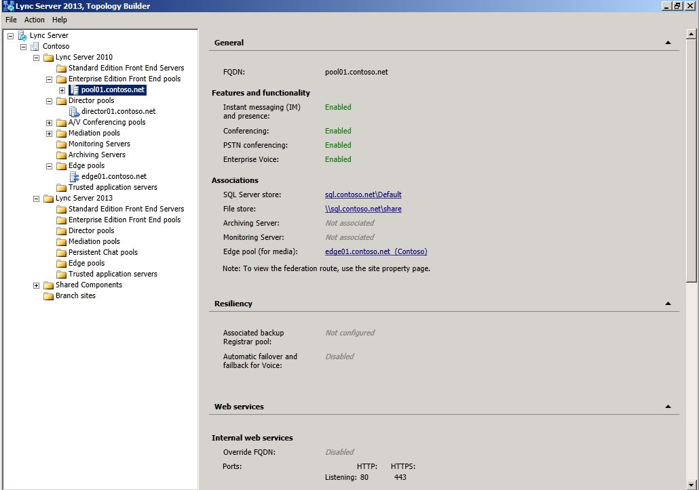

# Download topology from existing deployment
[]
When creating a Lync Server 2013 pool, you will use the Central Management Store that is associated with Lync Server 2010. When you start Topology Builder on first use and subsequent edit sessions, you are prompted for the location where you want Topology Builder to load the current configuration document. Because you already have a Lync Server 2010 topology defined and have established the Central Management store, you should choose to download a topology from an existing deployment. Topology Builder will read the database and retrieve the current definition. 
  
### To download a topology from an existing deployment

1. Open the **Lync Server Deployment Wizard**.
    
2. From the **Lync Server 2013 - Deployment Wizard** page, click **Install Administrative Tools**.
    
3. Start Topology Builder: Click **Start**, click **All Programs**, click **Microsoft Lync Server 2013**, and then click **Lync Server Topology Builder**.
    
4. Select **Download Topology from existing deployment**.
    
     
  
5. Choose a file name and save the topology with the default .tbxml file type.
    
6. Expand the Lync Server node, as shown, to reveal the various server roles in the deployment.
    
     
  

