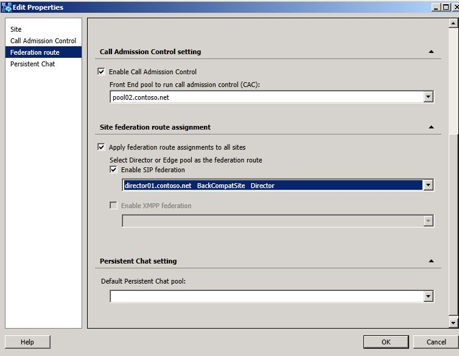
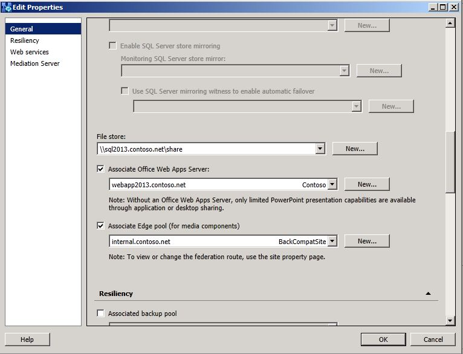

# Connect pilot pool to legacy Edge Servers [OCS 2007 R2 to W15]
[]
After deploying Lync Server 2013, a federation route for this site is not configured. In order to use the federated route that is being used by Office Communications Server 2007 R2, Lync Server 2013 must be configured to use this route. 
  
To enable the Lync Server 2013 site to use the Director and Edge Server of the BackCompatSite, use Topology Builder to associate the legacy Edge pool.
  
## To associate the legacy Edge pool by using Topology Builder

1. Open the pilot pool topology in Topology Builder.
    
2. Select your Lync Server 2013 site.
    
3. On the **Action** menu, click **Edit Properties**.
    
4. Under **Site federation route assignment**, select **Enable SIP federation**, and then select the Office Communications Server 2007 R2 Director, or the Office Communications Server 2007 R2 Edge Server if no Director is listed.
    
     
  
5. Click **OK** to close the **Edit Properties** page. 
    
6. In Topology Builder, under the Lync Server 2013 node, navigate to the **Standard Edition server** or **Enterprise Edition Front End pools**, right-click the pool, and then click **Edit Properties**.
    
7. Under **Associations**, select the check box next to **Associate Edge pool (for media components)**. 
    
8. From the list, select the Edge Server interface for the BackCompatSite.
    
     
  
9. Click **OK** to close the **Edit Properties** page. 
    
10. In **Topology Builder**, select the top-most node, **Lync Server**.
    
11. From the **Action** menu, click **Publish Topology**, and then click **Next**.
    
12. When the **Publishing wizard** completes, click **Finish**.
    

