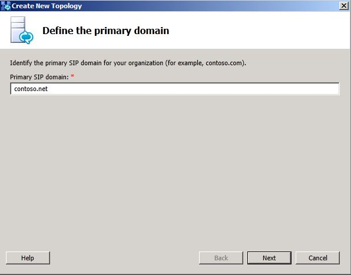
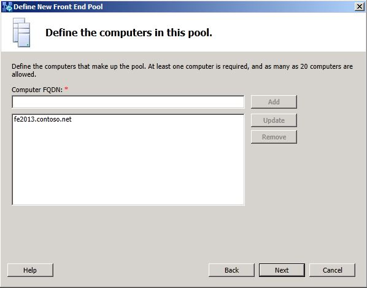
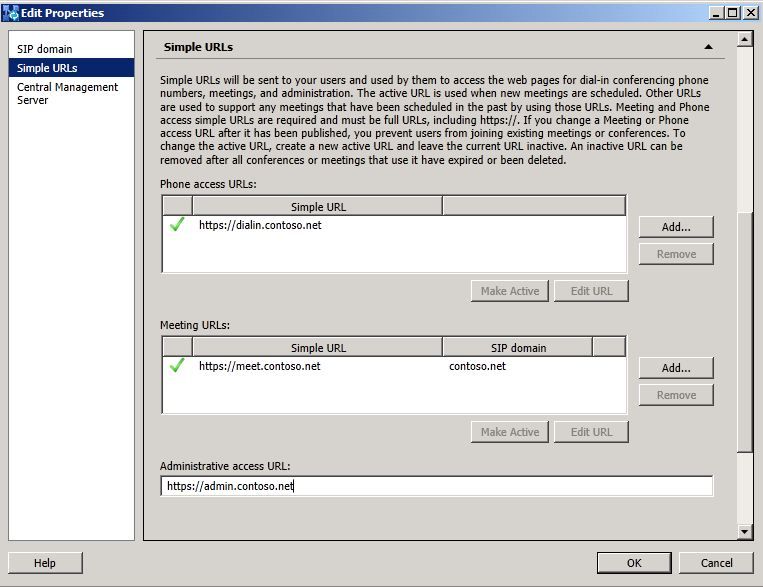
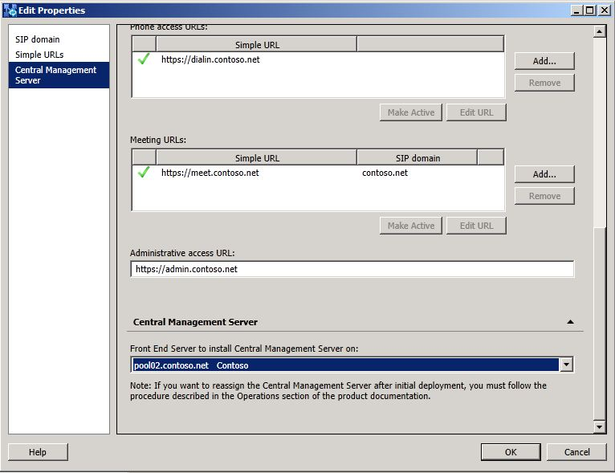
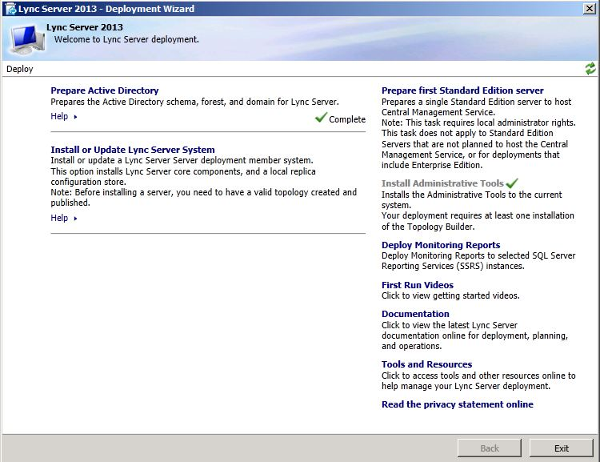

# Deploy Lync Server 2013 pilot pool [OCS 2007 R2 to W15]
[]
One of the first steps required for migration to Lync Server 2013 is to deploy a pilot pool. The pilot pool is where you test coexistence of Lync Server 2013 with your Office Communications Server 2007 R2 deployment. Coexistence is a temporary state that lasts until you have moved all users and pools to Lync Server 2013. 
  
 When you deploy a pilot pool, you use the Define New Front End Pool wizard. You should deploy the same features and workloads in your Lync Server 2013 pilot pool that you have in your Office Communications Server 2007 R2 pool. If you deployed Archiving Server, Monitoring Server, or System Center Operations Manager for archiving or monitoring your Office Communications Server 2007 R2 environment, and you want to continue archiving or monitoring throughout the migration, you need to also deploy these features in your pilot environment. The version you deployed to archive or monitor your Office Communications Server 2007 R2 environment will not capture data in your Lync Server 2013 environment. 
  
> [!NOTE]
> The following procedure discusses features and settings you should consider as part of your overall pilot pool deployment process. This section only highlights key points you should consider as part of your pilot pool deployment. For detailed steps, refer to the [Deploying Lync Server 2013](../../deployment/deploying-lync-server-2013/deploying-lync-server-2013.md) deployment guide. 
  
### To deploy a Lync Server 2013 pilot pool

1. Log on to the computer where Topology Builder is installed as a member of the Domain Admins group and the RTCUniversalServerAdmins group.
    
2. Open Topology Builder and choose to create a new topology.
    
3. Enter the primary SIP domain.
    
     
  
4. Continue completing the wizard until you reach the **Define the New Front End pool** wizard. Click Next. 
    
5. Enter the pool FQDN. When you define your pilot pool, you can choose to deploy an Enterprise Edition Front End pool or a Standard Edition server. Lync Server 2013 does not require that your pilot pool features match what was deployed in your legacy pool.
    
    > [!CAUTION]
    > The pool or server fully qualified domain name (FQDN) that you define for the pilot pool must be unique. It cannot match the name of the currently deployed Office Communications Server 2007 R2 pool, or any other servers currently deployed. 
  
     
  
6. Define the computer that will be added to the pool.
    
     
  
7. On the **Select features** page, select the check boxes for the features that you want on this Front End pool. For example, if you are deploying only instant messaging (IM) and presence features, you would select the Conferencing check box to allow multiparty IM, but would not select the Dial-in (PSTN) conferencing, Enterprise Voice, or Call Admission Control check boxes, because they represent voice, video, and collaborative conferencing features. For additional information on selecting features, see [Define and configure a Front End pool or Standard Edition server in Lync Server 2013](../../deployment/deploying-lync-server-2013/define-and-configure-a-front-end-pool-or-standard-edition-server.md) in the Deployment documentation. 
    
     
  
8. On the **Select collocated server roles** page, we recommend you collocate the Mediation Server in Lync Server 2013. When merging a legacy topology with Lync Server 2013, we require that you first collocate the Office Communications Server 2007 R2 Mediation Server. After merging the topologies and configuring the Lync Server 2013 Mediation Server, you can decide whether to keep the collocated Mediation Server, or change it to a stand-alone server when you move the Mediation Server role to Lync Server 2013 later in the deployment process. 
    
     
  
9. On the **Associate server roles with this Front End pool** page, during pilot pool deployment, do not choose the **Enable an Edge pool to be used by the media component of this Front End pool** option. This is a feature you will enable and bring online in a later phase of migration. Keep this setting cleared for now. 
    
     
  
10. On the **Select an Office Web Apps Server** page, click **New**, and specify the FQDN of the application server.
    
     
  
11. On the **Define the Archiving SQL Server store** page, select the SQL Server instance created earlier for Lync Server 2013. 
    
     
  
12. On the **Define the Monitoring SQL Server store** page, select the SQL Server instance created earlier for Lync Server 2013. Click **Finish**.
    
13. From the top node of Topology Builder, right click **Lync Server** and click **Edit Properties.** Click **Simple URLs**.
    
14. Update the **Administrative access URL**.
    
     
  
    For additional information on Simple URLs, see the topic [Edit or configure simple URLs in Lync Server 2013](../../deployment/deploying-lync-server-2013/edit-or-configure-simple-urls.md) in the Deployment documentation. 
    
15. From the **Edit Properties**, click **Central Management Server**.
    
16. From the drop-down list, select the Lync Server 2013 pool.
    
     
  
17. Click OK to close **the Edit Properties** page. 
    
18. From the **Action** menu, select **Publish Topology**.
    
19. When the publish process has completed, click **Finish**.
    
20. Returning to the Lync Server 2013 Deployment Wizard, click **Install or Update Lync Server System**.
    
     
  
To install a local copy of the configuration store and start the required services, see [Setting up Front End Servers and Front End pools for Lync Server 2013](../../deployment/deploying-lync-server-2013/setting-up-front-end-servers-and-front-end-pools.md) in the Deployment documentation. 
  

