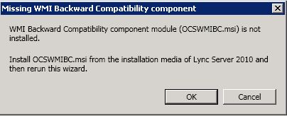
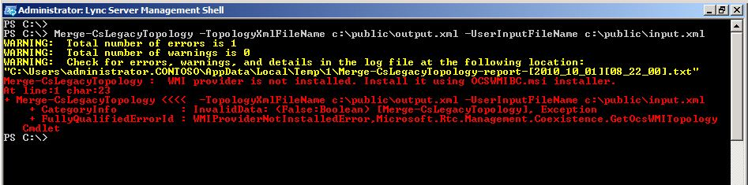

# Install WMI Backward Compatibility package [OCS 2007 R2 to W15]
[]
If you attempt to run the Topology Builder Merge wizard without installing the WMI Backward Compatibility package, you will see the following error:
  

  
If you attempt to run the **Merge-CsLegacytopology** cmdlet without installing the WMI Backward Compatibility package, you will see the following error: 
  

  
To install the WMI Backward Compatibility Package
  
1. From your installation media, navigate to \SETUP\AMD64\SETUP\OCSWMIBC.MSI.
    
2. Install OCSWMIBC.MSI.
    
    > [!IMPORTANT]
    > OCSWMIBC.msi must be installed on the computer where the Topology Builder Merge wizard is run. However, we recommend installing OCSWMIBC.msi on all Front End servers in your topology. 
  
    > [!IMPORTANT]
    > OCSWMIBC.msi can be installed on any computer in the domain that has the Lync Server 2013 Core Components and the Lync Server 2013 Management Shell installed, and has access to the Office Communications Server 2007 R2 topology (WMI provider to Active Directory Domain Services (AD DS) and SQL Server). 
  

