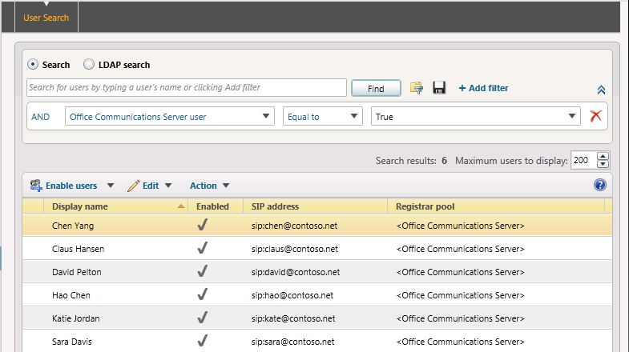
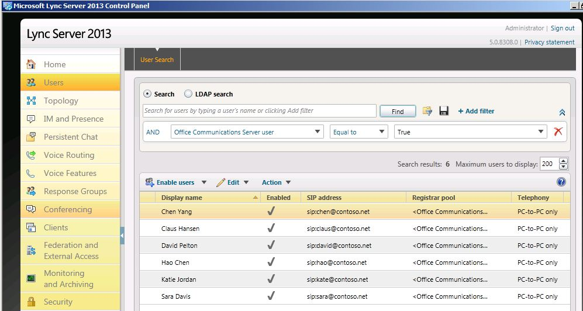
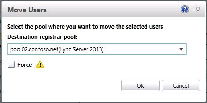
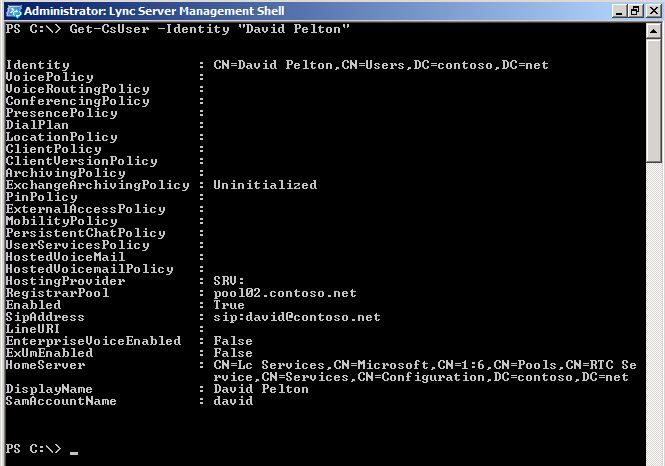

# Move a single user to the pilot pool [OCS 2007 R2 to W15]
[]
You can move a user from your Office Communications Server 2007 R2 pool to your Lync Server 2013 pilot pool using Lync Server 2013 Control Panel or Lync Server 2013 Management Shell. In the example below, in the Registrar pool column, **\<Office Communications Server\>** is the Office Communications Server 2007 R2 pool, and all six of these users are connected to this pool. Use the following procedures to move a user to your Lync Server 2013 pool using Lync Server 2013 Control Panel and Lync Server Management Shell. 
  

  
## To move a user by using the Lync Server 2013 Control Panel

1. Log on to the Front End Server with an account that is a member of the RTCUniversalServerAdmins group or a member of the CsAdministrator or CsUserAdministrator administrative role.
    
2. Open Lync Server Control Panel.
    
3. Click **Users**.
    
4. From the **User Search** tab, click the **Search** button. 
    
5. Next, click **Add Filter**.
    
6. Create a filter where **Office Communications Server user** is equal to **True**. 
    
7. Click **Find** to search for legacy Office Communications Server 2007 R2 users. 
    
     
  
8. Select a user that you want to move to the Lync Server 2013 pool. In this example, we will move user Sara Davis.
    
9. On the **Action** menu, select **Move selected users to pool**.
    
10. From the drop-down list, select the Lync Server 2013 pool.
    
11. Click **Action** and then click **Move selected users to pool**. Click **OK**.
    
     
  
12. Verify that the **Registrar pool** column for the user now contains the Lync Server 2013 pool, which indicates that the user has been successfully moved 
    
## To move a user by using the Lync Server 2013 Management Shell

1. Open the Lync Server Management Shell.
    
2. At the command line, type the following: 
    
  ```
  Move-CsLegacyUser -Identity "David Pelton" -Target "pool02.contoso.net"
  ```

3. Next, at the command line, type the following: 
    
  ```
  Get-CsUser -Identity "David Pelton"
  ```

4. The **RegistrarPool** identity now points to the Lync Server 2013 pool. The presence of this identity confirms that the user has been successfully moved. 
    
     
  
    > [!NOTE]
    > For details about the **Get-CsUser** cmdlet, run: **Get-Help Get-CsUser -Detailed**
  

