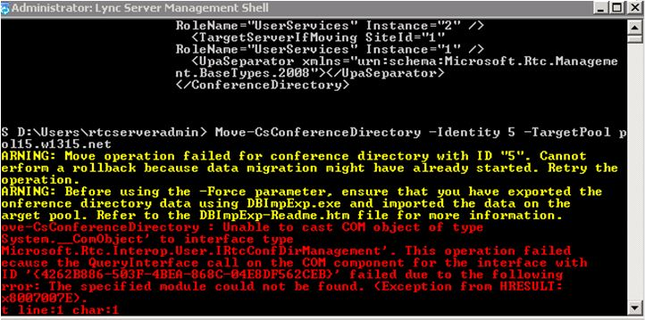

# Move conference directories [OCS 2007 R2 to W15]
[]
Before decommissioning a pool, you need to perform the following procedure for each conference directory in your Office Communications Server 2007 R2 pool. 
  
## To move a conference directory to Lync Server 2013

1. Open the Lync Server Management Shell.
    
2. To obtain the identity of the conference directories in your organization, run the following commands:
    
  ```
  Get-CsConferenceDirectory
  ```

    Because this cmdlet returns all the conference directories in your organization, you may want to limit the results to only the pool you want to decommission. For example, if you want to decommission a pool with the fully qualified domain name (FQDN) pool01.contoso.net:
    
  ```
  Get-CsConferenceDirectory | Where-Object {$_.ServiceID -match "pool01.contoso.net"}
  ```

    This cmdlet returns all the conference directories where service ID contains the FQDN pool01.contoso.net.
    
3. To move conference directories, run the following for each conference directory in the pool:
    
  ```
  Move-CsConferenceDirectory -Identity <Numeric identity of conference directory> -TargetPool <FQDN of pool where ownership is to be transitioned>
  ```

    For example:
    
  ```
  Move-CsConferenceDirectory -Identity 3 -TargetPool pool02.contoso.net
  ```

> [!NOTE]
> You may experience an error, shown below, that is caused by the Lync Server Management Shell requiring an updated set of permissions from Active Directory. To resolve the error, closed the current window and open a new Lync Server Management Shell and run the command again. 
  

  

