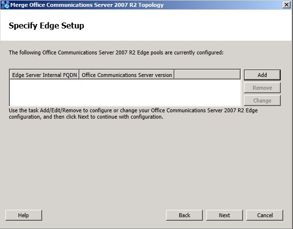

# Remove BackCompatSite [OCS 2007 R2 to W15]
[]
After all pools are deactivated and all Edge Servers have been uninstalled, run the Topology Builder Merge wizard to remove the **BackCompatSite**.
  
## To remove BackCompat site from Topology Builder

1. Open an existing deployment from Topology Builder.
    
2. In the **Action** menu, click **Merge 2007 R2 Topology**.
    
3. Click **Next** to continue. 
    
4. On the **Specify Legacy Edge** page, ensure that list of Edge Servers is empty. If the list is not empty, use the **Remove** button to remove all the legacy Edge Servers, and then click **Next**.
    
     
  
5. On the **Specify Internal SIP port setting** page, click **Next**.
    
6. On the **Summary** page, click **Next** to begin merging the topologies to remove the legacy site. 
    
7. In the **Status** column, verify that the value is **Success** and then click **Finish** to close the wizard. 
    
8. In the left pane of Topology Builder, expand the BackCompatSite and ensure no servers are listed. 
    
9. Right-click the **BackCompatSite**, and then click **Delete**.
    
10. In **Topology Builder**, select the top-most node **Lync Server**.
    
11. From the **Action** menu, select **Publish Topology** and then click **Next**.
    
12. When the **Publishing wizard** completes, click **Finish** to close the wizard. 
    

