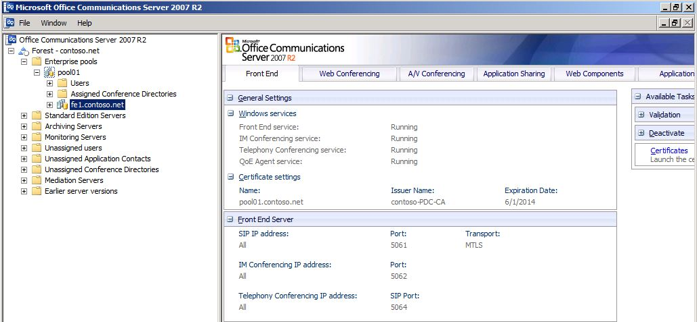
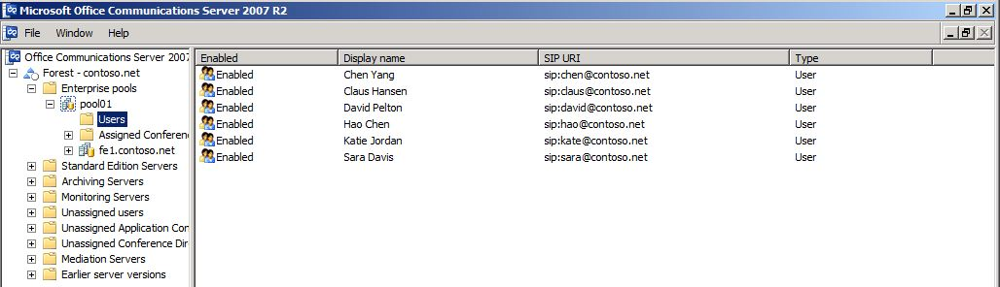

# Verify Office Communications Server 2007 R2 environment
[]
Prior to deploying Lync Server 2013 in a coexistence state with Office Communications Server 2007 R2, you need to verify the Office Communications Server 2007 R2 services are configured and started. 
  
### Verify the Pool is started using the Office Communications Server 2007 R2 Administrative Tool

1. Open the Office Communications Server 2007 R2 administrative tool.
    
2. Expand the **Forest** node, expand the **Standard Edition Servers** or **Enterprise pools** node, and then expand the pool or server name. 
    
3. Ensure that the services are running on the Standard Edition server or Enterprise pool.
    
     
  
### Review Users configured for Office Communications Server 2007 R2

1. Open the Office Communications Server 2007 R2 administrative tool.
    
2. Expand the **Forest** node, expand the **Standard Edition Servers** or **Enterprise pools** node, and then expand the pool or server name. 
    
3. Click **Users**. 
    
4. Verify the list of Office Communications Server 2007 R2 users. 
    
     
  
### Verify legacy XMPP Federated Partner Configuration

1. From the legacy XMPP server, navigate to the Administrative Tools\Services applet.
    
2. Verify that the Office Communications Server XMPP Gateway service is started. 
    
     
  

