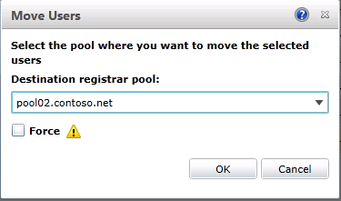

# Move multiple users to the pilot pool

You can move multiple users from your legacy pool to your Skype for Business Server 2019 pilot pool using Skype for Business Server 2019 Control Panel or Skype for Business Server 2019 Management Shell.

 **In this article**
  
[To move multiple users by using the Skype for Business Server 2019 Control Panel](#sectionSection0)
  
[To move multiple users by using the Skype for Business Server 2019 Management Shell](#sectionSection1)
  
[To move all users at the same time by using the Skype for Business Server 2019 Management Shell](#sectionSection2)
  
  
## To move multiple users by using the Skype for Business Server 2019 Control Panel
<a name="sectionSection0"> </a>

1. Open Skype for Business Server Control Panel.
    
2. Select **Users**, select **Search**, and then select **Find**.
    
3. Select two users that you want to move to the Skype for Business Server 2019 pool. In this example, we move users Chen Yang and Claus Hansen.
    
     
  
4. From the **Action** menu, select **Move selected users to pool**.
    
5. From the drop-down list, select the Skype for Business Server 2019 pool.
    
6. Select **Action**, and then select **Move selected users to pool**. Select **OK**.
    
     
  
7. Verify that the **Registrar pool** column for the users now contains the Skype for Business Server 2019 pool, which indicates that the users are successfully moved. 
    
## To move multiple users by using the Skype for Business Server 2019 Management Shell
<a name="sectionSection1"> </a>

1. Open the Skype for Business Server 2019 Management Shell. 
    
2. At the command line, type the following and replace **User1** and **User2** with specific user names you want to move, and replace **pool_FQDN** with the name of the destination pool. In this example we move users Hao Chen and Katie Jordan. 
    
   ```PowerShell
   Get-CsUser -Filter {DisplayName -eq "User1" -or DisplayName - eq "User2"} | Move-CsUser -Target "pool_FQDN"
   ```

    
  
3. At the command line, type the following: 
    
   ```PowerShell
   Get-CsUser -Identity "User1"
   ```

4. The **Registrar Pool** identity should now point to the pool you specified as **pool_FQDN** in the previous step. The presence of this identity confirms that the user is successfully moved. Repeat step to verify that **User2** is moved. 
    
     
  
## To move all users at the same time by using the Skype for Business Server 2019 Management Shell
<a name="sectionSection2"> </a>

In this example, all users are returned to the legacy pool (pool01.contoso.net). Using the Skype for Business Server 2019 Management Shell, we move all users at the same time to the Skype for Business Server 2019 pool (pool02.contoso.net).
  
1. Open the Skype for Business Server 2019 Management Shell.
    
2. At the command line, type the following: 
    
   ```PowerShell
   Get-CsUser -OnLyncServer | Move-CsUser -Target "pool_FQDN"
   ```

     
  
3. Run **Get-CsUser** for one of the pilot users. 
    
   ```PowerShell
   Get-CsUser -Identity "Hao Chen"
   ```

4. The **Registrar Pool** identity for each user now points to the pool you specified as **pool_FQDN** in the previous step. The presence of this identity confirms that the user has been successfully moved. 
    
5. Additionally, we can view the list of users in the Skype for Business Server 2019 Control Panel and verify that the Registrar Pool value now points to the Skype for Business Server 2019 pool.
    
     
  


