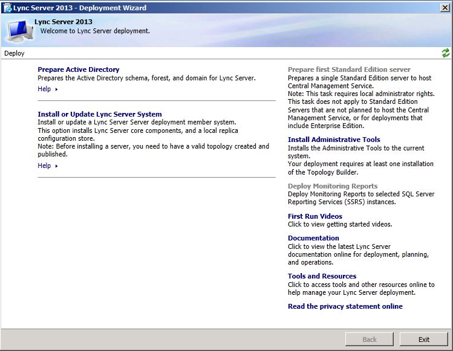
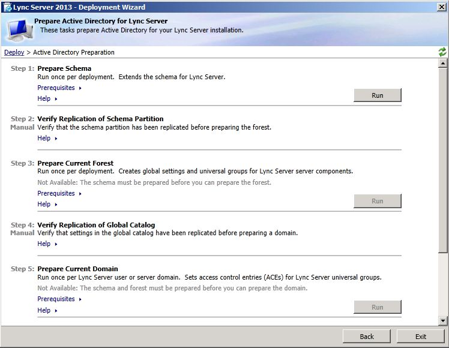

# Prepare Active Directory for Skype for Business Server

Prior to deploying Skype for Business Server 2019 in a coexistence state, you must perform some additional Active Directory tasks to configure the schema, forest, and domain for Skype for Business Server 2019. The schema extensions add the Active Directory classes and attributes that are required by Skype for Business Server 2019. For additional information, see the topic 
<!-- [Preparing Active Directory Domain Services for Skype for Business Server 2019](../deployment/deploying-lync-server-2013/preparing-active-directory-domain-services-for-lync-server-2013.md). -->
  
### To prepare Active Directory for Skype for Business Server 2019

1. On the Skype for Business Server 2019 Front End Server, run Skype for Business Server 2019 Setup.
    
2. Select **Prepare Active Directory**.
    
     
  
3. Complete steps 1 through 5.
    
     
  

