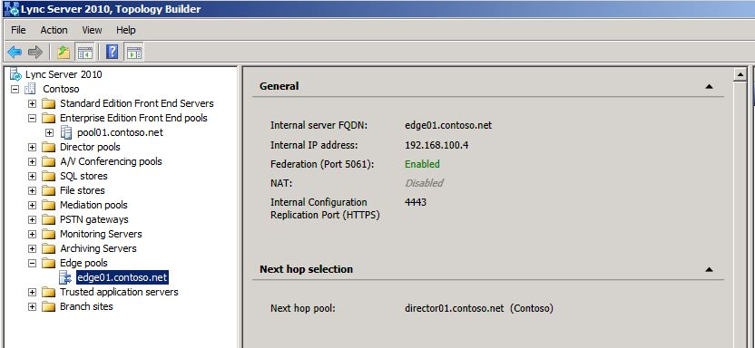

# Verify the legacy environment

Before deploying Skype for Business Server 2019 in a coexistence state, you need to verify that legacy services have been configured and started. It is important to identify key services and features that exist in your legacy environment prior to deploying a Skype for Business Server 2019 pilot pool. Before deploying Microsoft Skype for Business Server 2019 XMPP in a coexistence state with a legacy XMPP deployment, you need to verify that the legacy XMPP services have been configured and started, and identify which federated partner the legacy XMPP configuration is supporting. Verifying your legacy deployment entails the following:
  
- Verifying that the legacy services are started
    
- Reviewing the topology and users
    
- Verifying the federation and Edge server settings
    
- Verifying XMPP services and federated partners
    
## Verify that legacy services are started

1. From the legacy Front End Server, navigate to the Administrative Tools\Services applet.
    
2. Verify that the following services are running on the Front End Server:
    
     
  
## Review the legacy topology in Skype for Business Server Control Panel

1. Log on to the Front End Server with an account that is a member of the RTCUniversalServerAdmins group or a member of the CsAdministrator or CsUserAdministrator administrative role.
    
2. Open the Skype for Business Server Control Panel.
    
3. Select **Topology**. Verify that the various servers in your legacy deployment are listed.
    
     
  
## Review legacy users in Skype for Business Server Control Panel

1. Open the Skype for Business Server Control Panel.
    
2. Select **Users**, and then click **Find**.
    
3. Verify that the **Registrar Pool** column points to the legacy pool for each user listed. 
    
     
  
## Verify legacy Edge and federation settings

1. Start Topology Builder.
    
2. Select **Download Topology from existing deployment**.
    
3. Choose a file name, and save the topology with the default .tbxml file type.
    
4. Expand the legacy installs node to reveal the various server roles in the deployment.
    
5. Select the site node and verify that a **Site federation route assignment** value is set. 
    
     
  
6. Select the Standard Edition Server or Enterprise Edition front end pool. Determine whether an Edge pool has been configured for media below **Associations**. 
    
     
  
7. Select the Edge pool and identify whether a Next hop pool is configured below **Next hop selection**.
    
     
  
## Verify legacy XMPP federated partner Configuration

1. From the legacy XMPP server, navigate to the Administrative Tools\Services applet.
    
2. Verify that the Office Communications Server XMPP Gateway service is started. 
    
     
  

