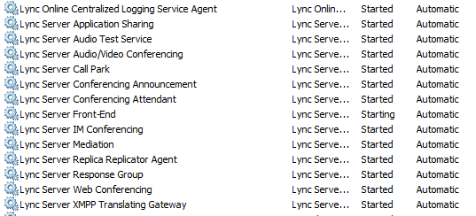
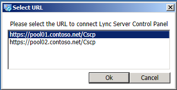
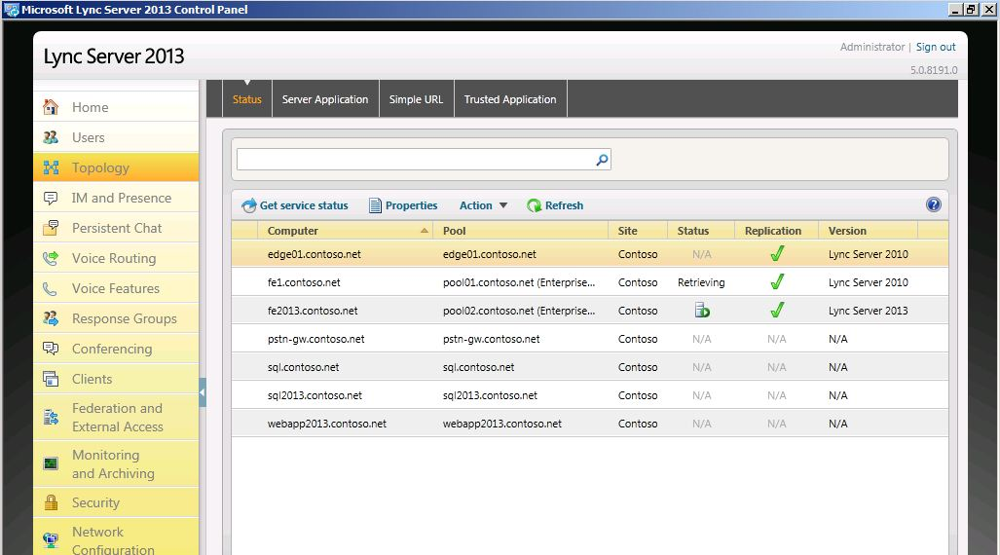
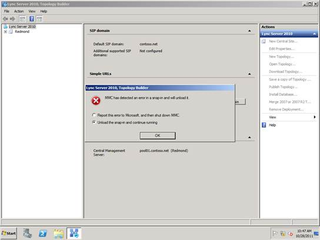

# Verify pilot pool coexistence with legacy pool

 **In this article**
  
[Verify that Skype for Business Server 2019 services have started](#sectionSection0)
  
[Open the Skype for Business Server 2019 Control Panel](#sectionSection1)
  
[Don't attempt to open the topology in the legacy Topology Builder](#sectionSection2)
  
After you deploy the pilot pool, you need to verify the coexistence of the two pools by using the administrative tools to view the pool information. For the Skype for Business Server 2019 pools and legacy pools, you must use the Skype for Business Server 2019 Control Panel and Topology Builder tools. 
  
## Verify that Skype for Business Server 2019 services have started

1. From the Skype for Business Server 2019 Front End Server, navigate to the Administrative Tools\Services applet.
    
2. Verify that the following services are running on the Front End Server:
    
**Skype for Business Server 2019 services**

  
## Open the Skype for Business Server 2019 Control Panel

From the Front End Server in your Skype for Business Server 2019 deployment, open the Skype for Business Server 2019 Control Panel and select the legacy pool. Repeat the procedure to open the Skype for Business Server 2019 pool.
  
**Open Skype for Business Server 2019 Control Panel**

  
> [!IMPORTANT]
> On Skype for Business Server 2019, you must upgrade Silverlight to Silverlight version 5 prior to using the Skype for Business Server Control Panel. 
  
This topology now includes legacy and Skype for Business Server 2019 server roles. 
  
**Skype for Business Server 2019 Control Panel Topology page**

  
## Don't attempt to open the topology in the legacy Topology Builder

If you attempt to open the topology using the legacy Topology Builder, you will encounter the error below. The topology can only be viewed using Skype for Business Server 2019 Topology Builder. The Skype for Business Server 2019 Topology Builder must be used to create pools for both Skype for Business Server 2019 and the legacy install.
  
**Topology Builder error message**

  

