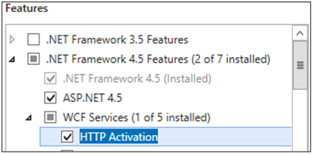
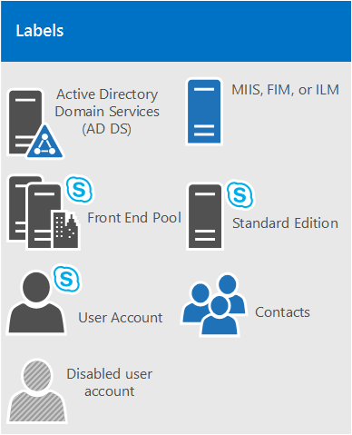
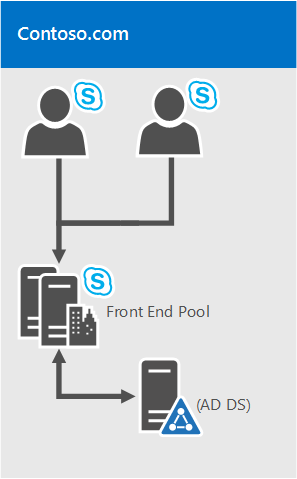
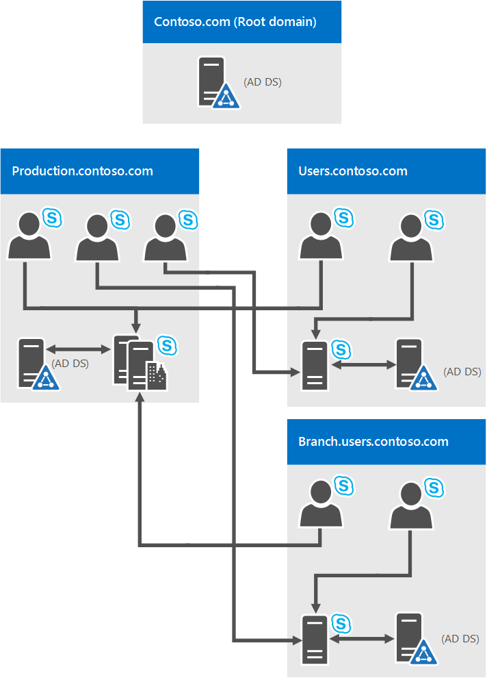
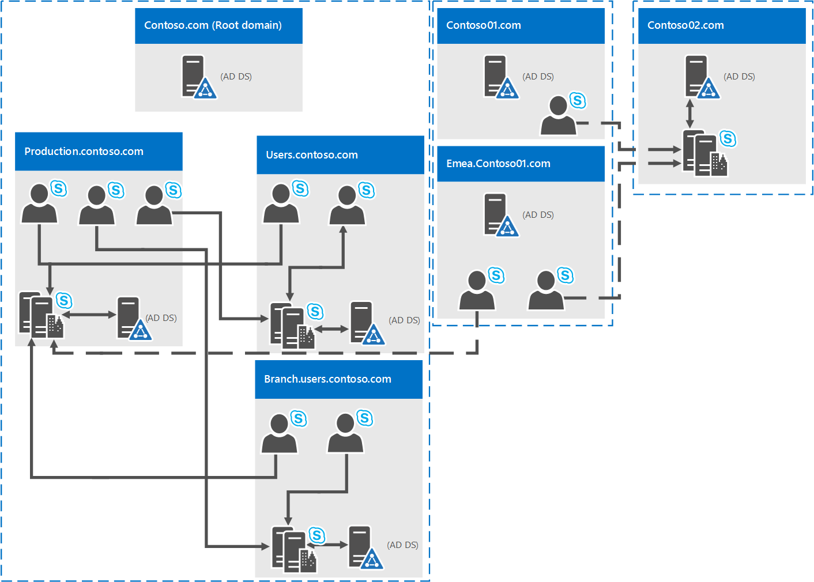
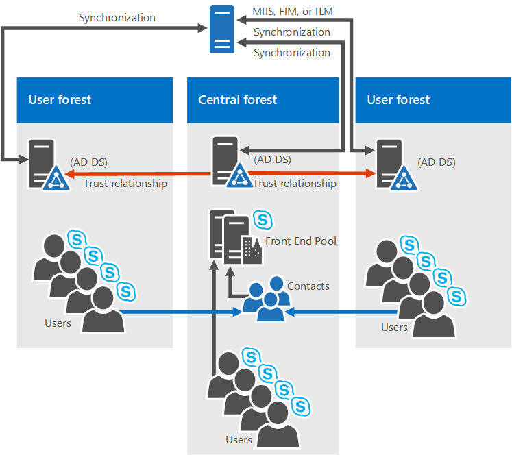
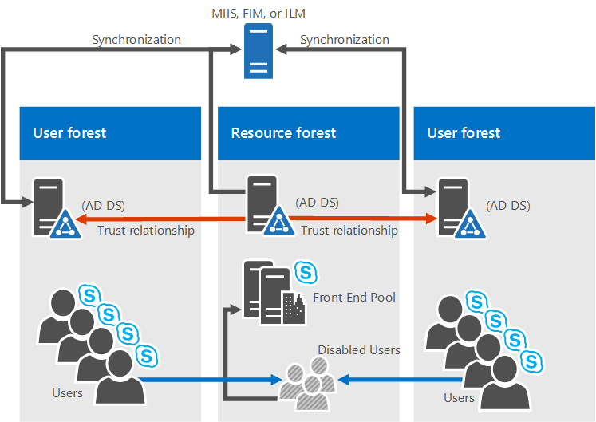
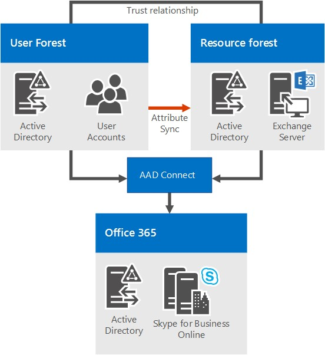

# System requirements for Skype for Business Server 2019
 
**Summary:** Prepare to install Skype for Business Server 2019 with this topic. Hardware, OS, software, databases, certificates, Active Diretory, DNS, and fileshares are covered here. All the system requirements and recommendations are here to help ensure a successful install and deployment of your server farm.
  
As you might expect, there are some preparations to make before you begin deploying Skype for Business Server 2019. This article will walk you through planning for the following:
  
- [Hardware](system-requirements.md#Hardware)
  
- [Operating systems](system-requirements.md#OS)
  
- [Software](system-requirements.md#Software)

- [Back end SQL databases](system-requirements.md#DBs)
  
- [Active Directory](system-requirements.md#AD)
  
- [Domain Name System (DNS)](system-requirements.md#DNS)
  
- [Certificates](system-requirements.md#Certs)
  
- [File Share](system-requirements.md#Fileshare)

  
## Hardware for Skype for Business Server 2019
<a name="Hardware"> </a>

After you have your topology down (and if you don't, you can check out the [Topology Basics for Skype for Business Server 2019](../../SfbServer/plan-your-deployment/topology-basics/topology-basics.md) topic), it's time to think about servers. Skype for Business Server 2019 servers require 64-bit hardware. Our recommendations for hardware are below. These aren't requirements, but they reflect the requirements necessary for optimal performance. We have capacity planning documentation that will help you determine if you need more than this, depending on your circumstances.
  
Recommended hardware for Standard Edition servers:

|**Hardware component**|**Recommended**|
|:-----|:-----|
|CPU  <br/> |Intel Xeon E5-2673 v3 dual processor, 6-core, 2.4 gigahertz (GHz) or higher.  <br/> Intel Itanium processors are not supported for Skype for Business Server 2019 roles.  <br/> |
|Memory  <br/> |32 gigabytes (GB).  <br/> |
|Disk  <br/> |EITHER:  <br/> • 8 or more 10000 RPM hard disk drives with at least 72 GB free disk space (two of the disks using RAID 1 and 6 using RAID 10).  <br/> OR  <br/> • Solid state drives (SSDs) able to provide the same free space and similar performance to 8 10000 RPM mechanical disk drives.  <br/> |
|Network  <br/> |1 dual-port network adapter, 1 Gbps or higher (2 network adapters can be used, but they need to be teamed with a single MAC address and a single IP address).  <br/> Dual or multi-homed configurations are **not** supported for Front End Servers, Back End Servers, and Standard Edition servers. <br/> As long as they are not exposed to the operating system and are being used to monitor and manage server hardware, you can have out-of-band management systems, such as DRAC or ILO. This scenario doesn't constitute a multi-homed server, and it is supported.  <br/> |


Recommended hardware for Front End Servers and Back End Servers:
  
|**Hardware component**|**Recommended**|
|:-----|:-----|
|CPU  <br/> |Intel Xeon E5-2673 v3 dual processor, 6-core, 2.4 gigahertz (GHz) or higher. <br/> Intel Itanium processors are not supported for Skype for Business Server 2019 roles.  <br/> |
|Memory  <br/> |64 gigabytes (GB).  <br/> |
|Disk  <br/> |EITHER:  <br/> • 8 or more 10000 RPM hard disk drives with at least 72 GB free disk space (two of the disks using RAID 1 and 6 using RAID 10).  <br/> OR  <br/> • Solid state drives (SSDs) able to provide the same free space and similar performance to 8 10000 RPM mechanical disk drives.  <br/> |
|Network  <br/> |1 dual-port network adapter, 1 Gbps or higher (2 network adapters can be used, but they need to be teamed with a single MAC address and a single IP address).  <br/> Dual or multi-homed configurations are **not** supported for Front End Servers, Back End Servers, and Standard Edition servers. <br/> As long as they are not exposed to the operating system and are being used to monitor and manage server hardware, you can have out-of-band management systems, such as DRAC or ILO. This scenario doesn't constitute a multi-homed server, and it is supported.  <br/> |
   
Recommended hardware for Edge Servers, standalone Mediation Servers, and Directors:
  
|**Hardware component**|**Recommended**|
|:-----|:-----|
|CPU  <br/> |Intel Xeon E5-2673 v3 dual processor, 6-core, 2.4 gigahertz (GHz) or higher.  <br/> Intel Itanium processors are not supported for Skype for Business Server 2019 roles.  <br/> |
|Memory  <br/> |32 gigabytes.  <br/> |
|Disk  <br/> |EITHER:  <br/> • 4 or more 10000 RPM hard disk drives with at least 72 GB free disk space (the disks should be in a 2x RAID 1 configuration).  <br/> OR  <br/> • Solid state drives (SSDs) able to provide the same free space and similar performance to 4 10000 RPM mechanical disk drives.  <br/> |
|Network  <br/> |1 dual-port network adapter, 1 Gbps or higher (2 network adapters can be used, but they need to be teamed with a single MAC address and a single IP address).  <br/> Dual or multi-homed configurations are **not** supported for Video Interop Servers and Directors. <br/> Edge servers will require two network interfaces that are dual-port network adapters, 1 Gbps or higher (or two paired network adapters, for a total of four, each pair being teamed with a single MAC address and a single IP address, for a total of two pairs).  <br/> On standalone Mediation Servers, the installation of additional network interface cards (NICs) to allow the configuration of a specific PSTN IP address is supported.  <br/> |


> [!NOTE]
> Regardless of the server role, we also recommend the following hardware settings for Skype for Business Server 2019 (this may vary depending on the brand of hardware you've purchased, so please refer to manufacturer documentation for specifics):
> - BIOS config - should be set to FLAT from NUMA.
> - Enable Hyperthreading.
> - The RSS queue setting should be set to 8 queue.

   
## Operating systems for Skype for Business Server 2019
<a name="OS"> </a>

After you have the hardware in place, you'll need to the install operating system (OS) that will allow you to install and successfully use Skype for Business Server 2019.
  
|||
|:-----|:-----|
|Windows Server 2019 <br/> |
|Windows Server 2016 <br/> ||
||
   
Anything other than the operating systems listed here won't work properly; please don't try it for installs of Skype for Business Server 2019. For example, Server Core option is not listed, and is thus not Supported.

> [!NOTE]
> 
> If you are installing Windows Admin Center 2019 on your Windows Server 2019 machine, it will prompt you for a port to listen on. There's a liklihood you might choose port 443, but if that machine has Skype for Business Server 2019 installed on it, or is going to have Skype for Business Server 2019 installed on it, then you must choose a different port number.
> 
>Why is this the case? If Windows Admin Center 2019 is running on port 443, you will not be able to connect to the server using the Skype for Business Control Panel, nor will you be able to connect to any internal web service running on the server (Address Book Web Service, Autodiscover Service, WebTicket Service, etc).  In fact, you will not be able to connect to any Internal Web Service URL. Please choose a different port, in the event you need or want to put Windows Admin Center 2019 on a server with Skype for Business Server 2019.
> 

  
## Software that should be installed before a Skype for Business Server 2019 deployment
<a name="Software"> </a>

There are some things you're going to need to install or configure for any server running Skype for Business Server 2019. These are listed below, followed by additional requirements for specific server roles.
  
 **All servers:**
  
|**Software/role**|**Details**|
|:-----|:-----|
|Windows PowerShell 3.0  <br/> |All Skype for Business Server servers need Windows PowerShell 3.0 installed.  <br/> • This should be installed by default with Windows Server 2016.<br/> |
|Microsoft .NET Framework  <br/> |WCF services is a **Feature** that's installed as a Windows feature, under **Server Manager**, no downloads needed. <br/> • You need to make sure, when you install this feature, or if it's already installed and you're checking on it, that the **HTTP Activation** option is also checked and installed, like so: <br/>  <br/> Don't worry if you get an additional pop-up saying some other things need to be installed for HTTP Activation to be installed. That's normal; click OK and go ahead. If you don't get this pop-up, you can assume those things are already installed and go ahead.  <br/> Microsoft .NET Framework is usually installed when Windows Server 2016 is installed. Skype for Business Server works with the following Microsoft .NET Framework versions:  <br/> • .NET 3.5  <br/> • .NET 4.5  <br/> • .NET 4.6.x  <br/> • .NET 4.7 <br/> |
|Media Foundation  <br/> |For Windows Server 2016, the Windows Media Format Runtime installs with Microsoft Media Foundation.  <br/> All Front End Servers and Standard Edition servers used for conferencing require Windows Media Format Runtime to run the Windows Media Audio (.wma) files that the Call Park, Announcement, and Response Group applications play for announcements and music.  <br/> |
|Windows Identity Foundation  <br/> |We need Windows Identity Foundation 3.5 to support server-to-server authentication scenarios for Skype for Business Server 2019.  <br/> • For Windows Server 2016, there's no need to download anything. Open **Server Manager**, and go to the **Add Roles and Features Wizard**. **Windows Identity Foundation 3.5** is listed under the **Features** section. If it's selected, you're good. Otherwise select it and click **Next** to reach the **Install** button. <br/> |
|Remote Server Administration Tools  <br/> |Role Administration Tools: AD DS and AD LDS tools  <br/> |
   
 **Front End Servers and Standard Edition server also need:**
  
|**Software/role**|**Details**|
|:-----|:-----|
|Internet Information Services (IIS)  <br/> |IIS is needed on all Front End Servers, as well as all Standard Edition servers, with the following modules selected:  <br/> • Common HTTP Features: Default Document, HTTP Errors, Static Content  <br/> • Health and Diagnostics: HTTP Logging, Logging Tools, Tracing  <br/> • Performance: Static Content Compression, Dynamic Content Compression  <br/> • Security: Request Filtering, Client Certificate Mapping Authentication, Windows Authentication  <br/> • Application Development: .NET Extensibility 3.5, .NET Extensibility 4.5, ASP.NET 3.5, ASP.NET 4.5, ISAPI Extensions, ISAPI Filters  <br/> • Management Tools: IIS Management Console, IIS Management Scripts and Tools  <br/> Note that Anonymous Access is also needed, but you get that when you install IIS, so you don't have a place to select it on the list.  <br/> |
|Windows Media Format Runtime  <br/> | For Windows Server 2016, you'll need to install the **Media Foundation** feature in **Server Manager**. You actually can start your Skype for Business Server 2019 installation without this, but you'll be prompted to install it, and then reboot the server, before the Skype for Business Server 2019 install continues. It's better to do it ahead of time. <br/> |
|Silverlight  <br/> |You can install the latest version of Silverlight [here](https://www.microsoft.com/silverlight/).  <br/> |
   
To help you out, here's a sample PowerShell script you can run to automate this:
  
```
Add-WindowsFeature RSAT-ADDS, Web-Server, Web-Static-Content, Web-Default-Doc, Web-Http-Errors, Web-Asp-Net, Web-Net-Ext, Web-ISAPI-Ext, Web-ISAPI-Filter, Web-Http-Logging, Web-Log-Libraries, Web-Request-Monitor, Web-Http-Tracing, Web-Basic-Auth, Web-Windows-Auth, Web-Client-Auth, Web-Filtering, Web-Stat-Compression, Web-Dyn-Compression, NET-WCF-HTTP-Activation45, Web-Asp-Net45, Web-Mgmt-Tools, Web-Scripting-Tools, Web-Mgmt-Compat, Server-Media-Foundation, Telnet-Client
```

 **Directors also need:**
  
IIS, with the following modules selected:
  
- Common HTTP Features
    
  - Default Document
    
  - HTTP Errors
    
  - Static Content
    
- Health and Diagnostics
    
  - HTTP Logging
    
  - Logging Tools
    
  - Tracing
    
- Performance
    
  - Static Content Compression
    
- Security
    
  - Request Filtering
    
  - Client Certificate Mapping Authentication
    
  - Windows Authentication
    
- Application Development
    
  - .NET Extensibility 3.5
    
  - .NET Extensibility 4.5
    
  - ASP.NET 3.5
    
  - ASP.NET 4.5
    
  - ISAPI Extension
    
  - ISAPI Filters
    
(If you're wondering, it's the same module set as the Front End Servers and Standard Edition servers, with the Dynamic Content Compression and Management Tools left out.)
  
And we have some PowerShell code below for this too:
  
```
Add-WindowsFeature RSAT-ADDS, Web-Server, Web-Static-Content, Web-Default-Doc, Web-Http-Errors, Web-Asp-Net, Web-Net-Ext, Web-ISAPI-Ext, Web-ISAPI-Filter, Web-Http-Logging, Web-Log-Libraries, Web-Request-Monitor, Web-Http-Tracing, Web-Basic-Auth, Web-Windows-Auth, Web-Client-Auth, Web-Filtering, Web-Stat-Compression, NET-WCF-HTTP-Activation45, Web-Asp-Net45, Web-Scripting-Tools, Web-Mgmt-Compat, Server-Media-Foundation, Telnet-Client
```

## Back end databases that will work with Skype for Business Server 2019
<a name="DBs"> </a>

When installing Skype for Business Server 2019 Standard Edition, you'll have SQL Server 2016 Express (64-bit edition).

Skype for Business Server 2019 Enterprise Edition will require full SQL Server, as indicated below (only 64-bit edition; please don't use 32-bit editions):
  
||||
|:-----|:-----|:-----|
|Microsoft SQL Server 2016 (64-bit edition), and you must run with the latest updates.  <br/> |
Microsoft SQL Server 2017 (64-bit edition), and you must run with the latest updates.|
 |

If you don't see the SQL Server edition you want to use listed here, you can't use it.
  
> [!NOTE]
> You also need to install SQL Server Reporting Services for the Monitoring Server role. 
  
### SQL Clustering, and SQL Always On

SQL Clustering with Skype for Business Server 2019 is supported. If you want to set up SQL Clustering, that's done in SQL Server.
  
Make sure you have an active/passive configuration for SQL Clustering, which is supported. Don't share the passive node with any other SQL instance.
  
You can have the following for failover clustering:
  
Two-node:
  
- Microsoft SQL Server 2016 Standard (64-bit edition), and we recommend running with the latest service pack.
- Microsoft SQL Server 2017 Standard (64-bit edition), and we recommend running with the latest service pack.

Sixteen-node:
  
- Microsoft SQL Server 2016 Enterprise (64-bit edition), and we recommend running with the latest service pack.
- Microsoft SQL Server 2017 Enterprise (64-bit edition), and we recommend running with the latest service pack.

SQL Always On is supported, and you can read more about it in [Back End Server high availability in Skype for Business Server 2019](../../SfbServer/plan-your-deployment/high-availability-and-disaster-recovery/back-end-server.md).
  

###  Additional server installation recommendations:
  
Please don't install any Microsoft Internet Security and Acceleration (ISA) Server client software, or any other Winsock Layered Service Providers (LSP) software (any third-party firewalls or anti-virus network inspection software would be included here) on any of your front end servers or standalone mediation servers. Poor media traffic performance has been seen when that software is installed.
  

## Active Directory
<a name="AD"> </a>

Although much of the configuration data for servers and services is stored in the Skype for Business Server 2019 Central Management store, there are some things still stored in Active Directory:
  
|**Active Directory objects**|**Object types**|
|:-----|:-----|
|Schema extensions  <br/> |User object extensions  <br/> |
||Extensions for Skype for Business Server 2015 and Lync Server 2013, to maintain backward compatibility with the previous supported versions  <br/> |
|Data  <br/> |User SIP URI and other user settings  <br/> |
||Contact objects for applications (like the Response Group application and the Conferencing Attendant application)  <br/> |
||Data published for backward compatibility  <br/> |
||A service control point (SCP) for the Central Management store  <br/> |
||Kerberos Authentication Account (an optional computer object)  <br/> |
   
### OS for Domain Controllers

The following Domain Controller operating systems can be used:
  
- Windows Server 2019

- Windows Server 2016
    
- Windows Server 2012 R2
    
- Windows Server 2012
    
The domain functional level of any domain you deploy Skype for Business Server 2019 into, and the forest functional level of any forest you deploy Skype for Business Server 2019 into, must be one of the following:
  
- Windows Server 2019

- Windows Server 2016
    
- Windows Server 2012 R2
    
- Windows Server 2012
    
Can you have read-only domain controllers in these environments? Sure, as long as there are also writable domain controllers available.
  
It's important to know that Skype for Business Server 2019 doesn't support single-labeled domains. What are they? If you have a root domain labeled contoso.local, that's going to be fine. If you have a root domain that's just named local, that's not going to work, and it's not supported as a result. A little more about this has been written [in this Knowledge Base article](https://support.microsoft.com/kb/300684/en-us).
  
Skype for Business Server 2019 also doesn't support renaming domains. If you really have to rename your domain, you'll need to uninstall Skype for Business Server 2019, do the domain rename, and then reinstall Skype for Business Server 2019.
  
Finally, you may be dealing with a domain with a locked-down AD DS environment, and that's alright. We have more information on how to deploy Skype for Business Server 2019 into a locked-down AD DS environment in the Deployment documentation.
  
### AD Topologies

Supported topologies in Skype for Business Server 2019 are:
  
- Single forest with single domain
    
- Single forest with a single tree and multiple domains
    
- Single forest with multiple trees and disjoint namespaces
    
- Multiple forests in a central forest topology
    
- Multiple forests in a resource forest topology
    
- Multiple forests in a Skype for Business resource forest topology with Exchange Online
    
- Multiple forests in a resource forest topology with Skype for Business Online and Azure Active Directory Connect
    
We have diagrams and descriptions to help you determine what topology you have in your environment, or what you may need to set up prior to installing Skype for Business Server 2019. To keep it simple, we're also including a key:
  

  
#### Single forest with single domain


  
It doesn't get easier than this; it's a single domain forest, a common topology.
  
#### Single forest with a single tree and multiple domains


  
This diagram shows a single forest, again, but it has one or more child domains as well (there are three in this specific example). So the domain the users are created in might be different from the domain Skype for Business Server 2019 is deployed to. Why worry about this? It's important to remember that when you deploy a Skype for Business Server Front End pool, all the servers in that pool need to be in a single domain. You can have cross-domain administration via Skype for Business Server support of Windows universal administrator groups.
  
In the diagram above, you can see that users from one domain are able to access Skype for Business Server pools from the same domain or from different domains, even if those users are in a child domain.
  
#### Single forest with multiple trees and disjoint namespaces


  
You may have a topology similar to this diagram, where you have one forest, but within that forest are multiple domains, with separate AD namespaces. In this case, this diagram is a good illustration, because it includes users in three different domains accessing Skype for Business Server 2019. Solid lines indicate they're accessing a Skype for Business Server pool in their own domain, whereas a dashed line indicates they're going to a pool in a different tree altogether.
  
As you can see, users in the same domain, the same tree, or even a different tree can access pools successfully.
  
#### Multiple forests in a central forest topology


  
Skype for Business Server 2019 does support multiple forests configured in a central forest topology. If you're not sure that's what you have, the central forest in the topology uses objects in it to represent users in the other forests, and hosts user accounts for any users in the forest.
  
How does this work? A directory synchronization product (such as Forefront Identity Manager, or FIM) manages your organization's user accounts throughout their existence. When an account is created or deleted from a forest, that change is synched up to the corresponding contact in the central forest.
  
Clearly, if your AD infrastructure is in place, moving to this topology might not be easy, but if you're already there, or still planning out your forest infrastructure, this can be a good choice. You can centralize your Skype for Business Server 2019 deployment within a single forest, while users can search, communicate, and view the presence of other users in any forest. All user contact updates are handled automatically with synchronization software.
  
#### Multiple forests in a Skype for Business resource forest topology
<a name="BKMK_multipleforestopology"> </a>


  
A resource forest topology is also supported; it's where a forest is dedicated to running your server applications, like Microsoft Exchange Server and Skype for Business Server 2019. This resource forests also hosts a synchronized representation of active user objects, but no logon-enabled user accounts. So the resource forest is a shared services environment for other forests in which user objects reside, and they have a forest-level trust relationship with the resource forest.
  
Note that Exchange Server can be deployed in the same resource forest as Skype for Business Server or in a different forest.
  
To deploy Skype for Business Server 2019 in this type of topology, you would create one disabled user object in the resource forest for each user account in the user forests (if Microsoft Exchange Server is already in the environment, this might be done for you). Then you need a directory synchronization tool (like Forefront Identity Manager, or FIM) to manage user accounts through their life cycle.
  
#### Multiple forests in a Skype for Business resource forest topology with Exchange Online
<a name="BKMK_multipleforestopology"> </a>

This topology is similar to the topology described in [Multiple forests in a Skype for Business resource forest topology](system-requirements.md#BKMK_multipleforestopology).
  
In this topology, there are one or more user forests, and Skype for Business Server is deployed in a dedicated resource forest. Exchange Server can be deployed on-premises in the same resource forest or a different forest and configured for hybrid with Exchange Online, or email services may be provided exclusively by Exchange Online for the on-premises accounts. There is no diagram available for this topology.
  
#### Multiple forests in a resource forest topology with Skype for Business Online and Azure Active Directory Connect
<a name="BKMK_multipleforestopology"> </a>


  
With this scenario, there are multiple forests on-premises, with a resource forest topology. There is a full trust relationship between the Active Directory forests. The Azure Active Directory Connect tool is used to synchronize accounts between the on-premises user forests and Office 365.
  
 The organization also has Office 365, and uses [Azure Active Directory Connect](https://docs.microsoft.com/azure/active-directory/connect/active-directory-aadconnect) to synchronize their on-premises accounts with Office 365. Users who are enabled for Skype for Business are enabled via Office 365 and Skype for Business Online. Skype for Business Server is not deployed on-premises.
  
Single sign-on authentication is provided by an Active Directory Federation Services farm located in the user forest.
  
In this scenario, it is supported to deploy Exchange on-premises, Exchange Online, a hybrid Exchange solution, or to not have Exchange deployed at all. (The diagram shows only Exchange on-premises, but the other Exchange solutions are also fully supported.)
  
#### Multiple forests in a resource forest topology with hybrid Skype for Business
<a name="BKMK_multipleforestopology"> </a>

In this scenario, there are one or more on-premises user forests, and Skype for Business is deployed in a dedicated resource forest and is configured for hybrid mode with Skype for Business Online. Exchange Server can be deployed on-premises in the same resource forest or a different forest and may be configured for hybrid with Exchange Online. Alternatively, email services may be provided exclusively by Exchange Online for the on-premises accounts.
  
For more information, see [Configure a multi-forest environment for hybrid Skype for Business](../../SfbServer/skype-for-business-hybrid-solutions/deploy-hybrid-connectivity/configure-a-multi-forest-environment-for-hybrid.md).
  
## Domain Name System (DNS)
<a name="DNS"> </a>

Skype for Business Server 2019 requires DNS, for the following reasons:
  
- DNS enables Skype for Business Server 2019 to discover internal servers or pools, allowing for server-to-server communications.
    
- DNS allows client machines to discover the Front End pool or Standard Edition server being used for SIP transactions.
    
- It associates simple URLs for conferences with the servers hosting those conferences.
    
- DNS allows external users and client machines to connect to your Edge Servers, or the HTTP reverse proxy, for instant messaging (IM) or conferencing.
    
- It lets unified communications (UC) devices that aren't logged in discover the Front End pool or Standard Edition server that's running the Device Update web service to get updates and send logs.
    
- Using DNS allows mobile clients to automatically discover web services resources without requiring users to manually enter URLs in their device settings.
    
- It's used in DNS load balancing.
    
It's important to note that Skype for Business Server 2019 doesn't support internationalized domain names (IDNs).
  
And it's extremely important to remember that any name in DNS be identical to the computer name configured on any server being used by Skype for Business Server 2019. Specifically, we can't have any short-names in the environment, and must have FQDNs for Topology Builder.
  
This seems like it would be logical for any computer already joined to a domain, but if you have an Edge Server that's not joined to your domain, it may have a default of a short name, with no domain suffix. Make sure that's not the case, either in DNS or on the Edge Server, or any Skype for Business Server 2019 server or pool, for that matter.
  
Definitely don't use Unicode characters or underscores. Standard characters (which are A-Z, a-z, 0-9, and hyphens) are supported by external DNS and public Certificate Authorities (you'll need to assign FQDNs to the SN in the certificate, it's important to remember), so you'll spare yourself a lot of trouble if you name with this in mind from the start.
  
For further reading on DNS requirements for Networking, check out the [Networking](../../SfbServer/plan-your-deployment/network-requirements/network-requirements.md) section of our Planning documentation.
  
## Certificates
<a name="Certs"> </a>

One of the most important things you can do before deploying is make sure you have your certificates in order. Skype for Business Server 2019 needs a public key infrastructure (PKI) for transport layer security (TLS) and mutual transport layer security (MTLS) connections. Basically, to communicate securely in a standardized way, Skype for Business Server uses certificates issued by Certificate Authorities (CAs).
  
These are some of the things that Skype for Business Server 2019 uses certificates for:
  
- TLS connections between clients and servers
    
- MTLS connections between servers
    
- Federation using automatic DNS discovery of partners
    
- Remote user access for instant messaging (IM)
    
- External user access to audio/video (AV) sessions, application sharing, and conferencing
    
- Talking to web applications and Outlook Web Access (OWA)
    
So certificate planning is a must. Now, let's look at a list of some of the things you need to keep in mind when requesting certificates:
  
- All server certificates must support server authorization (Server EKU).
    
- All server certificates must contain a CRL Distribution Point (CDP).
    
- All certificates must be signed using a signing algorithm supported by the operating system. Skype for Business Server 2019 supports the SHA-1 and SHA-2 suite of digest sizes (224, 256, 384 and 512-bit), and meets or exceeds the operating system requirements.
    
- Auto-enrollment is supported for internal servers running Skype for Business Server 2019.
    
- Auto-enrollment is not supported for Skype for Business Server 2019 Edge Servers.
    
> [!NOTE]
> Using the RSASSA-PSS signature algorithm is unsupported, and may lead to errors on login and call forwarding issues, among other problems. 
  
- Encryption key lengths of 1024, 2048, and 4096 are supported. Key lengths of 2048 and greater are recommended.
    
- The default digest, or hash signing, algorithm is RSA. The ECDH_P256, ECDH_P384, and ECDH_P521 algorithms are also supported.
    
That's a lot to think about, and there are a variety of comfort levels with requesting certificates from a CA. We'll give you some further guidance below to make your planning as painless as possible.
  
### Certificates for your internal servers

You'll need certificates for most of your internal servers, and most likely, you'll get them from an internal CA (that's a CA located in your domain). If you want to, you can request these certificates from an external CA (one located on the Internet). If you're wondering what public CA you should go to, you can check out the [Unified Communications certificate partners](https://support.microsoft.com/kb/929395/en-us) list.
  
You're also going to need certificates when Skype for Business Server 2019 communicates with other applications and servers, such as Microsoft Exchange Server. This will, obviously, need to be a certificate that these other apps and servers can use in a supported way. Skype for Business Server 2019 and other Microsoft products support the Open Authorization (OAuth) protocol for server-to-server authentication and authorization. If you're interested in this, we have an additional planning article for OAuth and Skype for Business Server 2019.
  
Skype for Business Server 2019 also includes support for (without requiring) certificates signed using the SHA-256 cryptographic hash function. To support external access using SHA-256, the external certificate needs to be issued by a public CA using SHA-256.
  
To keep things straightforward, we've put the certificate requirements for Standard Edition servers, Front End pools, and other roles, into the following tables, with the fictional contoso.com being used for examples (you'll probably be using something else for your environment). These are all standard web server certificates, with private keys that are non-exportable. Some additional things to note:
  
- Server enhanced key usage (EKU) is automatically configured when you use the certificate wizard to request certificates.
    
- Each certificate friendly name has to be unique in the computer store.
    
- As per the sample names below, if you've configured sipinternal.contoso.com or sipexternal.contoso.com in your DNS, they need to be added to the certificate's Subject Alternative Name (SAN).
    
Certificates for Standard Edition servers:
  
|**Certificate**|**Subject name/common name**|**Subject alternative name**|**Example**|**Comments**|
|:-----|:-----|:-----|:-----|:-----|
|Default  <br/> |FQDN of the pool  <br/> |FQDN of the pool and FQDN of the server  <br/> If you have multiple SIP domains and have enabled automatic client configuration, the certificate wizard detects and adds each supported SIP domain FQDNs.  <br/> If this pool is the auto-logon server for clients and strict Domain Name System (DNS) matching is required in group policy, you also need entries for sip.sipdomain (for each SIP domain you have).  <br/> |SN=se01.contoso.com; SAN=se01.contoso.com  <br/> If this pool is the auto-logon server for clients and strict DNS matching is required in group policy, you also need SAN=sip.contoso.com; SAN=sip.fabrikam.com  <br/> |On Standard Edition servers, the server FQDN is the same as the pool FQDN.  <br/> The wizard detects any SIP domains you specified during setup and automatically adds them to the subject alternative name.  <br/> You can also use this certificate for Server-to-Server Authentication.  <br/> |
|Web internal  <br/> |FQDN of the server  <br/> |Each of the following:  <br/> • Internal web FQDN (which is the same as the FQDN of the server)  <br/> AND  <br/> • Meet simple URLs  <br/> • Dial-in simple URL  <br/> • Admin simple URL  <br/> OR  <br/> • A wildcard entry for the simple URLs  <br/> |SN=se01.contoso.com; SAN=se01.contoso.com; SAN=meet.contoso.com; SAN=meet.fabrikam.com; SAN=dialin.contoso.com; SAN=admin.contoso.com  <br/> Using a wildcard certificate:  <br/> SN=se01.contoso.com; SAN=se01.contoso.com; SAN=\*.contoso.com  <br/> |You can't override the Internal web FQDN in Topology Builder.  <br/> If you have multiple Meet simple URLs, you must include all of them as SANs.  <br/> Wildcard entries are supported for the simple URL entries.  <br/> |
|Web external  <br/> |FQDN of the server  <br/> |Each of the following:  <br/> • External web FQDN  <br/> AND  <br/> • Dial-in simple URL  <br/> • Meet simple URLs per SIP domain  <br/> OR  <br/> • A wildcard entry for the simple URLs  <br/> |SN=se01.contoso.com; SAN=webcon01.contoso.com; SAN=meet.contoso.com; SAN=meet.fabrikam.com; SAN=dialin.contoso.com  <br/> Using a wildcard certificate:  <br/> SN=se01.contoso.com; SAN=webcon01.contoso.com; SAN=\*.contoso.com  <br/> |If you have multiple Meet simple URLs, you must include all of them as subject alternative names.  <br/> Wildcard entries are supported for the simple URL entries.  <br/> |
   
Certificates for Front End Servers in a Front End pool:
  
|**Certificate**|**Subject name/common name**|**Subject alternative name**|**Example**|**Comments**|
|:-----|:-----|:-----|:-----|:-----|
|Default  <br/> |FQDN of the pool  <br/> |FQDN of the pool and FQDN of the server  <br/> If you have multiple SIP domains and have enabled automatic client configuration, the certificate wizard detects and adds each supported SIP domain FQDNs.  <br/> If this pool is the auto-logon server for clients and strict Domain Name System (DNS) matching is required in group policy, you also need entries for sip.sipdomain (for each SIP domain you have).  <br/> |SN=eepool.contoso.com; SAN=eepool.contoso.com; SAN=ee01.contoso.com  <br/> If this pool is the auto-logon server for clients and strict DNS matching is required in group policy, you also need SAN=sip.contoso.com; SAN=sip.fabrikam.com  <br/> |The wizard detects any SIP domains you specified during setup and automatically adds them to the subject alternative name.  <br/> You can also use this certificate for Server-to-Server Authentication.  <br/> |
|Web internal  <br/> |FQDN of the pool  <br/> |Each of the following:  <br/> • Internal web FQDN (which is NOT the same as the FQDN of the server)  <br/> • Server FQDN  <br/> • Skype for Business pool FQDN  <br/> AND  <br/> • Meet simple URLs  <br/> • Dial-in simple URL  <br/> • Admin simple URL  <br/> OR  <br/> • A wildcard entry for the simple URLs  <br/> |SN=ee01.contoso.com; SAN=ee01.contoso.com; SAN=meet.contoso.com; SAN=meet.fabrikam.com; SAN=dialin.contoso.com; SAN=admin.contoso.com  <br/> Using a wildcard certificate:  <br/> SN=ee01.contoso.com; SAN=ee01.contoso.com; SAN=\*.contoso.com  <br/> |If you have multiple Meet simple URLs, you must include all of them as subject alternative names.  <br/> Wildcard entries are supported for the simple URL entries.  <br/> |
|Web external  <br/> |FQDN of the pool  <br/> |Each of the following:  <br/> • External web FQDN  <br/> AND  <br/> • Dial-in simple URL  <br/> • Admin simple URL  <br/> OR  <br/> • A wildcard entry for the simple URLs  <br/> |SN=ee01.contoso.com; SAN=webcon01.contoso.com; SAN=meet.contoso.com; SAN=meet.fabrikam.com; SAN=dialin.contoso.com  <br/> Using a wildcard certificate:  <br/> SN=ee01.contoso.com; SAN=webcon01.contoso.com; SAN=\*.contoso.com  <br/> |If you have multiple Meet simple URLs, you must include all of them as subject alternative names.  <br/> Wildcard entries are supported for the simple URL entries.  <br/> |
   
Certificates for the Director:
  
|**Certificate**|**Subject name/common name**|**Subject alternative name**|**Example**|
|:-----|:-----|:-----|:-----|
|Default  <br/> |Director pool  <br/> |FQDN of the Director, FQDN of the Director pool.  <br/> If this pool is the auto-logon server for clients and strict DNS matching is required in group policy, you'll also need entries for sip.sipdomain (for each SIP domain you have).  <br/> |pool.contoso.com; SAN=dir01.contoso.com  <br/> If this Director pool is the auto-logon server for clients and strict DNS matching is required in group policy, you also need SAN=sip.contoso.com; SAN=sip.fabrikam.com  <br/> |
|Web internal  <br/> |FQDN of the server  <br/> |Each of the following:  <br/> • Internal web FQDN (which is the same as the FQDN of the server)  <br/> • Server FQDN  <br/> • Skype for Business pool FQDN  <br/> AND  <br/> • Meet simple URLs  <br/> • Dial-in simple URL  <br/> • Admin simple URL  <br/> OR  <br/> • A wildcard entry for the simple URLs  <br/> |SN=dir01.contoso.com; SAN=dir01.contoso.com; SAN=meet.contoso.com; SAN=meet.fabrikam.com; SAN=dialin.contoso.com; SAN=admin.contoso.com  <br/> Using a wildcard certificate:  <br/> SN=dir01.contoso.com; SAN=dir01.contoso.com SAN=\*.contoso.com  <br/> |
|Web external  <br/> |FQDN of the server  <br/> |Each of the following:  <br/> • External web FQDN  <br/> AND  <br/> • Meet simple URLs per SIP domain  <br/> • Dial-in simple URL  <br/> OR  <br/> • A wildcard entry for the simple URLs  <br/> |The Director external web FQDN must be different from the Front End pool or Front End Server.  <br/> SN=dir01.contoso.com; SAN=directorwebcon01.contoso.com SAN=meet.contoso.com; SAN=meet.fabrikam.com; SAN=dialin.contoso.com  <br/> Using a wildcard certificate:  <br/> SN=dir01.contoso.com; SAN=directorwebcon01.contoso.com SAN=\*.contoso.com  <br/> |
   
Certificates for Stand-alone Mediation Server:
  
|**Certificate**|**Subject name/common name**|**Subject alternative name**|**Example**|
|:-----|:-----|:-----|:-----|
|Default  <br/> |FQDN of the pool  <br/> |FQDN of the pool  <br/> FQDN of the pool member server  <br/> |SN=medsvr-pool.contoso.net; SAN=medsvr-pool.contoso.net; SAN=medsvr01.contoso.net  <br/> |
   
Certificates for Survivable Branch Appliance (Specifically, Survivable Branch Appliance 2015 for Skype for Business Server 2019):
  
|**Certificate**|**Subject name/common name**|**Subject alternative name**|**Example**|
|:-----|:-----|:-----|:-----|
|Default  <br/> |FQDN of the appliance  <br/> |SIP.\<sipdomain\> (you need only one entry per SIP domain)  <br/> |SN=sba01.contoso.net; SAN=sip.contoso.com; SAN=sip.fabrikam.com  <br/> |
   
### Certificates for external user access (Edge)

Skype for Business Server 2019 supports the use of a **single public certificate** for access and web conferencing Edge external interfaces, plus the A/V Authentication service, which is all provided via the Edge Server(s). Your Edge internal interface will typically use a private certificate issued by your internal CA, but if you'd prefer, you can use a public certificate for this as well, if it's from a trusted CA.
  
Your reverse proxy (RP) is also going to use a public certificate, and it encrypts the communication from your RP to clients, and the RP to internal servers by using HTTP (or more precisely, TLS over HTTP).
  
### Certificates for mobility

If you're deploying mobility and you're supporting automatic discovery for mobile clients, you're going to need to include some additional subject alternate name entries on your certificates to support the secure connections from the mobile clients.
  
You'll need SAN names for automatic discovery on the following certificates:
  
- Director pool
    
- Front End pool
    
- Reverse Proxy
    
The specifics are listed in the tables below.
  
This is where a little pre-planning is good, but sometimes you've deployed Skype for Business Server 2019 without intending to deploy mobility, and that comes up later when you already have certificates in your environment. Reissuing them via an internal CA is typically pretty easy, but with public certificates from a public CA, that can be a little more pricy.
  
If that's what you're looking at, and if you have a lot of SIP domains (which would make adding SANS more expensive), you can configure your reverse proxy to use HTTP for the initial Autodiscover Service request, instead of using HTTPS (which is the default configuration). The [Plan for Mobility](../../SfbServer/plan-your-deployment/mobility.md) article has more information on this.
  
Director pool and Front End pool certificate requirements:
  
|**Description**|**SAN entry**|
|:-----|:-----|
|Internal Autodiscover service URL  <br/> |SAN=lyncdiscoverinternal.\<sipdomain\>  <br/> |
|External Autodiscover service URL  <br/> |SAN=lyncdiscover.\<sipdomain\>  <br/> |
   
You can alternatively use SAN=\*.\<sipdomain\>
  
Reverse Proxy (Public CA) certificate requirements:
  
|**Description**|**SAN entry**|
|:-----|:-----|
|External Autodiscover service URL  <br/> |SAN=lyncdiscover.\<sipdomain\>  <br/> |
   
This SAN needs to be assigned to the certificate that's assigned to the SSL Listener on your reverse proxy.
  
> [!NOTE]
> Your reverse proxy listener is going to have SANs for your external Web Services URL(s). Some examples would be SAN=skypewebextpool01.contoso.com and dirwebexternal.contoso.com, if you've deployed the Director, (which is optional). 
  
## File Share
<a name="Fileshare"> </a>

Skype for Business Server 2019 can use the same file share for all file storage. You do need to keep the following in mind:
  
- A file share needs to be on either direct attached storage (DAS) or a storage area network (SAN), and this includes the Distributed File System (DFS) as well as a redundant array of independent disks (RAID) for file stores. For further reading on DFS for Windows Server 2012, check out [this DFS page](https://technet.microsoft.com/en-us/library/jj127250.aspx).
    
- We recommend a shared cluster for the file share. If you're using one, you should cluster Windows Server 2012 or Windows Server 2012 R2. Why the latest Windows? Older versions may not have the right permissions to enable all features. You can use Cluster Administrator to create the file shares, and this [Creating a Cluster](https://support.microsoft.com/en-us/help/224967) KB article will help you with those details.
    
> [!CAUTION]
> You should know that using network attached storage (NAS) as a file share isn't supported, so use one of the options listed above. 
  


