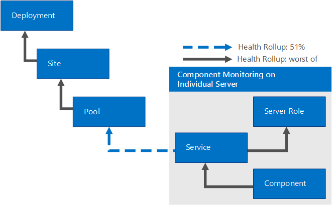
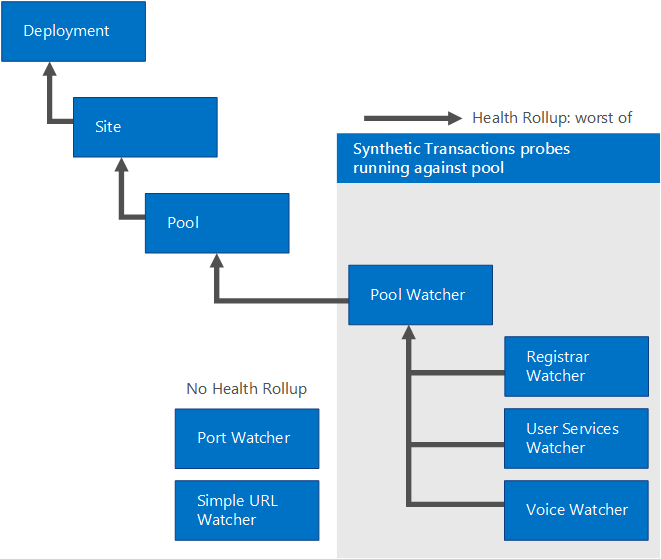

# Manage Skype for Business Server 2019 using SCOM Management pack
 
**Summary:** Learn how to configure your Skype for Business Server 2019 infrastructure to work with System Center Operations Manager.
  
In an ideal world, you'd never encounter issues with Skype for Business Server 2019. However, Skype for Business Server can be affected by external factors—for example, network crashes and hardware failures. By using Skype for Business Server 2019 Management Packs, you can identify and address potential issues proactively. In this way, the Skype for Business Server 2019 Management Packs extend the capabilities of System Center Operations Manager.
  
This information was written based on version 9319.0 of the Monitoring Pack for Skype for Business Server 2019 communications software.
  
## Configuration overview

 To configure your Skype for Business Server 2019 infrastructure to work with System Center Operations Manager, you must do three things:
  
Identify and [Configure the Primary Management Server](../../SfbServer/management-tools/use-scom-management-pack/configure-the-primary.md). To do this, you must install System Center Operations Manager 2012 SP1 or R2. 
  
 Identify and [Configure the Skype for Business Server computers that will be monitored](../../SfbServer/management-tools/use-scom-management-pack/configure-computers-to-monitor.md). To monitor a Skype for Business Server computer by using System Center Operations Manager, you must install the System Center Operations Manager agent files, and configure each server to act as a proxy. 
  
 Identify and [Install and configure watcher nodes](../../SfbServer/management-tools/use-scom-management-pack/watcher-nodes.md). Watcher nodes are computers that periodically run Skype for Business Server synthetic transactions—Windows PowerShell cmdlets that verify that key Skype for Business Server components, such as the ability to log on to the system or the ability to exchange instant messages, are working as expected. 
  
## System Center Operations Manager Root Management Server and Agent Support

The Management Packs can be used with System Center Operations Manager 2007 R2 (64-bit) (Supported for Migration purposes only) or System Center Operations Manager 2012 SP1 &amp; R2 (64-bit). The following table shows the supported configurations for the Management Packs for Skype for Business Server 2019: 
  
|**Configuration**|**Supported?**|
|:-----|:-----|
|Windows Server 2008 R2 operating system    Windows Server 2012 R2 operating system    |Yes. Both on Skype for Business Server 2019 server and synthetic transaction watcher nodes.    |
|Clustered servers    |Not supported.    |
|Agentless monitoring    |Not supported.    |
|Virtual environment    |Yes.    |
|Domain-joined server roles    |All internal Skype for Business Server 2019 server roles must be domain-joined.    |
|Stand-alone server roles    |Skype for Business Server 2019 Edge Servers are not required to be domain-joined.    |
|Topology limitations    |All server roles in a deployment must be monitored from the same Operations Manager Management Group.    |
|Synthetic transactions watcher node    |Monitoring scenario availability with a synthetic transactions watcher node is supported (additional configuration required). Watcher nodes are not required to be domain-joined.    |
   
The following table shows the capacity and operating system requirements for a synthetic transaction watcher node:
  
|**Hardware component**|**Minimum requirement**|
|:-----|:-----|
|CPU    |One of the following:    64-bit processor, quad-core, 2.33 GHz or higher    64-bit 2-way processor, dual-core, 2.33 GHz or higher    |
|Memory    |8 GB    |
|Operating system    |Windows Server 2008 R2    Windows Server 2012 R2    |
|Network    |1 network adapter at 1 Gbps    |
   
## Prerequisites

To run a synthetic transaction watcher node, you must first install the following:
  
- System Center Operations Manager Agent 
    
-  Microsoft .NET Framework 4.5
    
- Skype for Business Server core installation files (OcsCore.msi) and Unified Communications Managed API (UCMA) (versions must match the Skype for Business Server WatcherNode.msi version)
    
## Files in this Monitoring Pack

The Monitoring Pack for Skype for Business Server 2019 includes the following files:
  
- Microsoft.LS.2019.Monitoring.ActiveMonitoring.mp
    
- Microsoft.LS.2019.Monitoring.ComponentAndUser.mp
    
- WatcherNode.msi
    
## What's New

The following features are new to Skype for Business Server 2019 Management Packs.
  
- **Automatic discovery for Client Sign-In** Client applications that sign-in to Skype for Business Server 2019 often automatically discover the server to sign-in to. Synthetic transactions now support verification that automatic discovery is configured correctly.
    
- **Customized synthetic transaction run intervals** To simplify the set up process of Watcher Nodes, synthetic transactions can share user accounts. This slows down the frequency at which the tests are run as the tests are serialized to avoid conflicts. By default, synthetic transactions run every 15 minutes to ensure all tests have time to run. Administrators who choose to use more users or fewer tests per user may now reduce the run interval, as well.
    
- **Video Interop Services synthetic transaction** Customers who are migrating to Skype for Business Server 2019 from other vendor solutions often desire to continue using the video teleconferencing devices (VTCs) from these other vendors. Video Interop Server is a new Skype for Business Server 2019 server role that enables customers to continue to use Cisco VTCs in their conference rooms by connecting to Cisco CUCM via a video SIP trunk. This feature also adds a synthetic transaction to help verify that the Video Interop Server is up and can handle incoming connections over a video SIP trunk.
    
- **Application Sharing Conferencing synthetic transaction** End-to-end scenario validation for Application Sharing Conferences is now supported.
    
## Monitoring Scenarios

The Skype for Business Server 2019 Management Pack leverages a variety of features to help you detect and diagnose issues. These features provide real-time visibility into the health of a Skype for Business Server 2019 environment.
  
|**Monitoring scenario**|**Description**|
|:-----|:-----|
|Synthetic transactions    | Windows PowerShell cmdlets to test and help ensure high availability of scenarios such as sign in, presence, IM, and conferencing for users.   The synthetic transactions can be run from any geographic location including inside the enterprise, outside of the enterprise and in branch offices.    When a synthetic transaction fails, HTML log s are created to help determine the exact nature of the failure. This includes understanding which action failed, the latency of each action, the command line used to run the test, and the specific error that occurred.    |
|Call reliability alerts    |Call Detail Records (CDRs) written by Skype for Business Server 2019 Servers reflect whether users are able to connect to a call or why a call is terminated. Call reliability alerts query the CDR database to produce alerts that indicate when a high number of users experience connectivity issues for peer-to-peer calls or basic conferencing functionality.    Scenario coverage includes audio calls, peer-to-peer instant messaging (IM) and other conferencing features.    |
|Media quality alerts    |Database queries that look at Quality of Experience (QoE) reports published by Skype for Business Server 2019 clients at the end of each call. These queries produce alerts that pinpoint scenarios where users are most likely to experience compromised media quality during calls and conferences. The data is built on key metrics, such as packet latency and loss, which directly contribute to the quality of user experience.    |
|Component health alerts    |Individual server components raise alerts via event logs and performance counters to indicate failure conditions that may significantly affect user scenarios. These alerts indicate a variety of conditions, such as services not running, high failure rates, high message latency, or connectivity issues.    |
|Dependency health monitoring    |Skype for Business Server can fail for a variety of external reasons. The Management Pack monitors and collects data for critical external dependencies that can indicate severe issues. These dependencies include Internet Information Services (IIS) availability, and CPU of servers used for Skype for Business Server.    |
   
### Alert Prioritization

Alerts are classified into the following categories: 
  
 **High Priority alerts:** These alerts indicate conditions that cause service outages for large groups of users and require immediate action. Outages detected by synthetic transactions and offline services (such as Skype for Business Server Audio/Video Conferencing) qualify as High Priority alerts. In contrast, a component failure on a single machine is not a High Priority alert. Skype for Business Server 2019 has built-in high-availability features for these situations—for example, multiple Front End Servers behind load balancers.
  
 **Medium Priority alerts:** These alerts indicate conditions that affect a subset of users or indicate issues in call quality—for example, component failures, latency in call establishment, or lower audio quality in calls. Alerts in this category are stateful (that is, the nature of the alert changes based on the state of the network connection.) For example, if call establishment times indicate latency but then return to a normal threshold, this Medium Priority alert would be auto-resolved in System Center Operations Manager and administrators would not need to take action. Alerts that cannot be auto-resolved are typically addressed by administrators on the same business day.
  
 **Other alerts:** These alerts are generated from components that might affect a specific user or subset of users. For example, a typical alert would be that the Address Book service could not parse the Active Directory® Domain Services (AD DS) entry for user: testuser@contoso.com. Administrators can address these alerts whenever they have time available.
  
### Synthetic Transactions

Skype for Business Server 2019 Management Packs provide increased coverage for alerts through synthetic transactions. Synthetic transactions are Windows PowerShell cmdlets integrated into the Operations Manager management pack to test end-to-end user scenarios. When you designate a server to execute synthetic transactions, these cmdlets are triggered periodically by the management pack. Failures resulting from a synthetic transaction generate a stateful alert. Here are supported synthetic transactions for Skype for Business Server 2019:
  
**Supported Synthetic Transactions for Registration, Presence, and Contacts**

||||
|:-----|:-----|:-----|
|1    |Registration (user login)    |Available Lync Server 2010 and beyond    |
|2    |Address Book Service (file download)    |Available Lync Server 2010 and beyond    |
|3    |Address Book Web Query    |Available Lync Server 2010 and beyond    |
|4    |Presence    |Available Lync Server 2010 and beyond    |
|5    |Unified Contact Store    |Available Lync Server 2013 and beyond    |
   
**Supported Synthetic Transactions for Peer-to-Peer Services**

||||
|:-----|:-----|:-----|
|6    |Peer-to-Peer Instant Messaging    |Available in Lync Server 2010 and beyond    |
|7    |Peer-to-Peer Audio Video    |Available in Lync Server 2010 and beyond    |
|8    |MCX Peer-to-Peer Instant Message (mobile)    |Available in the September 2011 release of Lync Server 2010 to Skype for Business 2019    |
 
> [!NOTE]
> MCX (Mobility Service) support for legacy mobile clients is no longer available in Skype for Business Server 2019. All current Skype for Business mobile clients already use Unified Communications Web API (UCWA) to support instant messaging (IM), presence, and contacts. Users with legacy clients using MCX will need to upgrade to a current client.
  
**Supported Synthetic Transactions for Conferencing and Persistent Chat**

||||
|:-----|:-----|:-----|
|9    |Audio Video Conferencing    |Available in Lync Server 2010 and beyond    |
|10    |Data Conferencing    |Available in Lync Server 2013 and beyond    |
|11    |Instant Message Conferencing    |Available in Lync Server 2010 and beyond    |
|12    | Persistent Chat   |Available in Lync Server 2013 and beyond    |
|13    |Join Launcher (scheduled meetings)    |Available in Lync Server 2013 and beyond    |
|14    |Dial in Conferencing    |Available in Skype for Business Server 2015 and beyond   |
|15    |Application Sharing Conferencing    |Available in Skype for Business Server 2015 and beyond   |
|16    |UCWA Conference (web meeting join)    |Available in Skype for Business Server 2015 and beyond   |
   
**Supported Synthetic Transactions for Network and Partner Dependencies**

||||
|:-----|:-----|:-----|
|17    |AV Edge Connectivity    |Available in Lync Server 2013 and beyond    |
|18    |AV Edge Connectivity Exchange Unified Message Connectivity (voicemail)    |Available in Lync Server 2013 and beyond    |
|19    |PSTN Peer-to-Peer Call    |Available in Lync Server 2010 and beyond    |
|20    |XMPP Instant Messaging (federation)    |Available in Lync Server 2013 and beyond    |
|21    |Video Interop Server    |Available in Skype for Business Server 2015 and beyond    |
   
## How Health Rolls Up

The following Table shows the health states of objects the Skype for Business Server monitoring pack.
  
|**Management Pack Object**|**Description**|
|:-----|:-----|
|Skype for Business Server Deployment    |Represents the deployment of Skype for Business Server 2019 in the organization.    |
|Skype for Business Server Site    |Represents different geographical locations where services are deployed.    |
|Skype for Business Server Pool    |A Pool (within a Site) that provides communications services, such as instant messaging and conferencing, to users. Applicable to Front End pools, Edge pools, and Director pools, even if there is only a single machine in a given pool.    |
|Skype for Business Server Role    |A server role that hosts Skype for Business Server Service.    |
|Skype for Business Server Service    |Represents a functionality deployed on a specific machine (for example, user service on fp01.contoso.com).    |
|Skype for Business Server Component    |A component of the Service (for example, the Address Book Download component is a part of the Web Service).    |
|Skype for Business Server Pool Watcher    |An instance of synthetic transactions that are running against one pool.    |
|Skype for Business Server Registrar Watcher    |An instance of synthetic transactions that run against one Registrar pool.    |
|Skype for Business Server User Services Pool Watcher    |An instance of synthetic transactions that run against one User Services pool.    |
|Skype for Business Server Voice Pool Watcher    |An instance of synthetic transactions that run against one Voice pool.    |
|Skype for Business Server Port Watcher    |An instance of Port checks running against one pool.    |
|Simple URL Watcher    |Performs HTTPS probing of the configured simple URLs in a deployment.    |
   

  
A Skype for Business Server pool can contain multiple individual Skype for Business Server systems (with more than one Skype for Business Server role, Skype for Business Server service, and Skype for Business Server component). Therefore, the failure of an individual server or component is less critical to the overall health of the Skype for Business Server pool, because other servers in the same pool can provide the application service to the client. The health will roll up on a percentage level to the Skype for Business Server pool. 
  
The Skype for Business Server Pool Watcher performs synthetic transactions against a Skype for Business Server pool. Consecutive failure of one or more synthetic transactions (a process known as the consecutive polling interval) will roll up the critical health state to the pool level (worst of any synthetic transaction), as shown in the following diagram. 
  

  
## Best Practice: Create a Management Pack for Customizations

By default, Operations Manager saves all customizations, such as overrides to the Default Management Pack. As a best practice, you should create a separate management pack for each sealed management pack that you want to customize. 
  
When you create a management pack for storing customized settings for a sealed management pack, we recommend naming the new management pack appropriately, such as "Skype for Business Server 2019 Customizations."
  
Creating a new management pack for storing customizations of each sealed management pack makes it easier to export the customizations from a test environment to a production environment. This also makes it easier to delete a management pack, because you must delete any dependencies before you can delete a management pack. If customizations for all management packs are saved in the Default Management Pack and you need to delete a single management pack, you must first delete the Default Management Pack, which also deletes customizations to other management packs. 
  
## Links

The following links connect you to information about common tasks that are associated with System Center 2012 Monitoring Packs:
  
- [Management Pack Life Cycle](https://technet.microsoft.com/en-us/library/hh212732.aspx)
    
- [How to Import a Management Pack in Operations Manager 2012 ](https://technet.microsoft.com/en-us/library/hh212691.aspx)
    
- [How to Override a Rule or Monitor ](https://technet.microsoft.com/en-us/library/hh212869.aspx)
    
- [How to Create a Run As Account in Operations Manager 2012](https://technet.microsoft.com/en-us/library/hh321655.aspx)
    
- [Managing Run As Accounts and Profiles](https://technet.microsoft.com/en-us/library/hh212714.aspx)
    
- [How to Export an Operations Manager Management Pack](https://technet.microsoft.com/en-us/library/hh320149.aspx)
    
- [How to Remove an Operations Manager Management Pack](https://technet.microsoft.com/en-us/library/hh230746.aspx)
    
The following links connect you to information about common tasks that are associated with System Center 2007 Monitoring Packs:
  
- [Administering the Management Pack Life Cycle](https://go.microsoft.com/fwlink/p/?LinkId=211463)
    
- [How to Import a Management Pack in Operations Manager 2007](https://go.microsoft.com/fwlink/p/?LinkID=142351)
    
- [How to Monitor Using Overrides](https://go.microsoft.com/fwlink/p/?LinkID=117777)
    
- [How to Create a Run As Account in Operations Manager 2007 ](https://go.microsoft.com/fwlink/p/?LinkID=165410)
    
- [How to Modify an Existing Run As Profile](https://go.microsoft.com/fwlink/p/?LinkID=165412)
    
- [How to Export Management Pack Customizations](https://go.microsoft.com/fwlink/p/?LinkId=209940)
    
- [How to Remove a Management Pack](https://go.microsoft.com/fwlink/p/?LinkId=209941)
    
For questions about Operations Manager and monitoring packs, see the [System Center Operations Manager community forum](https://go.microsoft.com/fwlink/p/?LinkID=179635).
  
A useful resource is the [System Center Operations Manager Unleashed](https://opsmgrunleashed.wordpress.com/) blog, which contains "By Example" posts for specific monitoring packs.
  
For additional information about Operations Manager, see the following blogs: 
  
- [Operations Manager Team Blog](https://blogs.technet.com/momteam/default.aspx)
    
- [Kevin Holman's OpsMgr Blog](https://blogs.technet.com/kevinholman/default.aspx)
    
- [Thoughts on OpsMgr](https://thoughtsonopsmgr.blogspot.com/)
    
- [Raphael Burri's blog](https://rburri.wordpress.com/)
    
- [BWren's Management Space](https://blogs.technet.com/brianwren/default.aspx)
    
- [Ops Mgr ++](https://blogs.msdn.com/boris_yanushpolsky/default.aspx)
    
> [!IMPORTANT]
> All information and content on non-Microsoft sites is provided by the owner or the users of the website. Microsoft makes no warranties, express, implied, or statutory, as to the information at this website. 
  
## See also

[Skype for Business Server 2019 Management Tools](../management-tools-2019.md)
