# Client Version Policy

The **CLIENT VERSION POLICY** sub tab under **Client** tab returns information about the clients supported in Skype for Business Server environment. A client version policy enables you to specify those clients who can sign in to Skype for Business Server system.

Let us consider the various tasks a user can do on **CLIENT VERSION POLICY**, and the Skype for Business cmdlets those tasks map to.

---
> **Functionality 1**: Lists all the client version policies

   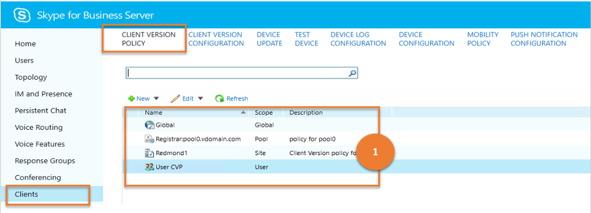

***Cmdlet***

[Get-CsClientVersionPolicy](https://docs.microsoft.com/en-us/powershell/module/skype/get-csclientversionpolicy?view=skype-ps)

***Example***

```powershell
 Get-CsClientVersionPolicy
```

---

> **Functionality 2**: Creates a new client version policy

   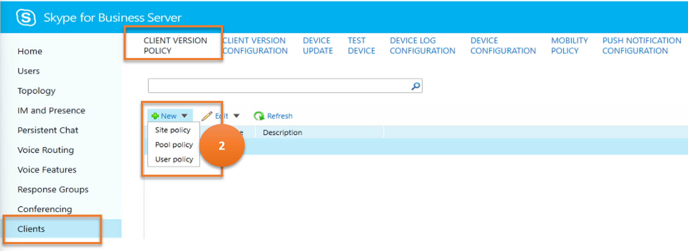

***Cmdlet***

[New-CsClientVersionPolicy](https://docs.microsoft.com/en-us/powershell/module/skype/new-csclientversionpolicy?view=skype-ps)  

***Example***

```powershell
 New-CsClientVersionPolicy -Identity site:Redmond
```

---

> **Functionality 3**: Gets details of a chosen client version policy

   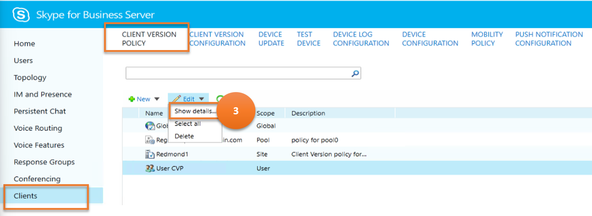

***Cmdlet***

[Get-CsClientVersionPolicy](https://docs.microsoft.com/en-us/powershell/module/skype/get-csclientversionpolicy?view=skype-ps)

***Example***

```powershell
 Get-CsClientVersionPolicy -Identity site:Redmond
```

---

> **Functionality 4**: Deletes chosen client version policies

   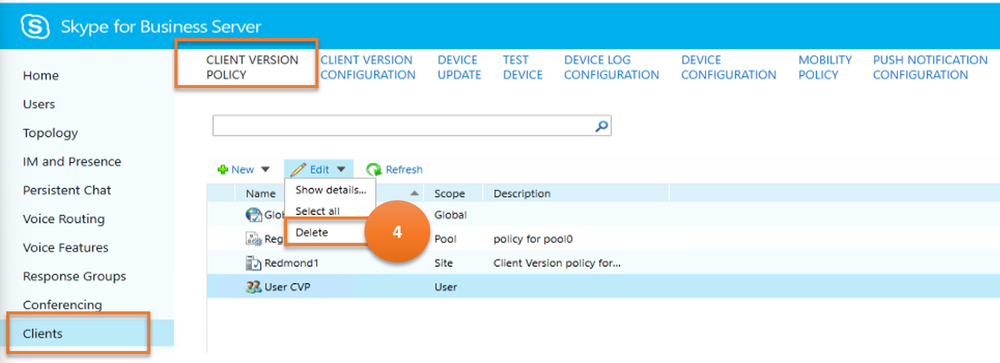

***Cmdlet***

[Remove-CsClientVersionPolicy](https://docs.microsoft.com/en-us/powershell/module/skype/remove-csclientversionpolicy?view=skype-ps)

***Example***

```powershell
 Remove-CsClientVersionPolicy -Identity site:Redmond
```

---

> **Functionality 5**: Updates a client version policy

   

- **Annotation 1 - Result**

    This annotation on the image indicates a result, that is, the data being retrieved and displayed.

    ***Cmdlet***

    [Get-CsClientVersionPolicyRule](https://docs.microsoft.com/en-us/powershell/module/skype/get-csclientversionpolicyrule?view=skype-ps)

    ***Example***

    ```powershell
    Get-CsClientVersionPolicyRule -Filter "Global/*"
    ```

- **Annotation 2 - Option (for the user)**

    This annotation on the image indicates an option for the user to implement, that is, to get the details of the client version policy rules.

    ***Cmdlet***

    [Get-CsClientVersionPolicyRule](https://docs.microsoft.com/en-us/powershell/module/skype/get-csclientversionpolicyrule?view=skype-ps)

    ***Example***

    ```powershell
    Get-CsClientVersionPolicyRule -Identity "Global/2336c611-a243-4c5d-994b-eea8a524d0e4"
    ```

- **Annotation 3 - Option (for the user)**

    This annotation on the image indicates an option for the user to implement, that is, to create a new client version policy rule.

    ***Cmdlet***

    [New-CsClientVersionPolicyRule](https://docs.microsoft.com/en-us/powershell/module/skype/new-csclientversionpolicyrule?view=skype-ps)

    ***Example***

    ```powershell
    $x = \[guid\]::NewGuid()

    New-CsClientVersionPolicyRule -Parent "site:Redmond" -RuleId $x -MajorVersion 4 -UserAgent InHouse
    ```

- **Annotation 4 - Option (for the user)**

    This annotation on the image indicates an option for the user to implement, that is, to commit/save the newly created client version policy rule.

    ***Cmdlet***

    [Set-CsClientVersionPolicy](https://docs.microsoft.com/en-us/powershell/module/skype/set-csclientversionpolicy?view=skype-ps)

    ***Example***

    ```powershell
    Set-CsClientVersionPolicy -Identity site:Redmond -Rules $Null

    $x = Get-CsClientVersionPolicy -Identity site:Dublin | Select-Object -ExpandProperty Rules

    Set-CsClientVersionPolicy -Identity site:Redmond -Rules $x
    ```

---

## Client Version Configuration

 The **CLIENT VERSION CONFIGURATION** sub tab returns information about the clients supported in Skype for Business Server environment.

Let us consider the various tasks a user can do on **CLIENT VERSION CONFIGURATION**, and the Skype for Business cmdlets those tasks map to.

---
> **Functionality 1**: Lists all the client version configurations

   

***Cmdlet***

[Get-CsClientVersionConfiguration](https://docs.microsoft.com/en-us/powershell/module/skype/get-csclientversionconfiguration?view=skype-ps)

***Example***

```powershell
 Get-CsClientVersionConfiguration
```

---

> **Functionality 2**: Creates a new client version configuration

   

***Cmdlet***

[New-CsClientVersionConfiguration](https://docs.microsoft.com/en-us/powershell/module/skype/new-csclientversionconfiguration?view=skype-ps)  

***Example***

```powershell
 New-CsClientVersionConfiguration -Identity site:Redmond -Enabled $False
```

---

> **Functionality 3**: Gets details of a chosen client version configuration

   

***Cmdlet***

[Get-CsClientVersionConfiguration](https://docs.microsoft.com/en-us/powershell/module/skype/get-csclientversionconfiguration?view=skype-ps)

***Example***

```powershell
 Get-CsClientVersionConfiguration -Identity site:Redmond
```

---

> **Functionality 4**: Deletes chosen client version configurations

   

***Cmdlet***

[Remove-CsClientVersionConfiguration](https://docs.microsoft.com/en-us/powershell/module/skype/remove-csclientversionconfiguration?view=skype-ps)

***Example***

```powershell
 Remove-CsClientVersionConfiguration -Identity site:Redmond
```

---

> **Functionality 5**: Updates client version configurations

   

***Cmdlet***

[Set-CsClientVersionConfiguration](https://docs.microsoft.com/en-us/powershell/module/skype/set-csclientversionconfiguration?view=skype-ps)

***Example***

```powershell
Get-CsClientVersionConfiguration | Set-CsClientVersionConfiguration -DefaultURL "https://litwareinc.com/csclients"
```

---

> **Functionality 6**: Enables/disables client version configurations


***Cmdlet***

[Set-CsClientVersionConfiguration](https://docs.microsoft.com/en-us/powershell/module/skype/set-csclientversionconfiguration?view=skype-ps)

***Example***

```powershell
Set-CsClientVersionConfiguration -Identity site:Redmond -Enabled $False
```

---

## Device Update

**DEVICE UPDATE** rules are used to associate firmware updates with devices that run Skype for Business Phone Edition.

Let us consider the various tasks a user can do on **DEVICE UPDATE**, and the Skype for Business cmdlets those tasks map to.

---
> **Functionality 1**: Lists all the device updates

   

***Cmdlet***

[Get-CsDeviceUpdateRule](https://docs.microsoft.com/en-us/powershell/module/skype/csdeviceupdaterule?view=skype-ps)

***Example***

```powershell
 Get-CsDeviceUpdateRule
```

---

> **Functionality 2**: Delete device update

   

***Cmdlet***

[Remove-CsDeviceUpdateRule](https://docs.microsoft.com/en-us/powershell/module/skype/remove-csdeviceupdaterule?view=skype-ps)  

***Example***

```powershell
 Remove-CsDeviceUpdateRule -Identity service:WebServer:atl-cs-001.litwareinc.com/d5ce3c10-2588-420a-82ac-dc2d9b1222ff9
```

---

> **Functionality 3**: Cancel device update

   

***Cmdlet***

[Clear-CsDeviceUpdateFile](https://docs.microsoft.com/en-us/powershell/module/skype/clear-csdeviceupdatefile?view=skype-ps)

***Example***

```powershell
 Clear-CsDeviceUpdateFile -Identity "service:WebServer:atl-cs-001.litwareinc.com"
```

---

> **Functionality 4**: Approve device update

   

***Cmdlet***

[Approve-CsDeviceUpdateRule](https://docs.microsoft.com/en-us/powershell/module/skype/approve-csdeviceupdaterule?view=skype-ps)

***Example***

```powershell
 Approve-CsDeviceUpdateRule -Identity service:WebServer:atl-cs-001.litwareinc.com/d5ce3c10-2588-420a-82ac-dc2d9b1222ff9
```

---

> **Functionality 5**: Restore device update

   

***Cmdlet***

[Restore-CsDeviceUpdateRule](https://docs.microsoft.com/en-us/powershell/module/skype/restore-csdeviceupdaterule?view=skype-ps)

***Example***

```powershell
 Restore-CsDeviceUpdateRule -Identity service:WebServer:atl-cs-001.litwareinc.com/d5ce3c10-2588-420a-82ac-dc2d9b1222ff9
```

---

## Test Device

The **TEST DEVICE** component provides a way for administrators to test firmware updates before those updates are distributed to all the devices in an organization.

Let us consider the various tasks a user can do on **TEST DEVICE**, and the Skype for Business cmdlets those tasks map to.

---
> **Functionality 1**: Lists all the test devices

   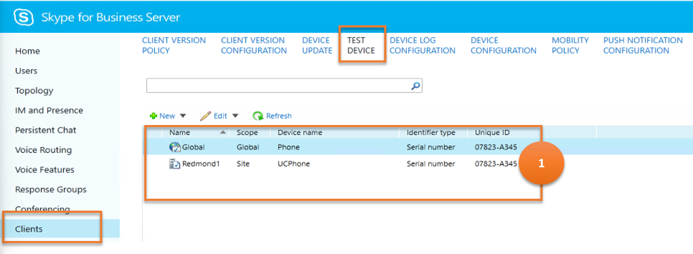

***Cmdlet***

[Get-CsTestDevice](https://docs.microsoft.com/en-us/powershell/module/skype/get-cstestdevice?view=skype-ps)

***Example***

```powershell
 Get-CsTestDevice
```

---

> **Functionality 2**: Creates a new test device

   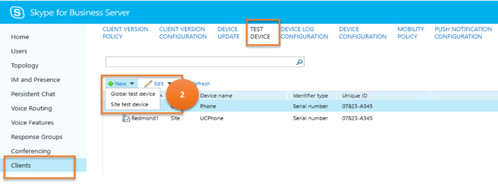

***Cmdlet***

[New-CsTestDevice](https://docs.microsoft.com/en-us/powershell/module/skype/new-cstestdevice?view=skype-ps)  

***Example***

```powershell
 New-CsTestDevice -Identity site:Redmond/UCPhone -IdentifierType SerialNumber -Identifier "07823-A345"
```

---

> **Functionality 3**: Gets details of a chosen test device

   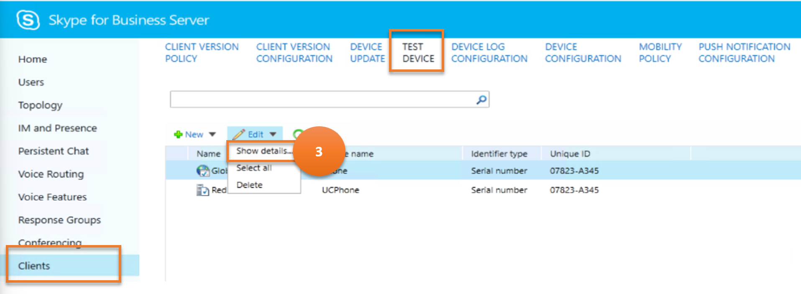

***Cmdlet***

[Get-CsTestDevice](https://docs.microsoft.com/en-us/powershell/module/skype/get-cstestdevice?view=skype-ps)

***Example***

```powershell
 Get-CsTestDevice -Identity site:Redmond/UCPhone
```

---

> **Functionality 4**: Deletes a chosen test device

   

***Cmdlet***

[Remove-CsTestDevice](https://docs.microsoft.com/en-us/powershell/module/skype/remove-cstestdevice?view=skype-ps)

***Example***

```powershell
 Remove-CsTestDevice -Identity site:Redmond
```

---

> **Functionality 5**: Updates a test device

   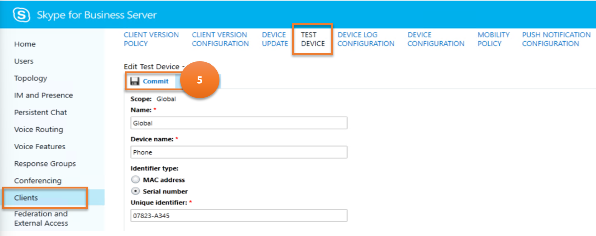

***Cmdlet***

[Set-CsTestDevice](https://docs.microsoft.com/en-us/powershell/module/skype/set-cstestdevice?view=skype-ps)

***Example***

```powershell
Set-CsTestDevice -Identity site:Redmond/UCPhone -IdentifierType SerialNumber -Identifier "09768-ABDR-83295"
```

---

## Device Log Configuration

**DEVICE LOG CONFIGURATION** helps manage the Device Update Web service, a Skype for Business Server component that enables administrators to distribute firmware updates to telephones and other devices that run Skype for Business.

Let us consider the various tasks a user can do on **DEVICE LOG CONFIGURATION**, and the Skype for Business cmdlets those tasks map to.

---
> **Functionality 1**: Lists all the device log configurations

   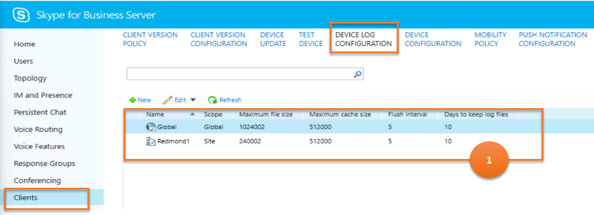

***Cmdlet***

[Get-CsDeviceUpdateConfiguration](https://docs.microsoft.com/en-us/powershell/module/skype/get-csdeviceupdateconfiguration?view=skype-ps)

***Example***

```powershell
 Get-CsDeviceUpdateConfiguration
```

---

> **Functionality 2**: Creates a new device log configuration

   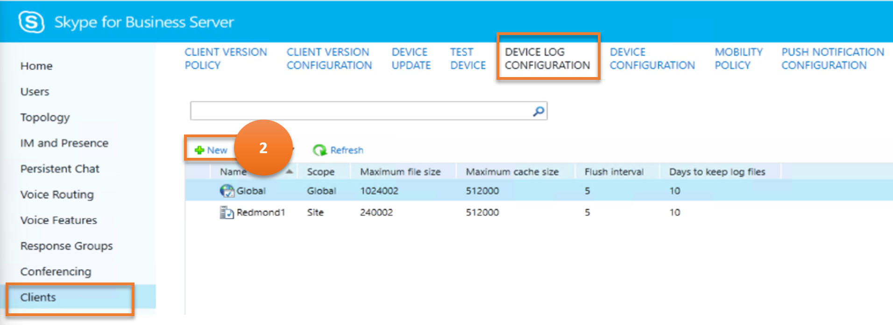

***Cmdlet***

[New-CsDeviceUpdateConfiguration](https://docs.microsoft.com/en-us/powershell/module/skype/new-csdeviceupdateconfiguration?view=skype-ps)  

***Example***

```powershell
 New-CsDeviceUpdateConfiguration -Identity site:Redmond "07823-A345"
```

---

> **Functionality 3**: Gets details of a chosen device log configuration

   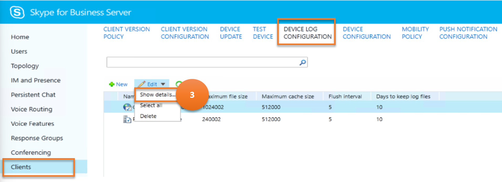

***Cmdlet***

[Get-CsDeviceUpdateConfiguration](https://docs.microsoft.com/en-us/powershell/module/skype/get-csdeviceupdateconfiguration?view=skype-ps)

***Example***

```powershell
 Get-CsDeviceUpdateConfiguration -Identity Global
```

---

> **Functionality 4**: Deletes chosen device log configurations

   

***Cmdlet***

[Remove-CsDeviceUpdateConfiguration](https://docs.microsoft.com/en-us/powershell/module/skype/remove-csdeviceupdateconfiguration?view=skype-ps)

***Example***

```powershell
 Remove-CsTestDevice -Identity site:Redmond
```

---

> **Functionality 5**: Updates device log configurations

   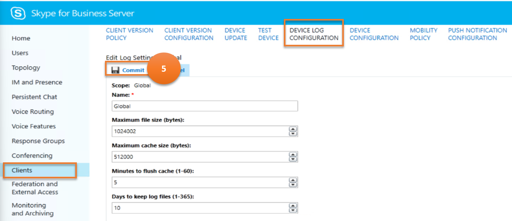

***Cmdlet***

[Set-CsDeviceUpdateConfiguration](https://docs.microsoft.com/en-us/powershell/module/skype/set-csdeviceupdateconfiguration?view=skype-ps)

***Example***

```powershell
Set-CsDeviceUpdateConfiguration -Identity global -MaxLogFileSize 2048000 -MaxLogCacheLimit 1024000
```

---

## Device Configuration

**DEVICE CONFIGURATION** helps administer information regarding management options for UC phones. This includes such things as the required security mode and whether or not the phone should automatically be locked after a specified period of inactivity.

Let us consider the various tasks a user can do on **DEVICE CONFIGURATION**, and the Skype for Business cmdlets those tasks map to.

---
> **Functionality 1**: Lists all the mobility policies

   

***Cmdlet***

[Get-CsUCPhoneConfiguration](https://docs.microsoft.com/en-us/powershell/module/skype/get-csucphoneconfiguration?view=skype-ps)

***Example***

```powershell
 Get-CsUCPhoneConfiguration
```

---

> **Functionality 2**: Creates a new device configuration

   

***Cmdlet***

[New-CsUCPhoneConfiguration](https://docs.microsoft.com/en-us/powershell/module/skype/new-csucphoneconfiguration?view=skype-ps)  

***Example***

```powershell
 New-CsUCPhoneConfiguration -Identity site:Redmond -CalendarPollInterval "00:10:00" -LoggingLevel "Medium"
```

---

> **Functionality 3**: Gets details of a chosen device configuration

   

***Cmdlet***

[Get-CsUCPhoneConfiguration](https://docs.microsoft.com/en-us/powershell/module/skype/get-csucphoneconfiguration?view=skype-ps)

***Example***

```powershell
 Get-CsUCPhoneConfiguration -Identity site:Redmond
```

---

> **Functionality 4**: Deletes chosen device configuration

   

***Cmdlet***

[Remove-CsUCPhoneConfiguration](https://docs.microsoft.com/en-us/powershell/module/skype/remove-csucphoneconfiguration?view=skype-ps)

***Example***

```powershell
 Remove-CsUCPhoneConfiguration -Identity site:Redmond
```

---

> **Functionality 5**: Updates device configuration

   

***Cmdlet***

[Set-CsUCPhoneConfiguration](https://docs.microsoft.com/en-us/powershell/module/skype/set-csucphoneconfiguration?view=skype-ps)

***Example***

```powershell
 Set-CsUCPhoneConfiguration -Identity site:Redmond -PhoneLockTimeout "00:30:00"
```

---

## Mobility Policy

**MOBILITY POLICY** determine whether or not a user can use Skype for Business Mobile. These policies also manage a user's ability to employ Call via Work, a feature that enables users to make and receive phone calls on their mobile phone by using their work phone number instead of their mobile phone number. Mobility policies can also be used to require Wi-Fi connections when making or receiving calls.

Let us consider the various tasks a user can do on **MOBILITY POLICY**, and the Skype for Business cmdlets those tasks map to.

---
> **Functionality 1**: Lists all the mobility policies

   

***Cmdlet***

[Get-CsMobilityPolicy](https://docs.microsoft.com/en-us/powershell/module/skype/get-csmobilitypolicy?view=skype-ps)

***Example***

```powershell
 Get-CsMobilityPolicy
```

---

> **Functionality 2**: Creates a new mobility policy

   

***Cmdlet***

[New-CsMobilityPolicy](https://docs.microsoft.com/en-us/powershell/module/skype/new-csmobilitypolicy?view=skype-ps)  

***Example***

```powershell
 New-CsMobilityPolicy -Identity site:Redmond -EnableOutsideVoice $False
```

---

> **Functionality 3**: Gets details of a chosen mobility policy

   

***Cmdlet***

[Get-CsMobilityPolicy](https://docs.microsoft.com/en-us/powershell/module/skype/get-csmobilitypolicy?view=skype-ps)

***Example***

```powershell
 Get-CsMobilityPolicy -Identity "site:Redmond"
```

---

> **Functionality 4**: Deletes chosen mobility policy

   

***Cmdlet***

[Remove-CsMobilityPolicy](https://docs.microsoft.com/en-us/powershell/module/skype/remove-csmobilitypolicy?view=skype-ps)

***Example***

```powershell
 Remove-CsMobilityPolicy -Identity "site:Redmond"
```

---

> **Functionality 5**: Updates mobility policy

   

***Cmdlet***

[Set-CsMobilityPolicy](https://docs.microsoft.com/en-us/powershell/module/skype/set-csmobilitypolicy?view=skype-ps)

***Example***

```powershell
Set-CsMobilityPolicy -Identity "site:Redmond" -EnableOutsideVoice $False
```

---

## Push Notification Configuration

The **PUSH NOTIFICATION SERVICE** (Apple Push Notification Service and Microsoft Push Notification Service) provides a way to send notifications about events such as new instant messages or new voice mail to mobile devices such as iPhones and Windows Phones, even if the Skype for Business application on those devices is currently suspended or running in the background.

Let us consider the various tasks a user can do on **PUSH NOTIFICATION CONFIGURATION**, and the Skype for Business cmdlets those tasks map to.

---
> **Functionality 1**: Lists all the mobility policies

   

***Cmdlet***

[Get-CsPushNotificationConfiguration](https://docs.microsoft.com/en-us/powershell/module/skype/get-cspushnotificationconfiguration?view=skype-ps)

***Example***

```powershell
 Get-CsPushNotificationConfiguration
```

---

> **Functionality 2**: Creates a new push notification configuration

   

***Cmdlet***

[New-CsPushNotificationConfiguration](https://docs.microsoft.com/en-us/powershell/module/skype/new-cspushnotificationconfiguration?view=skype-ps)  

***Example***

```powershell
 New-CsPushNotificationConfiguration -Identity "site:Redmond" -EnableApplePushNotificationService $True -EnableMicrosoftPushNotificationService -$True
```

---

> **Functionality 3**: Gets details of a chosen push notification configuration

   

***Cmdlet***

[Get-CsPushNotificationConfiguration](https://docs.microsoft.com/en-us/powershell/module/skype/get-cspushnotificationconfiguration?view=skype-ps)

***Example***

```powershell
 Get-CsPushNotificationConfiguration -Identity "site:Redmond"
```

---

> **Functionality 4**: Deletes chosen push notification configuration

   

***Cmdlet***

[Remove-CsPushNotificationConfiguration](https://docs.microsoft.com/en-us/powershell/module/skype/remove-cspushnotificationconfiguration?view=skype-ps)

***Example***

```powershell
 Remove-CsPushNotificationConfiguration -Identity "site:Redmond"
```

---

> **Functionality 5**: Updates push notification configuration

   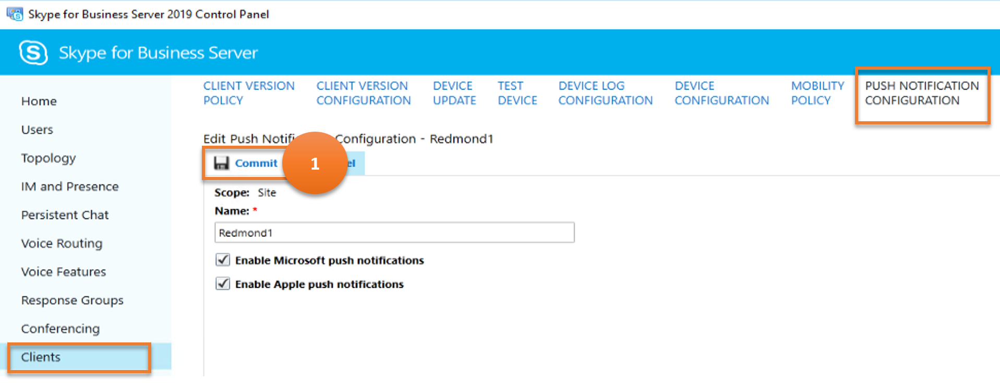

***Cmdlet***

[Set-CsPushNotificationConfiguration](https://docs.microsoft.com/en-us/powershell/module/skype/set-cspushnotificationconfiguration?view=skype-ps)

***Example***

```powershell
 Set-CsPushNotificationConfiguration -Identity "site:Redmond" -EnableApplePushNotificationService $False
```

---
