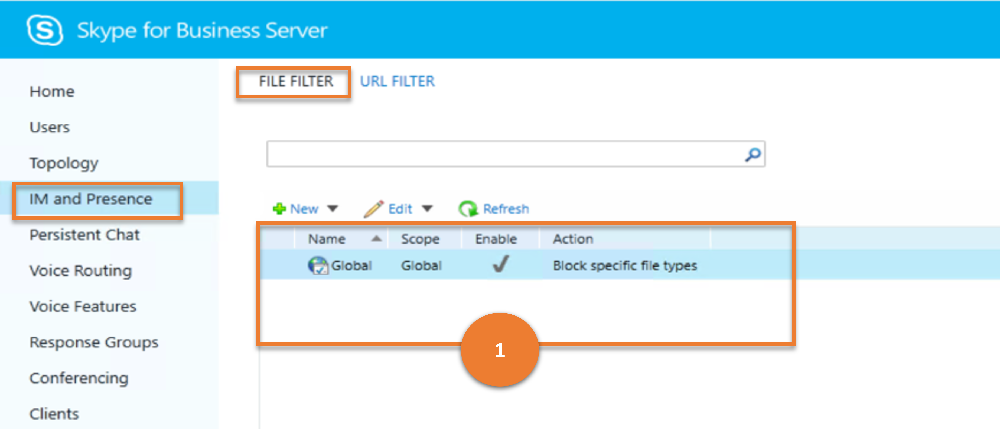
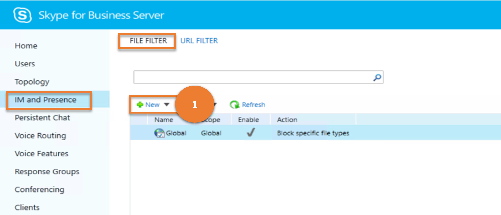
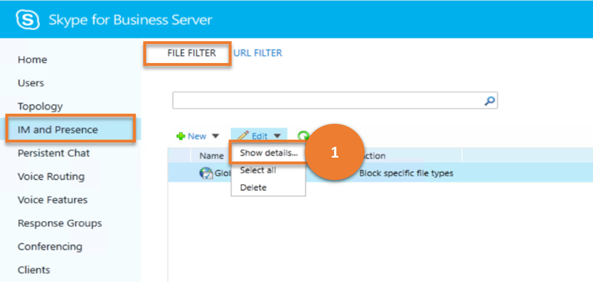
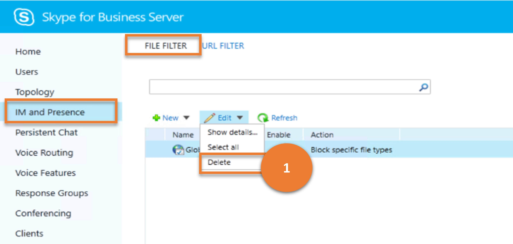
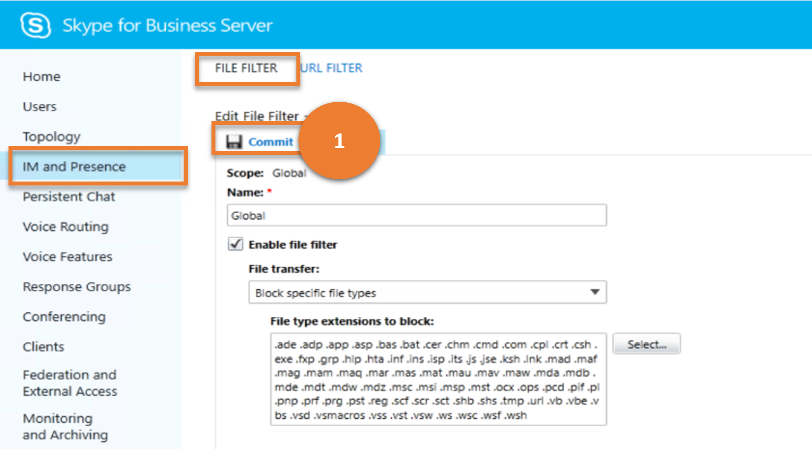
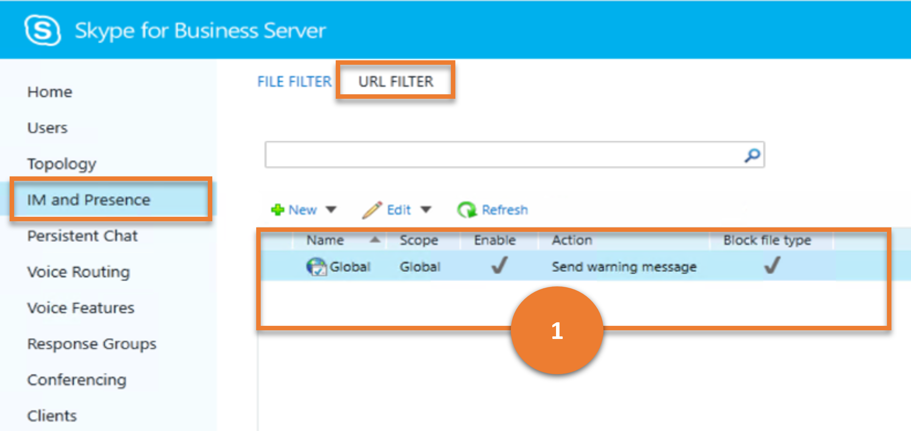
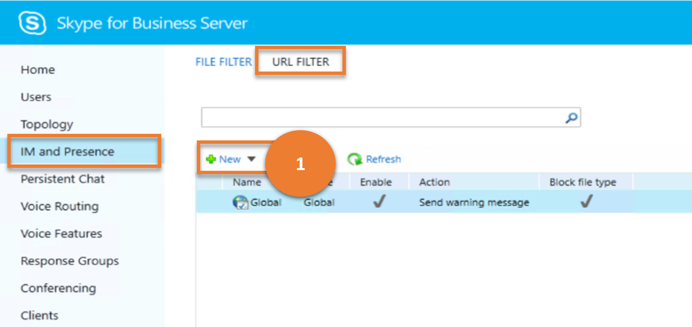
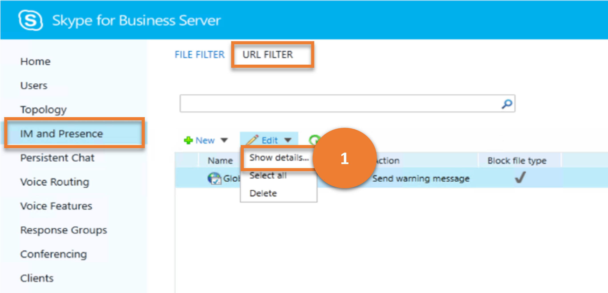
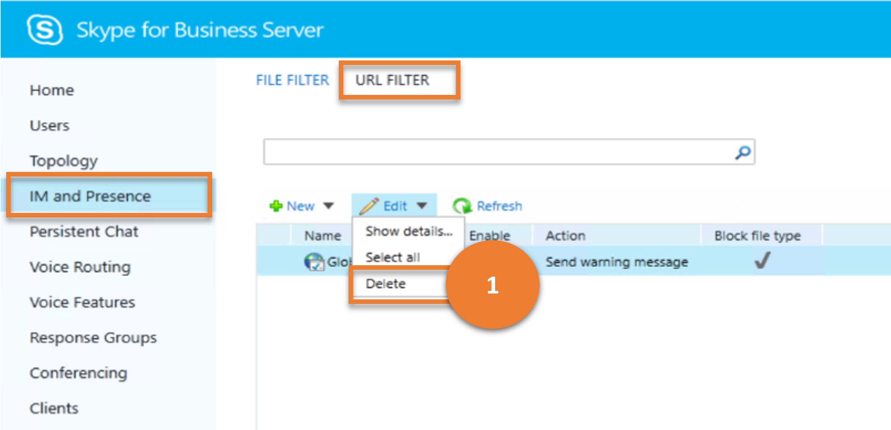
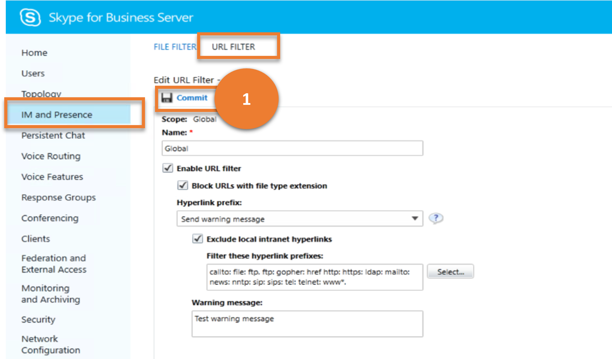

# IM and Presence

This article describes how similar results as that of the **IM and Presence** menu item in the legacy Control Panel can be achieved using cmdlets.

This article describes the following sub-menus :

- [IM and Presence](#im-and-presence)
  - [File Filter](#file-filter)
  - [URL Filter](#url-filter)

## File Filter

**FILE FILTER** sub-menu enables administrators to manage file transfer filter configurations in the organization. These configurations are used to block a user's ability to transfer certain types of files (for example, files with a .vbs or .ps1 file extension) using a Skype for Business Server client.

Let us consider the various tasks a user can do on **FILE FILTER**, and the Skype for Business cmdlets those tasks map to.

---

> **Scenario 1**: List all the file filters

   

***Cmdlet***

[Get-CsFileTransferFilterConfiguration](/powershell/module/skype/get-csfiletransferfilterconfiguration)

***Example***

```powershell
 Get-CsFileTransferFilterConfiguration
```

---

> **Scenario 2**: Create a new file filter

   

***Cmdlet***

[New-CsFileTransferFilterConfiguration](/powershell/module/skype/new-csfiletransferfilterconfiguration)  

***Example***

```powershell
 New-CsFileTransferFilterConfiguration -Identity site:Redmond
```

---

> **Scenario 3**: Get details of a chosen file filter

   

***Cmdlet***

[Get-CsFileTransferFilterConfiguration](/powershell/module/skype/get-csfiletransferfilterconfiguration)

***Example***

```powershell
 Get-CsFileTransferFilterConfiguration -Identity site:Redmond
```

---

> **Scenario 4**: Delete chosen file filters

   

***Cmdlet***

[Remove-CsFileTransferFilterConfiguration](/powershell/module/skype/remove-csfiletransferfilterconfiguration)

***Example***

```powershell
 Remove-CsFileTransferFilterConfiguration -Identity site:Redmond
```

---

> **Scenario 5**: Update a file filter

   

***Cmdlet***

[Set-CsFileTransferFilterConfiguration](/powershell/module/skype/set-csfiletransferfilterconfiguration)

***Example***

```powershell
 Set-CsFileTransferFilterConfiguration -Identity site:Redmond -Extensions @{Add=".ps1"}
```

---

## URL Filter

The **URL FILTER** sub-menu item under **IM and Presence** enables administrators to configure URL filter so that hyperlinks with certain prefixes are blocked or are not active. (In other words, the participants can't simply click the link and go to the site the URI refers to; they must copy and paste the link manually into a browser.)

Let us consider the various tasks a user can do on **URL FILTER**, and the Skype for Business cmdlets those tasks map to.

---
> **Scenario 1**: List all the web URL filters

   

***Cmdlet***

[Get-CsImFilterConfiguration](/powershell/module/skype/get-csimfilterconfiguration)

***Example***

```powershell
 Get-CsImFilterConfiguration
```

---

> **Scenario 2**: Create a new URL filter

   

***Cmdlet***

[New-CsImFilterConfiguration](/powershell/module/skype/new-csimfilterconfiguration)  

***Example***

```powershell
 New-CsImFilterConfiguration -Identity site:Redmond
```

---

> **Scenario 3**: Get details of a chosen URL filter

   

***Cmdlet***

[Get-CsImFilterConfiguration](/powershell/module/skype/get-csimfilterconfiguration)

***Example***

```powershell
 Get-CsImFilterConfiguration -Identity site:Redmond
```

---

> **Scenario 4**: Delete chosen URL filters

   

***Cmdlet***

[Remove-CsImFilterConfiguration](/powershell/module/skype/remove-csimfilterconfiguration)

***Example***

```powershell
 Remove-CsImFilterConfiguration -Identity site:Redmond
```

---

> **Scenario 5**: Update a URL filter

   

***Cmdlet***

[Set-CsImFilterConfiguration](/powershell/module/skype/set-csimfilterconfiguration)

***Example***

```powershell
 Set-CsImFilterConfiguration -Identity site:Redmond -Enabled $False
```

---
