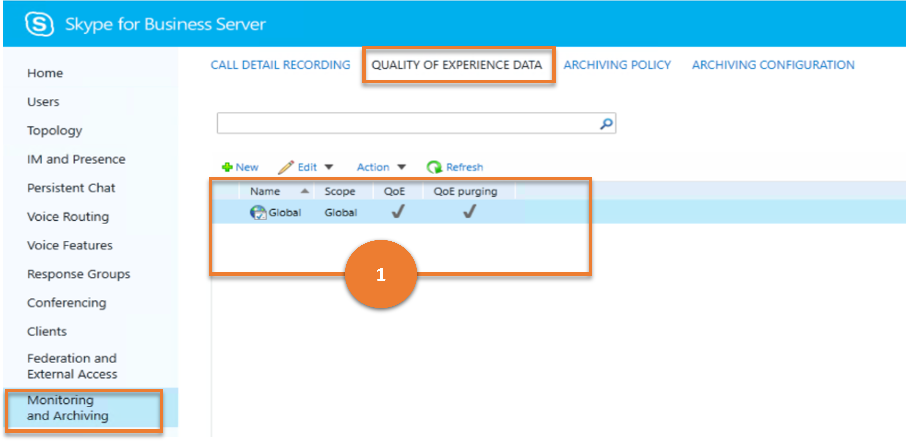
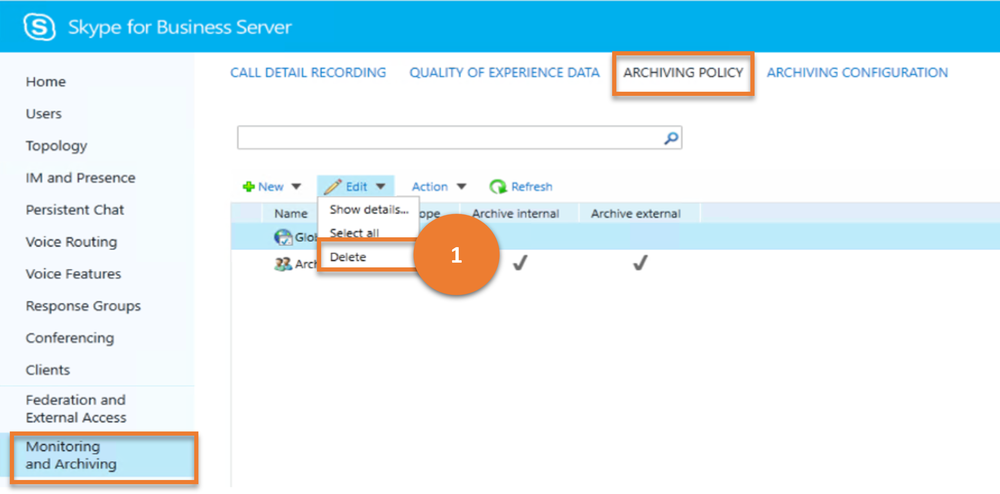

# Monitoring and Archiving

This article describes how similar results as that of the **Monitoring and Archiving** menu item in the legacy Control Panel can be achieved using cmdlets.

This article describes the following sub-menus :

- [Monitoring and Archiving](#monitoring-and-archiving)
  - [Call Detail Recording](#call-detail-recording)
  - [Quality of Experience Data](#quality-of-experience-data)
  - [Archiving Policy](#archiving-policy)
  - [Archiving Configuration](#archiving-configuration)

## Call Detail Recording

**CALL DETAIL RECORDING** sub-menu enables administrators to manage call detail recording (CDR) settings.CDR enables you to track usage of such things as peer-to-peer instant messaging sessions, Voice over Internet Protocol (VoIP) phone calls, and conferencing calls.

Let us consider the various tasks a user can do on **CALL DETAIL RECORDING**, and the Skype for Business cmdlets those tasks map to.

---

> **Scenario 1**: List all the CDR configurations

   

***Cmdlet***

[Get-CsCdrConfiguration](/powershell/module/skype/get-cscdrconfiguration)

***Example***

```powershell
 Get-CsCdrConfiguration
```

---

> **Scenario 2**: Create a new CDR configuration

   

***Cmdlet***

[New-CsCdrConfiguration](/powershell/module/skype/new-cscdrconfiguration)  

***Example***

```powershell
 New-CsCdrConfiguration -Identity site:Redmond -EnableCDR $False
```

---

> **Scenario 3**: Get details of a chosen CDR configuration

   

***Cmdlet***

[Get-CsCdrConfiguration](/powershell/module/skype/get-cscdrconfiguration)

***Example***

```powershell
 Get-CsCdrConfiguration -Identity site:Redmond
```

---

> **Scenario 4**: Delete chosen CDR configurations

   

***Cmdlet***

[Remove-CsCdrConfiguration](/powershell/module/skype/remove-cscdrconfiguration)

***Example***

```powershell
 Remove-CsCdrConfiguration -Identity site:Redmond
```

---

> **Scenario 5**: Update a CDR configuration

   

***Cmdlet***

[Set-CsCdrConfiguration](/powershell/module/skype/set-cscdrconfiguration)

***Example***

```powershell
 Set-CsCdrConfiguration -Identity site:Redmond -PurgeHourOfDay 23
```

---

## Quality of Experience Data

The **QUALITY OF EXPERIENCE DATA** sub-menu enables administrators to manage Quality of Experience (QoE) settings. throughout the organization; this includes managing group expansion, certificate settings, and allowed authentication methods. Because administrators can configure different settings at the global, site, and service scope (albeit for the only the Web Services service), one can customize Web Services capabilities for different users and different locations.

Let us consider the various tasks a user can do on **WEB SERVICE**, and the Skype for Business cmdlets those tasks map to.

---
> **Scenario 1**: List all the QoE configurations

   

***Cmdlet***

[Get-CsQoEConfiguration](/powershell/module/skype/get-csqoeconfiguration)

***Example***

```powershell
 Get-CsQoEConfiguration
```

---

> **Scenario 2**: Create a new QoE configuration

   

***Cmdlet***

[New-CsQoEConfiguration](/powershell/module/skype/new-csqoeconfiguration)  

***Example***

```powershell
 New-CsQoEConfiguration -Identity site:Redmond -EnableQoE $False
```

---

> **Scenario 3**: Get details of a chosen QoE configuration

   

***Cmdlet***

[Get-CsQoEConfiguration](/powershell/module/skype/get-csqoeconfiguration)

***Example***

```powershell
 Get-CsQoEConfiguration -Identity site:Redmond
```

---

> **Scenario 4**: Delete chosen QoE configurations

   

***Cmdlet***

[Remove-CsQoEConfiguration](/powershell/module/skype/remove-csqoeconfiguration)

***Example***

```powershell
 Remove-CsQoEConfiguration -Identity site:Redmond
```

---

> **Scenario 5**: Update a QoE configuration

   

***Cmdlet***

[Set-CsQoEConfiguration](/powershell/module/skype/set-csqoeconfiguration)

***Example***

```powershell
 Set-CsQoEConfiguration -Identity site:Redmond -EnableQoE $False
```

---

## Archiving Policy

Administrators can use **ARCHIVING POLICY** to manage instant messaging (IM) session archiving policies.Archiving policies enable you to archive all IM and web conferencing sessions that take place between internal users and/or between internal users and external users

Let us consider the various tasks a user can do on **ARCHIVING POLICY**, and the Skype for Business cmdlets those tasks map to.

---

> **Scenario 1**: List all the archiving policies

   

***Cmdlet***

[Get-CsArchivingPolicy](/powershell/module/skype/get-csarchivingpolicy)

***Example***

```powershell
 Get-CsArchivingPolicy
```

---

> **Scenario 2**: Create a new archiving policy

   

***Cmdlet***

[New-CsArchivingPolicy](/powershell/module/skype/new-csarchivingpolicy)  

***Example***

```powershell
 New-CsArchivingPolicy -Identity site:Redmond -ArchiveInternal $True
```

---

> **Scenario 3**: Get details of a chosen archiving policy

   

***Cmdlet***

[Get-CsArchivingPolicy](/powershell/module/skype/get-csarchivingpolicy)

***Example***

```powershell
 Get-CsArchivingPolicy -Identity site:Redmond
```

---

> **Scenario 4**: Delete chosen archiving policies

   

***Cmdlet***

[Remove-CsArchivingPolicy](/powershell/module/skype/remove-csarchivingpolicy)

***Example***

```powershell
 Remove-CsArchivingPolicy -Identity site:Redmond
```

---

> **Scenario 5**: Update a archiving policy

   

***Cmdlet***

[Set-CsArchivingPolicy](/powershell/module/skype/set-csarchivingpolicy)

***Example***

```powershell
 Set-CsArchivingPolicy -Identity global -ArchiveInternal $True
```

---

## Archiving Configuration

Administrators can use **ARCHIVING CONFIGURATION** to configure how (or if) instant messaging (IM) sessions are archived in the organization.

Let us consider the various tasks a user can do on **ARCHIVING CONFIGURATION**, and the Skype for Business cmdlets those tasks map to.

---

> **Scenario 1**: List all the archiving configurations

   

***Cmdlet***

[Get-CsArchivingConfiguration](/powershell/module/skype/get-csarchivingconfiguration)

***Example***

```powershell
 Get-CsArchivingConfiguration
```

---

> **Scenario 2**: Create a new archiving configuration

   

***Cmdlet***

[New-CsArchivingConfiguration](/powershell/module/skype/new-csarchivingconfiguration)  

***Example***

```powershell
 New-CsArchivingConfiguration -Identity site:Redmond -EnableArchiving "ImOnly"
```

---

> **Scenario 3**: Get details of a chosen archiving configuration

   

***Cmdlet***

[Get-CsArchivingConfiguration](/powershell/module/skype/get-csarchivingconfiguration)

***Example***

```powershell
 Get-CsArchivingConfiguration -Identity site:Redmond
```

---

> **Scenario 4**: Delete chosen archiving configurations

   

***Cmdlet***

[Remove-CsArchivingConfiguration](/powershell/module/skype/remove-csarchivingconfiguration)

***Example***

```powershell
 Remove-CsArchivingConfiguration -Identity site:Redmond
```

---

> **Scenario 5**: Update a archiving configuration

   

***Cmdlet***

[Set-CsArchivingConfiguration](/powershell/module/skype/set-csarchivingconfiguration)

***Example***

```powershell
 Set-CsArchivingConfiguration -Identity site:Redmond -ArchiveDuplicateMessages $False -KeepArchivingDataForDays 30
```

---
