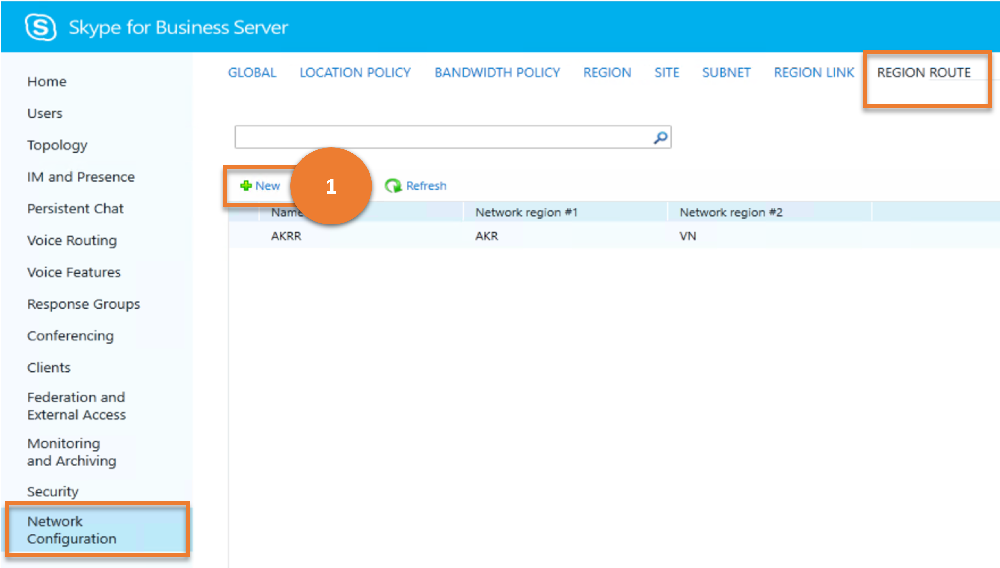

# Network Configuration

This article describes how similar results as that of the **Network Configuration** menu item in the legacy Control Panel can be achieved using cmdlets.

This article describes the following sub-menus :

- [Network Configuration](#network-configuration)
  - [Location Policy](#location-policy)
  - [Bandwidth Policy](#bandwidth-policy)
  - [Region](#region)
  - [Site](#site)
  - [Subnet](#subnet)
  - [Region Link](#region-link)
  - [Region Route](#region-route)

## Location Policy

The **LOCATION POLICY** sub menu is used to apply settings that relate to E9-1-1 functionality. The location policy determines whether a user is enabled for E9-1-1, and if so what the behavior is of an emergency call.

Let us consider the various tasks a user can do on **LOCATION POLICY**, and the Skype for Business cmdlets those tasks map to.

---

> **Scenario 1**: List all the Location Policies

   

***Cmdlet***

[Get-CsLocationPolicy](/powershell/module/skype/get-cslocationpolicy)

***Example***

```powershell
 Get-CsLocationPolicy
```

---

> **Scenario 2**: Create a new Location Policy

   

***Cmdlet***

[New-CsLocationPolicy](/powershell/module/skype/new-cslocationpolicy)  

***Example***

```powershell
 New-CsLocationPolicy -Identity site:Redmond -EnhancedEmergencyServicesEnabled $True
```

---

> **Scenario 3**: Get details of a chosen Location Policy

   

***Cmdlet***

[Get-CsLocationPolicy](/powershell/module/skype/get-cslocationpolicy)

***Example***

```powershell
 Get-CsLocationPolicy -Identity Reno
```

---

> **Scenario 4**: Delete chosen Location Policies

   

***Cmdlet***

[Remove-CsLocationPolicy](/powershell/module/skype/remove-cslocationpolicy)

***Example***

```powershell
 Remove-CsLocationPolicy -Identity Reno
```

---

> **Scenario 5**: Update a Location Policy

   

***Cmdlet***

[Set-CsLocationPolicy](/powershell/module/skype/set-cslocationpolicy)

***Example***

```powershell
 Set-CsLocationPolicy -Identity site:Redmond -EnhancedEmergencyServicesEnabled $True
```

---

## Bandwidth Policy

As part of call admission control (CAC), a bandwidth policy is used to define bandwidth limitations for certain modalities. (In Skype for Business Server, only audio and video modalities can be assigned bandwidth limitations.) This cmdlet creates a container profile for these policies. You define the individual policies within the container by specifying the audio and video bandwidth limitations when you call this cmdlet.

Let us consider the various tasks a user can do on **BANDWIDTH POLICY**, and the Skype for Business cmdlets those tasks map to.

---
> **Scenario 1**: List all the Bandwidth Policies

   

***Cmdlet***

[Get-CsNetworkBandwidthPolicyProfile](/powershell/module/skype/get-csnetworkbandwidthpolicyprofile)

***Example***

```powershell
 Get-CsNetworkBandwidthPolicyProfile
```

---

> **Scenario 2**: Create a new Bandwidth Policy

   

***Cmdlet***

[New-CsNetworkBandwidthPolicyProfile](/powershell/module/skype/new-csnetworkbandwidthpolicyprofile)  

***Example***

```powershell
 New-CsNetworkBandwidthPolicyProfile -Identity LowBWLimits -AudioBWLimit 2000 -AudioBWSessionLimit 200 -VideoBWLimit 1400 -VideoBWSessionLimit 500
```

---

> **Scenario 3**: Get details of a chosen Bandwidth Policy

   

***Cmdlet***

[Get-CsNetworkBandwidthPolicyProfile](/powershell/module/skype/get-csnetworkbandwidthpolicyprofile)

***Example***

```powershell
 Get-CsNetworkBandwidthPolicyProfile -Identity LowBWProfile
```

---

> **Scenario 4**: Delete chosen Bandwidth Policies

   

***Cmdlet***

[Remove-CsNetworkBandwidthPolicyProfile](/powershell/module/skype/remove-csnetworkbandwidthpolicyprofile)

***Example***

```powershell
 Remove-CsNetworkBandwidthPolicyProfile -Identity LowBWProfile
```

---

> **Scenario 5**: Update a Bandwidth Policy

   

***Cmdlet***

[Set-CsNetworkBandwidthPolicyProfile](/powershell/module/skype/set-csnetworkbandwidthpolicyprofile)

***Example***

```powershell
 Set-CsNetworkBandwidthPolicyProfile -Identity LowBWLimit -VideoBWLimit 2500 -VideoBWSessionLimit 300
```

---

## Region

A network region interconnects various parts of a network across multiple geographic areas. Every network region must be associated with a central site. Administrators can use **REGION** menu to manage information about one or more network regions, including the associated central site and settings that determine whether alternate paths are allowed for audio and video connections, and that associate the sites within the region with a media bypass configuration.

---

> **Scenario 1**: List all the regions

   

***Cmdlet***

[Get-CsNetworkRegion](/powershell/module/skype/get-csnetworkregion)

***Example***

```powershell
 Get-CsNetworkRegion
```

---

> **Scenario 2**: Create a new region

   

***Cmdlet***

[New-CsNetworkRegion](/powershell/module/skype/new-csnetworkregion)  

***Example***

```powershell
 New-CsNetworkRegion -Identity NorthAmerica -Description "All North American Locations" -CentralSite Redmond-NA-MLS
```

---

> **Scenario 3**: Get details of a chosen region

   

***Cmdlet***

[Get-CsNetworkRegion](/powershell/module/skype/get-csnetworkregion)

***Example***

```powershell
 Get-CsNetworkRegion -Identity NorthAmerica
```

---

> **Scenario 4**: Delete chosen regions

   

***Cmdlet***

[Remove-CsNetworkRegion](/powershell/module/skype/remove-csnetworkregion)

***Example***

```powershell
 Remove-CsNetworkRegion -Identity NorthAmerica
```

---

> **Scenario 5**: Update a region

   

- **Annotation 1 - Result**

    This annotation on the image indicates a result, that is, the data being retrieved and displayed.

    ***Cmdlet***

    [Get-CsNetworkSite from Region](/powershell/module/skype/get-csnetworksite)

    ***Example***

    ```powershell
     Get-CsNetworkSite | Where-Object {$_.NetworkRegionID -eq "AKR"}
    ```

- **Annotation 2 - Option (for the user)**

    This annotation on the image indicates an option for the user to implement, that is, to save a network region.

    [Set-CsNetworkRegion](/powershell/module/skype/set-csnetworkregion)

   ***Example***

   ```powershell
   Set-CsNetworkRegion -Identity NorthAmerica -Description "North American Region"
   ```

---

## Site

Network sites are the offices or locations configured within each region of a CAC or E9-1-1 deployment. **SITE** sub-menu helps administrators to add, remove or manage their settings.

Let us consider the various tasks a user can do on **SITE**, and the Skype for Business cmdlets those tasks map to.

---

> **Scenario 1**: List all the sites

   

***Cmdlet***

[Get-CsNetworkSubnet](/powershell/module/skype/get-csnetworksite)

***Example***

```powershell
 Get-CsNetworkSite
```

---

> **Scenario 2**: Create a new site

   

***Cmdlet***

[New-CsNetworkSubnet](/powershell/module/skype/new-csnetworksite)  

***Example***

```powershell
 New-CsNetworkSite -Identity Vancouver -NetworkRegionID NorthAmerica
```

---

> **Scenario 3**: Get details of a chosen site

   

***Cmdlet***

[Get-CsNetworkSubnet](/powershell/module/skype/get-csnetworksite)

***Example***

```powershell
 Get-CsNetworkSite -Identity Redmond
```

---

> **Scenario 4**: Delete chosen sites

   

***Cmdlet***

[Remove-CsNetworkSubnet](/powershell/module/skype/remove-csnetworksite)

***Example***

```powershell
 Remove-CsNetworkSite -Identity Vancouver
```

---

> **Scenario 5**: Update a site

   

- **Annotation 1 - Result**

    This annotation on the image indicates a result, that is, the data being retrieved and displayed.

    ***Cmdlet***

    [Get-CsNetworkSubnet from Site](/powershell/module/skype/get-csnetworksubnet)

    ***Example***

    ```powershell
     Get-CsNetworkSubnet | Where-Object {$_.NetworkSiteID -eq "Vancouver"}
    ```

- **Annotation 2 - Option (for the user)**

    This annotation on the image indicates an option for the user to implement, that is, to save a network site.

   ***Cmdlet***

   [Set-CsNetworkSubnet](/powershell/module/skype/set-csnetworksite)

   ***Example***

   ```powershell
    Set-CsNetworkSite -Identity Vancouver - BWPolicyProfileID LowBWLimits
   ```

---

## Subnet

Administrators can use **SUBNET** sub-menu to create,update and manage network subnets.

Let us consider the various tasks a user can do on **SUBNET**, and the Skype for Business cmdlets those tasks map to.

---

> **Scenario 1**: List all the subnets

   

***Cmdlet***

[Get-CsNetworkSubnet](/powershell/module/skype/get-csnetworksubnet)

***Example***

```powershell
 Get-CsNetworkSubnet
```

---

> **Scenario 2**: Create a new subnet

   

***Cmdlet***

[New-CsNetworkSubnet](/powershell/module/skype/new-csnetworksubnet)  

***Example***

```powershell
 New-CsNetworkSubnet -Identity 172.11.15.0 -MaskBits 24 -NetworkSiteID Vancouver
```

---

> **Scenario 3**: Get details of a chosen subnet

   

***Cmdlet***

[Get-CsNetworkSubnet](/powershell/module/skype/get-csnetworksubnet)

***Example***

```powershell
 Get-CsNetworkSubnet -Identity 172.11.15.0
```

---

> **Scenario 4**: Delete chosen subnets

   

***Cmdlet***

[Remove-CsNetworkSubnet](/powershell/module/skype/remove-csnetworksubnet)

***Example***

```powershell
 Remove-CsNetworkSubnet -Identity 172.11.15.0
```

---

> **Scenario 5**: Update a subnet

   

***Cmdlet***

[Set-CsNetworkSubnet](/powershell/module/skype/set-csnetworksubnet)

***Example***

```powershell
 Set-CsNetworkSubnet -Identity 172.11.15.0 -MaskBits 25 -NetworkSiteID Chicago
```

---

## Region Link

Regions within a network are linked through physical WAN connectivity.Administrators can use **REGION LINK** sub-menu to create,update and manage network subnets.

Let us consider the various tasks a user can do on **REGION LINK**, and the Skype for Business cmdlets those tasks map to.

---

> **Scenario 1**: List all the region links

   

***Cmdlet***

[Get-CsNetworkRegionLink](/powershell/module/skype/get-csnetworkregionLink)

***Example***

```powershell
 Get-CsNetworkRegionLink
```

---

> **Scenario 2**: Create a new region link

   

***Cmdlet***

[New-CsNetworkRegionLink](/powershell/module/skype/new-csnetworkregionLink)  

***Example***

```powershell
 New-CsNetworkRegionLink -Identity NA_EMEA -NetworkRegionID1 NorthAmerica -NetworkRegionID2 EMEA -BWPolicyProfileID LowBWLimits
```

---

> **Scenario 3**: Get details of a chosen region link

   

***Cmdlet***

[Get-CsNetworkRegionLink](/powershell/module/skype/get-csnetworkregionLink)

***Example***

```powershell
 Get-CsNetworkRegionLink -Identity NA_EMEA
```

---

> **Scenario 4**: Delete chosen region links

   

***Cmdlet***

[Remove-CsNetworkRegionLink](/powershell/module/skype/remove-csnetworkregionLink)

***Example***

```powershell
 Remove-CsNetworkRegionLink -Identity NA_EMEA
```

---

> **Scenario 5**: Update a region link

   

***Cmdlet***

[Set-CsNetworkRegionLink](/powershell/module/skype/set-csnetworkregionLink)

***Example***

```powershell
 Set-CsNetworkRegionLink -Identity NA_EMEA -BWPolicyProfileID HighBWLimits
```

---

## Region Route

Every region within a CAC configuration must have some way to access every other region. While region links set bandwidth limitations on the connections between regions and also represent the physical links, a route determines which linked path the connection will traverse from one region to another. Administrators can use **REGION ROUTE** sub-menu to create,update and manage these.

Let us consider the various tasks a user can do on **REGION ROUTE**, and the Skype for Business cmdlets those tasks map to.

---

> **Scenario 1**: List all the region routes

   

***Cmdlet***

[Get-CsNetworkInterRegionRoute](/powershell/module/skype/get-csnetworkinterregionroute)

***Example***

```powershell
 Get-CsNetworkInterRegionRoute
```

---

> **Scenario 2**: Create a new region route

   

***Cmdlet***

[New-CsNetworkInterRegionRoute](/powershell/module/skype/new-csnetworkinterregionroute)  

***Example***

```powershell
 New-CsNetworkInterRegionRoute -Identity NA_APAC_Route -NetworkRegionID1 NorthAmerica -NetworkRegionID2 APAC -NetworkRegionLinkIDs "NA_EMEA,EMEA_APAC"
```

---

> **Scenario 3**: Get details of a chosen region route

   

***Cmdlet***

[Get-CsNetworkInterRegionRoute](/powershell/module/skype/get-csnetworkinterregionroute)

***Example***

```powershell
 Get-CsNetworkInterRegionRoute -Filter *APAC*
```

---

> **Scenario 4**: Delete chosen region routes

   

***Cmdlet***

[Remove-CsNetworkInterRegionRoute](/powershell/module/skype/remove-csnetworkinterregionroute)

***Example***

```powershell
 Remove-CsNetworkInterRegionRoute -Identity NA_APAC_Route
```

---

> **Scenario 5**: Update a region route

   

- **Annotation 1 - Option (for the user)**

    This annotation on the image indicates a result, that is, the data being retrieved and displayed.

   ***Cmdlet***

   [Get-CsNetworkRegionLink](/powershell/module/skype/get-csnetworkregionLink)

   ***Example***

   ```powershell
   Get-CsNetworkRegionLink
   ```

- **Annotation 2 - Option (for the user)**

    This annotation on the image indicates an option for the user to implement, that is, to save a network region route.

    ***Cmdlet***

   [Set-CsNetworkInterRegionRoute](/powershell/module/skype/set-csnetworkinterregionroute)

   ***Example***

   ```powershell
   Set-CsNetworkInterRegionRoute -Identity NA_APAC_Route -NetworkRegionLinkIDs "NA_SA,SA_APAC"
   ```

---
---
