# Security

This article describes how similar results as that of the **Security** menu item in the legacy Control Panel can be achieved using cmdlets.

This article describes the following sub-menus :

- [Security](#security)
  - [Registrar](#registrar)
  - [Web Service](#web-service)
  - [PIN Policy](#pin-policy)

## Registrar

**REGISTRAR** sub-menu enables administrators to manage proxy servers through proxy server configuration settings. These settings, which can be applied at both the global scope and the service scope (albeit for only the Edge Server and Registrar services) enables to control such things as the authentication protocols that can be used by client endpoints and whether or not compression will be used on incoming and outgoing proxy server connections.

Let us consider the various tasks a user can do on **REGISTRAR**, and the Skype for Business cmdlets those tasks map to.

---

> **Scenario 1**: List all the proxy configurations

   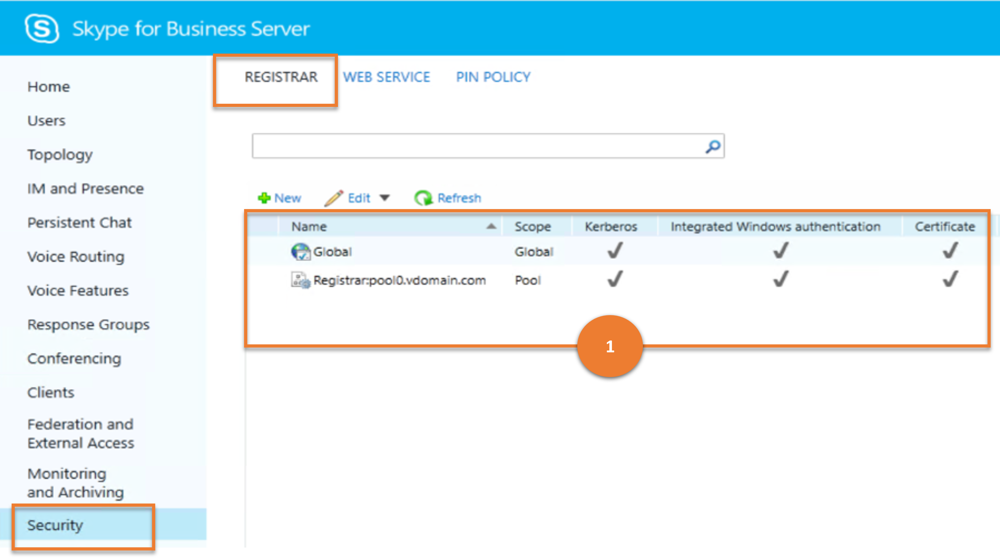

***Cmdlet***

[Get-CsProxyConfiguration](/powershell/module/skype/get-csproxyconfiguration)

***Example***

```powershell
 Get-CsProxyConfiguration
```

---

> **Scenario 2**: Create a new proxy configuration

   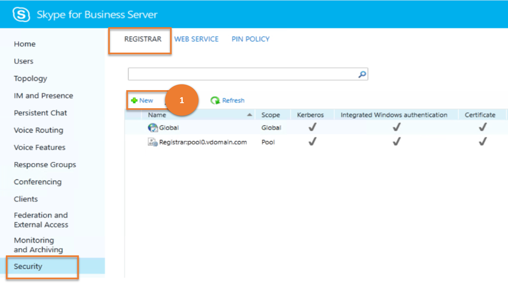

***Cmdlet***

[New-CsProxyConfiguration](/powershell/module/skype/new-csproxyconfiguration)  

***Example***

```powershell
 New-CsProxyConfiguration -Identity "service:EdgeServer:atl-edge-001.litwareinc.com" -RequestServerCompression $True -MaxClientMessageBodySizeKb 256
```

---

> **Scenario 3**: Get details of a chosen proxy configuration

   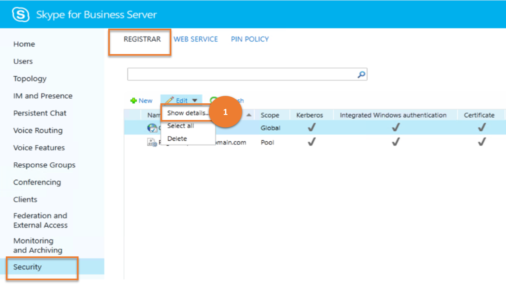

***Cmdlet***

[Get-CsProxyConfiguration](/powershell/module/skype/get-csproxyconfiguration)

***Example***

```powershell
 Get-CsProxyConfiguration -Identity "service:EdgeServer:atl-cs-001.litwareinc.com"
```

---

> **Scenario 4**: Delete chosen proxy configurations

   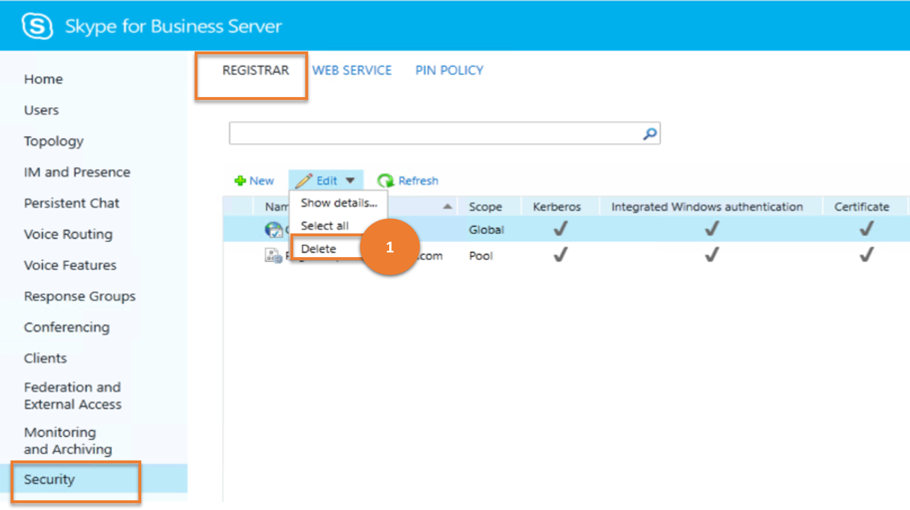

***Cmdlet***

[Remove-CsProxyConfiguration](/powershell/module/skype/remove-csproxyconfiguration)

***Example***

```powershell
 Remove-CsProxyConfiguration -Identity service:EdgeServer:atl-edge-011.litwareinc.com
```

---

> **Scenario 5**: Update a proxy configuration

   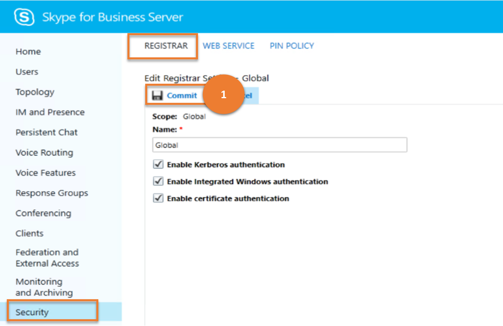

***Cmdlet***

[Set-CsProxyConfiguration](/powershell/module/skype/set-csproxyconfiguration)

***Example***

```powershell
 Set-CsProxyConfiguration -Identity service:EdgeServer:atl-edge-001.litwareinc.com -AcceptServerCompression $True
```

---

## Web Service

The **WEB SERVICE** sub-menu item under **Security** enables administrators to manage Web Services configuration settings throughout the organization; this includes managing group expansion, certificate settings, and allowed authentication methods. Because administrators can configure different settings at the global, site, and service scope (albeit for the only the Web Services service), one can customize Web Services capabilities for different users and different locations.

Let us consider the various tasks a user can do on **WEB SERVICE**, and the Skype for Business cmdlets those tasks map to.

---
> **Scenario 1**: List all the web service configurations

   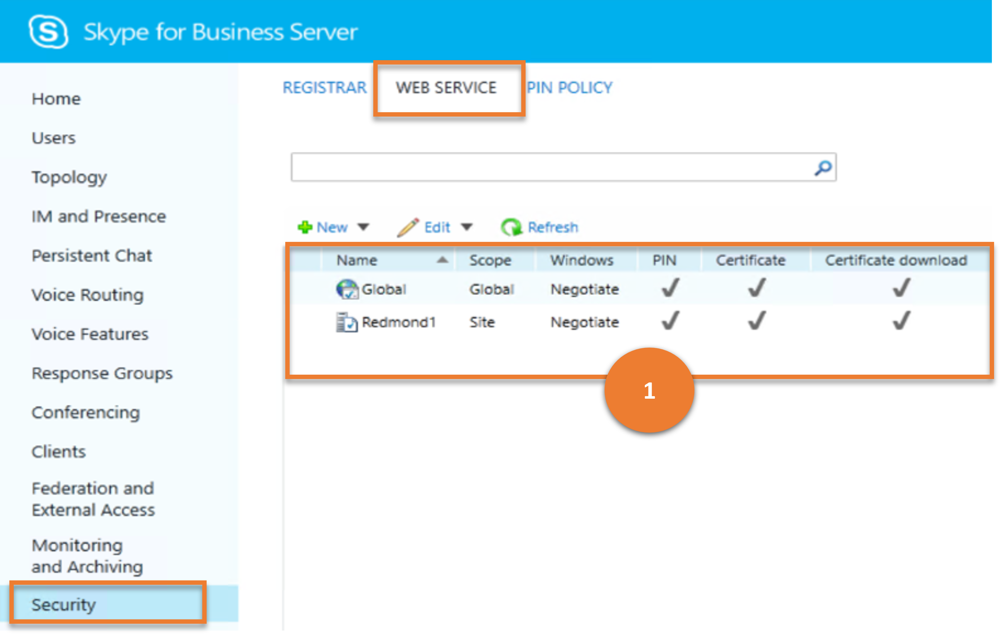

***Cmdlet***

[Get-CsWebServiceConfiguration](/powershell/module/skype/get-cswebserviceconfiguration)

***Example***

```powershell
 Get-CsWebServiceConfiguration
```

---

> **Scenario 2**: Create a new web service configuration

   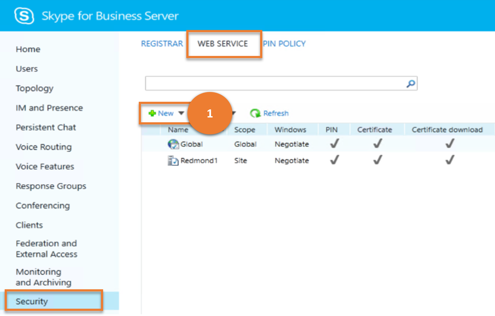

***Cmdlet***

[New-CsWebServiceConfiguration](/powershell/module/skype/new-cswebserviceconfiguration)  

***Example***

```powershell
 New-CsWebServiceConfiguration -Identity site:Redmond -EnableGroupExpansion $False -UseCertificateAuth $True
```

---

> **Scenario 3**: Get details of a chosen web service configuration

   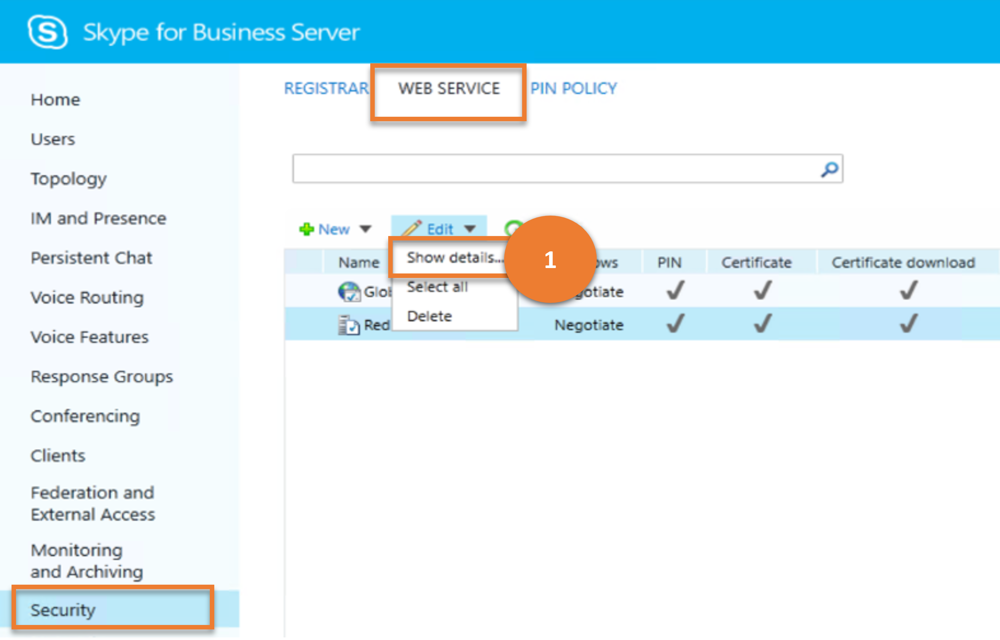

***Cmdlet***

[Get-CsWebServiceConfiguration](/powershell/module/skype/get-cswebserviceconfiguration)

***Example***

```powershell
 Get-CsWebServiceConfiguration -Identity site:Redmond
```

---

> **Scenario 4**: Delete chosen web service configurations

   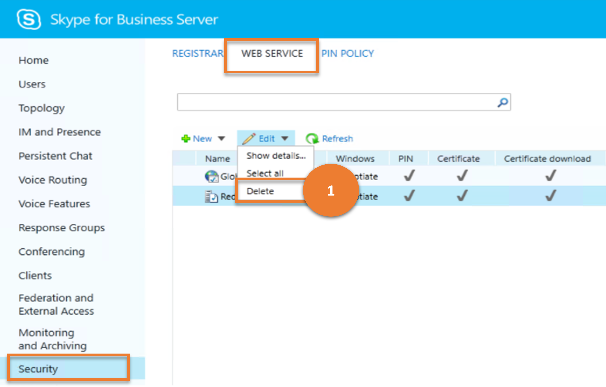

***Cmdlet***

[Remove-CsWebServiceConfiguration](/powershell/module/skype/remove-cswebserviceconfiguration)

***Example***

```powershell
 Remove-CsWebServiceConfiguration -Identity site:Redmond
```

---

> **Scenario 5**: Update a web service configuration

   

***Cmdlet***

[Set-CsWebServiceConfiguration](/powershell/module/skype/set-cswebserviceconfiguration)

***Example***

```powershell
 Set-CsWebServiceConfiguration -Identity site:Redmond -EnableGroupExpansion $True
```

---

## PIN Policy

Administrators can use **PIN POLICY** to manage PIN authentication properties; for example, one can specify the minimum length for a PIN and determine whether one will allow PINs that use "common patterns" such as consecutive digits (for example, a PIN like 123456)

Let us consider the various tasks a user can do on **PIN POLICY**, and the Skype for Business cmdlets those tasks map to.

---

> **Scenario 1**: List all the PIN policies

   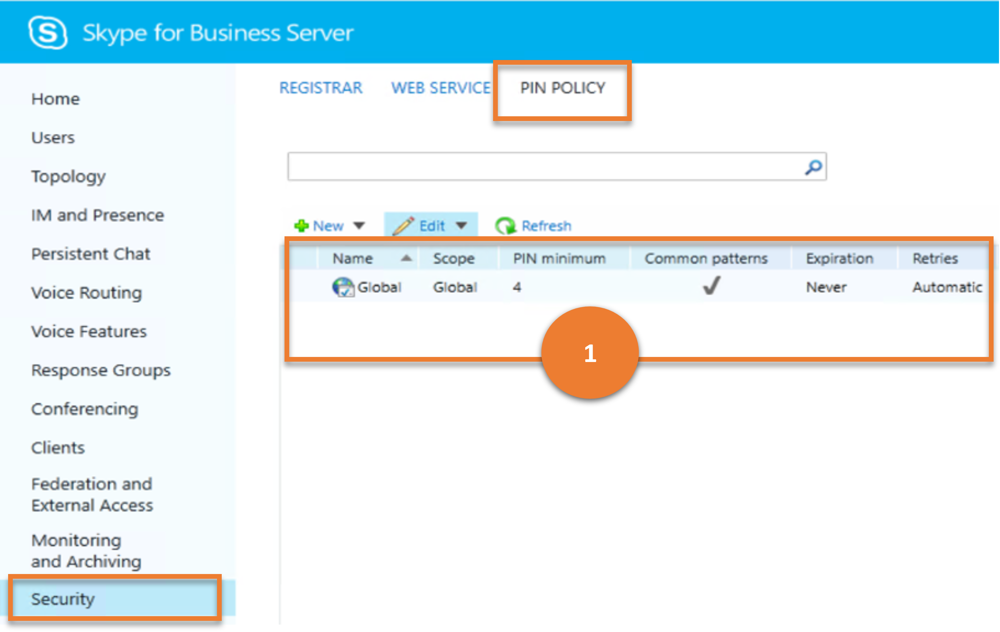

***Cmdlet***

[Get-CsPinPolicy](/powershell/module/skype/get-cspinpolicy)

***Example***

```powershell
 Get-CsPinPolicy
```

---

> **Scenario 2**: Create a new PIN policy

   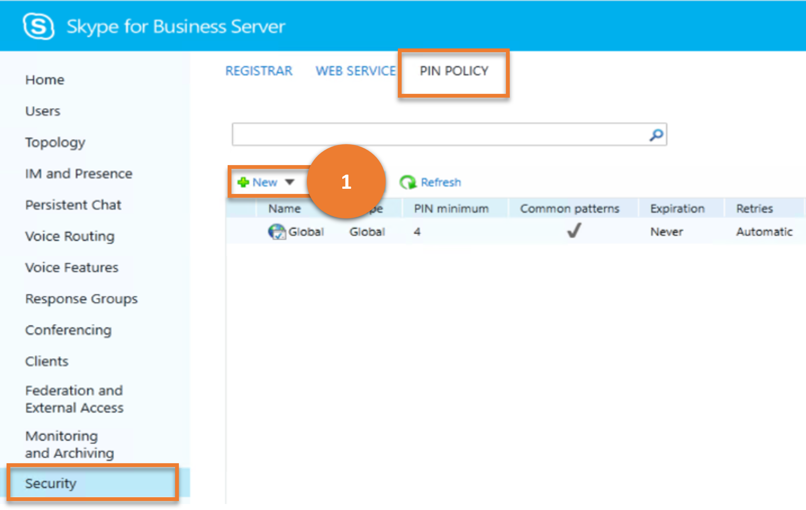

***Cmdlet***

[New-CsPinPolicy](/powershell/module/skype/new-cspinpolicy)  

***Example***

```powershell
 New-CsPinPolicy -Identity "site:Redmond" -MinPasswordLength 10
```

---

> **Scenario 3**: Get details of a chosen PIN Policy

   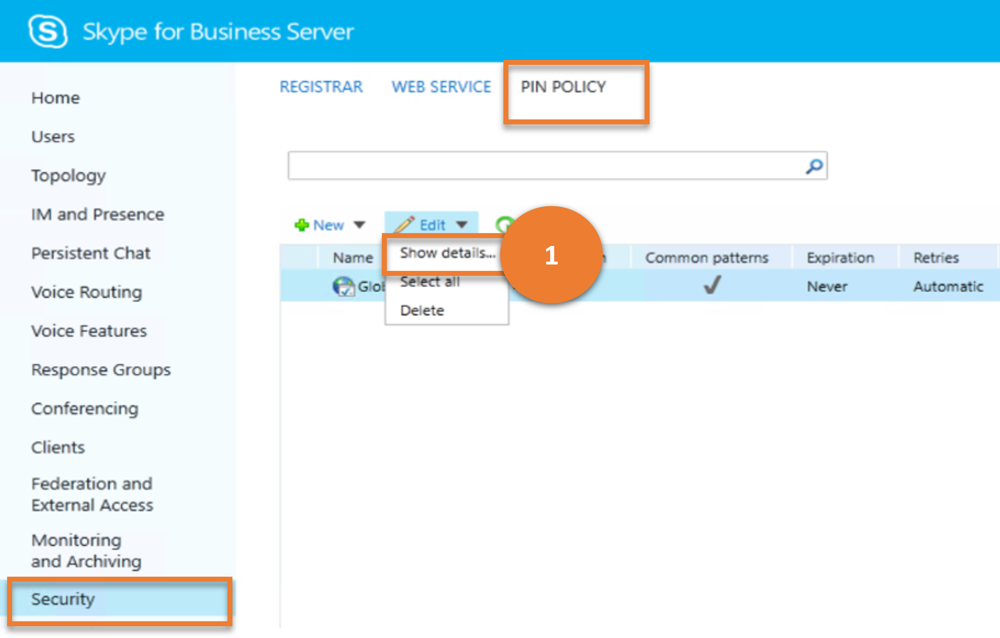

***Cmdlet***

[Get-CsPinPolicy](/powershell/module/skype/get-cspinpolicy)

***Example***

```powershell
 Get-CsPinPolicy -Identity "site:Redmond"
```

---

> **Scenario 4**: Delete chosen PIN policies

   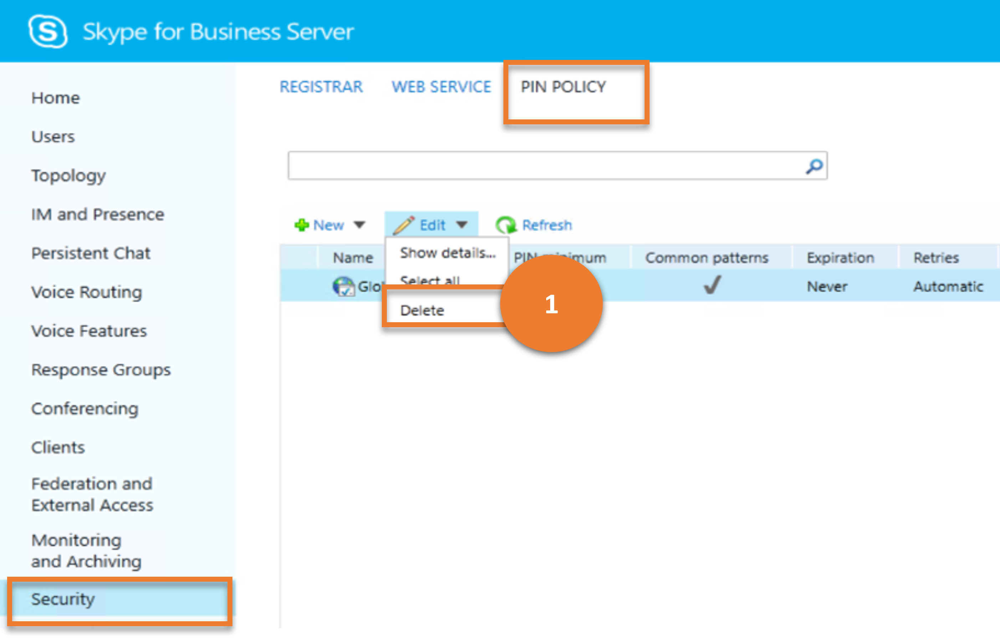

***Cmdlet***

[Remove-CsPinPolicy](/powershell/module/skype/remove-cspinpolicy)

***Example***

```powershell
 Remove-CsPinPolicy -Identity RedmondUsersPinPolicy
```

---

> **Scenario 5**: Update a PIN Policy

   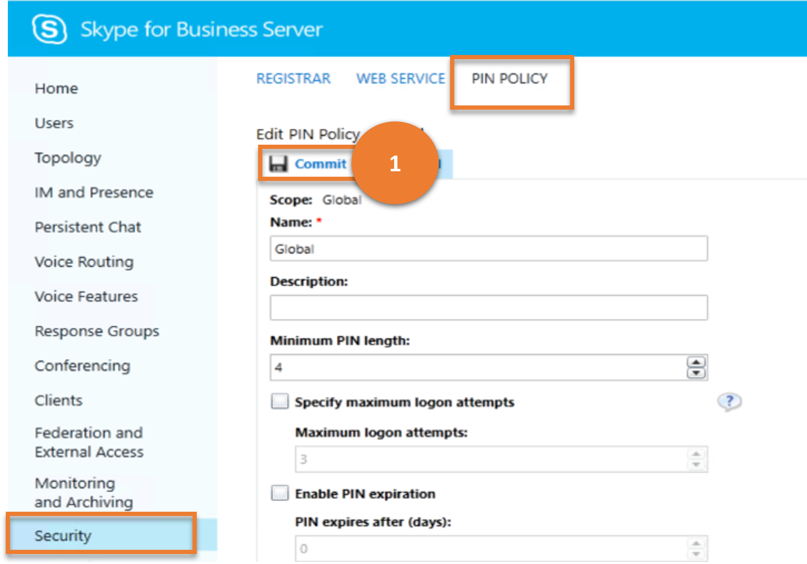

***Cmdlet***

[Set-CsPinPolicy](/powershell/module/skype/set-cspinpolicy)

***Example***

```powershell
 Set-CsPinPolicy -Identity site:Redmond -MinPasswordLength 10
```

---
