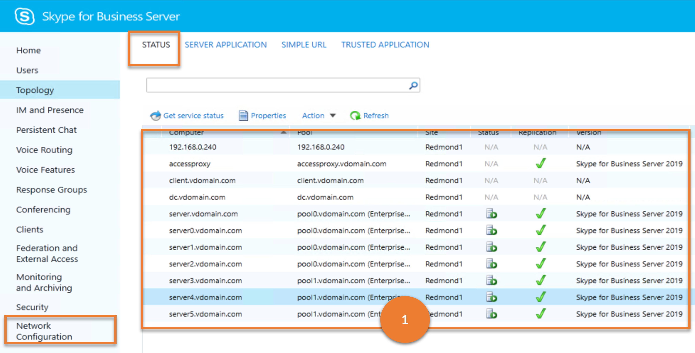
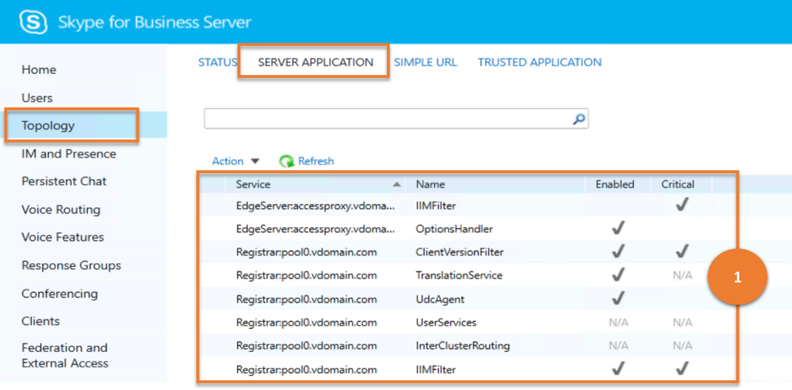
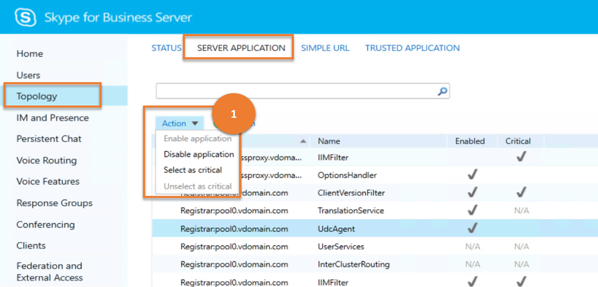
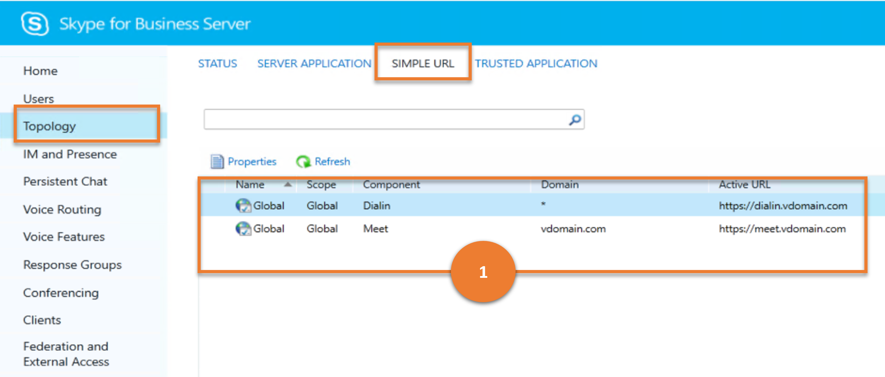
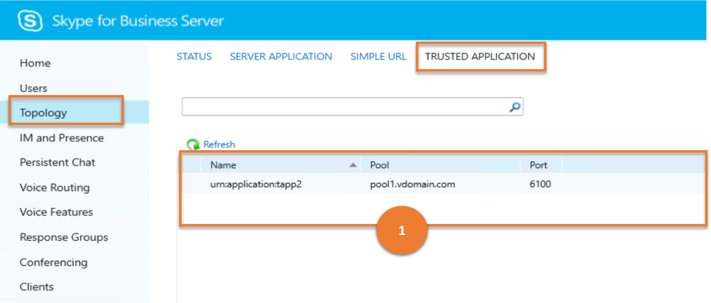

# Topology

This article describes how similar results as that of the **Topology** menu item in the legacy Control Panel can be achieved using cmdlets.

This article describes the following sub-menus :

- [Topology](#topology)
  - [Status](#status)
  - [Server Application](#server-application)
  - [Simple URL](#simple-url)
  - [Trusted Application](#trusted-application)

## Status

**STATUS** sub-menu enables administrators to manage the computers in the topology.

Let us consider the various tasks a user can do on **STATUS**, and the Skype for Business cmdlets those tasks map to.

---

> **Scenario 1**: List all the computers and their status

   

   ***Cmdlet***

   [Get-CsPool](/powershell/module/skype/get-cspool)

   ***Example***

   ```powershell
    Get-CsPool
   ```

   ***Cmdlet***

   [Get-CsComputer](/powershell/module/skype/get-cscomputer)

   ***Example***

   ```powershell
    Get-CsComputer
   ```

   ***Cmdlet***

   [Get-CsManagementStoreReplicationStatus](/powershell/module/skype/get-csmanagementstorereplicationstatus)

   ***Example***

   ```powershell
   Get-CsManagementStoreReplicationStatus
   ```

---

## Server Application

Server applications refer to the individual programs that run under Skype for Business Server. **SERVER APPLICATION** sub-menu provides a way for administrators to return information about any (or all) of the applications running as part of Skype for Business Server.

Let us consider the various tasks a user can do on **SERVER APPLICATION**, and the Skype for Business cmdlets those tasks map to.

---
> **Scenario 1**: List all the server applications

   

***Cmdlet***

[Get-CsServerApplication](/powershell/module/skype/get-csserverapplication)

***Example***

```powershell
 Get-CsServerApplication
```

---

> **Scenario 2**: Enable/Disable or select critical/ unselect critical a server application

   

***Cmdlet***

[Set-CsServerApplication](/powershell/module/skype/get-csserverapplication)

***Example***

```powershell
 Set-CsServerApplication -Identity "Registrar:atl-cs-001.litwareinc.com/ExumRouting" -Enabled $True
```

---

## Simple URL

Simple URLs make it easier for users to join meetings and conferences, and also make it easier for Administrators to log on to the Skype for Business Server Control Panel.The **SIMPLE URL** sub-menu helps administrator to view them.

Let us consider the various tasks a user can do on **SIMPLE URL**, and the Skype for Business cmdlets those tasks map to.

---
> **Scenario 1**: List all the Simple URL configurations

   

***Cmdlet***

[Get-CsSimpleUrlConfiguration](/powershell/module/skype/get-cssimpleurlconfiguration)

***Example***

```powershell
 Get-CsSimpleUrlConfiguration | Select-Object -ExpandProperty SimpleUrl
```

---

## Trusted Application

A trusted application is an application developed by a third party that is given trusted status to run as part of Skype for Business Server but that is not a built-in part of the product.The **TRUSTED APPLICATION** sub-menu helps administrator to view them.

Let us consider the various tasks a user can do on **TRUSTED APPLICATION**, and the Skype for Business cmdlets those tasks map to.

---
> **Scenario 1**: List all the trusted applications

   

***Cmdlet***

[Get-CsTrustedApplication](/powershell/module/skype/get-cstrustedapplication)

***Example***

```powershell
 Get-CsTrustedApplication
```

---
