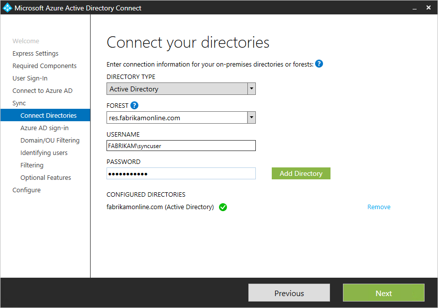

# Update AAD Connect to include more than one forest

Azure AD Connect supports [syncing from multiple forests](https://docs.microsoft.com/en-us/azure/active-directory/connect/active-directory-aadconnect-topologies). However, it supports only one instance of Azure AD Connect syncing to AAD. Therefore, in cases where Azure AD is already installed in one forest, the existing instance of AAD Connect must be updated to sync from the additional forest.

 - If all identities are represented only once across both forests (that is, you haven’t made any mail-enabled contacts), then you can simply re-run the AAD Connect wizard, choose “Customize synchronization options,” and then on the **Connect Your Directories** page, enter the name of the additional forest and creds.  
 
 - However, if users can exist in more than one directory and you’ll be merging the data (for example, if contact objects exist in a forest corresponding to users in another forest), you will need to uninstall Azure AD Connect and re-install it.  This is because the cross-forest join rules condition can only be configured during the first install. This is done on the following page:  
 

## See also

[Cloud Consolidation for Teams and Skype for Business](cloud-consolidation.md)