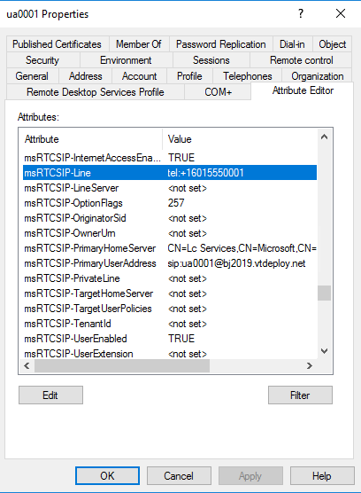

# Decide how to manage attributes after decommissioning

[!INCLUDE [sfbo-retirement](../../Hub/includes/sfbo-retirement.md)]


By default, all users that were enabled for Skype for Business Server and then moved to the cloud still have msRTCSIP attributes configured in your on-premises Active Directory. 

These attributes, in particular sip address (msRTCSIP-PrimaryUserAddress) and phone number (msRTCSIP-Line), continue to sync into Azure AD. If changes are required to any of the msRTCSIP attributes, these changes must be made in the on-premises Active Directory and then sync'd to Azure AD. However, once the Skype for Business Server deployment has been removed, the Skype for Business Server tools won't be available to manage these attributes.

There are two options available for handling this situation:

1. Leave users that were enabled for Skype for Business server accounts as is, and manage the msRTCSIP attributes using Active Directory tools. This method ensures no loss of service for migrated users, and allows you to remove the Skype for Business Server deployment by eliminating (for example, wiping) the servers, without a full decommissioning. However, newly licensed users won't have these attributes populated in your on-premises Active Directory and will need to be managed online.

2.  Clear all msRTCSIP attributes from migrated users in your on-premises Active Directory and manage these attributes using online tools. This method allows for a consistent management approach for existing and new users. However, it may result in a temporary loss of service during the on-premises decommissioning process.


## Method 1 - Manage sip addresses and phone numbers for users in Active Directory

Administrators can manage users who were moved from an on-premises Skype for Business Server to the cloud, even after the on-premises deployment is decommissioned. 

If you want to make changes to a user’s sip address or to a user’s phone number (and the sip address or phone number already has a value in the on-premises Active Directory), you must make the change in the on-premises Active Directory and let the value(s) flow up to Azure AD. This method does NOT require on-premises Skype for Business Server. Rather, you can modify these attributes directly in the on-premises Active Directory, using either the Active Directory Users and Computers MMC snap-in (as shown below), or by using PowerShell. If you're using the MMC snap-in, open the properties page of the user, click Attribute Editor tab, and find the appropriate attributes to modify:

- To modify a user’s sip address, modify the `msRTCSIP-PrimaryUserAddress`.

    > [!NOTE]
    > If the `ProxyAddresses` attribute contains a sip address, also update that value as a best practice. Although the sip address in `ProxyAddresses` is ignored by O365 if `msRTCSIP-PrimaryUserAddress` is populated, it may be used by other on-premises components.

- To modify a user’s phone number, modify `msRTCSIP-Line` *if it already has a value*.

  


- If the user didn't originally have a value for `msRTCSIP-Line` on-premises before the move, you can modify the phone number using the `-PhoneNumber` parameter in the [Set-CsPhoneNumberAssignment cmdlet](/powershell/module/teams/set-csphonenumberassignment) in the Teams PowerShell module.

These steps are not necessary for new users created after you disable hybrid, and those users can be managed directly in the cloud. If you're comfortable using the mix of these methods and with leaving the msRTCSIP attributes in place in your on-premises Active Directory, you can re-image the on-premises Skype for Business servers. However, if you prefer to clear all msRTCSIP attributes and do a traditional uninstall of Skype for Business Server, then use Method 2.


## Method 2 - Clear Skype for Business attributes for all on-premises users in Active Directory

This option requires more effort and proper planning because users who were moved from an on-premises Skype for Business Server to the cloud must be re-provisioned. These users can be categorized into two different categories: users without Phone System and users with Phone System. Users with Phone System will experience a temporary loss of phone service as part of transitioning the phone number from being managed in on-premises Active Directory to the cloud. **It's recommended to perform a pilot involving a small number of users with Phone System prior to start bulk user operations.** For large deployments, users can be processed in smaller groups in different time windows. 

> [!NOTE] 
> This process is simplest for users who have a matching sip address and UserPrincipalName. For organizations that have users with non-matching values across these two attributes, extra care must be taken as noted below for a smooth transition.

> [!NOTE]
> If you have configured on-premises hybrid application endpoints for Auto Attendants or Call Queues, be sure to move these endpoints to Microsoft 365 before decommissioning Skype for Business Server. For details, see [Migrate hybrid application endpoints before decommissioning your on-premises environment](decommission-move-on-prem-endpoints.md).  


1. Confirm the following on-premises Skype for Business PowerShell cmdlet returns an empty result. An empty result means no users are homed on-premises and have either been moved to Microsoft 365 or have been disabled:

   ```PowerShell
   Get-CsUser -Filter { HostingProvider -eq "SRV:"} | Select-Object Identity, SipAddress, UserPrincipalName, RegistrarPool
   ```

2. Record users' current phones number (LineUri), UserPrincipalName and related info, by executing the following on-premises Skype for Business Server PowerShell cmdlet to export user data:

   ```PowerShell
   Get-CsUser | Select-Object SipAddress, UserPrincipalName, SamAccountName, RegistrarPool, HostingProvider, EnabledForFederation, EnabledForInternetAccess, LineUri, EnterpriseVoiceEnabled, HostedVoiceMail | Sort SipAddress | Export-Csv -Path  "c:\backup\SfbUserSettings.csv"
   ```

   > [!Important] 
   > Before proceeding open SfbUserSettings.csv file and confirm all user data has been successfully exported. It's recommended to keep a copy of this file.  Do not use this file in the following steps for processing users. 

3. Create a file with a group of users to be used in the following steps. After the first group of users has completed successfully, proceed with the next group of users. In the example below, the groups of users are selected alphabetically. You may filter on users based on criteria that matches how you would like to process the users.

   ```PowerShell
   Get-CsUser | where userprincipalname -like "abc*" | Select-Object SipAddress, UserPrincipalName, SamAccountName, RegistrarPool, HostingProvider, EnabledForFederation, EnabledForInternetAccess, LineUri, EnterpriseVoiceEnabled, HostedVoiceMail | Sort SipAddress | Export-Csv -Path "c:\data\SfbUsers.csv"
   ```

   > [!Important] 
   > Before proceeding open SfbUsers.csv file and confirm user data has been successfully exported. You'll need the LineUri (phone number), UserPrincipalName, SamAccountName, and SipAddress from this file in a later step.

4. Delete the attribute information related to Skype for Business Server from active Directory for the set of users you're ready to update.  There are two steps to this process, as shown below.

   > [!Important] 
   > After the next AAD Sync cycle after running this step, users with Phone System who were moved from an on-premises Skype for Business Server to the cloud will lose the ability to make and receive calls until step 8 is successfully completed and confirmed in step 9. In addition, make sure you have saved user's phone numbers and related information as per step 2, since that information is required for that step.

 
   ```PowerShell
   $sfbusers=import-csv "c:\data\SfbUsers.csv"
   foreach($user in $sfbusers){
   Disable-CsUser -Identity $user.SipAddress}
   ```

   Next, for the same set of users, clear the value of msRTCSIP-DeploymentLocator using on-premises Active Directory PowerShell:

   ```PowerShell
   $sfbusers=import-csv "c:\data\SfbUsers.csv"
   foreach($user in $sfbusers){
   Set-ADUser -Identity $user.SamAccountName -Clear msRTCSIP-DeploymentLocator}
   ```

5. To add sip address value back to the on-premises Active Directory proxyAddresses, run the following on-premises Active Directory Module for Windows PowerShell cmdlet. This action will prevent interoperability issues that rely on this attribute. 

   ```PowerShell
   $sfbusers=import-csv "c:\data\SfbUsers.csv"
   foreach($user in $sfbusers){
     $userUpn=$user.UserPrincipalName
     $userSip=$user.SipAddress
     $proxies=Get-ADUser -Filter "UserPrincipalName -eq '$userUpn'" -properties * | Select-Object @{Name="proxyAddresses";Expression={$_.proxyAddresses}}
     if(($null -eq $proxies) -or ($proxies.proxyAddresses -NotContains $userSip))
     {
             Get-ADUser -Filter "UserPrincipalName -eq '$userUpn'" | Set-ADUser -Add @{"proxyAddresses"=$user.SipAddress}
     }
   }
   ```

6. Run Azure AD Sync

   ```PowerShell
   Start-ADSyncSyncCycle -PolicyType Delta
   ```

7. Wait for user provisioning to complete. You can monitor user provisioning progress by running the following Teams PowerShell command. The following Teams PowerShell command returns an empty result as soon process is completed.

   ```PowerShell
   Get-CsOnlineUser -Filter {IsSipEnabled -eq $True} | Where UserValidationErrors -ne $null | Select SipAddress,InterpretedUserType,UserValidationErrors
   ```

8. To assign phone numbers and enable users for Phone System, execute the following Teams PowerShell command:


   ```PowerShell
   $sfbusers=import-csv "c:\data\SfbUsers.csv"
   foreach($user in $sfbusers){
   if($user.LineUri)
        {
             Set-CsPhoneNumberAssignment -Identity $user.SipAddress -PhoneNumber $user.LineUri.Replace("tel:","") -PhoneNumberType DirectRouting
        }
   }
   ```

   > [!Note]
   >  If you still have Skype for Business endpoints (either Skype clients or 3rd party phones), you'll also want to set -HostedVoiceMail to $true. If your organization is only using Teams endpoints for voice enabled users, this setting is not applicable to your users. 

9. Confirm users with Phone System functionality have been provisioned correctly. The following Teams PowerShell command returns an empty result as soon process is completed.

   ```PowerShell
   $sfbusers=import-csv "c:\data\SfbUsers.csv"
   foreach($user in $sfbusers)
   {
   if($user.LineUri)
        {
                $u=Get-CsOnlineUser -Identity $user.SipAddress
                if ($u.LineURI -ne $user.LineUri -or $u.EnterpriseVoiceEnabled -ne $true)
                {
                Get-CsOnlineUser -Identity $user.SipAddress | fl SipAddress, InterpretedUserType, OnPremLineURI, LineURI, EnterpriseVoiceEnabled
                }
        }
   }
   ``` 

10. Repeat steps 3 through 9 until all users are processed.

11. Confirm that all users have been processed successfully by running the following two PowerShell commands.

    On-premises Skype for Business Server on-premises PowerShell command:

    ```PowerShell
    Get-CsUser | Select-Object SipAddress, UserPrincipalName
    ``` 

    Teams PowerShell command:

    ```PowerShell
    Get-CsOnlineUser -Filter {IsSipEnabled -eq $True} | where {UserValidationErrors -ne $null} | fl SipAddress, InterpretedUserType, OnPremHostingProvider, UserValidationErrors
    ``` 

12. After you have completed all steps in Method 2, see [Move hybrid application endpoints from on-premises to online](decommission-move-on-prem-endpoints.md) and [Remove your on-premises Skype for Business Server](decommission-remove-on-prem.md) for additional steps to remove your Skype for Business Server on-premises deployment.


## See also

- [Cloud Consolidation for Teams and Skype for Business](cloud-consolidation.md)

- [Decommission your on-premises Skype for Business environment](decommission-on-prem-overview.md)

