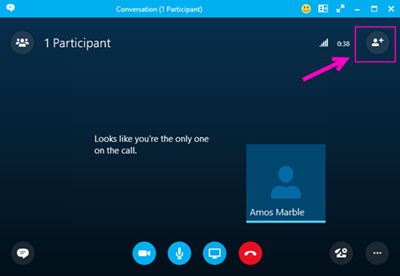
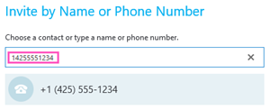

# Dialing out from a Skype for Business meeting so other people can join it

> [!NOTE]
> If you're looking for information about dialing out from a Teams meeting, see [Dialing out from a Teams meeting so other people can join it](/MicrosoftTeams/dialing-out-from-a-teams-meeting-so-other-people-can-join-it).

As the meeting organizer, you can dial out using the Skype for Business app to let other people join the same meeting using their phone. Although it's not required, when you are dialing out to someone, it's recommended that you dial the full number, including the country/region code. To get dial-out to work:
  
- You can dial-out only if you join a meeting using a Skype for Business app.
    
- You as the meeting organizer have been enabled for audio conferencing.

In order to add other participants via dial-out to the meetings of your organization, at least one authenticated user from the same organization as the organizer (your organization) is required to be present in the meeting in order to allow adding other participants via dial-out. 

> [!NOTE]
> [!INCLUDE [updating-admin-interfaces](../includes/updating-admin-interfaces.md)]

 **Step 1:** In the invite meeting, use the **Invite More People** option to dial out to a phone number.
  

  
 **Step 2:** Enter the full phone number, including the country/region code in the box.
  

  
## Supported countries and regions

Dial-out is only available to some countries/regions. For complete list, see [Country and region availability for Audio Conferencing and Calling Plans](/microsoftteams/country-and-region-availability-for-audio-conferencing-and-calling-plans/country-and-region-availability-for-audio-conferencing-and-calling-plans).
  
## Want to know more about audio conferencing?

[Try or purchase Audio Conferencing in Office 365](../audio-conferencing-in-office-365/try-or-purchase-audio-conferencing-in-office-365.md)
    
- [Skype for Business add-on licensing](../skype-for-business-and-microsoft-teams-add-on-licensing/skype-for-business-and-microsoft-teams-add-on-licensing.md)
    
## Related topics

[Install Skype for Business](https://support.office.com/en-us/article/8a0d4da8-9d58-44f9-9759-5c8f340cb3fb)
