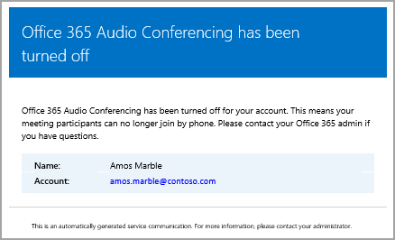
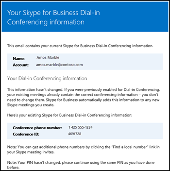

# Emails sent to users when their settings change in Skype for Business Online

> [!Note]
> If you're looking for automatic email information in Microsoft Teams, see [Emails sent to users when their settings change in Microsoft Teams](/MicrosoftTeams/emails-sent-to-users-when-their-settings-change-in-teams).

Emails will be automatically sent to users who are [enabled for Audio Conferencing](set-up-audio-conferencing.md) using Microsoft as the audio conferencing provider.
  
By default, there are four types of email that will be sent to your users who are enabled for Audio Conferencing. However, if you want to limit the number of emails sent to users, you can turn it off. Audio Conferencing in Office 365 will send email to your users' email when:
  
- **An Audio Conferencing license is assigned to them or when you are changing the audio conferencing provider to Microsoft.**
    
     This email includes the conference ID, the default conference phone number for the meetings, the audio conferencing PIN for the user, and the instructions and link to use the Skype for Business Online Meeting Update Tool that is used to update existing meetings for the user. See [Assign Skype for Business licenses](../skype-for-business-and-microsoft-teams-add-on-licensing/assign-skype-for-business-and-microsoft-teams-licenses.md) or [Assign Microsoft as the audio conferencing provider](assign-microsoft-as-the-audio-conferencing-provider.md).
    
    > [!NOTE]
    > If your organization has been enabled for dynamic conference IDs, all of a user's meetings that they schedule will have unique conference IDs. You can set up [Audio Conferencing dynamic IDs in your organization](using-audio-conferencing-dynamic-ids-in-your-organization.md). 
  
    Here is an example of this email:
    
     
  
    You can find out more about Skype for Business licensing by seeing [Skype for Business add-on licensing](../skype-for-business-and-microsoft-teams-add-on-licensing/skype-for-business-and-microsoft-teams-add-on-licensing.md).
    
- **The conference ID or default conference phone number of a user changes.**
    
    This email contains the conference ID, default conference phone number, and the instructions and link to use the Skype for Business Online Meeting Update Tool that is used to update existing meetings for the user. But this email doesn't include the user's audio conferencing PIN. See [Reset a conference ID for a user](reset-a-conference-id-for-a-user.md).
    
    > [!NOTE]
    > If your organization has been enabled for dynamic conference IDs, all of a user's meetings that they schedule will have unique conference IDs. You can set up [Audio Conferencing dynamic IDs in your organization](using-audio-conferencing-dynamic-ids-in-your-organization.md). 
  
    Here is an example of this email:
    
     
  
- **The audio conferencing PIN of a user is reset.**
    
    This email contains the organizer's audio conferencing PIN, the existing conference ID, and default conference phone number for the user. See [Reset the Audio Conferencing PIN](reset-the-audio-conferencing-pin.md).
    
    > [!NOTE]
    > If your organization has been enabled for dynamic conference IDs, all of a user's meetings that they schedule will have unique conference IDs. You can set up [Audio Conferencing dynamic IDs in your organization](using-audio-conferencing-dynamic-ids-in-your-organization.md). 
  
    Here is an example of this email:
    
     
  
- **A user's license is removed or when audio conferencing provider changes from Microsoft to other provider or None.**
    
    This happens when the **Audio Conferencing** license is removed from a user or when changing the audio conferencing provider of a user from Microsoft to a third-party audio conferencing provider or when setting the provider to **None**. This email contains the instructions and information for the user to use the Skype for Business Online Meeting Update Tool to remove audio conferencing specific information, such as the default conference phone number or conference ID.
    
    See [Assign or remove licenses for Office 365 for business](https://support.office.com/en-us/article/997596b5-4173-4627-b915-36abac6786dc).
    
    Here is an example of this email:
    
     
  
> [!NOTE]
> [!INCLUDE [updating-admin-interfaces](../includes/updating-admin-interfaces.md)]

## Make changes to the email messages that are sent to them

You can make changes to the email that is automatically sent to users including the email address and the display name that is included in the *From* contact information. By default, the sender of the emails will be from Office 365, but you can change the email address and display name using Windows PowerShell and the [Set-CsOnlineDialInConferencingTenantSettings](https://go.microsoft.com/fwlink/?LinkId=627285) cmdlet. To make changes to the email address that is sending the email to the users, you must:
  
- Enter the email address in the  _SendEmailFromAddress_ parameter.
    
- Enter the email display name in the  _SendEmailFromDisplayName_ parameter.
    
- Set the  _SendEmailOverride_ parameter to  _True_.
    
You can make changes to the email sent to users, such as the email address that the email is sent from and the display name for the email, by running:
  
```
Set-CsOnlineDialInConferencingTenantSetting -SendEmailOverride $true -SendEmailFromAddress amos.marble -SendEmailFromDisplayName "Amos Marble"
```

> [!NOTE]
>  If you want to change the email address information, you need to make sure that the inbound email policies of your environment allow emails that come from the custom specified from address. If you decide to override the *From* contact information, you should verify that the emails are correctly sent to users. You can do this by testing this with one user in your organization.
  
You can use the [Set-CsOnlineDialInConferencingTenantSettings](https://go.microsoft.com/fwlink/?LinkId=627285) cmdlet to manage other settings for your organization, including email.
  
## What if you don't want email to be sent to them?

When you disable sending emails to users, email won't be sent even when a user gets assigned a license. In this case, the conference ID, default conferencing phone number, and, more importantly, their audio conferencing PIN won't be sent to the user. When this happens, you must tell the user by sending them a separate email or by calling them.
  
By default, emails will be sent to your users, but if you want to prevent them from receiving email for audio conferencing, you can use the Skype for Business admin center or Windows PowerShell. 
 
  **Using the Skype for Business admin center**
    
1. In the **Skype for Business admin center**, in the left navigation, go to **Audio conferencing** > **Microsoft bridge settings**.
    
2. On the **Microsoft bridge settings** page, select or clear **Automatically send emails to users if their audio conferencing settings change**. 
    
3. Click **Save**. 

> [!Note]
> [!INCLUDE [updating-admin-interfaces](../includes/updating-admin-interfaces.md)]
  
**Using Windows PowerShell**
  
1. Run the following to disable sending all of your users email:
    
   ```
   Set-CsOnlineDialInConferencingTenantSettings -AutomaticallySendEmailsToUsers $false
   ```

You can use the [Set-CsOnlineDialInConferencingTenantSettings](https://go.microsoft.com/fwlink/?LinkId=627285) cmdlet to manage other settings for your organization, including email.
  
## What else should you know about this email?

- For more on enabling and disabling automatically sending email to your users, see [Enable or disable sending emails when Audio Conferencing settings change](enable-or-disable-sending-emails-when-their-settings-change.md).
    
- Sometimes users lose their audio information and you need to be able to send them all of their audio information to them. You can do this by using the Skype for Business admin center and clicking **Send conference info via email** under the audio conferencing properties for a user. See [Send an email to a user with their Audio Conferencing information](send-an-email-to-a-user-with-their-dial-in-information.md). However, this information doesn't include the audio conferencing PIN.
    
    Here is an example of this email that will be sent to them:
    
     
  
## Want to know how to manage with Windows PowerShell?

- By default, the sender of the emails will be from Office 365, but you can change the email address and display name using Windows PowerShell and the [Set-CsOnlineDialInConferencingTenantSettings](https://go.microsoft.com/fwlink/?LinkId=627285) cmdlet.
    
- Windows PowerShell is all about managing users and what users are allowed or not allowed to do. With Windows PowerShell, you can manage Office 365 using a single point of administration that can simplify your daily work when you have multiple tasks to do. To get started with Windows PowerShell, see these topics:
    
  - [Why you need to use Office 365 PowerShell](https://go.microsoft.com/fwlink/?LinkId=525041)
    
  - [Best ways to manage Office 365 with Windows PowerShell](https://go.microsoft.com/fwlink/?LinkId=525142)
    
- Windows PowerShell has many advantages in speed, simplicity, and productivity over only using the Microsoft 365 admin center, such as when you are making setting changes for many users at one time. Learn about these advantages in the following topics: 
    
  - [An introduction to Windows PowerShell and Skype for Business Online](https://go.microsoft.com/fwlink/?LinkId=525039)
    
  - [Using Windows PowerShell to manage Skype for Business Online](https://go.microsoft.com/fwlink/?LinkId=525453)
    
  - [Using Windows PowerShell to do common Skype for Business Online management tasks](https://go.microsoft.com/fwlink/?LinkId=525038)
    
    > [!NOTE]
    > The Windows PowerShell module for Skype for Business Online enables you to create a remote Windows PowerShell session that connects to Skype for Business Online. This module, which is supported only on 64-bit computers, can be downloaded from the Microsoft Download Center at [Windows PowerShell Module for Skype for Business Online.](https://go.microsoft.com/fwlink/?LinkId=294688)
  
## Related topics

[Enable or disable sending emails when Audio Conferencing settings change](enable-or-disable-sending-emails-when-their-settings-change.md)
  
[Send an email to a user with their Audio Conferencing information](send-an-email-to-a-user-with-their-dial-in-information.md)
