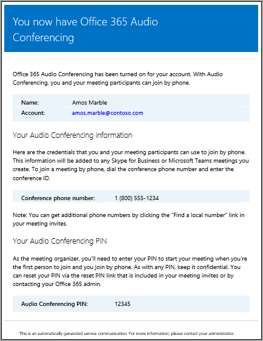

# Enable or disable sending emails when Audio Conferencing settings change in Skype for Business Online

> [!Note]
> If you want to enable or disable sending emails in Microsoft Teams, see [Enable or disable sending emails when Audio Conferencing settings change in Microsoft Teams](/MicrosoftTeams/enable-or-disable-sending-emails-when-their-settings-change-in-teams).

Users are automatically notified by email when they are enabled for Audio Conferencing. There may be times, however, when you want to reduce the number of emails that are sent to Skype for Business users. In such cases, you can disable sending email.
  
If you disable sending emails, Audio Conferencing emails won't be sent to your users, including emails for when users are enabled or disabled for audio conferencing, when their PIN is reset, and when the conference ID and the default conferencing phone number changes.
  
Here is an example of the email that is sent to users when they are enabled for Audio Conferencing:
  

  
## When are emails being sent to your users?

- There are several emails that are sent to users in your organization after they are enabled for audio conferencing:
    
  - When an **Audio Conferencing** license is assigned to them.
    
  - When you manually reset the user's audio conferencing PIN.
    
  - When you manually reset the user's conference ID.
    
  - When the **Audio Conferencing** license is removed from them.
    
  - When the audio conferencing provider of a user is changed from Microsoft to another provider or **None**.
    
  - When the audio conferencing provider of a user is changed to Microsoft.


## Enable or disable email from being sent to users

You can use the Skype for Business admin center or Windows PowerShell to enable or disable email sent to users.

 
 **Using the Skype for Business admin center**
    
1. In the **Skype for Business admin center**, in the left navigation, click **Audio conferencing**.
    
2. On the **Microsoft bridge settings** page, select or clear the **Automatically send emails to users if their audio conferencing settings change**.
    
3. Click **Save**.
    
    > [!TIP]
    > You can also send email to a user with the audio conferencing settings by going to **Audio conferencing** > **Users**, selecting the user, and clicking **Send conference info via email**.  If you do this, an email will be sent that only includes conference ID and conference phone number, but not the PIN.  See [Send an email to a user with their Audio Conferencing information](send-an-email-to-a-user-with-their-dial-in-information.md) for more information.
  
> [!Note]
> [!INCLUDE [updating-admin-interfaces](../includes/updating-admin-interfaces.md)]

**Using Windows PowerShell**
  
- Run the following to disable sending emails: 
    
  ```
  Set-CsOnlineDialInConferencingTenantSetting -AutomaticallySendEmailsToUsers $false
  ```

    For help with this cmdlet, see [Set-CsOnlineDialInConferencingTenantSettings](https://go.microsoft.com/fwlink/?LinkId=715757).
    
## What else should you know?

- When automatic emails are disabled, you can still manually trigger sending an email with the conference ID and phone number using the Skype for Business admin center. However, if you do this, the PIN won't be included. If you want to reset the audio conferencing PIN and sending emails is disabled, you will need to send it to the user in another way.
    
- Sending email to your users can be disabled using the Skype for Business admin center or the Windows PowerShell.
    
## Want to know how to manage with Windows PowerShell?

- You can use these cmdlets to save time or automate this.
    
  - [Get-CsOnlineDialInConferencingTenantSettings](https://go.microsoft.com/fwlink/?LinkId=715760)
    
  - [Remove-CsOnlineDialInConferencingTenantSettings](https://go.microsoft.com/fwlink/?LinkId=715759)
    
  - [Get-CsOnlineDialinConferencingTenantConfiguration](https://go.microsoft.com/fwlink/?LinkId=715758)
    
  - [Get-CsOnlineDialInConferencingTenantSettings](https://go.microsoft.com/fwlink/?LinkId=715760)
    
- Windows PowerShell is all about managing users and what users are allowed or not allowed to do. With Windows PowerShell, you can manage Office 365 using a single point of administration that can simplify your daily work when you have multiple tasks to do. To get started with Windows PowerShell, see these topics:
    
  - [Why you need to use Office 365 PowerShell](https://go.microsoft.com/fwlink/?LinkId=525041)
    
  - [Best ways to manage Office 365 with Windows PowerShell](https://go.microsoft.com/fwlink/?LinkId=525142)
    
- Windows PowerShell has many advantages in speed, simplicity, and productivity over only using the Microsoft 365 admin center, such as when you are making setting changes for many users at one time. Learn about these advantages in the following topics: 
    
  - [An introduction to Windows PowerShell and Skype for Business Online](https://go.microsoft.com/fwlink/?LinkId=525039)
    
  - [Using Windows PowerShell to manage Skype for Business Online](https://go.microsoft.com/fwlink/?LinkId=525453)
    
  - [Using Windows PowerShell to do common Skype for Business Online management tasks](https://go.microsoft.com/fwlink/?LinkId=525038)
    
    > [!NOTE]
    > The Windows PowerShell module for Skype for Business Online enables you to create a remote Windows PowerShell session that connects to Skype for Business Online. This module, which is supported only on 64-bit computers, can be downloaded from the Microsoft Download Center at [Windows PowerShell Module for Skype for Business Online.](https://go.microsoft.com/fwlink/?LinkId=294688)
  
## Related topics

[Emails sent to users when their Audio Conferencing settings change](emails-sent-to-users-when-their-settings-change.md)

[Send an email to a user with their Audio Conferencing information](send-an-email-to-a-user-with-their-dial-in-information.md)


