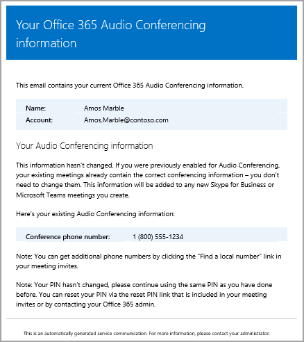

# Send an email to a user with their Audio Conferencing information in Skype for Business Online

> [!Note]
> For information about sending Audio Conferencing information to users in Microsoft Teams, see [Send an email to a user with their Audio Conferencing information in Microsoft Teasms](/MicrosoftTeams/send-an-email-to-a-user-with-their-dial-in-information-in-teams).

Sometimes Skype for Business users may need you to send them their Audio Conferencing information. You can do this by using the **Skype for Business admin center** and clicking **Send conference info via email** under the properties for a user. When you send this email, it will contain all of the audio conferencing information, including:
  
- The conference phone or dial-in phone number for the user.
    
- The user's conference ID.
    
   
Here is an example of the email that is sent:
  


> [!NOTE]
> [!INCLUDE [updating-admin-interfaces](../includes/updating-admin-interfaces.md)]
  
## Send an email with audio conferencing information to a user

1. In the left navigation, click **Users**, and then select the user from the list of available users.

2. At the top of the page, click **Edit**.

3. Under **Audio Conferencing**, click **Send conference info in email**.

1. Sign in to Office 365 with your work or school account.
    
2. Go to the **Office 365 admin center** > **Skype for Business**, and in the left navigation, click **Audio conferencing**.
    
3. Click **Users**, and then select the user.
    
4. In the Action pane, click **Send conference info via email**.
    
> [!TIP]
> You can also send email to the user with the audio conferencing settings by editing the user's properties and then clicking **Audio conferencing** > **Send conference info via email**. 

## What else should you know about this email?

- There are several emails that are sent to users in your organization after they are enabled for audio conferencing:
    
  - When an **Audio Conferencing** license is assigned to them.
    
  - When you manually reset the user's audio conferencing PIN.
    
  - When you manually reset the user's conference ID.
    
  - When an **Audio Conferencing** license is removed from them.
    
  - When the audio conferencing provider for a user is changed from Microsoft to another provider or **None**.
    
  - When the audio conferencing provider for a user is changed to Microsoft.
    
- By default, the sender of the emails will be from Office 365, but you can change the email address and display name by using Windows PowerShell and the [Set-CsOnlineDialInConferencingTenantSettings](https://go.microsoft.com/fwlink/?LinkId=708983) cmdlet. To make changes to the email address that is sending the email to users, you must:
    
  - Enter the email address in the SendEmailFromAddress parameter.
    
  - Set the SendEmailOverride parameter to True.
    
  - Enter the email display name in the SendEmailFromDisplayName parameter.
    
     `Set-CsOnlineDialInConferencingTenantSetting -SendEmailOverride $true -SendEmailFromAddress amos.marble@contoso.com -SendEmailFromDisplayName "Amos Marble"`
    
    > [!NOTE]
    > If you want to change the email address information, you need to make sure that the inbound email policies of your organization allow emails that come from the custom email address that is set. 
  
## Want to know how to manage with Windows PowerShell?

- To save time or automate this, you can use the [Set-CsOnlineDialInConferencingUser](https://go.microsoft.com/fwlink/?LinkId=617688 ) cmdlet.
    
    To send an email to the user with their audio conferencing information, run the following:
    
  ```
  Set-CsOnlineDialInConferencingUser -id amos.marble@contoso.com  -SendEmail
  ```

- When it comes to Windows PowerShell, Skype for Business Online is all about managing users and what users are allowed or not allowed to do. With Windows PowerShell, you can manage Office 365 using a single point of administration that can simplify your daily work when you have multiple tasks to do. To get started with Windows PowerShell, see these topics:
    
  - [Why you need to use Office 365 PowerShell](https://go.microsoft.com/fwlink/?LinkId=525041)
    
  - [Best ways to manage Office 365 with Windows PowerShell](https://go.microsoft.com/fwlink/?LinkId=525142)
    
- Windows PowerShell has many advantages in speed, simplicity, and productivity over only using the Office 365 admin center, such as when you are making setting changes for many users at one time. Learn about these advantages in the following topics: 
    
  - [An introduction to Windows PowerShell and Skype for Business Online](https://go.microsoft.com/fwlink/?LinkId=525039)
    
    [Using Windows PowerShell to manage Skype for Business Online](https://go.microsoft.com/fwlink/?LinkId=525453)
    
  - [Using Windows PowerShell to do common Skype for Business Online management tasks](https://go.microsoft.com/fwlink/?LinkId=525038)
    
    > [!NOTE]
    > The Windows PowerShell module for Skype for Business Online enables you to create a remote Windows PowerShell session that connects to Skype for Business Online. This module, which is supported only on 64-bit computers, can be downloaded from the Microsoft Download Center at [Windows PowerShell Module for Skype for Business Online.](https://go.microsoft.com/fwlink/?LinkId=294688)
  
## Related topics

[Try or purchase Audio Conferencing in Office 365](../audio-conferencing-in-office-365/try-or-purchase-audio-conferencing-in-office-365.md)
