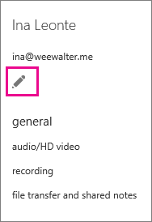

# Set the phone numbers included on invites in Skype for Business Online

> [!Note]
> For information about meeting invite phone numbers in Microsoft Teams, see [Set the phone numbers included on invites in Microsoft Teams](/MicrosoftTeams/set-the-phone-numbers-included-on-invites-in-teams).

Audio Conferencing in Office 365 enables users in your organization to create Skype for Business meetings, and then allow users to dial in to those meetings using a phone. In Office 365, you have the option of using a Microsoft audio conferencing bridge or a third-party audio conferencing bridge that is hosted by an approved audio conferencing provider (ACP).
  
> [!NOTE]
> There isn't a resource that contains a listing of all of the dial-in numbers for Audio Conferencing. If you are looking to see if there are dial-in phone numbers available in your area or country/region, use the **Skype for Business admin center** > **Voice** > **Phone Numbers**, click **Add** then **New Service Numbers**. Use the lists for **Country/Region**, **State/Region** and **City** to filter your search.> Also, if you are looking for toll free service numbers, select **Toll-Free** from the **State/Region** list.
  
A conferencing bridge gives you a set of dial-in phone numbers for your organization. All of them can be used to join the meetings that a meeting organizer has created, but you can select which ones will be included on their meeting invites.
  
> [!NOTE]
> There can be a maximum of one toll and one toll-free phone number on the meeting invite for a meeting organizer, but there is also a link located at the bottom of each meeting invite that opens the full list of all dial-in phone numbers that can be used to join a meeting. 

> [!NOTE]
> [!INCLUDE [updating-admin-interfaces](../includes/updating-admin-interfaces.md)]
  
## Set the default dial-in phone number for a meeting organizer

1. Sign in to Office 365 with your work or school account.
    
2. Choose **Admin centers** > **Skype for Business**.
    
3. Choose **Users**.
    
    
  
4. Choose the users you want to edit:
    
   - To select a single user, select the user's name.
    
   - To select all users on the page, select the box next to **Display name** at the top of the list.
    
   - To select multiple users, select the box next to each user's name.
    
5. In the right panel, choose **Edit**.
    
    
  
6. Choose **Audio conferencing**.
    
7. On the **Properties** page, in the **Provider name** list, choose the provider for the user. Depending on the provider, complete the following boxes.
    
   - **Microsoft is the provider**: Use the **Default toll number** and **Default toll-free number** lists to select the default numbers for the user.
    
     > [!NOTE]
     > At least one toll-free number must be assigned to your conferencing bridge before it can be set as the default toll-free number of a user. To get a toll-free number, see [Getting service phone numbers for Skype for Business](/microsoftteams/getting-service-phone-numbers). 
  
   - **A third-party is the provider**: Use the **Toll number** and **Toll-free number** fields to enter the numbers for the user.


## Reset audio conferencing phone numbers

1. In the **Skype for Business admin center**, choose **Audio conferencing**.
    
2. At the top of the page, choose **Users**.
    
3. Choose the users you want to reset, and then in the Action pane, click **Clear**.
    
By default, when you change a user's conferencing settings, an email is sent to the user. To change this, see [Enable or disable sending emails when Audio Conferencing settings change](enable-or-disable-sending-emails-when-their-settings-change.md).
  
> [!IMPORTANT]
> When you change a user's audio conferencing settings, recurring and future Skype for Business meetings must be updated and sent to attendees. 
  
## Want to know how to manage with Windows PowerShell?

- To save time or automate this, you can use the [Set-CsOnlineDialInConferencingUser](https://go.microsoft.com/fwlink/?LinkId=617688) cmdlet.
    
- Use the [Set-CsOnlineDialInConferencingUser](https://go.microsoft.com/fwlink/?LinkId=617688) cmdlet to change the default toll or toll-free number for specific users.
    
    To change the default toll-free number for a user, run:
    
  ```
  Set-CsOnlineDialinConferencingUser -Identity amos.marble@Contoso.com -TollFreeServiceNumber   +180045551234
  ```

- Use the **Set-CsOnlineDialInConferencingUserDefaultNumber** cmdlet to change the default toll or toll-free number of users based on their original default number or their location.
    
    > [!NOTE]
    > To find the BridgeID, use the **Get-CsOnlineDialInConferencingBridge** cmdlet.
  
  ```
  Set-CsOnlineDialInConferencingUserDefaultNumber -FromNumber +18005551234 -ToNumber +18005551239 NumberType TollFree -BridgeId <Bridge Id> -RescheduleMeetings 
  ```

  - To set the default toll-free number for all users without one to +18005551234, run:
    
  ```
  Set-CsOnlineDialInConferencingUserDefaultNumber -FromNumber $null -ToNumber +18005551234 -NumberType TollFree -BridgeId <Bridge Id>  
  ```

  - To change the default toll-free number of all users that have +18005551234 as their default toll-free number to +18005551239, run:
    
  ```
  Set-CsOnlineDialInConferencingUserDefaultNumber -FromNumber +18005551234 -ToNumber +18005551239 NumberType TollFree -BridgeId <Bridge Id>
  ```

  - To set the default toll-free number of all users located in the U.S. to +18005551234, run:
    
  ```
  Set-CsOnlineDialInConferencingUserDefaultNumber -Country US -ToNumber +18005551234 -NumberType TollFree -BridgeId <Bridge Id>
  ```
  ## Want to learn more about Windows PowerShell?
- When it comes to Windows PowerShell is all about managing users and what users are allowed or not allowed to do. With Windows PowerShell, you can manage Office 365 and Skype for Business Online using a single point of administration that can simplify your daily work, when you have multiple tasks to do. To get started with Windows PowerShell, see these topics:
    
  - [An introduction to Windows PowerShell and Skype for Business Online](https://go.microsoft.com/fwlink/?LinkId=525039)
    
  - [Why you need to use Office 365 PowerShell](https://go.microsoft.com/fwlink/?LinkId=525041)
    
- Windows PowerShell has many advantages in speed, simplicity, and productivity over only using the Microsoft 365 admin center such as when you are making setting changes for many users at one time. Learn about these advantages in the following topics:
    
  - [Best ways to manage Office 365 with Windows PowerShell](https://go.microsoft.com/fwlink/?LinkId=525142)
    
  - [Using Windows PowerShell to manage Skype for Business Online](https://go.microsoft.com/fwlink/?LinkId=525453)
    
  - [Using Windows PowerShell to do common Skype for Business Online management tasks](https://go.microsoft.com/fwlink/?LinkId=525038)
    
## Related topics

[Try or purchase Audio Conferencing in Office 365](../audio-conferencing-in-office-365/try-or-purchase-audio-conferencing-in-office-365.md)
