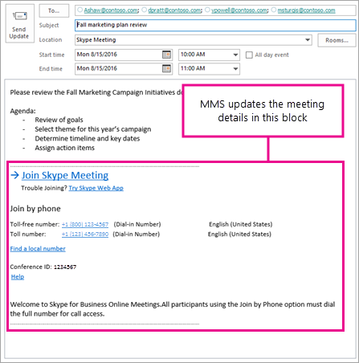

# Using the Meeting Migration Service (MMS)

The Meeting Migration Service (MMS) is service that updates a user’s existing meetings in the following scenarios:

- When a user is migrated from on-premises to the cloud (whether to Skype for Business Online or to TeamsOnly).
- When an admin makes a change to the user’s audio conferencing settings 
- When an online user is upgraded to Teams only, or when a user's mode in TeamsUpgradePolicy is set to SfBwithTeamsCollabAndMeetings
- When you use PowerShell 


By default, MMS is automatically triggered in each of these cases, although admins can disable it at the tenant level. In addition, admins can use a PowerShell cmdlet to manually trigger meeting migration for a given user.


**Limitations**: The meeting migration service can't be used if any of the following apply:

- The user’s mailbox is hosted in Exchange on-premises.
- The user is being migrated from the cloud to Skype for Business Server on-premises.

In these situations, end users can use the [Meeting Migration Tool](https://www.microsoft.com/en-us/download/details.aspx?id=51659) to migrate their own meetings instead.

## How MMS works

When MMS is triggered for a given user, a migration request for that user is placed in a queue. To avoid any race conditions, the queued request is deliberately not processed until at least 90 minutes have gone by. Once MMS processes the request, it performs the following tasks:

1. It searches that user’s mailbox for all existing meetings organized by that user and scheduled in the future.
2. Based on the information found in the user’s mailbox, it either updates or schedules new meetings in either Teams or Skype for Business Online for that user, depending on the exact scenario.
3. In the email message, it replaces the online meeting block in the meeting details.
4. It sends the updated version of that meeting to all meeting recipients on behalf of the meeting organizer. Meeting invitees will receive a meeting update with updated meeting coordinates in their email. 

    

From the time MMS is triggered, it typically takes about 2 hours until the user’s meetings are migrated. However, if the user has a large number of meetings, it might take longer. If MMS encounters an error migrating one or more meetings for the user, it will periodically retry up to 9 times over the span of 24 hours.

**Notes**:

- MMS replaces everything in the online meeting information block when a meeting is migrated. Therefore, if a user has edited that block, their changes will be overwritten. Any content they have in the meeting details outside of the online meeting information block won't be affected.
- Only the Skype for Business or Microsoft Teams meetings that were scheduled by clicking the **Add Skype meeting** button in Outlook on the Web or by using the Skype Meeting add-in for Outlook are migrated. If a user copies and pastes the Skype online meeting information from one meeting to a new meeting, that new meeting won't be updated since there is no meeting in the original service.
- Meeting content that was created or attached to the meeting (whiteboards, polls, and so on) won't be retained after MMS runs. If your meeting organizers have attached content to the meetings in advance, the content will need to be recreated after MMS runs.
- The link to the shared meeting notes in the calendar item and also from within the Skype meeting also will be overwritten. Note that the actual meeting notes stored in OneNote will still be there; it is only the link to the shared notes that is overwritten.
- Meetings with more than 250 attendees (including the organizer) won't be migrated.
- Some UNICODE characters in the body of the invite might be incorrectly updated to one of the following special characters: ï, ¿, ½, �.

## Triggering MMS for a user

This section describes what happens when MMS is triggered in each of the following cases:

- When a user is migrated from on-premises to the cloud
- When an admin makes a change to the user’s audio conferencing settings 
- When the user's mode in TeamsUpgradePolicy is set to either TeamsOnly or SfBWithTeamsCollabAndMeetings (using either Powershell or the Teams Admin Portal)
- When you use the PowerShell cmdlet, Start-CsExMeetingMigration

### Updating meetings when you move an on-premises user to the cloud

This is the most common scenario where MMS helps create a smoother transition for your users. Without meeting migration, existing meetings organized by a user in Skype for Business Server on-premises would no longer work once the user is moved online. Therefore, when you use the on-premises admin tools (either `Move-CsUser` or the Admin Control Panel) to move a user to the cloud, existing meetings are automatically moved to the cloud as follows:

- If the `MoveToTeams` switch in `Move-CsUser` is specified, meetings are migrated directly to Teams and the user will be in TeamsOnly mode. Use of this switch requires Skype for Business Server with CU8 or later. These users can still join any Skype for Business meeting they may be invited to, using either the Skype for Business client or the Skype Meeting App.
- Otherwise meetings are migrated to Skype for Business Online.

In either case, if the user has been assigned an Audio Conferencing license before being moved to the cloud, the meetings will be created with dial-in coordinates. If you move a user from on-premises to the cloud and you intend for that user to use Audio Conferencing, we recommend that you first assign the audio conference before you move the user so that only 1 meeting migration is triggered.


### Updating meetings when a user's audio conferencing settings change

In the following cases, MMS will update existing Skype for Business and Microsoft Teams meetings to add, remove, or modify dial-in coordinates:

- When you assign or remove a Microsoft Audio Conferencing service license to a user, and that user is not enabled for a third-party audio conferencing provider.
- When you change the audio conferencing provider of a user from any other provider to Microsoft, provided the user is assigned a Microsoft Audio Conferencing license. For more information, see [Assign Microsoft as the audio conferencing provider](https://docs.microsoft.com/en-us/skypeforbusiness/audio-conferencing-in-office-365/assign-microsoft-as-the-audio-conferencing-provider). Also note that support for third party audio conferencing providers [ACP] is scheduled for end of life on April 1, 2019, as [previously announced](https://docs.microsoft.com/skypeforbusiness/legal-and-regulatory/end-of-integration-with-3rd-party-providers).
- When you enable or disable audio conferencing for a user.
- When you change or reset the conference ID for a user configured to use public meetings.
- When you move the user to a new audio conferencing bridge.
- When a phone number from a audio conferencing bridge is unassigned. This is a complex scenario that requires additional steps. For more information, see [Change the phone numbers on your audio conferencing bridge](https://docs.microsoft.com/en-us/MicrosoftTeams/change-the-phone-numbers-on-your-audio-conferencing-bridge).

Not all changes to a user's audio conferencing settings trigger MMS. Specifically, the following two changes won't result in MMS updating meetings:

- When you change the SIP address for the meeting organizer (either their SIP user name or their SIP domain)
- When you change your organization's meeting URL using the `Update-CsTenantMeetingUrl` command.


### Updating meetings when assigning TeamsUpgradePolicy

By default, meeting migration is automatically triggered when a user is granted an instance of `TeamsUpgradePolicy` with `mode=TeamsOnly` or `mode= SfBWithTeamsCollabAndMeetings`. If you do not want to migrate meetings when granting either of these modes, then specify `MigrateMeetingsToTeams $false` in `Grant-CsTeamsUpgradePolicy` (if using PowerShell) or uncheck the box to migrate meetings when setting a user's coexistence mode (if using the Teams admin portal).

Also note the following:

- Meeting migration is only invoked when you grant `TeamsUpgradePolicy` for a specific user. If you grant `TeamsUpgradePolicy` with `mode=TeamsOnly` or `mode=SfBWithTeamsCollabAndMeetings` on a *tenant-wide* basis, meeting migration is not invoked.
- A user can only be granted TeamsOnly mode if the user is homed online. Users that are homed on-premises must be moved using `Move-CsUser` as previously described.
- Granting a mode other than TeamsOnly or SfBWithTeamsCollabAndMeetings does not convert existing Teams meetings to Skype for Business meetings.

### Trigger Meeting Migration manually via PowerShell cmdlet

In addition to automatic meeting migrations, admins can manually trigger meeting migration for a user by running the cmdlet `Start-CsExMeetingMigration`. This cmdlet queues a migration request for the specified user.  In addition to the required `Identity` parameter, it takes two optional parameters, `SourceMeetingType` and `TargetMeetingType`, which allow you to specify how to migrate meetings:

**TargetMeetingType:**

- Using `TargetMeetingType Current` specifies that Skype for Business meetings remain Skype for Business meetings and Teams meetings remain Teams meetings. However audio conferencing coordinates might be changed, and any on-premises Skype for Business meetings would be migrated to Skype for Business Online. This is the default value for TargetMeetingType.
- Using `TargetMeetingType Teams` specifies that any existing meeting must be migrated to Teams, regardless of whether the meeting is hosted in Skype for Business online or on-premises, and regardless of whether any audio conferencing updates are required. 

**SourceMeetingType:**
- Using `SourceMeetingType SfB` indicates that only Skype for Business meetings (whether on-premises or online) should be updated.
- Using `SourceMeetingType Teams` indicates that only Teams meetings should be updated.
- Using `SourceMeetingType All` indicates that both Skyep for Business meetings and Teams meetings should be updated. This is the default value for SourceMeetingType.
    

The example below shows how to initiate meeting migration for user ashaw@contoso.com so that all meetings are migrated to Teams:

```
Start-CsExMeetingMigration -Identity ashaw@contoso.com -TargetMeetingType Teams
```


## Managing MMS

Using Windows PowerShell, you can check the status of ongoing migrations, manually trigger meeting migration, and disable migration altogether. 

### Check the status of meeting migrations

You use the `Get-CsMeetingMigrationStatus` cmdlet to check the status of meeting migrations. Below are some examples.

- To get a summary status of all MMS migrations, run the following command which provides a tabular view of all migration states:

    ```
    Get-CsMeetingMigrationStatus -SummaryOnly

    State      UserCount
    ------     ---------
    Pending 	 21
    InProgress 	  6
    Failed            2 
    Succeeded 	131
    ```
- To get full details of all migrations within a specific time period, use the `StartTime` and `EndTime` parameters. For example, the following command will return full details on all migrations that occurred from October 1, 2018 to October 8, 2018.

    ```
    Get-CsMeetingMigrationStatus -StartTime "10/1/2018" -EndTime "10/8/2018"
    ```
- To check the status of migration for a specific user, use the `Identity` parameter. For example, the following command will return the status for the user ashaw@contoso.com:

    ```
    Get-CsMeetingMigrationStatus -Identity ashaw@contoso.com
    ```
If you see any migrations that have failed, take action to resolve these issues as soon as possible, since people won't be able to dial-in to the meetings organized by those users until you resolve them. If `Get-CsMeetingMigrationStatus` shows any migrations in a failed state, perform these steps:
 
1. Determine which users are affected. Run the following command to get the list of affected users, and the specific error that was reported:

    ```
    Get-CsMeetingMigrationStatus| Where {$_.State -eq "Failed"}| Format-Table Identity, LastMessage
    ```
2. For each affected user, run the Meeting Migration Tool to manually migrate their meetings.

3. If migration still doesn't work with the Meeting Migration Tool, you have two options:

    - Have the users create new Skype meetings.
    - [Contact support](https://go.microsoft.com/fwlink/p/?LinkID=518322).


### Enabling and disabling MMS

MMS is enabled by default for all organizations, but it can be disabled as follows:

- Disable entirely for the tenant. 
- Disable only for changes related to audio conferencing. In this case, MMS will still run when a user is migrated from on-premises to the cloud or when you grant TeamsOnly mode or SfBWithTeamsCollabAndMeetings mode in `TeamsUpgradePolicy`.

For example, you may want to manually migrate all meetings or temporarily disable MMS while making substantial changes to the audio conferencing settings for your organization

To see if MMS is enabled for your organization, run the following command. MMS is enabled if the `MeetingMigrationEnabled` parameter is `$true`.
```
Get-CsTenantMigrationConfiguration
```
To enable or disable MMS entirely, use the `Set-CsTenantMigrationConfiguration` command. For example, to disable MMS, run the following command:

```
Set-CsTenantMigrationConfiguration -MeetingMigrationEnabled $false
```
If MMS is enabled in the organization and you want to check if it is enabled for audio conferencing updates, check the value of the `AutomaticallyMigrateUserMeetings` parameter in the output from `Get-CsOnlineDialInConferencingTenantSettings`. To enable or disable MMS for audio conferencing, use `Set-CsOnlineDialInConferencingTenantSettings`. For example, to disable MMS for audio conferencing, run the following command:

```
Set-CsOnlineDialInConferencingTenantSettings  -AutomaticallyMigrateUserMeetings $false
```

## Related topics

[Try or purchase Audio Conferencing in Office 365](../audio-conferencing-in-office-365/try-or-purchase-audio-conferencing-in-office-365.md)

[Move users between on-premises and cloud](https://docs.microsoft.com/SkypeForBusiness/hybrid/move-users-between-on-premises-and-cloud)
