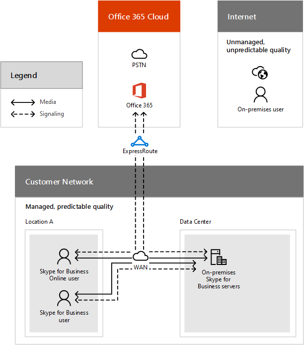

# Call flow using ExpressRoute

This article helps to explain the core call flow principles for Skype for Business Online and ExpressRoute, and gives you some detailed examples of call flows so you can understand and plan correctly.

If you are deploying Skype for Business Online as part of Office 365, Skype for Business Server Hybrid, or Skype for Business Cloud Connector Edition, you will need to understand the communication between the Skype for Business client and servers and the call flow so you can effectively plan, deploy, operate, and troubleshoot your Skype for Business Online services.

## Call flow overview

This document describes the network segments that can carry data for these call flows and helps you to understand which traffic will remain local to your network compared to the traffic that will travel over the Internet or through ExpressRoute. Knowing which traffic uses ExpressRoute will help you to assess the benefits that your company will receive by using ExpressRoute, as well as help you understand the ExpressRoute deployment guidance to validate and troubleshoot your deployment once you've decided to use ExpressRoute.

The call flows described here can be impacted by a variety of factors that are under your control, including firewall rules, NAT configuration, proxies, and router configuration. This document assumes that the recommended settings have been applied. These recommended settings are described in:

- [Set up Skype for Business Online](../set-up-skype-for-business-online/set-up-skype-for-business-online.md)

- [Office 365 URLs and IP address ranges](https://support.office.com/article/8548a211-3fe7-47cb-abb1-355ea5aa88a2)

- [ExpressRoute Overview](https://docs.microsoft.com/azure/expressroute/expressroute-introduction)

- [Azure ExpressRoute](https://azure.microsoft.com/services/expressroute/)

Setup and configurations that haven't followed the setup steps found in the documentation above can have different call flows than those we have documented here. Additionally, you may find yourself with configuration issues such as asymmetrical and non-optimal network routes, or non-optimal transport protocols. Asymmetrical routing is an important consideration whenever ExpressRoute is involved, because ExpressRoute introduces a second path to Office 365, which creates the possibility for a route that uses the Internet in one direction and another route that uses ExpressRoute in the other direction. This can result in traffic being blocked in the return direction if it traverses a stateful firewall.

## Network segments and traffic types

### Network Segments

Before we can explain the call flow, we need to define some terms that will help you understand the network segments and types of media that are used in Skype for Business Online.

The call flow diagrams below show you four different network segments, each of which are managed by different organizations (your internal network, your network service provider, and their Internet peering partners, and Microsoft) that have different performance characteristics. For guidelines on network performance targets, refer to [Media Quality and Network Connectivity Performance in Skype for Business Online](media-quality-and-network-connectivity-performance.md).

Below you can see each network segment that we will be talking about.

 **Your network** This is the network segment that is part of your overall network that you control and manage. This includes all of your connections within your offices, whether wired or wireless, between office buildings, to on-premises datacenters, and your connections to Internet providers or ExpressRoute partners.

Typically, the edge of your network has one or more DMZ with firewalls and/or proxy servers, which enforce your organization's security policies and that only allow certain network traffic that you have set up and configured. Because you manage this network, you have direct control over the performance of your network, and it is highly recommended that you complete network assessments to validate performance both within sites in your network and from your network to Skype for Business Online. To see the performance requirements, see [Media Quality and Network Connectivity Performance in Skype for Business Online](media-quality-and-network-connectivity-performance.md).

 **Internet** This is the network segment that is part of your overall network that will be used by users who are connecting to Skype for Business Online from outside of your network, and is used for all connections when ExpressRoute isn't configured. The Internet and all of its connections aren't managed by you or Microsoft, so performance and routing paths can't be determined, and this will have the greatest impact on overall call flow and quality.

 **ExpressRoute** This is the network segment that is part of your overall network that will give you a dedicated, private connection to the Microsoft network. This is the recommended option for connecting your network to the Microsoft network (Office 365 datacenters) for all of the workloads that are dependent on network speed and performance, such as Skype for Business Online real-time communication. ExpressRoute connections are made between your network and the Microsoft network use [ExpressRoute connectivity providers](https://azure.microsoft.com/documentation/articles/expressroute-locations/) to provide a private and managed network, with 99.9% uptime and support for Quality of Service (QoS) that can improve performance for real-time media during periods of network congestion.

 **Microsoft network** This is the network segment that is part of your overall network that supports Office 365 services. This includes all of the communication between Online servers for Office 365. This may include traffic that traverses the Microsoft network backbone and is transmitted between geographical regions.

### Types of traffic

The network traffic for Skype for Business Online falls into two broad categories, shown as separate paths in the call flow:

 **Real-time media** is data encapsulated within RTP (Real-time Transport Protocol) and supports audio, video, application sharing, and file transfer workloads. In general, media traffic is highly latency sensitive, so you would want this traffic to take the most direct path possible, and to use UDP as the transport layer protocol because using TCP introduces higher latency.

 **Signaling** is the communication link between the client and server, or other clients that are used to control activities (for example, when a call is initiated), and deliver IMs. Most signaling traffic uses the SIP protocol, though some clients use HTTP-based REST interfaces. To make it simple, we are considering a variety signaling that may travel over HTTP and HTTPS or TLS connections in this type of traffic. It's important to understand that this traffic is much less sensitive to latency, but may cause service outages or call timeouts if latency between the endpoints exceed several seconds.

The destinations for this traffic are found in [Office 365 URLs and IP address ranges](https://support.office.com/article/8548a211-3fe7-47cb-abb1-355ea5aa88a2) for all Office 365 services. For each URL, it indicates whether that portion of traffic may traverse the ExpressRoute for Office 365. For diagrams that show that the Internet is still used for some traffic when ExpressRoute is enabled, please see [Azure ExpressRoute for Office 365](https://support.office.com/article/6d2534a2-c19c-4a99-be5e-33a0cee5d3bd). It is important to understand that even URLs that are listed as being routable over ExpressRoute are also routable over the Internet. This means that in some scenarios, the determination about whether the Internet or ExpressRoute will be used depends on location of client and configuration of proxy servers and firewalls. It is also important to understand that since not all URLs associated with Office 365 are able to use ExpressRoute, an Internet connection is required even if you purchase ExpressRoute from an ExpressRoute partner.

Traffic that can only be sent over the Internet includes common Internet dependencies, such as Certificate Revocation Lists (CRLs), DNS lookups and name resolution, URLs for shared Office 365 services, such as for the Office 365 admin center, and some non-real-time communication features of Skype for Business Online, such as telemetry and federation for interoperability with Skype consumer, as well media that is streamed for Skype Meeting Broadcast. To help you make decisions, see [Routing with ExpressRoute for Office 365](https://support.office.com/article/e1da26c6-2d39-4379-af6f-4da213218408) for more considerations when you are planning your network routing.

## Principles for call flows with Skype for Business

Before we get into the details of specific call flow scenarios, there are six general principles that help you understand call flows for Skype for Business.

1. A Skype for Business conference is hosted in the same region where the conference organizer is homed. This is in the Office 365 cloud if the organizer is an Online user, or in an on-premises datacenter if the meeting organizer is an on-premises user.

2. Media traffic sent from a client to a hosted conference always goes to the server where the conference is hosted. This may be an on-premises server within a datacenter that you manage or an Online server within the Office 365 cloud. However, an Edge server is always used for media flow for Online conferences.

3. Media traffic for peer-to-peer calls take the most direct route that is available. The preferred route is direct to the remote peer (client), but if that route isn't available due to firewall blocking the traffic or something like that, then one or more Edge servers will relay traffic.

4. Signaling traffic always goes to the server where the user is homed, either Online or on-premises. An Edge server will be used if the Front End server can't be connected to directly.

5. Users joining a conference hosted Online will always use an Edge server (or two if required due to client firewall configurations).

6. Users joining a conference hosted on-premises will typically not use an Edge server if connecting from within the same network that contains the on-premises deployment, and will use either one or two Edge servers when connecting from outside of your network.

To learn more about the details on the media path that is chosen, please see [ICE - Edge Media Connectivity](https://aka.ms/AVEdge). Although this video is about Lync Server 2013, the principles and protocols still apply to Skype for Business.

## Skype for Business call flows with ExpressRoute

Now that you have an understanding of the four different network segments and some general guiding principles for Skype for Business call flows, you can use that information to help you understand which Skype for Business traffic will traverse an ExpressRoute network segment.

In general, network traffic will traverse the ExpressRoute connection if one endpoint is in your network and the other endpoint is in the Office 365 datacenter. This will include signaling traffic between client and server, media traffic used during conference calls, or peer-to-peer calls that use an Online Edge server.

Traffic won't traverse the ExpressRoute connection if both of the endpoints are able to communicate directly across the internet or are located within your network. This will include media for peer-to-peer calls, traffic from the Internet destined to an on-premises deployment, or any traffic between the Internet and Office 365 Edge Servers. An example of this would be a user joining an Online conference from a hotel.

## Basic Skype for Business call flow

To help you apply the general principals about the Skype for Business call flows that are described above, the next section of this article contains several diagrams for reference. This isn't an exhaustive list of all possible call flows, but is intended to help you apply the principles detailed above. Additionally, the scenarios in the diagrams have been selected to cover common deployment types including Online, Hybrid, Cloud Connector, and in one special case, Skype Meeting Broadcast.

> [!NOTE]
> A subset of traffic used by Skype for Business isn't routable over ExpressRoute, and will always take an Internet path. Refer to the [Office 365 URLs and IP address ranges](https://support.office.com/article/8548a211-3fe7-47cb-abb1-355ea5aa88a2) to determine the URLs that can be affected.

### Peer-to-peer call for Office 365 users from within customer network

For peer-to-peer calls, media traffic always takes the most direct route to its destination. However, the signaling traffic goes to an Office 365 datacenter where the Online user is homed. Since both users are on the same WAN and nothing prevents the clients from communicating directly, the media flows directly between them. Signaling traffic, for both users traverses the ExpressRoute connection that is destined for each organization's datacenter. To show you the call flow in this scenario, see this.

 **Peer-to-peer call flow**

### Online user on your network joining a conference that is hosted Online

In the peer-to-peer example, media traffic always takes the most direct route to its destination. However, for an Online conference, the destination is in the Office 365 cloud. This means that media traffic for all users joining the conference from within your network will traverse the ExpressRoute connection and the signaling traffic travels to the Office 365 cloud. The graphic below shows you that both media and signaling will traverse the ExpressRoute connection for a user within your network, and will directly traverse the Internet for users that are connected to the Internet from outside your network, such as from a coffee shop or hotel.

Remember that the location of a conference is defined by the meeting organizer and not by the participants. This means that if the meeting were scheduled by an on-premises customer, the media traffic won't flow to the Office 365 cloud over ExpressRoute, but would instead traverse the Internet to the on-premises datacenter of the meeting organizer.

The destination for media for Online conferences will be a datacenter within Office 365 cloud, but the datacenter may be in a different geographical region than the users that are joining the conference. This can happen in one of two ways:

- If the meeting organizer is from a different company than the attendees or participants, and the organization for the organizer is hosted in a different geographic location or country/region.

- If a user is joining from a different country/region than where the company's organization is located, either due to the company being multinational, or the user is traveling.

The good news about using ExpressRoute in this scenario is that with ExpressRoute premium add-on, data that follows the ExpressRoute path will pass automatically across Microsoft's backbone regardless of geographical region of the organizer of the meeting organization's datacenter.

 **Online user with Online meeting call flow**

### Joining a conference hosted by on-premises user in Hybrid deployment

Remember that the conferencing servers that support hosted conferences are determined by where the meeting organizer is homed. In this scenario, media for all users joining a conference scheduled by an on-premises user in a Hybrid deployment will flow to an on-premises datacenter. Signaling for Online homed users will be established through their organization in the Office 365 Cloud, while media will attempt a direct connection. In this scenario, since both users are connecting from within your network, a direct media connection is possible, so ExpressRoute is used only for signaling traffic for the Online homed user. If an Online homed user connects from the Internet, the media could traverse ExpressRoute if an Online Edge server is used to connect.

 **Conference hosted by a Hybrid user call flow**

### On-premises Edge server with Office 365 hosted conferences

When a Hybrid user joins an Online hosted conference, we know that signaling and media will be destined for the Office 365 cloud, and since the user is joining from the Internet, normally a direct internet path would be taken. However, in some cases, such as due to firewall restrictions, a direct Internet path isn't available. In this case, an on-premises Edge server can relay the media traffic, which causes the media traffic to return to your on-premises network before traversing the ExpressRoute circuit to the Office 365 cloud.

 **On-premises user joining an online conference call using an on-premises Edge server**

### PSTN call using Skype for Business Cloud Connector Edition

Using the [Skype for Business Online Cloud Connector Edition](https://aka.ms/CloudConnectorInstaller) provides PSTN connectivity using on-premises resources such as a SIP trunk, or a PSTN gateway, or using a minimal hardware device to integrate with Skype for Business. With Cloud Connector Edition, users are homed Online and act as normal Online users when they don't involve Calling Plans. Signaling for PSTN scenarios will travel between the client and the cloud across an ExpressRoute connection if available, and the media traffic stays within your WAN. In this case, signaling turns around at the Office 365 cloud, and terminates at the Cloud Connector.

 **PSTN call via the Phone System in Office 365 and Cloud Connector**

### Skype Meeting Broadcast with users joining from customer network

Skype Meeting Broadcast is a special use case, which consists of a two-part meeting with each part having different network transport profiles. The first part, and the one that is most important from a network performance point of view, is the inner meeting. This is the real-time portion of the meeting that includes one or more client endpoints connecting to the conferencing server in the Office 365 cloud. Data transmitted using this portion of the meeting is exactly like the example above, with an Office 365 user joining and Online conference.

What makes Skype Meeting Broadcast unique is that the meeting is distributed to a large number of conference attendees using a broadcast streaming service. This broadcast streaming service isn't routable over ExpressRoute, but instead uses the Internet with the optional support of Content Delivery Network (CDN) services. It is helpful to recognize that the broadcast streaming is a unidirectional media flow because the attendees listen but don't talk and supports buffering, so it is much less sensitive to network performance issues such as latency, packet loss, and jitter. Instead of optimizing broadcast traffic for these issues, it is optimized for bandwidth utilization because there is potentially a very large number of attendees receiving the streamed media.

 **Skype Meeting Broadcast with users from customer network**

## Call flow patterns by deployment type

With the common call flow examples above, and an understanding of the general principles that control traffic patterns, the tables below provide a summary of the traffic patterns for a large combination of deployment and usage scenarios. These tables do not capture all possible combinations of call flows, but should help you to further understand the general principles of call flow.

Data is transmitted and is listed as being local to the organization; it doesn't leave the customer network, Internet, or ExpressRoute. The patterns listed below are based on the most common network settings, such as firewalls, federation, and Internet, and assume that all organizations involved in multi-party or federated flows have ExpressRoute. In practice, having different settings could result in different traffic patterns than those that are listed below.

### Call flows for Skype for Business Online

Skype for Business Online usage scenarios involve users who are homed Online, and may be calling from either your internal network or the Internet. On-premises servers aren't part of these scenarios, so all conferencing or PSTN related media will flow to the Office 365 cloud, and the Online users Edge server will also be in the cloud.

 **Call flow summary for Skype for Business Online**

|||||||
|:-----|:-----|:-----|:-----|:-----|:-----|
|**Usage scenario**   |**Endpoints**   |**Signaling path**   |**Media path**   |**Example flow**   |**Notes**   |
|Peer-to-peer call    |Two clients, both on your network.    |ExpressRoute    |local    |[Peer-to-peer call for Office 365 users from within customer network](call-flow-using-expressroute.md#bk_Figure2)   ||
|Peer-to-peer call    |Two clients, one on your network (internal) and the other client on the Internet (external).    |Internal user: ExpressRoute    External user: Internet    |Internal user: ExpressRoute    External user: Internet to Office 365 Edge server.    |[Peer-to-peer call for Office 365 users from within customer network](call-flow-using-expressroute.md#bk_Figure2)   |Assumes that firewall blocks direct connections between clients, that requires an Online Edge server. Traffic from internal user to Online Edge server follows similar path as that to conferencing server for conference call.    |
|Peer-to-peer call to a user in a federated organization    |Two clients, on your network (internal) and at Online user on federated organization's network (federated).    |ExpressRoute    |ExpressRoute    |[Online user on your network joining a conference that is hosted Online](call-flow-using-expressroute.md#bk_Figure3)   |Assumes a firewall blocks direct connections between clients, requiring Online Edge server. Traffic from the internal user to Online Edge server follows a similar path as that of a conferencing server for conference call.    |
|Join conference call by user in customer network    |Client on your network and conferencing server in Office 365 cloud.    |ExpressRoute    |ExpressRoute    |[Online user on your network joining a conference that is hosted Online](call-flow-using-expressroute.md#bk_Figure3)   ||
|Join conference call by user in Internet    |Client is on the Internet and conferencing server in Office 365 cloud.    |Internet    |Internet    |[Online user on your network joining a conference that is hosted Online](call-flow-using-expressroute.md#bk_Figure3)   ||
|Join conference hosted by another company's on-prem Server    |Client on your network and conferencing server in third-party datacenter.    |Internet    |Internet    |Not applicable    |Since the conferencing server that hosts the conference is on an on-premises network of a different customer, no data would pass through the Microsoft cloud.    |
|PSTN call    |Client in customer network and Phone System servers in Office 365 cloud    |ExpressRoute    |ExpressRoute    |[Online user on your network joining a conference that is hosted Online](call-flow-using-expressroute.md#bk_Figure3)   ||
|PSTN call    |Client on the Internet and Phone System servers in Office 365 cloud    |Internet    |Internet    |Not applicable    |The media and signaling will flow to the Office 365 datacenter. Since the client endpoint is on the Internet, all data will flow to the Microsoft datacenter across the Internet (even if an Online Edge server is needed for connectivity).    |

> [!NOTE]
> ExpressRoute will be used on the media path from a user located on the corporate network to an online Edge Server, but won't be used if the Edge server for another customer's on-premises deployment is used.

### Call flows for Skype for Business Hybrid

Hybrid call flows apply when you have a Skype for Business deployment that includes at least some users that are homed on-premises. The call flows in this section include both on-premises conferences and peer-to-peer or PSTN calls with at least one on-premises homed user.

|||||||
|:-----|:-----|:-----|:-----|:-----|:-----|
|**Usage scenario**   |**Endpoints**   |**Signaling path**   |**Media path**   |**Example flow**   |**Notes**   |
|Peer-to-peer call    |Two clients, both on customer network and homed on-premises    |Local    |local    |[Peer-to-peer call for Office 365 users from within customer network](call-flow-using-expressroute.md#bk_Figure2)   |Since users are homed on-premises, signaling flows locally to the on-premises datacenter instead of Office 365 cloud.    |
|Peer-to-peer call    |Two clients, both connecting from customer network. One is homed online, the other is homed on-premises.    |Online user: ExpressRoute    On-premises user: local    |local    |[Peer-to-peer call for Office 365 users from within customer network](call-flow-using-expressroute.md#bk_Figure2)   |Only the Online homed user sends signaling traffic to the Office 365 cloud.    |
|Peer-to-peer call to a user in a federated organization    |Two clients, on premise-user in customer network (internal) and online user at federated company's network (Federated).    |Internal user: local    Federated user: ExpressRoute    |Internet or ExpressRoute (depends whether online or on-premises edge server is used)    |[Online user on your network joining a conference that is hosted Online](call-flow-using-expressroute.md#bk_Figure3) and part of [On-premises Edge server with Office 365 hosted conferences](call-flow-using-expressroute.md#bk_Figure5) (for media traffic).   |Assumes a firewall blocks direct connections between clients, requiring Online Edge server. ICE negotiation will offer both Online (by the online user) and on-premises Edge servers (by the on-premises user) for connectivity.    |
|Join conference call by user in customer network (conference scheduled by Online user)    |On-premises user on your network and conferencing server in Office 365 cloud.    |ExpressRoute    |ExpressRoute    |[Online user on your network joining a conference that is hosted Online](call-flow-using-expressroute.md#bk_Figure3)   |Server resources for conference call are defined by the meeting organizer. In this case, it was scheduled by an Online user, so resources are in the Office 365 cloud.    |
|PSTN call    |On-premises user on your network and on-premises Skype for Business datacenter.    |Local    |Local    |[PSTN call using Skype for Business Cloud Connector Edition](call-flow-using-expressroute.md#bk_Figure6)   |Similar scenario to use of Cloud Connector Edition, except that user is homed on-premises, so the signaling stays within your network.    |

### Call flows for Skype for Business with Cloud Connector

Users that will connect to Cloud Connector Edition are all homed Online. This means that conferences will be online, and signaling follows the same patterns as for Online users. For scenarios other than PSTN calls, the call flow will be exactly as described above for Skype for Business Online.

|||||||
|:-----|:-----|:-----|:-----|:-----|:-----|
|**Usage scenario**   |**Endpoints**   |**Signaling path**   |**Media path**   |**Example flow**   |**Notes**   |
|PSTN call    |Online user on your network using Cloud Connector Edition.    |local    |local    |[PSTN call using Skype for Business Cloud Connector Edition](call-flow-using-expressroute.md#bk_Figure6)   ||
|PSTN call    |Online user using the internet using Cloud Connector Edition.    |Internet    |Internet    |Combination of [On-premises Edge server with Office 365 hosted conferences](call-flow-using-expressroute.md#bk_Figure5) and [PSTN call using Skype for Business Cloud Connector Edition](call-flow-using-expressroute.md#bk_Figure6).    |Internet users will connect via the Edge server that is included in Cloud Connector, and Cloud Connector will connect to the PSTN network.    |

## Related topics

[ExpressRoute documentation](https://go.microsoft.com/fwlink/?LinkId=690285)

