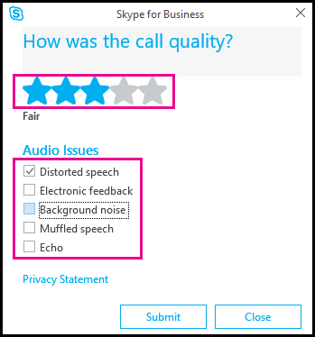

# Optimizing your network for Skype for Business Online

The following requirements are really important to ensure the long-term health and success for all Skype for Business Online features you are setting up for your organization. We know some of you are very technical - this document is for you, but there are some of you that aren't. If you need help setting up Skype for Business Online, you should read this document to become familiar with the things you need to consider. It will also give you things to talk about when you are working with the [Microsoft FastTrack Center](https://fasttrack.microsoft.com/office), your Microsoft Services and account teams, or with [Microsoft partners](https://partnercenter.microsoft.com/en-us/pcv/search) to figure out how you can meet these requirements.
  
## A quick overview

Skype for Business lets you connect with co-workers or business partners in your company or around the world.
  
With Skype for Business, you can:
  
- Start conversations with IM, voice, or video calls.
    
- See when your contacts are available online, in a meeting, or presenting.
    
- Set industrial-strength security for meetings.
    
- Broadcast online to a large audience.
    
- Present your screen during meetings or give control to others.
    
- Use Skype for Business in other Office programs to chat, call, or join a meeting with a click.
    
## Why is this all so important?

The quality of real-time media (audio, video, and application sharing) over IP is greatly impacted by the quality of end-to-end network connectivity. For optimal Skype for Business Online media quality, it is important for you to make sure there is a high-quality connection between your company network and Skype for Business Online. The best way to accomplish this is to set up your internal network and cloud connectivity based on the capacity of your network to accommodate for peak traffic volume for Skype for Business Online across all connections.
  
Working with a [Microsoft partner](https://partnercenter.microsoft.com/en-us/pcv/search), you can connect a variety of Office 365 applications including Skype for Business Online in the cloud to your network and real-time voice and video communications capabilities for Skype for Business require network services must be specifically configured to support these Office 365 real-time workloads. This includes a network that has sufficient bandwidth to carry the required volume of traffic and be capable of supporting Quality of Service (QoS) to deliver a business class experience for your users.
  
Along with the information here, there are other resources that can help you successfully plan and deploy Skype for Business Online services and features and to ensure that your network services meet those requirements:
  
- [Call flow using ExpressRoute](call-flow-using-expressroute.md)
    
- [ExpressRoute and QoS in Skype for Business Online](expressroute-and-qos-in-skype-for-business-online.md)
    
- [Media Quality and Network Connectivity Performance in Skype for Business Online](media-quality-and-network-connectivity-performance.md)
    
## Implement Quality of Service (QoS) for Skype for Business

Before moving to Skype for Business Online, you should take a look at your network's capacity to handle audio, video and sharing session traffic. As with other Office 365 services, Microsoft has available for download the [Skype for Business Bandwidth Calculator](https://www.microsoft.com/en-us/download/details.aspx?id=19011) that's used to determine the required network traffic for each of your company sites. You should perform usage modeling, including modeling real-time communication traffic media flows and the amount of Skype for Business traffic per company location, calculating traffic volume, and analyzing how that traffic impacts your overall network. After you've done that, analysis of this data should provide recommendations of where your network needs to be improved and recommend queue sizes in order to provide an excellent end user experience.
  
Skype for Business real-time traffic is sensitive to packet loss, delay and jitter, which occur frequently in congested networks. Quality of Service (QoS) - sometimes called Class of Service - must also be deployed on managed external WANs, managed internal LANs, and enterprise-based WiFi networks. This will help to properly prioritize Skype for Business real-time traffic such as audio and video over other non-real time traffic on local networks and over WAN, creating a better experience for end users.
  
Skype for Business audio must be deployed in the EF (Expedited Forwarding - DSCP 46) queue and Skype for Business video must be deployed in the AF41 (Assured Forwarding - DSCP 34) queue. This is true even for peer-to-peer and conferencing traffic, regardless of whether Phone System in Office 365 or other telephony features are being deployed.
  
While existing QoS policies might be in place already on the LAN and WAN for other IP telephony products, Skype for Business allows users to be mobile and to move from location to location while using the service. Because of this, QoS policies must be marked on the LAN, WAN and wireless networks in order to be sure that all Skype for Business traffic is being prioritized across managed networks.
  
To help you will sizing your network, download the [Skype for Business Bandwidth Calculator](https://www.microsoft.com/en-us/download/details.aspx?id=19011).
  
For more about media quality and QoS, see [Media Quality and Network Connectivity Performance in Skype for Business Online](media-quality-and-network-connectivity-performance.md).
  
For more about setting up and managing QoS, see [Managing Quality of Service](https://technet.microsoft.com/en-us/library/gg425841.aspx).
  
## Bypass proxies and WAN optimization devices

All Office 365 including Skype for Business Online is encrypted and is typically not able to be inspected by proxy devices. For these reasons we recommend bypassing proxy devices for all Office 365 network traffic as defined as connections your users make to [Office 365 URLs and IP address ranges](https://support.office.com/article/8548a211-3fe7-47cb-abb1-355ea5aa88a2). Since proxy devices will likely introduce delay in real-time Skype for Business Online media streams we strongly recommend bypassing proxy devices at a minimum for that traffic.
  
Microsoft recommends excluding Office 365 URLs using PAC files to send Office 365 traffic to a firewall.
  
Here are some available resources that can help too:
  
- [Office 365 performance tuning using baselines and performance history](https://support.office.com/article/1492cb94-bd62-43e6-b8d0-2a61ed88ebae)
    
- [Network and migration planning for Office 365](https://support.office.com/article/f5ee6c33-bcd7-4b0b-b0f8-dc1d9fb8d132)
    
- [Office 365 Proxy Pac generator](https://gallery.technet.microsoft.com/Office-365-Proxy-Pac-60fb28f7)
    
- [Using WAN Optimization Controller or Traffic/Inspection devices with Office 365](https://aka.ms/kb2690045)
    
- [Routing with ExpressRoute for Office 365](https://support.office.com/article/e1da26c6-2d39-4379-af6f-4da213218408)
    
## Bypass double encryption

To provide users the best possible audio and video experience, you must implement a solution that prevents Skype for Business media (audio and video) from traversing a Virtual Private Network (VPN) tunnel. All Skype for Business traffic is encrypted with Transport Layer Security (TLS) and the media workloads are encrypted with Secure Real Time Protocol (SRTP). Signaling is encrypted with TLS and the media workloads are encrypted with SRTP. Sending this traffic over the VPN tunnel adds an extra layer of encryption, and additional network hops between the client and Office 365, both of which can result in a degraded session because it increases jitter, packet loss and latency.
  
One option to prevent Skype for Business traffic from traversing the VPN tunnel is Split Tunneling. To implement split-tunneling, customers should consult with their VPN vendor on the specifics of how to do this in their software.
  
> [!NOTE]
> This is only required for the Skype for Business media workloads and isn't applicable to other Office 365 services. 
  
Additional resources:
  
- [Enabling Lync Media to Bypass a VPN Tunnel](https://blogs.technet.microsoft.com/nexthop/2011/11/14/enabling-lync-media-to-bypass-a-vpn-tunnel/)
    
- [More on Direct Access, Split Tunneling and Force Tunneling](https://blogs.technet.com/b/tomshinder/archive/2010/03/30/more-on-directaccess-split-tunneling-and-force-tunneling.aspx)
    
- [Enable Direct Access](https://technet.microsoft.com/en-us/library/jj574163.aspx)
    
## Ensure the right ports and protocols are open

Customers must ensure reachability of the URLs and IP addresses that are required for the O365 service. For a complete listing of all IP addresses and URLs for Skype for Business Online, see [Office 365 URLs and IP address ranges](https://support.office.com/article/8548a211-3fe7-47cb-abb1-355ea5aa88a2).
  
Skype for Business clients use a variety of ports and protocols. The direction and flow of network traffic for a Skype for Business session will vary depending on the type of interactions (peer-to-peer vs multiparty) and depending on the use of content sharing and voice/video. You must review and open the list of ports and protocols, paying special attention to the source and destination ports. For example, audio traffic uses just 20 ports (50000-50019 TCP/UDP) at the client side, but the destination port could be anywhere in a 10K port range (50000-59999 TCP/UDP) at the service side. This also includes opening TCP 443 and UDP 3478 on the firewall.
  
Additional network configuration might also be required to support Skype for Business Online.
  
  
## Use Phones and Devices Optimized for Skype for Business

In a real-time media session, media devices that are used by all participants such as headsets and web cams have a great impact on the overall audio and video quality. Lower-quality devices or devices with incorrect device drivers will produce lower overall sound quality for audio and lower image quality for video. Certified devices or good quality devices, on the other hand, help with echo cancellation, noise filtering, video resolution and reduce latency.
  
Phones and devices make a huge difference in the quality of audio and video for end users. The Skype for Business certification program is an evolution of the "Lync Compatible" program and validates that the device meets Microsoft standards for audio and video. There are a number of IP Phones, USB audio and video devices, PCs and meeting room devices that have been tested and qualified by Microsoft. You should review the list of devices that are optimized for Skype for Business, and work to provide different devices in order to meet the various needs and personal preferences of your end users in your organization.
  
See the following for more information on supported and certified devices:  
  
- [Getting phones for Skype for Business Online](../what-is-phone-system-in-office-365/getting-phones-for-skype-for-business-online/getting-phones-for-skype-for-business-online.md)
    
- [Phones and Devices for Skype for Business](https://technet.microsoft.com/en-us/office/dn947482.aspx)
    
- [Solutions Catalog for Personal Peripherals](http://partnersolutions.skypeforbusiness.com/solutionscatalog/personal-peripherals-pcs)
    
- [Phones and devices qualified for Microsoft Lync](https://technet.microsoft.com/en-us/office/dn788944.aspx)
    
The environment and surrounding area where users are meeting and using audio and video devices is another big factor for audio and video quality. Users calling from a noisy environment will have echoed, muffled and unclear audio. Users in a dark or low light environment won't be able to produce bright, clear image quality for video. In a conference room setting, the location of the microphone and video device have a direct impact on the sound and image quality that participants will receive.
  
To get a clearer picture of a user's audio and video experience use the Skype for Business app **Tools** > **Options** > **Audio Device** or **Video Device** to make changes to the device in use and customize it's settings. You can also check the audio quality of a call by clicking **Check Call Quality**. If they click **Check Call Quality**, they can then report the quality and issues found with the test call.
  

  
## Related topics 

[ExpressRoute and QoS in Skype for Business Online](expressroute-and-qos-in-skype-for-business-online.md)
  
  
 
