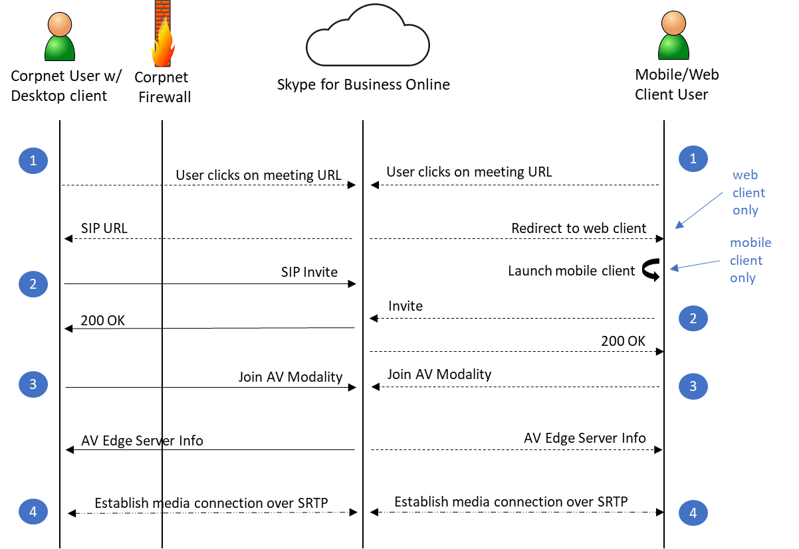

# Security and Skype for Business Online

Skype for Business Online (SfBO), as part of the Office 365 service, follows all the security best practices and procedures such as service-level security through defense-in-depth, customer controls within the service, security hardening and operational best practices. For full details, please see the Microsoft Trust Center (https://microsoft.com/trustcenter).

## Trustworthy by Design
Skype for Business Online is designed and developed in compliance with the Microsoft Trustworthy Computing Security Development Lifecycle (SDL), which is described at https://www.microsoft.com/en-us/sdl/default.aspx. The first step in creating a more secure unified communications system was to design threat models and test each feature as it was designed. Multiple security-related improvements were built into the coding process and practices. Build-time tools detect buffer overruns and other potential security threats before the code is checked in to the final product. Of course, it is impossible to design against all unknown security threats. No system can guarantee complete security. However, because product development embraced secure design principles from the start, Skype for Business Online incorporates industry standard security technologies as a fundamental part of its architecture. 

## Trustworthy by Default
Network communications in Skype for Business Online are encrypted by default. By requiring all servers to use certificates and by using OAUTH, TLS, Secure Real-Time Transport Protocol (SRTP), and other industry-standard encryption techniques, including 256-bit Advanced Encryption Standard (AES) encryption, all Skype for Business Online data is protected on the network.

## How SfBO Handles Common Security Threats
This section identifies the more common threats to the security of the SfBO Service and how Microsoft mitigates each threat.

### Compromised-Key Attack
A key is a secret code or number that is used to encrypt, decrypt, or validate secret information. There are two sensitive keys in use in public key infrastructure (PKI) that must be considered: the private key that each certificate holder has and the session key that is used after a successful identification and session key exchange by the communicating partners. A compromised-key attack occurs when the attacker determines the private key or the session key. When the attacker is successful in determining the key, the attacker can use the key to decrypt encrypted data without the knowledge of the sender.

Skype for Business Online uses the PKI features in the Windows Server operating system to protect the key data used for encryption for the Transport Layer Security (TLS) connections. The keys used for media encryptions are exchanged over TLS connections. 

### Network Denial-of-Service Attack
The denial-of-service attack occurs when the attacker prevents normal network use and function by valid users. By using a denial-of-service attack, the attacker can:
- Send invalid data to applications and services running in the attacked network to disrupt their normal function.
- Send a large amount of traffic, overloading the system until it stops responding or responds slowly to legitimate requests.
- Hide the evidence of the attacks.
- Prevent users from accessing network resources.

SfBO mitigates against these attacks by running Azure DDOS network protection and by throttling client requests from the same endpoints, subnets, and federated entities.

### Eavesdropping
Eavesdropping can occur when an attacker gains access to the data path in a network and has the ability to monitor and read the traffic. This is also called sniffing or snooping. If the traffic is in plain text, the attacker can read the traffic when the attacker gains access to the path. An example is an attack performed by controlling a router on the data path. 

SfBO uses mutual TLS (MTLS) for server communications within O365 and TLS from clients to the service, rendering this attack very difficult to impossible to achieve within the time period in which a given conversation could be attacked. TLS authenticates all parties and encrypts all traffic. This does not prevent eavesdropping, but the attacker cannot read the traffic unless the encryption is broken.

The TURN protocol is used for real time media purposes. The TURN protocol does not mandate the traffic to be encrypted and the information that it is sending is protected by message integrity. Although it is open to eavesdropping, the information it is sending (that is, IP addresses and port) can be extracted directly by simply looking at the source and destination addresses of the packets. The SfBO service ensures that the data is valid by checking the Message Integrity of the message using the key derived from a few items including a TURN password, which is never sent in clear text. SRTP is used for media traffic and is also encrypted.

### Identity Spoofing (IP Address Spoofing)
Spoofing occurs when the attacker determines and uses an IP address of a network, computer, or network component without being authorized to do so. A successful attack allows the attacker to operate as if the attacker is the entity normally identified by the IP address. Within the context of Microsoft Lync Server 2010, this situation comes into play only if an administrator has done both of the following:
- Configured connections that support only Transmission Control Protocol (TCP) (which is not recommended, because TCP communications are unencrypted).
- Marked the IP addresses of those connections as trusted hosts. 

This is less of a problem for Transport Layer Security (TLS) connections, as TLS authenticates all parties and encrypts all traffic. Using TLS prevents an attacker from performing IP address spoofing on a specific connection (for example, mutual TLS connections). But an attacker could still spoof the address of the DNS server that SfBO uses. However, because authentication in SfBO is performed with certificates, an attacker would not have a valid certificate required to spoof one of the parties in the communication.

### Man-in-the-Middle Attack
A man-in-the-middle attack occurs when an attacker reroutes communication between two users through the attacker’s computer without the knowledge of the two communicating users. The attacker can monitor and read the traffic before sending it on to the intended recipient. Each user in the communication unknowingly sends traffic to and receives traffic from the attacker, all while thinking they are communicating only with the intended user. This can happen if an attacker can modify Active Directory Domain Services to add his or her server as a trusted server or modify Domain Name System (DNS) to get clients to connect through the attacker on their way to the server. 

A man-in-the-middle attack can also occur with media traffic between two clients, except that in SfBO point-to-point audio, video, and application sharing streams are encrypted with SRTP, using cryptographic keys that are negotiated between the peers using Session Initiation Protocol (SIP) over TLS. 

### RTP Replay Attack
A replay attack occurs when a valid media transmission between two parties is intercepted and retransmitted for malicious purposes. SfBO uses SRTP in conjunction with a secure signaling protocol that protects transmissions from replay attacks by enabling the receiver to maintain an index of already received RTP packets and compare each new packet with those already listed in the index.

### Spim
Spim is unsolicited commercial instant messages or presence subscription requests. While not by itself a compromise of the network, it is annoying in the least, can reduce resource availability and production, and can possibly lead to a compromise of the network. An example of this is users spimming each other by sending requests. Users can block each other to prevent this, but with federation, if a coordinated spim attack is established, this can be difficult to overcome unless you disable federation for the partner.

### Viruses and Worms
A virus is a unit of code whose purpose is to reproduce additional, similar code units. To work, a virus needs a host, such as a file, email, or program. Like a virus, a worm is a unit of code that is coded to reproduce additional, similar code units, but that unlike a virus does not need a host. Viruses and worms primarily show up during file transfers between clients or when URLs are sent from other users. If a virus is on your computer, it can, for example, use your identity and send instant messages on your behalf. Standard client security best practices such as periodically scanning for viruses can mitigate this issue. 

## Personally Identifiable Information
SfBO has the potential to disclose information over a public network that might be able to be linked to an individual. The information types can be broken down to two specific categories:
- **Enhanced presence data**&nbsp;&nbsp;&nbsp;Enhanced presence data is information that a user can choose to share or not share over a link to a federated partner or with contacts within an organization. This data is not shared with users on a public IM network. Client policies and other client configuration may put some control with the system administrator. In the SfBO service, enhanced presence privacy mode can be configured for an individual user to prevent SfBO users not on the user’s Contacts list from seeing the user’s presence information. 
- **Mandatory data**&nbsp;&nbsp;&nbsp;Mandatory data is data that is required for the proper operation of the server or the client. This is information that is necessary at a server or network level for the purposes of routing, state maintenance, and signaling.
The following tables list the data that is required for SfBO to operate.

***Table 1 - Enhanced Presence Data***

<!--start table here -->

|                      |                                                                                            |   |
|:---------------------|:-------------------------------------------------------------------------------------------|:--|
| **Data**             | **Possible** **settings**                                                                  |   |
| Personal Data        | Name, Title, Company, Email address, Time zone                                             |   |
| Telephone Numbers    | Work, Mobile, Home                                                                         |   |
| Calendar Information | Free/Busy, Out-of-town notice, meeting details (to those who have access to your calendar) |   |
| Presence Status      | Away, Available, Busy, Do Not Disturb, Offline                                             |   |
|                      |                                                                                            |   |

<!-- end of table -->

***Table 2 - Mandatory Data***

<!--start table here -->

|              |                                                                 |   |
|:-------------|:----------------------------------------------------------------|:--|
| **Category** | **Possible settings**                                           |   |
| IP Address   | Actual address of computer or NATed address                     |   |
| SIP URI      | <u>david.campbell@contoso.com</u>                               |   |
| Name         | David Campbell (as defined in Active Directory Domain Services) |   |
|              |                                                                 |   |

<!-- end of table -->

## Security Framework for SfBO
This section provides an overview of the fundamental elements that form the security framework for Microsoft SfBO. 
These elements are as follows:
- Azure Active Directory (AAD) provides a single trusted back-end repository for user accounts. 
- Public key infrastructure (PKI) uses certificates issued by trusted certification authorities (CAs) to authenticate servers and ensure data integrity.
- Transport Layer Security (TLS), HTTPS over SSL (HTTPS), and mutual TLS (MTLS) enable endpoint authentication and IM encryption. Point-to-point audio, video, and application sharing streams are encrypted and integrity checked using Secure Real-Time Transport Protocol (SRTP).
- Industry-standard protocols for user authentication, where possible.

The topics in this section describe how each of these fundamental elements works to enhance the security of the SfBO service.

### Azure Active Directory
Azure Active Directory functions as the directory service for O365. It stores all user directory information and policy assignments. 

### Public Key Infrastructure for SfBO
SfBO service relies on certificates for server authentication and to establish a chain of trust between clients and servers and among the different server roles. The Windows Server public key infrastructure (PKI) provides the infrastructure for establishing and validating this chain of trust.
Certificates are digital IDs. They identify a server by name and specify its properties. To ensure that the information on a certificate is valid, the certificate must be issued by a Certificate Authority (CA) that is trusted by clients or other servers that connect to the server. If the server connects only with other clients and servers on a private network, the CA can be an enterprise CA. If the server interacts with entities outside the private network, a public CA might be required.

Even if the information on the certificate is valid, there must be some way to verify that the server presenting the certificate is actually the one represented by the certificate. This is where the Windows PKI comes in.
Each certificate is linked to a public key. The server named on the certificate holds a corresponding private key that only it knows. A connecting client or server uses the public key to encrypt a random piece of information and sends it to the server. If the server decrypts the information and returns it as plain text, the connecting entity can be sure that the server holds the private key to the certificate and therefore is the server named on the certificate.

#### CRL Distribution Points
SfBO requires all server certificates to contain one or more Certificate Revocation List (CRL) distribution points. CRL distribution points (CDPs) are locations from which CRLs can be downloaded for purposes of verifying that the certificate has not been revoked since the time it was issued and the certificate is still within the validity period. A CRL distribution point is noted in the properties of the certificate as a URL and is secure HTTP. The SfBO service checks CRL with every certificate authentication.

#### Enhanced Key Usage
All components of the SfBO service require all server certificates to support Enhanced Key Usage (EKU) for the purpose of server authentication. Configuring the EKU field for server authentication means that the certificate is valid for the purpose of authenticating servers. This EKU is essential for MTLS. 

### TLS and MTLS for SfBO
TLS and MTLS protocols provide encrypted communications and endpoint authentication on the Internet. SfBO uses these two protocols to create the network of trusted servers and to ensure that all communications over that network are encrypted. All SIP communications between servers occur over MTLS. SIP communications from client to server occur over TLS.

TLS enables users, through their client software, to authenticate the SfBO servers to which they connect. On a TLS connection, the client requests a valid certificate from the server. To be valid, the certificate must have been issued by a CA that is also trusted by the client and the DNS name of the server must match the DNS name on the certificate. If the certificate is valid, the client uses the public key in the certificate to encrypt the symmetric encryption keys to be used for the communication, so only the original owner of the certificate can use its private key to decrypt the contents of the communication. The resulting connection is trusted and from that point is not challenged by other trusted servers or clients. Within this context, Secure Sockets Layer (SSL) as used with Web services can be associated as TLS-based.

Server-to-server connections rely on mutual TLS (MTLS) for mutual authentication. On an MTLS connection, the server originating a message and the server receiving it exchange certificates from a mutually trusted CA. The certificates prove the identity of each server to the other. In the SfBO service, this procedure is followed.

TLS and MTLS help prevent both eavesdropping and man-in-the middle attacks. In a man-in-the-middle attack, the attacker reroutes communications between two network entities through the attacker’s computer without the knowledge of either party. TLS and SfBO’s specification of trusted servers mitigate the risk of a man-in-the middle attack partially on the application layer by using end-to-end encryption coordinated using the Public Key cryptography between the two endpoints, and an attacker would have to have a valid and trusted certificate with the corresponding private key and issued to the name of the service to which the client is communicating to decrypt the communication. 

### Encryption for SfBO
SfBO uses TLS and MTLS to encrypt instant messages. All server-to-server traffic requires MTLS, regardless of whether the traffic is confined to the internal network or crosses the internal network perimeter.

The following table summarizes the protocol used by SfBO.

***Table 3 - Traffic Protection***

<!--start table here with header -->

|||
|:-----|:-----|
|**Traffic type**|**Protected by**|
|Server-to-server|MTLS|
|Client-to-server|TLS|
|Instant messaging and presence|TLS (if configured for TLS)|
|Audio and video and desktop sharing of media|SRTP|
|Desktop sharing (signaling)|TLS|
|Web conferencing|TLS|
|Meeting content download, address book download, distribution group expansion|HTTPS|
|||

<!-- end of table -->

#### Media Encryption
Media traffic is encrypted using Secure RTP (SRTP), a profile of Real-Time Transport Protocol (RTP) that provides confidentiality, authentication, and replay attack protection to RTP traffic. SRTP uses a session key generated by using a secure random number generator and exchanged using the signaling TLS channel. In addition, media flowing in both directions between the Mediation Server and its internal next hop is also encrypted using SRTP. 

SfBO generates username/passwords for secure access to media relays over TURN. Media relays exchange the username/password over a TLS-secured SIP channel.

#### FIPS
SfBO uses FIPS (Federal Information Processing Standard) compliant algorithms for encryption key exchanges. 

### User and Client Authentication 
A trusted user is one whose credentials have been authenticated by AAD in O365. 

Authentication is the provision of user credentials to a trusted server or service. SfBO uses the following authentication protocols, depending on the status and location of the user.
- **Modern Authentication** is the Microsoft implementation of OAUTH 2.0 for client to server communication. It enables security features such as O365 Certificate Based Authentication, O365 Multi-Factor Authentication and O365 Conditional Access. In order to use MA, both the online tenant and the clients need to be enabled for MA. SfBO tenants created after May 2017 have MA enabled by default. For tenants created before this time, follow the instructions here to turn it on. The following clients all support MA: Skype for Business 2015 or 2016 client, Skype for Business on Mac, Lync 2013 client, 3PIP IP Phones, iOS, and Android. 
- **Org ID** is used when Modern Authentication is not enabled (or not available).
- **Digest protocol** for so-called anonymous users. Anonymous users are outside users who do not have recognized Active Directory credentials but who have been invited to an on-premises conference and possess a valid conference key. Digest authentication is not used for other client interactions.

SfBO authentication consists of two phases:
1. A security association is established between the client and the server.
2. The client and server use the existing security association to sign messages that they send and to verify the messages they receive. Unauthenticated messages from a client are not accepted when authentication is enabled on the server.

User trust is attached to each message that originates from a user, not to the user identity itself. The server checks each message for valid user credentials. If the user credentials are valid, the message is unchallenged not only by the first server to receive it but by all other servers in SfBO.

Users with valid credentials issued by a federated partner are trusted but optionally prevented by additional constraints from enjoying the full range of privileges accorded to internal users.

For media authentication, the ICE and TURN protocols also use the Digest challenge as described in the IETF TURN RFC. For details, see [media traversal](#external-user-av-traffic-traversal).

Client certificates provide an alternate way for users to be authenticated by SfBO. Instead of providing a user name and password, users have a certificate and the private key corresponding to the certificate that is required to resolve a cryptographic challenge. 

### Windows PowerShell and SfBO Management Tools
In SfBO, IT Admins can manage their service via the O365 Admin portal or by using Tenant Remote PowerShell (TRPS). Tenant admins use Modern Authentication to authenticate to TRPS.

### Configuring Access to SfBO at your Internet Boundary
For SfBO to function properly (users able to join meetings etc.), customers need to configure their internet access such that outbound UDP and TCP traffic to services in the SfBO cloud is allowed. For more details, see here: https://support.office.com/en-us/article/Office-365-URLs-and-IP-address-ranges-8548a211-3fe7-47cb-abb1-355ea5aa88a2#bkmk_lyo 

### UDP 3478-3481 and TCP 443

The UDP 3478-3481 and TCP 443 ports are used by clients to request service from the A/V Edge service. A client uses these two ports to allocate UDP and TCP ports respectively for the remote party to connect to. To access the A/V Edge service, the client must first have established an authenticated SIP signaling session with SfBO registrar to obtain A/V Edge service authentication credentials. These values are sent across the TLS-protected signaling channel and are computer generated to mitigate against dictionary attacks. Clients can then use these credentials for digest authentication with the A/V Edge service to allocate ports for use in a media session. An initial allocate request is sent from the client and responded with a 401 nonce/challenge message from the A/V Edge service. The client sends a second allocate containing the user name and a Hash Message Authentication Code (HMAC) hash of the user name and nonce. 

A sequence number mechanism is also in place to prevent replay attacks. The server calculates the expected HMAC based on its own knowledge of the user name and password and if the HMAC values match, the allocate procedure is carried out. Otherwise, the packet is dropped. This same HMAC mechanism is also applied to subsequent messages within this call session. The lifetime of this user name/password value is a maximum of eight hours at which time the client reacquires a new user name/password for subsequent calls.

### UDP/TCP 50,000–59,999
TCP 50,000 outbound is used for SfBO, including for application and desktop sharing, file transfer. UDP/TCP 50,000-59,999 port ranges are used for media sessions with Microsoft Office Communications Server 2007 partners that require NAT/firewall traversal service from the A/V Edge service. Because the A/V Edge service is the sole process using these ports, the size of the port range does not indicate the potential surface of attack. Good security practice is to always minimize the total number of listening ports by not running unnecessary network services. If a network service is not running, it is not exploitable by a remote attacker and the surface of attack of the host computer is reduced. However, within a single service, reducing the number of ports does not provide the same benefit. The A/V Edge service software is no more exposed to attack with 10,000 ports open as it is with 10. The allocation of ports within this range is done randomly and ports not currently allocated do not listen for packets.

### External User A/V Traffic Traversal
Enabling external users and internal users to exchange media requires an Access Edge service to handle the SIP signaling that is necessary to set up and tear down a session. It also requires an A/V Edge service to act as a relay for the transfer of the media. The call sequence is illustrated in the following figure.

 

1. A user receives an email containing an invitation to join an SfBO meeting. The email contains a conference key and a HTTP-based URL linking to the conference. Both the key and the URL are unique for a particular meeting.
The user initiates the join procedure by clicking the meeting URL in the email which initiates a client detection process on the user’s machine. If the client is detected, this client is launched. If it is not detected, the user is redirected to the web client.

2. The SfBO client sends a SIP INVITE containing the user’s credentials. A federated or remote user joins a conference using their enterprise credentials. For a federated user, the SIP INVITE is first sent to his or her home server, which authenticates the user and forwards the INVITE to SfBO. An anonymous user is required to pass digest authentication.
SfBO authenticates the remote or anonymous user and notifies the client. As mentioned in step 2, federated users joining a conference are authenticated by their enterprise.

3. The client sends an INFO request to add the user to the A/V conference.

    The A/V conferences sends an Add User response that contains the token to present to the A/V Conferencing Edge service among other information.

    [Note]
    All the preceding SIP traffic flowed through the Access Edge service.

    The client connects to the A/V Conference Server, which validates the token and proxies the request, which contains another authorization token, to the internal A/V Conferencing Server. The A/V Conferencing Server validates the Authorization Token, which it originally issued over the SIP channel, to further ensure that a valid user is joining the conference.

4. Between the client and the A/V Conferencing Server, a media connection is negotiated and setup over SRTP.
5. A user receives an email containing an invitation to join an SfBO meeting. The email contains a conference key and a HTTP-based URL linking to the conference. Both the key and the URL are unique for a particular meeting.

### Federation Safeguards for SfBO
Federation provides your organization with the ability to communicate with other organizations to share IM and presence. In SfBO federation is on by default. However, tenant admins have the ability to control this via the O365 Admin portal. See more.

## Addressing Threats to SfBO Conferences

SfBO provides the capability for enterprise users to create and join real-time Web conferences. Enterprise users can also invite external users who do not have an AAD/O365 account to participate in these meetings. Users who are employed by federated partners with a secure and authenticated identity can also join meetings and, if promoted to do so, can act as presenters. Anonymous users cannot create or join a meeting as a presenter, but they can be promoted to presenter after they join.

Enabling external users to participate in SfBO meetings greatly increases the value of this feature, but it also entails some security risks. To address these risks, SfBO provides the following additional safeguards:
- Participant roles determine conference control privileges.
- Participant types allow you to limit access to specific meetings.
- Defined meeting types determine which types of participants can attend.
- Conference scheduling is restricted to users who have an AAD account and an SfBO license.
- Anonymous, that is, unauthenticated, users who want to join a dial-in conference dial one of the conference access numbers and then they are prompted to enter the conference ID. Unauthenticated anonymous users are also prompted to record their name. The recorded name identifies unauthenticated users in the conference. Anonymous users are not admitted to the conference until at least one leader or authenticated user has joined, and they cannot be assigned a predefined role.

### Participant Roles
Meeting participants fall into three groups, each with its own privileges and restrictions:
- **Organizer** &nbsp;&nbsp;The user who creates a meeting, whether impromptu or by scheduling. An organizer must be an authenticated enterprise user and has control over all end-user aspects of a meeting.
- **Presenter** &nbsp;&nbsp;A user who is authorized to present information at a meeting, using whatever media is supported. A meeting organizer is by definition also a presenter and determines who else can be a presenter. An organizer can make this determination when a meeting is scheduled or while the meeting is under way.
- **Attendee** &nbsp;&nbsp;A user who has been invited to attend a meeting but who is not authorized to act as a presenter.

A presenter can also promote an attendee to the role of presenter during the meeting.

### Participant Types

Meeting participants are also categorized by location and credentials. You can use both of these characteristics to specify which users can have access to specific meetings. Users can be divided broadly into the following categories:
1.  **Users that belong to the tenant** &nbsp;&nbsp;These users have a credential in Azure Active Directory for the tenant. 
    a. *Inside corpnet* – These users are joining from inside the corporate network. b. *Remote users* – These users are joining from outside the corporate network. They can include employees who are working at home or on the road, and others, such as employees of trusted vendors, who have been granted enterprise credentials for their terms of service. Remote users can create and join conferences and act as presenters.
2.  **Users that do not belong to the tenant**&nbsp;&nbsp;These users do not have credentials in Azure Active Directory for the tenant. a. *Federated Users* - Federated users possess valid credentials with federated partners and are therefore treated as authenticated by SfBO. Federated users can join conferences and be promoted to presenters after they have joined the meeting, but they cannot create conferences in enterprises with which they are federated. b. *Anonymous Users* - Anonymous users do not have an Active Directory identity and are not federated with the tenant. 

Customer data shows that many conferences involve external users. Those same customers also want reassurance about the identity of external users before allowing those users to join a conference. As the following section describes, SfBO limits meeting access to those user types that have been explicitly allowed and requires all user types to present appropriate credentials when entering a meeting.

### Participant Admittance
In SfBO, anonymous users are transferred to a waiting area called the lobby. Presenters can then either admit these users to the meeting or reject them. These users are transferred to the lobby, the leader is notified, and the users then wait until a leader either accepts or rejects them or their connection times out. While in the lobby, the users hear music. 

By default, participants dialing in from the PSTN go directly to the meeting, but this option can be changed to force dial-in participants to go to the lobby.  
Meeting organizers control whether participants can join a meeting without waiting in the lobby. Each meeting can be set up to enable access using any one of the following methods:
- **Only me, the meeting organizer**&nbsp;&nbsp;Everyone except the organizer must wait in the lobby until admitted.
- **People I invite from my company**&nbsp;&nbsp;Anyone from your company can get in to the meeting directly, even if not invited.
- **Anyone from my organization**&nbsp;&nbsp;All SfBO users in the O365 tenant can join the meeting without waiting in the lobby, even if those who are not on the distribution list. All others, including all external and anonymous users, must wait in the lobby until admitted.
- **Anyone**&nbsp;&nbsp;Anyone (there are no restrictions) who has access to the meeting link gets in to the meeting directly.
When any method except Organizer only (locked) is specified, the meeting organizer can also specify People dialing in by phone bypass the lobby. 

### Presenter Capabilities
Meeting organizers control whether participants can present during a meeting. Each meeting can be set up to limit presenters to any one of the following:
- **Organizer only**&nbsp;&nbsp;Only the meeting organizer can present.
- **People from my company**&nbsp;&nbsp;All internal users can present.
- **Everyone including people outside my company**&nbsp;&nbsp;Everyone (there are no restrictions) who joins the meeting can present.
- **People I choose**&nbsp;&nbsp;The meeting organizer specifies which users can present by adding them to a list of presenters.

## Related topics
[Microsoft Trust Center](https://microsoft.com/trustcenter)

