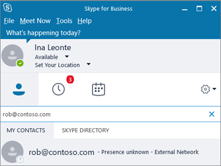
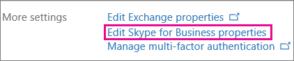
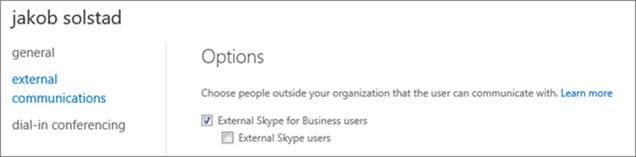

# Allow users to contact external Skype for Business users

> [!NOTE]
> Skype for Business federation isn't available to Office 365 operated by 21Vianet and Office 365 Germany organizations. 
  
Use the steps in this article when:
  
- You have users on different domains in your business. For example, Rob@ContosoEast.com and Ann@ContosoWest.com.
    
- You want the people in your organization to use Skype for Business to contact people in specific businesses outside of your organization.
    
- You want anyone else in the world who uses Skype for Business to be able to find and contact you, using your email address. If you and they use the default Skype for Business settings, this will work automatically. If they don't, then they need to make sure their configuration isn't blocking your domain.
    
## Enable business-to-business communications for your users

You must have [admin permissions](https://support.office.com/en-us/article/da585eea-f576-4f55-a1e0-87090b6aaa9d) in Office 365 in both organizations to do this.

 **Using the Skype for Business admin center**
  
1. Sign in with your Office 365 admin account. 
    
2. In the Office 365 admin center, go to **Admin Centers** > **Skype for Business**.
    
    
  
3. In the **Skype for Business admin center**, choose **Organization** > **External communications**.
    
4. To set up communication with a specific business or with users in another domain, in the drop-down box, choose **On only for allowed domains**.
    
    OR, if you want to enable communication with everyone else in the world who has open Skype for Business policies, choose **On except for blocked domains**. This is the default setting.
    
5. Under **Blocked or allowed domains**, choose **+** and add the name of the domain you want to allow.
    
6. Make sure the admin in the other organization does these same steps in their **Skype for Business admin center**. For example, in their **allowed domains** list, their admin needs to enter the domain for your business.
    
7. If you're using Windows Firewall, Skype for Business opens the required ports automatically.
    
    If your organization is using a different firewall solution to restrict computers on your network from connecting to the Internet, ensure your client computers are able to access the following [Office 365 URLs and IP address ranges](https://docs.microsoft.com/microsoftteams/office-365-urls-ip-address-ranges). This may require adding the FQDNs to the outbound allow list in your firewall or proxy infrastructure configuration: **\*.api.skype.com**, \***.users.storage.live.com**, and **graph.skype.com**. For instructions on how to open these ports in your firewall, check the documentation that came with it.
    
    For a list of all ports you need to open, see [Office 365 URLs and IP address ranges](https://docs.microsoft.com/microsoftteams/office-365-urls-ip-address-ranges).

8. Make sure that the administrator in the organization has also followed these steps.
    
9. **WAIT UP TO 24 HOURS TO TEST**. Any time you change the external communications settings, it can take up to 24 hours for the changes to populate across all the data centers.
    
 You can allow your users to search for and IM with everyone who uses Skype, the free consumer app! To learn more, see [Let Skype for Business users add Skype contacts](let-skype-for-business-users-add-skype-contacts.md).
  
## Test and troubleshoot

 **The most common issue people encounter when setting up business-to-business communication is getting their [Office 365 URLs and IP address ranges](https://docs.microsoft.com/microsoftteams/office-365-urls-ip-address-ranges) right.**
  
To test your setup, you need a contact on Skype for Business who's not behind your company firewall.
  
1. After you change your external communications settings, **WAIT UP TO 24 HOURS TO TEST**.
    
2. In Skype for Business, search for your contact in Skype for Business, and send a request to chat.
    
    If you get a message that it couldn't be sent due to company policy, you need to double-check your [Office 365 URLs and IP address ranges](https://docs.microsoft.com/microsoftteams/office-365-urls-ip-address-ranges).
    
3. Ask your Skype for Business contact to send you a request to chat. If you don't receive their request, the problem is your firewall settings (assuming they've already confirmed their firewall settings are correct).
    
4. Another way to test whether the problem is your firewall is to go to a wifi location not behind your firewall such as a coffee shop, and use Skype for Business to send a request to your contact to chat. If the message goes through there, but not when you're at work, then you know the problem is your firewall.
    
## How to find others, and be found, when connecting with another business

After you enable external communication with other Skype for Business users, your users can find federated Skype for Business users by searching for their sign-in name: for example, Rob@contoso.com. Then they will need to add the person to their list of contacts.
  

  
## Tips on setting up communications with federated businesses

- To configure federation between Skype for Business 2015 and Skype for Business Online, see this  article: [Configure federation with Skype for Business Online](https://technet.microsoft.com/en-us/library/jj205126.aspx).
    
- To configure federation between Lync and Skype for Business Online, see this  article: [Configuring Federation Support for a Lync Online Customer](https://technet.microsoft.com/en-us/library/hh202193.aspx).
    
- When two Skype for Business users in Office 365 are communicating with each other on separate domains, they can only use Skype for Business features (for example, video conversations or desktop sharing) that are turned on in both organizations.
    
- If a Skype for Business user in your organization is put on an In-Place or Litigation Hold, any IM conversations between that user and other Skype for Business or Skype users will be saved in **Recoverable Items** in their mailbox. These conversations aren't saved in the **Conversations History** folder in their mailbox.
    
## Turn off external communication for specific individuals

After you enable external communication for your entire business, you can turn it off for only specific individuals.
  
1. Sign in with your Office 365 admin account.
    
2. In the Office 365 admin center, go to **Users** > **Active users**.
    
3. In the list of users, choose the user, and then, under **More Settings**, click **Edit Skype for Business properties**.
    
    
  
4. In the **Skype for Business admin center**, choose **External communications**.
    
    On the **Options** page, all of the choices will be selected. Clear the communications you want to disable. The following image shows that Jakob will be able to communicate with people in other trusted businesses, but not with other Skype users.
    
    
  
5. Choose **Save**.
    
> [!NOTE]
> You may have to wait for up to 24 hours for your changes to take effect. 
  

[!INCLUDE [LinkedIn Learning Info](../../common/office/linkedin-learning-info.md)]
   
   
## Related topics

[Set up Skype for Business Online](set-up-skype-for-business-online.md)
  
[Let Skype for Business users add Skype contacts](let-skype-for-business-users-add-skype-contacts.md)
  
  
 
