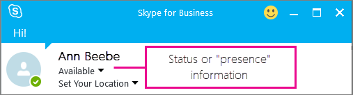

# Configure presence in Skype for Business Online

By default, anyone who can communicate with one of the people in your organization using Skype for Business can also see whether that person is online. Skype for Business shows whether a person is available online, in a meeting, offline, or another indicator.

As the **[admin](https://support.office.com/article/eac4d046-1afd-4f1a-85fc-8219c79e1504)** for everyone in your business, you can choose who sees their online presence in Skype for Business.

 **Using the Skype for Business admin center**

1. Go to **Office 365 admin center** > **Admin centers** > **Skype for Business**.

2. In the **Skype for Business admin center**, choose **organization**.

3. Under **presence privacy mode**, select one of the following settings, and then choose **Save**.

|**Setting**|**Who can view a user's presence**|
|:-----|:-----|
|**Automatically display presence information**   |Any Skype for Business user in your business who has not been added to a person's **External** or **Blocked** list will be able to see that person's online presence.   |
|**Display presence information only to a user's contacts**   |Anyone in a person's Contacts list who they have not added to their **External** or **Blocked** list.   Individuals can override your default settings in their Skype for Business app: **Settings** > **Tools** > **Options**.   |

For information about what your users can change in Skype for Business, see these articles:

- [Control access to your presence information in Skype for Business](https://support.office.com/en-us/article/fea86e34-60cf-4dd0-bfb2-169a42afd92c)

- [Set Status options in Skype for Business](https://support.office.com/en-us/article/efd25395-c8ef-4510-b9cb-6f70e2fff8a0)

## Related topics

[Set up Skype for Business Online](set-up-skype-for-business-online.md)

[Let Skype for Business users add Skype contacts](let-skype-for-business-users-add-skype-contacts.md)

