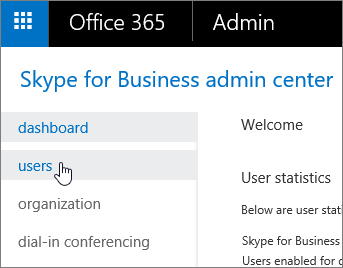

# Admins: Configure Skype for Business settings for individual users

This article explains how admins configure Skype for Business for a small number of users. To do these steps in bulk, we've included links to the Windows PowerShell cmdlets you can use.
  
To allow (or block) everyone in your business to communicate with external people, see:
  
- [Allow users to contact external Skype for Business users](allow-users-to-contact-external-skype-for-business-users.md): You can let your organization use advanced Skype for Business features (share desktops, look for who's online, etc.) to communicate with people in a specific trusted (federated) business. The article also explains how to block communication with specific domains.
    
- [Let Skype for Business users add Skype contacts](let-skype-for-business-users-add-skype-contacts.md). You can let your organization use Skype for Business to search for and IM people who use Skype, the free app.
    
## Configure general settings for one user

You must have [admin permissions](https://support.office.com/en-us/article/da585eea-f576-4f55-a1e0-87090b6aaa9d) to perform these steps.

 **Using the Skype for Business admin center**
  
1. Sign in to Office 365 with your work or school account.
    
2. Choose **Admin centers** > **Skype for Business**.
    
3. Choose **Users**.
    
    
  
4. Choose which users you want to edit.
    
5. In the right panel, choose **Edit**.
    
    
  
6. On the **General** options page, select or clear the check box next to the features you want to change, and then choose **Save**.
    
|**Option**|**Details**|
|:-----|:-----|
|Audio and HD video    |Allow this person to record audio meetings, audio and video meetings, or don't allow them to schedule any meetings (none).    |
|Record conversations and meetings    |Choose what this person is allowed to record.    This option is not available with Skype for Business Basic.    |
|For compliance, turn off non-archived features    | Choose this option if you're legally required to preserve electronically stored information.    Selecting this option turns off features that aren't captured when you have an [In-Place Hold](https://technet.microsoft.com/en-us/library/ff637980%28v=exchg.150%29.aspx) set up in the Exchange admin center. It turns off the following features:    File transfer using instant messaging    Shared OneNote pages    PowerPoint annotations   |
   
To configure these settings in bulk, use PowerShell. See [Set up your computer for Windows PowerShell](../set-up-your-computer-for-windows-powershell/set-up-your-computer-for-windows-powershell.md).
  
## Block external communications

After you [Let Skype for Business users add Skype contacts](let-skype-for-business-users-add-skype-contacts.md) for everyone in your company, you can selectively block external communications for specific individuals using these steps.
  
1. Choose **Users**, select the users whose settings you want to disable, and then choose **Edit** .
    
2. Choose **External communications**, and then clear the options as appropriate:
    
   - **External Skype for Business users**: Clear this box if you don't want the user to be able to communicate with Skype for Business users in federated domains.
    
   - **External Skype users**: Clear this box if you don't want the user to be able to communicate with people who are using the freeSkype app.
    
3. Click **Save**.
    
To configure these settings in bulk, use PowerShell. See [Set up your computer for Windows PowerShell](../set-up-your-computer-for-windows-powershell/set-up-your-computer-for-windows-powershell.md).
  
## Edit audio conferencing settings for one user

1. Choose **Users**, select the user whose audio conferencing settings you wan to edit, ,and then choose **Edit** .
    
2. Choose **Audio conferencing**, select your audio conferencing provider, type or change the requested information, and then click **Save**.
    
|**Audio conferencing setting**|**Description**|
|:-----|:-----|
|**Provider name**   |Choose your provider from the list.    |
|**Toll number** (required)   |For a third-party ACP, these phone numbers are the ones you received from the audio conferencing provider. If the user is using Microsoft as the audio conferencing provider, these will be numbers that are set on the audio conferencing bridge. Format the numbers as you want them to appear in Skype for Business and Microsoft Teams meeting requests.    |
|**Toll-free number**   |For a third-party ACP, these phone numbers are the ones you received from the audio conferencing provider. If the user is using Microsoft as the audio conferencing provider, these will be numbers that are set on the audio conferencing bridge. Format the numbers as you want them to appear in Skype for Business and Microsoft Teams meeting requests.    |
|**Conference ID and PIN** (required)   |The participant PIN, or conference code, used to join meetings that are scheduled by this user and are provided from a third-party audio conferencing provider. If the user is using Microsoft as the audio conferencing provider, this won't be required.    |
   
To configure these settings in bulk, use PowerShell. See [Set the phone numbers included on invites](../audio-conferencing-in-office-365/set-the-phone-numbers-included-on-invites.md) [Set up your computer for Windows PowerShell](../set-up-your-computer-for-windows-powershell/set-up-your-computer-for-windows-powershell.md).

[!INCLUDE [LinkedIn Learning Info](../../common/office/linkedin-learning-info.md)]
  
   
## Related topics 

[Set up Skype for Business Online](set-up-skype-for-business-online.md)

[Skype for Business and Microsoft Teams add-on licensing](../skype-for-business-and-microsoft-teams-add-on-licensing/skype-for-business-and-microsoft-teams-add-on-licensing.md)
  
  
 
