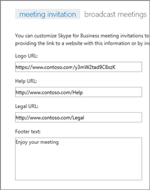
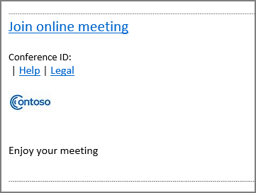

# Customize meeting invitations

As an admin, you can ensure that all Skype for Business meeting invitations include some helpful information your users might need, such as links to your support website and legal disclaimer, your company logo, and other text you want to include. 
  
## Tips for creating a logo for meeting invitations

1. Create an image that is no more than 188 pixels wide by 30 pixels tall (it's quite small).
    
2. Save the image in JPG format.
    
3. Store the image in a central location that everyone in your business can access, such as a network share, shared OneDrive for Business folder, Dropbox, etc.
    
    Now you can add it to your meeting invitations. See the next steps.
    
## Customize your meeting invitations

 **Using the Skype for Business admin center**

1. Sign in to Office 365 with your work or school account.
    
2. From the Office 365 admin center, choose **Admin centers** > **Skype for Business**.
    
3. In the Skype for Business admin center, choose **online meetings**. 
    
4. Complete the following boxes:
    
     

   **Logo URL:** Enter the URL where your logo is stored. Remember that it must be in JPG format! 
 
   **Help URL:** If your organization has a support website you want people to go to if they have problems, enter the URL here. 

   **Legal URL:** If your organization has a legal website you want people to go to if they have legal concerns, enter the URL here.
    
   **Footer text:** Enter a text-only footnote that will be appropriate for your users.  
  
   
5. Choose **Save**.
    
6. Wait an hour or so for the changes to get populated across all Office 365 services. Then go to Outlook and schedule a Skype meeting to see what your changes look like. 
    
    
  
## Related topics

[Try or purchase Audio Conferencing in Office 365](../audio-conferencing-in-office-365/try-or-purchase-audio-conferencing-in-office-365.md)

  
 
