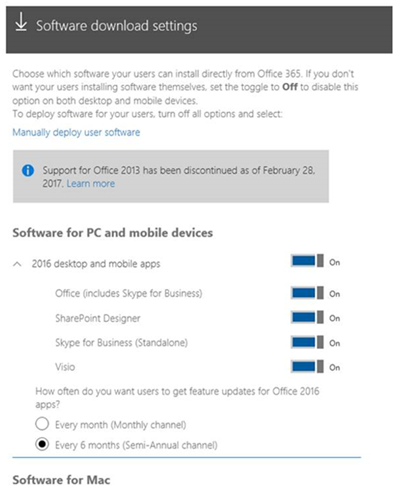
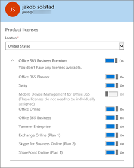

# Deploy the Skype for Business client in Office 365

This article explains options for how you, the **[admin](https://support.office.com/en-us/article/eac4d046-1afd-4f1a-85fc-8219c79e1504?ui=en-US&rs=en-US&ad=US)**, can deploy the Skype for Business app to the people in your organization.
  
Before you deploy Skype for Business to your users, make sure you've done steps 1-3 in the article [Set up Skype for Business Online](set-up-skype-for-business-online.md). This way, Skype for Business will be set up with your domain, everyone will have their licenses, and you will have configured IM and [Configure presence in Skype for Business Online](configure-presence-in-skype-for-business-online.md) for your organization.
  
> [!NOTE]
> For users to install the Skype for Business app, they need to be local admins on their PC or device. Or they will need to be part of a local group that can install apps on their PC or devices. If your users aren't allowed to install software on their devices, you'll need to install the Skype for Business app for them. 
  
## For most small and medium-sized businesses

 **Step-by-step installation instructions:** If you have a small or medium-sized business, we recommend that you simply ask your users to install the Skype for Business app on their PC. Point them to these instructions: [Install Skype for Business](https://support.office.com/en-us/article/8a0d4da8-9d58-44f9-9759-5c8f340cb3fb?ui=en-US&rs=en-US&ad=US). If they are using Macs, point them to [Set up Lync for Mac 2011 for Office 365](https://support.office.com/en-us/article/ae3ebd0e-a1a7-48cf-9350-36b144dc5f88?ui=en-US&rs=en-US&ad=US). The Skype for Business app is installed separately from the rest of the Office apps.
  
 **Office 365 ProPlus customers:** If your business is using an Office 365 plan that includes Office 365 ProPlus, such as the E3 plan, the Skype for Business app is installed at the same time your users download and install Word, Excel, PowerPoint, etc. This also means they can't uninstall Skype for Business unless they uninstall all of Office.
  
### Choose whether to make Skype for Business available to your users

As the [admin](https://support.office.com/en-us/article/eac4d046-1afd-4f1a-85fc-8219c79e1504?ui=en-US&rs=en-US&ad=US) you can choose whether to make the Skype for Business app available to your users.
  
- **To control whether everyone in your company gets the software**: Sign in to the Microsoft 365 admin center, go to **Install my software**, and then select the software you want to be available for users.
    
    
  
- **To control whether specific people in your company get the software**: Sign in to the Microsoft 365 admin center, go to **Users** > **Active users**, select the person who you want to give access to the software, and then click **Edit** next to **Product licenses** and turn the license on or off.
    
    
  
> [!NOTE]
> If you need to see what plans are assigned to people in your organization, sign in to the Microsoft 365 admin center > **Users** > **Active users**. Select the person from the list then look under **Product licenses**. If you are using the classic admin center, look under **Assigned license**. 
  
### Manually deploying Skype for Business to your users

If you want your users to install the Skype for Business app from a location on your network instead of from the Internet, you can download the setup files. To do this go to the **Manually deploy user software** section of the Microsoft 365 admin center. You can then select **Install** and save the setup .exe file to a network location.
  
Another option is to download the Skype for Business Basic app for your users. You can download [Microsoft Skype for Business Basic (32 or 64 Bit)](https://www.microsoft.com/en-us/download/details.aspx?id=49440).
  
For both the full and basic Skype for Business apps, after you have downloaded the setup files, you will need to manually send (for example, in email) the network path to the users so they can run the setup program to install the app on their computer.
  
You can also use these downloads to deploy the Skype for Business app to your users by using your existing software deployment tools and processes.
  
## For larger and enterprise organizations

> [!NOTE]
> This section only applies to the Skype for Business app available through Office 365 plans. If your organization is using a volume licensed version of the Skype for Business app, which is Windows Installer-based (MSI), see [Customize client installation in Skype for Business Server 2015](https://technet.microsoft.com/en-us/library/jj204934.aspx). 
  
In many enterprises or large organizations, users aren't allowed to install software on their computers. Instead, the IT departments deploy the necessary software to the users' computers. IT departments also might want to control the amount of Internet or network bandwidth used in their organization, so they want to install software from a nearby location on their network instead of from across the Internet or across the corporate network.
  
With Office 365, you have several options for deploying the Skype for Business app if you want to control where it's installed from. Some of those options include the following:
  
- Download the Skype for Business app to your local network from the Microsoft 365 admin center, as described in [Manually deploying Skype for Business to your users](deploy-the-skype-for-business-client-in-office-365.md#bkmk_manual_1).
    
- Use the **[Office Deployment Tool](https://go.microsoft.com/fwlink/p/?LinkID=626065)** to download either Office 365 ProPlus or the Skype for Business app to your local network. Then, use the Office Deployment Tool to deploy the app to your users. The Office Deployment Tool gives you the ability to control certain aspects of the deployment, such as languages and version (32-bit or 64-bit).
    
- Use your existing software deployment tools and processes, such as System Center Configuration Manager, to deploy Office 365 ProPlus or the Skype for Business app to your users. You can use your existing tools and processes with the [Office Deployment Tool](https://go.microsoft.com/fwlink/p/?LinkID=626065) or with the software that you've downloaded from the Microsoft 365 admin center.
    
### More info on using the Office Deployment Tool

For details on downloading the Office Deployment Tool and more information on installing the Skype for Business app and other Office 365 client apps, see [Manage user software in Office 365](https://support.office.com/en-us/article/c13051e6-f75c-4737-bc0d-7685dcedf360).
  
Here's an overview of the steps involved in using the Office Deployment Tool to deploy an app:
  
1. **[Download the newest Office Deployment Tool](https://www.microsoft.com/en-us/download/details.aspx?id=49117)** from the Microsoft Download Center.
    
2. Create the configuration.xml file to be used with the Office Deployment Tool that has the client app settings you want, such as setting the version (32-bit or 64-bit), the installation language, etc.
    
3. Use the Office Deployment Tool and the configuration.xml file to download the setup files to your local or internal network from the Office Content Delivery Network (CDN).
    
4. Use Office Deployment Tool and the configuration.xml to install the Office client apps, including the Skype for Business app.
    
For details on using the Office Deployment Tool and configuration.xml file, see the following articles:
  
- [Office Deployment Tool overview](https://technet.microsoft.com/library/jj219422.aspx)
    
- [Configuration.xml settings](https://technet.microsoft.com/library/jj219426.aspx)
    
### More info on using System Center Configuration Manager

You can use your existing software deployment tools and processes, such as System Center Configuration Manager, to deploy the Skype for Business app. You can use these tools and processes with either the software that you download from the Microsoft 365 admin center or with the Office Deployment Tool.
  
For more information about using Configuration Manager to deploy software, see the following articles:
  
- [How to Create Applications in Configuration Manager](https://technet.microsoft.com/en-us/library/gg682159.aspx)
    
- [How to Deploy Applications in Configuration Manager](https://technet.microsoft.com/en-us/library/gg682082.aspx)
    
If you're deploying the Skype for Business app as part of deploying Office 365 ProPlus, see [Deploy Office 365 ProPlus by using the System Center Configuration Manager](https://technet.microsoft.com/en-us/library/dn708063.aspx).
  
## Planning for updates to the Skype for Business app

As part of deploying the Skype for Business app, you need to consider how you want to get updates after Skype for Business is installed. These updates can include new features, security updates, or non-security updates, such as updates that provide stability or performance improvements. The two primary things you need to consider are :
  
- Where do you want to get updates from
    
- How often do you want to get feature updates
    
While you can control where you get updates from and how often you get feature updates, you can't choose which specific security updates or non-security updates you get.
  
 **Where to get updates from**
  
By default, after the Skype for Business app is installed, updates will be automatically downloaded from the Internet when they are available from Microsoft. If you want more control over when updates occur or where the updates are installed from, you can use the Office Deployment Tool or Group Policy to configure that.
  
For example, many organizations want to test updates with a group of users before deploying them throughout the organization. You can do this by using the Office Deployment Tool or Group Policy to configure the Skype for Business app to get updates from a specific location on your network, instead of automatically from the Internet. Then, you can use the Office Deployment Tool to download the updates every month to your local network.
  
For more information about how updates work for Office 365 software, see these articles:
  
- [Overview of the update process for Office 365 ProPlus](https://technet.microsoft.com/en-us/library/dn761709.aspx)
    
- [Choose how to manage updates to Office 365 ProPlus](https://technet.microsoft.com/en-us/library/dn761707.aspx)
    
- [Configure update settings for Office 365 ProPlus](https://technet.microsoft.com/en-us/library/dn761708.aspx)
    
  **How often to get feature updates**
  
In addition to where you get updates from, you can also control how often you get new features for the Skype for Business client. The two choices are the following:
  
- Get feature updates every month, if there are new features
    
- Get features updates every six months
    
For some organizations, they want time to test new features, so they want to get feature updates only twice a year instead of every month.
  
You can control how often you get feature updates by using the Office Deployment Tool or Group Policy to configure the update channel. The Monthly Channel gives you feature updates monthly (approximately), while the Semi-Annual Channel gives you feature updates every six months. For more information about channels, see [Overview of update channels for Office 365 ProPlus](https://support.office.com/article/9ccf0f13-28ff-4975-9bd2-7e4ea2fefef4).
  
## Related topics

[Set up Skype for Business Online](set-up-skype-for-business-online.md)
  
[Skype for Business and Microsoft Teams add-on licensing](../skype-for-business-and-microsoft-teams-add-on-licensing/skype-for-business-and-microsoft-teams-add-on-licensing.md)
  
  
 
