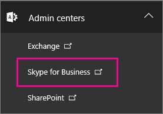
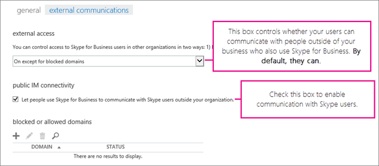
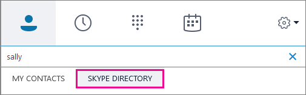

# Let Skype for Business users add Skype contacts

With Skype for Business, your users can search for and IM with everyone who uses Skype, the free app! This article explains what you need to do so they can add Skype contacts. 
  
You must have [admin permissions](https://support.office.com/en-us/article/da585eea-f576-4f55-a1e0-87090b6aaa9d?ui=en-US&rs=en-US&ad=US) in Office 365 to do this.

 **Using the Skype for Business admin center**
  
1. Sign in with your Office 365 admin account at [https://portal.office.com/adminportal/home](https://portal.office.com/adminportal/home#/homepage).
    
2. In the Office 365 admin center, go to **Admin Centers** > **Skype for Business**. 
    
    
  
3. In the **Skype for Business admin center**, choose **Organization** > **External communications**. 
    
4. By default, your users can communicate with all other people in the world who use Skype for Business (assuming your firewall has been configured to allow this). 
    
    
  
    If you want your users to chat with Skype users, BUT you don't want them to chat with others who use Skype for Business, choose **On only for allowed domains**. When you enable contact with Skype users, skype.com is automatically added as an allowed domain behind the scenes. 
    
    If you want to allow contact from all other businesses in the world using Skype for Business, except specific ones, choose **On except for blocked domains**, and choose **+** to add those domains. Everyone will be able to contact you except people on those specific domains. (Some businesses might choose this option, for example, if they are in litigation and need to ensure there's no contact with the other business.)
    
5. Choose **Let people use Skype for Business to communicate with Skype users outside your organization**. 
    
6.  If you're using Windows Firewall, Skype for Business opens the required ports automatically.
    
    If your organization uses another solution to restrict computers on your network from connecting to the Internet, ensure client computers are able to access all of the [IP addresses and URLs](https://support.office.com/en-us/article/8548a211-3fe7-47cb-abb1-355ea5aa88a2) for Skype connectivity and Skype Directory Search. This may require adding them to the outbound allow list in your firewall or proxy infrastructure configuration.
    
7. **WAIT UP TO 24 HOURS TO TEST**. Any time you change the external communications settings, it can take up to 24 hours for the changes to populate across all the data centers.
    
8. Show your users how to find and add Skype contacts to their list of Skype for Business contacts. Point them to [Search for people in Skype for Business](https://support.office.com/en-us/article/b12500ef-e37f-4d22-aade-c11277e53f19).
    
## Test and troubleshoot

To test your setup, you need a contact on Skype who's not behind your company firewall. They can be signed in to Skype using a Gmail account, Outlook.com account, or other type of email account.
  
1. After you change your external communications settings, **WAIT UP TO 24 HOURS TO TEST**.
    
2. Sign out of Skype for Business and then sign in again so you see the option to search the Skype Directory. 
    
    
  
3. In Skype for Business, search for your contact in Skype, and send a request to chat. 
    
    If you get the message it couldn't be sent due to company policy, you need to double-check your [firewall settings](https://support.office.com/en-us/article/8548a211-3fe7-47cb-abb1-355ea5aa88a2). 
    
4. Another way to test whether the problem is your firewall is to go to a wifi location not behind your firewall such as a coffee shop, and use Skype for Business to send a request to your Skype contact to chat. 
    
   - **If you sent your Skype contact a request and they never received it**, ask them to send you a request to chat. If the problem was establishing a connection between Skype and Skype for Business, that often solves it.
    
   - Now if the message goes through at the coffee shop but not when you're at work, then you know the problem is your firewall. 
    
## What you can and can't do

- **Skype for Business on Mac** doesn't have the ability to search for and communicate with Skype contacts.
    
- When directory search is enabled, you can search for and find Skype and Skype for Business users. If for some reason you can't find them by searching the directory, you can send them a contact request, and then have them sign in to Skype and accept it, so you can IM with them. 
    
- It's not possible to allow IM connectivity with other IM providers such as Google or Facebook. You can't use Skype for Business to send cell phone text messages.

- It is not possible to record audio or video calls between a Skype Contact and Skype for Business contact.
    
## What features are available when adding Skype contacts?

Skype contacts who signed in with their Microsoft account (formerly Windows Live ID) can get some, but not all, features when they are talking to your Skype for Business users.
  
|**Available with Skype contacts**|**Not available with Skype contacts**|
|:-----|:-----|
| Video conversations    Person-to-person instant messaging    Presence   | Multi-party IM conversations    Audio and video conversations with three or more people    Desktop and program sharing   |
   
[!INCLUDE [LinkedIn Learning Info](../../common/office/linkedin-learning-info.md)]
   
## Related topics

[Allow users to contact external Skype for Business users](allow-users-to-contact-external-skype-for-business-users.md)
  
[Set up Skype for Business Online](set-up-skype-for-business-online.md)

  
 
