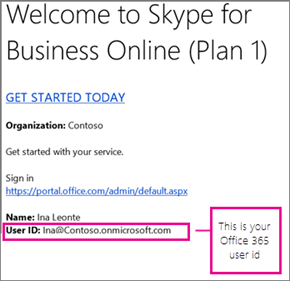
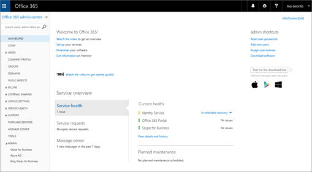

# Set up Skype for Business Online

You must have Office 365 global admin permissions to set up Skype for Business. If you have a firewall or proxy server that restricts access to parts of the web, consider hiring a [Microsoft partner](https://go.microsoft.com/fwlink/?linkid=391089) to set up Skype for Business for you.

## Setting up Skype

Looks like you need help setting up Skype with your Office 365 subscription. You can follow the steps in this article to get your setup completed.

## 1. Plan for Skype for Business

If you have **[Office 365 Business Premium](https://products.office.com/en-us/business/office-365-business-premium)** or **Business Essentials**, you can use Skype for Business to make online calls to other people in your business who are on your subscription. For example, if your business has 10 people, you'll be able to [Start using Skype for Business for IM and online meetings](https://support.office.com/article/cc05afa6-1894-4a82-9dd9-6222061f50fd) each other, and [Meetings with Skype for Business](https://support.office.com/article/2eed8424-581a-4497-b505-c08c152e5851) using Skype for Business after performing the steps 2-6 below. And you can [Set up a Skype for Business meeting in Outlook](https://support.office.com/article/b8305620-d16e-4667-989d-4a977aad6556#bkmk_OWA) to online meetings, too!

If you want to use Skype for Business to make and receive **calls** from people *external*  to your business:

- **Option 1. Use the free [Skype app](https://www.skype.com/)**. If you have a very small business (for example, 1-2 people), using the Skype app is the better way to go. It's less expensive to use for domestic and international calls. You can still hold conference calls, make video calls, and share your desktop for presentations. [Check out the rates and payment options](https://secure.skype.com/en/calling-rates?wt.mc_id=legacy&amp;expo365=bundled).

- **Option 2. Upgrade your plan, and buy the Phone System and a Calling Plan for Office 365**. The easiest way to find out how much this costs, and then make the switch, is to [Contact support for business products - Admin Help](https://support.office.com/article/32a17ca7-6fa0-4870-8a8d-e25ba4ccfd4b) and have them do everything for you.

To learn more, see [Plan your setup of Office 365 for business](https://support.office.com/article/eb926624-018b-4486-bf11-5fba6ee4d645#bkmk_skype).

## 2. Sign in to Office 365

Skype for Business Online is part of the Office 365 suite of services. To set up Skype for Business Online, you need to sign in to Office 365. Here's how you do that:

1. Locate your Office 365 user ID (for example,  <em>rob@fourthcoffee.com</em>  ). You received an email from the Microsoft Online Services Team that contains the Office 365 user ID that you created when you purchased Skype for Business Online. The mail looks something like this:

    

2. Sign in to the admin center and enter your Office 365 user ID and password. After you sign in, you'll see the Microsoft 365 admin center:

    

## 3. Set up your domain and users

Now that you're signed in to Office 365, you can set up your domain and people in your organization to use Skype for Business Online.

1. [Add a domain and users to Office 365](https://support.office.com/article/6383f56d-3d09-4dcb-9b41-b5f5a5efd611): Use the Office 365 setup wizard to set up your custom domain (such as *fourthcoffee.com*) with Office 365. **By default, the Office 365 setup wizard includes setting up Skype for Business Online and creating your Skype for Business user IDs.** If you already used the wizard to set up your domain for Office 365, then you've completed this step.

2. [Check your domain and DNS connections](https://support.office.com/article/2b54e1b0-47a7-4018-a1e4-c2b924e7c5a0): Use our tool - the domains troubleshooter - to check that your domain and DNS settings are correct. Doing this now will go a long way to helping figure out any setup issues later since you'll be able to eliminate DNS settings as the source of future issues.

3. [Office 365 URLs and IP address ranges](https://support.office.com/article/8548a211-3fe7-47cb-abb1-355ea5aa88a2#BKMK_LYO): Most small businesses don't need to do this step. **But if you have a firewall or proxy server that restricts access to parts of the web**, you must create rules to allow access to the Skype for Business Online endpoints. This is an advanced step best performed by someone experienced with configuring firewalls and proxy servers. If you haven't done this before, consider hiring a [Microsoft partner](https://go.microsoft.com/fwlink/?linkid=391089) to set up Skype for Business for you.

## 4. Set up IM and presence in your organization

Instant Messaging (IM) and presence ([Control access to your presence information in Skype for Business](https://support.office.com/article/fea86e34-60cf-4dd0-bfb2-169a42afd92c)) are basic features included with Skype for Business. By default, the people in your business can Skype and IM with each other.

1. **Choose who else your Skype for Business users can communicate with:**

   - [Allow users to contact external Skype for Business users](allow-users-to-contact-external-skype-for-business-users.md) Both you *and*  the other business will need to configure your systems.

     **IMPORTANT**: If you have two domains in your business, such as rob@contosowest.com and ina@contosoeast.com, you need to do this step so all of your users can communicate with each other.

   - [Let Skype for Business users add Skype contacts](let-skype-for-business-users-add-skype-contacts.md) outside your business

2. **Choose who sees whether co-workers are online:** The presence feature shows who's online and what their availability is, such as available, busy, away, or presenting.

    

    You can choose the default settings for everyone in your business:

   - Automatically display a person's online presence to everyone in the organization

   - Display a person's online presence only to their contacts

For instructions, see [Configure presence in Skype for Business Online](configure-presence-in-skype-for-business-online.md).

## 5. Download and install Skype for Business

To use Skype for Business on your PC, Mac, or mobile device, you and other people in your business have to first install the Skype for Business download on your devices.

- [Install Skype for Business](https://support.office.com/article/8a0d4da8-9d58-44f9-9759-5c8f340cb3fb): Instructions for how to download the app from the Office 365 portal, and install it on your PC or Mac.

- [Deploy the Skype for Business client in Office 365](deploy-the-skype-for-business-client-in-office-365.md): Instructions for deploying the app in a large enterprise.

- [Install Skype for Business](https://support.office.com/article/8a0d4da8-9d58-44f9-9759-5c8f340cb3fb): Download, install, and sign in to Skype for Business on Android devices, iOS devices, and Windows phones.

- [Turn on or off mobile phone notifications](turn-on-or-off-mobile-phone-notifications.md): When you have Skype for Business installed on a mobile device, you and others in your business can receive alerts about incoming and missed instant messages.

## 6. Test to make sure everything is working

First, test whether you and others in your business can [Video: Sign in and out of Skype for Business](https://support.office.com/article/8abed4b3-ac48-493e-9d76-0e10140e9451). Check that you can IM each other, see each other's presence, and try a quick meeting.

Problems? Do the following:

- [Need help signing in to Skype for Business?](https://support.office.com/article/448b8ea7-5b33-444a-afd4-175fc9930d05) of common sign-in problems.

- [Contact support for business products - Admin Help](https://support.office.com/article/32a17ca7-6fa0-4870-8a8d-e25ba4ccfd4b). We're here to help!

## Do you want to set up other available features?

Before setting up more features, make sure you have licenses for them. [Skype for Business and Microsoft Teams add-on licensing](../skype-for-business-and-microsoft-teams-add-on-licensing/skype-for-business-and-microsoft-teams-add-on-licensing.md)

### Set up Audio Conferencing

Sometimes people in your organization will need to use a phone to call into a meeting. Skype for Business includes the Audio Conferencing feature for just this situation! People can call into Skype for Business meetings using a phone, instead of using the Skype for Business app on a mobile device or PC.

### Set up Phone System and the Calling plans in Office 365

The Phone System feature in Office 365 gives you a phone system for your business. Calls to other Skype for Business people in your organization are free, and your employees can receive voicemail from each other and outside callers. Here's what you get with Phone System.

When you add the Calling Plan service, your employees get a primary phone number in Skype for Business. They can make and receive phone calls outside of your business. They can make voice calls across VoIP phones, PCs, and mobile devices. And, in case of emergencies, they can call 911 for help.

For step-by-step setup instructions, see Set up Calling Plans.

### Set up Skype Meeting Broadcast

Skype Meeting Broadcast is a feature that lets you produce, host, and broadcast meetings with up to 10,000 attendees. **To learn more about how it works, see [What is a Skype Meeting Broadcast?](https://support.office.com/article/c472c76b-21f1-4e4b-ab58-329a6c33757d)**

Here's an overview of the steps to set up Skype Meeting Broadcast:

1. [Assign or remove licenses for Office 365 for business](https://support.office.com/article/997596b5-4173-4627-b915-36abac6786dc): Assign **Skype for Business Online** or **Enterprise Plan** licenses to everyone who is going to **host** a Broadcast meeting.

2. [Enable Skype Meeting Broadcast](../set-up-your-network-for-skype-meeting-broadcast/enable-skype-meeting-broadcast.md): By default, this feature isn't enabled. After you turn it on, your users will be able to host broadcast meetings with other people in your organization.

3. [Set up your network for Skype Meeting Broadcast](../set-up-your-network-for-skype-meeting-broadcast/set-up-your-network-for-skype-meeting-broadcast.md): If you want to host webinars and other broadcasts with attendees outside of your organization, you need to configure your network.

4. [Schedule a Skype Meeting Broadcast](https://support.office.com/article/c3995bc9-4d32-4f75-a004-3bc5c477e553) and have a [Join a Skype Meeting Broadcast](https://support.office.com/article/14689da0-821d-48d4-9035-ea762de80ebe): Make sure broadcast meetings work by scheduling a Skype Meeting Broadcast at  *https://portal.broadcast.skype.com*  and then having someone try to join the meeting.

## Learn about network connectivity requirements

The quality of audio, video, and application sharing in Skype for Business is greatly impacted by the quality of end-to-end network connectivity. For an optimal experience, it is important to make sure there is a high-quality connection between your company network and Skype for Business Online. For network and tuning information, see [Tune Skype for Business Online performance](https://support.office.com/article/beec23c2-c5d6-4e84-a8af-e82aefca7802).

## All done setting up? Getting started using Skype for Business

[Skype for Business training](https://support.office.com/article/8a3491a3-c095-4718-80cf-cbbe4afe4eba): Check out this list of training topics to help you get started quickly!

[Start a Skype for Business conference call](https://support.office.com/article/8dc8ac52-91ac-4db9-8672-11551fdaf997)

[Set Video Device options in Skype for Business](https://support.office.com/article/d09017c0-deba-4f6c-a122-9eca6604f50c)

[Make and receive a video call using Skype for Business](https://support.office.com/article/abf62493-670f-4b0d-b2cf-fe03b49caf42)

[!INCLUDE [LinkedIn Learning Info](../../common/office/linkedin-learning-info.md)]

## Related topics

[Plan hybrid connectivity between Skype for Business Server and Skype for Business Online](https://go.microsoft.com/fwlink/p/?linkid=400791)

