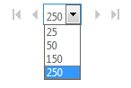

# Skype for Business Online admin center users page limitations

For performance reasons the **Skype for Business admin center**displays the first 1,000 users in your user list. If you have more than 1,000 users, use **Filter** and **Search** to find the specific people you're looking for.
  
## Bulk editing

1. Select the first 1,000 users—or everyone returned by your filter or search—by checking the box next to **Display name** at the top of the list.
    
2. Click **Edit**.
    
You can change the number of users shown on each page with the control at the bottom of the list:
  

  
## Related topics
[Set up Skype for Business Online](set-up-skype-for-business-online.md)

[Let Skype for Business users add Skype contacts](let-skype-for-business-users-add-skype-contacts.md)

  
 
