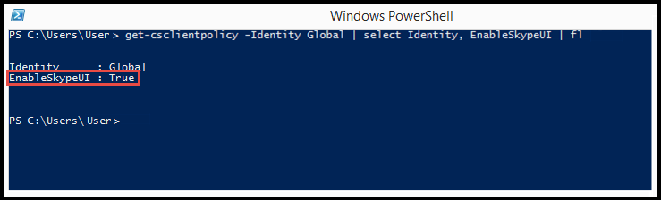
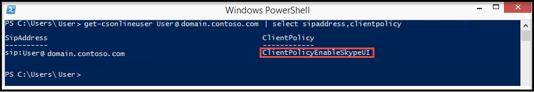
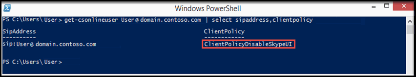

# Switching between the Skype for Business and the Lync client user interfaces

For Skype for Business Online organizations, you can use the Remote PowerShell in Office 365 to enable your Skype for Business users to use the Skype for Business client or the Skype for Business (Lync) client user interface. The default setting is for users to use the Skype for Business client user interface. If you'd prefer to use the Lync client experience, you can manage the first launch client behavior to display the Lync user interface by following the steps later in this topic.
  
> [!NOTE]
> The Lync 2013 client experience isn't an option for Skype for Business 2016 client versions. Before you attempt to configure your client environment to use the Lync 2013 client, please check the client version to ensure it does not start with the number 16; for example: 16.x.x.x. 
  
> [!TIP]
> If you want to easily switch the user interface and don't want to do the manual steps, see the [Microsoft Download Center ](https://go.microsoft.com/fwlink/?LinkId=532431) for a PowerShell script to make it easier.
  
## Switching the Skype for Business user interface for users

The Windows PowerShell module for Skype for Business Online enables you to create a remote Windows PowerShell session that connects to Skype for Business Online. This module, which is supported only on 64-bit computers can be downloaded from the Microsoft Download Center at [Windows PowerShell Module for Skype for Business Online](https://go.microsoft.com/fwlink/?LinkId=294688). For other information, see [Configuring your computer for Skype for Business Online management](https://go.microsoft.com/fwlink/?LinkId=534539).
  
> [!IMPORTANT]
> The  _Global_ policy setting for switching the user interface won't be applied to a user that already has a custom policy applied. To be able to change the user interface, you will need to run the following for each user that has a custom policy applied:
  
```
Grant-CsClientPolicy -PolicyName ClientPolicyEnableSkypeUI -Identity <username>
```

> [!CAUTION]
> The  _ClientPolicyEnableSkypeUI_ policy will replace the existing custom policy setting for the user.
  
To enable all of the users in your organization to use the Skype for Business client, open the Remote PowerShell and type the following:
  
```
Grant-CsClientPolicy -PolicyName ClientPolicyEnableSkypeUI
```

If you set the policy right, you will see:
  

  
To enable all of the users in your organization to use the Skype for Business (Lync) client, open the Remote PowerShell and type the following: 
  
```
Grant-CsClientPolicy -PolicyName ClientPolicyDisableSkypeUI
```

If you set the policy right, you will see:
  

  
To allow a single user in your organization to use the Skype for Business client, open the Remote PowerShell and type the following:
  
```
Grant-CsClientPolicy -PolicyName ClientPolicyEnableSkypeUI -Identity <username>
```

If you set the policy right, you will see:
  

  
To allow a single user in your organization to use the Skype for Business (Lync) client, open the Remote PowerShell and type the following:
  
```
Grant-CsClientPolicy -PolicyName ClientPolicyDisableSkypeUI -Identity <username>
```

If you set the policy right, you will see:
  

  
To allow multiple users in your organization to use the Skype for Business client, open the Remote PowerShell and type the following:
  

```
$users = @("sip:bob@contoso.com","sip:fred@contoso.com") 

$users | Grant-CsClientPolicy -PolicyName ClientPolicyEnableSkypeUI
```

To allow multiple users in your organization to use the Skype for Business (Lync) client, open the Remote PowerShell and type the following:
  
```
$users = @("sip:bob@contoso.com","sip:fred@contoso.com")

$users | Grant-CsClientPolicy -PolicyName ClientPolicyDisableSkypeUI
```

To allow a group of users in your organization to use the Skype for Business client, open the Remote PowerShell and type the following:
  
```
Get-CsOnlineUser -Filter {Department -eq "Sales"} | Grant-CsClientPolicy -PolicyName ClientPolicyEnableSkypeUI
```

To allow a group of users in your organization to use the Skype for Business (Lync) client, open the Remote PowerShell and type the following:
  
```
Get-CsOnlineUser -Filter {Department -eq "Sales"} | Grant-CsClientPolicy -PolicyName ClientPolicyDisableSkypeUI
```

> [!NOTE]
>  The user's name is the name of the user's account that the policy should be assigned to. The user's account name can be entered in one of the following formats:>  SIP address of the user>  User Principal name (UPN) of the user>  Domain\\username of the user>  Active Directory display name of the user
  
[Using Windows PowerShell to manage Lync Online](https://go.microsoft.com/fwlink/?LinkID=525453)
  
## Skype for Business Online policy settings

This table shows the user experience when the policy is first applied to users:
  
|**Admin policy setting**|**User interface displayed**|
|:-----|:-----|
|The policy isn't set. |The user will continue using the Skype for Business client user interface.|
|`Grant-CsClientPolicy -PolicyName ClientPolicyEnableSkypeUI`<br/>|The user will continue using the Skype for Business client user interface.|
|`Grant-CsClientPolicy -PolicyName ClientPolicyDisableSkypeUI`<br/>|The user will be asked to switch to the Skype for Business (Lync) client user interface. They can switch later.|
|`Grant-CsClientPolicy -PolicyName ClientPolicyEnableSkypeUI -Identity <username>`|The user will be using the Skype for Business client user interface. |
`Grant-CsClientPolicy-PolicyName ClientPolicyDisableSkypeUI -Identity <username>`|The user will be asked to switch to the Skype for Business (Lync) client user interface. An admin can change the setting in the future that will switch them to the Skype for Business client user interface. |
   
This table shows the user experience when the policy is changed:
  
|**Admin policy setting**|**Skype for Business (Lync) user interface**|**Skype for Business user interface**|
|:-----|:-----|:-----|
|`Grant-CsClientPolicy -PolicyName ClientPolicyEnableSkypeUI`|The user will be asked to switch to the Skype for Business client user interface.  <br/> |The user will continue to use the Skype for Business client user interface.  <br/> |
|`Grant-CsClientPolicy -PolicyName ClientPolicyDisableSkypeUI`|The user will continue to use the Skype for Business (Lync) interface.  <br/> |The user will be asked to switch to the Skype for Business (Lync) client user interface.  <br/> |
|The policy isn't set.  <br/> |Users will never see the Skype for Business (Lync) client user interface if the policy is not set. They will always use the Skype for Business client user interface.  <br/> |The user will continue to use the Skype for Business client user interface.  <br/> |
   
This table shows all the Online custom policies available. There are new policies created to give admins flexibility in retaining the old custom policy while switching between the EnableSkypeUI flags. Please use the cmdlets from above to grant one of the below policies to your users.
  
|**Policy name**|**EnableSkypeUI**|
|:-----|:-----|
`ClientPolicyDefaultPhoto`||
`ClientPolicyDefaultPhotoDisableSkypeUI` |False|
`ClientPolicyNoIMURL`||
`ClientPolicyNoIMURLDisableSkypeUI` |False|
`ClientPolicyNoIMURLPhoto`||
`ClientPolicyNoIMURLPhotoDisableSkypeUI` |False|
`ClientPolicyNoSaveIMNoArchivingI`||
`ClientPolicyNoSaveIMNoArchivingDisableSkypeUI` |False|
`ClientPolicyNoSaveIMNoArchivingNoIMURL`||
`ClientPolicyNoSaveIMNoArchivingNoIMURLDisableSkypeUI` |False|
`ClientPolicyNoSaveIMNoArchivingNoIMURLPhoto` ||
`ClientPolicyNoSaveIMNoArchivingNoIMURLPhotoDisableSkypeUI`|False|
`ClientPolicyNoSaveIMNoArchivingPhoto`||
`ClientPolicyNoSaveIMNoArchivingPhotoDisableSkypeUI` |False|

   
To get started with Windows PowerShell, see these topics:
  
- [Why you need to use Office 365 PowerShell](https://go.microsoft.com/fwlink/?LinkId=525041)
    
- [Best ways to manage Office 365 with Windows PowerShell](https://go.microsoft.com/fwlink/?LinkId=525142)
    
## First launch client behaviors

By default, when users launch Skype for Business for the first time, they will always see the Skype for Business user interface--even if you have selected the Lync client experience by setting the client policy to the Lync client experience (`Grant-CsClientPolicy -PolicyName ClientPolicyDisableSkypeUI`) as described previously. After several minutes, users will then be asked to switch to Lync mode.
  
If you want to display the Lync user interface when users launch the Skype for Business client for the first time, follow these steps before the client is started for the first time after being updated:
  
1. Follow the steps earlier in this topic and confirm that the client policy is set to disable the Skype for Business user interface.
    
2. Update the system registry on the user's computer. You should do this before the first time users launch the Skype for Business client, and you should do this only once. For information about how to create a Group Policy Object to update the registry on a domain joined computer, see the section later in the topic.
    
    In the **[HKEY_CURRENT_USER\\Software\\Microsoft\\Office\\Lync]** key, create a new **Binary** value.
    
    The **Value name** must be **EnableSkypeUI**, and the **Value data** must be set to **00 00 00 00**.
    
    The key should look like the following:
    
    [HKEY_CURRENT_USER\\Software\\Microsoft\\Office\\Lync]
    
    "CanSharePptInCollab"=dword:00000001
    
    "CanShareOneNoteInCollab"=dword:00000001
    
    "CanAppShareInCollab"=dword:00000001
    
    "EnableSkypeUI"=hex:00,00,00,00
    
The Lync user interface will now be displayed when users launch the Skype for Business client for the first time.
  
### Control the display of the Welcome screen tutorial

When users open the Skype for Business client, the default behavior is to display a Welcome screen that includes *7 Quick tips most people ask for*. You can turn off the display of the Welcome screen but still allow users to access the tutorial by adding the following Registry value on the client computer:
  
In the **[HKEY_CURRENT_USER\\Software\\Microsoft\\Office\\15.0\\Lync]** key, create a new **DWORD (32-bit) Value**. The **Value name** must be **IsBasicTutorialSeenByUser**, and the **Value data** must be set to **1**.
  
The key should look like the following:
  
`"IsBasicTutorialSeenByUser"=dword:00000001`

### Turn off the client tutorial

If you do not want your users to be able to access the tutorial, you can turn off the client tutorial with the following Registry value:
  
In the **[HKEY_CURRENT_USER\\Software\\Microsoft\\Office\\15.0\\Lync]** key, create a new **DWORD (32-bit) Value**. The **Value name** must be **TutorialFeatureEnabled**, and the **Value data** must be set to **0**.
  
```
"TutorialFeatureEnabled"=dword:00000000
```

You can turn the tutorial back on by setting the **Value data** to **1**.
  
## Create a Group Policy Object to modify the registry on a domain joined computer

The registry update to display the Lync client experience the first time a user launches the Skype for Business client should be done only once. If you use a Group Policy Object (GPO) to update the registry, you need to define the object to create a new value rather than update the Value data. When the GPO is applied, if the new value does not exist, the GPO will create it and set the Value data to 0.
  
The following procedure describes how to modify the registry so that the Lync client experience is displayed the first time a user launches the Skype for Business. You can also use this procedure to update the registry to disable the Welcome screen tutorial as described earlier.
  
 **To create the GPO**
  
1. Start the **Group Policy Management console**.
    
    For information about how to use the Group Policy Management Console, see [Group Policy Management Console](https://go.microsoft.com/fwlink/?LinkId=532759).
    
2. Right-click the **Group Policy Objects** node and select **New** on the menu.
    
3. In the **New GPO** dialog, enter a name for the GPO, for example,MakeLyncDefaultUI, and then click **OK**.
    
4. Right-click on the new GPO you just created and then select **Edit** from the menu.
    
5. In the **Group Policy Management Editor**, expand **User Configuration**, expand **Preferences**, expand **Windows Settings**, and then select the **Registry** node.
    
6. Right-click on the **Registry** node, and then select **New** > **Registry Item**.
    
7. On the **New Registry Properties** dialog, update the following:
    
|**Field**|**Value to select or enter**|
|:-----|:-----|
|**Action** <br/> |**Create** <br/> |
|**Hive** <br/> | HKEY_CURRENT_USER <br/> |
|**Key Path** <br/> |Software\\Microsoft\\Office\\Lync  <br/> |
|**Value name** <br/> |EnableSkypeUI  <br/> |
|**Value type** <br/> |REG_BINARY  <br/> |
|**Value data** <br/> |00000000  <br/> |
   
Click **OK** to save your changes, and then close the GPO.
    
Next, you'll need to link the GPO you created to the group of users that you want to assign the policy to, such as an OU.
  
 **To use the GPO to assign the policy**
  
1. In the Group Policy Management Console, right-click on the OU you want to assign the policy to, and then select **Link to an existing GPO**.
    
2. On the **Select GPO** dialog, select the GPO you created, and then select **OK**.
    
3. On the target user's computer, open a command prompt and type the following command:
    
    **gpupdate /target:user**
    
    The message "Updating policy..." is displayed while the GPO is applied. When it is completed, the message "User Policy update has completed successfully" is displayed.
    
4. At the command prompt, type the following command:
    
    **gpresult /r**
    
    You should see "Assigned Group Policy Objects" with the name of the GPO you created displayed below.
    
You can also verify that the GPO has successfully updated the registry on a user's computer by examining the registry. Open Registry Editor and navigate to the **[HKEY_CURRENT_USER\\Software\\Microsoft\\Office\\Lync]** key. If the GPO successfully updated the registry you will see a value named EnableSkypeUI with a value of 0.
  
## Related topics
[Set up Skype for Business Online](set-up-skype-for-business-online.md)

[Let Skype for Business users add Skype contacts](let-skype-for-business-users-add-skype-contacts.md)

  
 
