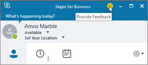
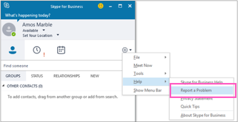
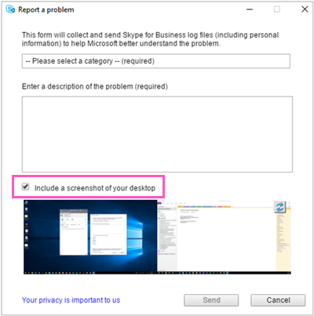

# Turn on or off Skype for Business client feedback reporting

You can enable your Skype for Business Online users to use the built-in Skype for Business app feedback tool to let users report issues and provide feedback directly to Microsoft about their experience. 
  

  
Using this tool, a user can copy the logs from the app on their device to help Microsoft better investigate and troubleshoot problems that they might have. 
  

  
You can also use the  _EnableOnlineFeedbackScreenshot_ setting so users can include a screenshot of their device as a part of their feedback.
  

  
> [!IMPORTANT]
> The logs collected by the app's feedback tool will be stored for up to a maximum of 90 days in the United States while the issue is being investigated. Because of this, please don't enable this feedback tool if this violates your organization's data protection policy. 
  
## Verify and start Windows PowerShell

- **Check that you are running Windows PowerShell version 3.0 or higher**
    
1. To verify that you are running version 3.0 or higher: **Start Menu** > **Windows PowerShell**.
    
2. Check the version by typing  _Get-Host_ in the **Windows PowerShell** window.
    
3. If you don't have version 3.0 or higher, you need to download and install updates to Windows PowerShell. See [Windows Management Framework 4.0](https://go.microsoft.com/fwlink/?LinkId=716845) to download and update Windows PowerShell to version 4.0. Restart your computer when you are prompted.
    
4. You will also need to install the Windows PowerShell module for Skype for Business Online that enables you to create a remote Windows PowerShell session that connects to Skype for Business Online. This module, which is supported only on 64-bit computers, can be downloaded from the Microsoft Download Center at [Windows PowerShell Module for Skype for Business Online](https://go.microsoft.com/fwlink/?LinkId=294688). Restart your computer if you are prompted.
    
If you need to know more, see [Connect to all Office 365 services in a single Windows PowerShell window](https://technet.microsoft.com/EN-US/library/dn568015.aspx).
    
- **Start a Windows PowerShell session**
    
1. From the **Start Menu** > **Windows PowerShell**.
    
2. In the **Windows PowerShell** window, connect to your Office 365 organization by running:
    
    > [!NOTE]
    > You only have to run the **Import-Module** command the first time you use the Skype for Business Online Windows PowerShell module.
 
   ```
    Import-Module "C:\\Program Files\\Common Files\\Skype for Business Online\\Modules\\SkypeOnlineConnector\\SkypeOnlineConnector.psd1"
    $credential = Get-Credential
    $session = New-CsOnlineSession -Credential $credential
    Import-PSSession $session
   ```
   If you want more information about starting Windows PowerShell, see [Connect to all Office 365 services in a single Windows PowerShell window](https://technet.microsoft.com/EN-US/library/dn568015.aspx) or[Set up your computer for Windows PowerShell](../set-up-your-computer-for-windows-powershell/set-up-your-computer-for-windows-powershell.md).
    
## Turn on client app feedback reporting for all the users in your organization

To enable feedback reporting for users in your organization and allow them to submit device screen shots, run:
 
  ```
  Set-CsClientPolicy -Identity EnableOnlineFeedback -EnableOnlineFeedback $true -EnableOnlineFeedbackScreenshots $true
  ```
## Want to know more about Windows PowerShell?
- Windows PowerShell is all about managing users and what users are allowed or not allowed to do. With Windows PowerShell, you can manage Office 365 and Skype for Business Online using a single point of administration that can simplify your daily work, when you have multiple tasks to do. To get started with Windows PowerShell, see these topics:
    
  - [An introduction to Windows PowerShell and Skype for Business Online](https://go.microsoft.com/fwlink/?LinkId=525039)
    
  - [Six Reasons Why You Might Want to Use Windows PowerShell to Manage Office 365](https://go.microsoft.com/fwlink/?LinkId=525041)
    
- Windows PowerShell has many advantages in speed, simplicity, and productivity over only using the Office 365 admin center such as when you are making setting changes for many users at one time. Learn about these advantages in the following topics:
    
  - [Best ways to manage Office 365 with Windows PowerShell](https://go.microsoft.com/fwlink/?LinkId=525142)
    
  - [Using Windows PowerShell to manage Skype for Business Online](https://go.microsoft.com/fwlink/?LinkId=525453)
    
  - [Using Windows PowerShell to do common Skype for Business Online management tasks](https://go.microsoft.com/fwlink/?LinkId=525038)

## Related topics
[Set up Skype for Business Online](set-up-skype-for-business-online.md)

[Let Skype for Business users add Skype contacts](let-skype-for-business-users-add-skype-contacts.md)

  
 
