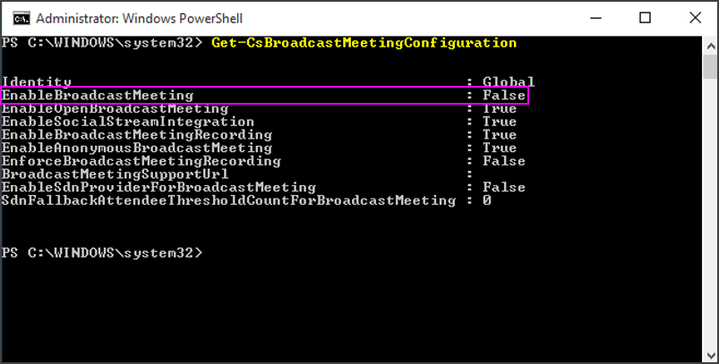
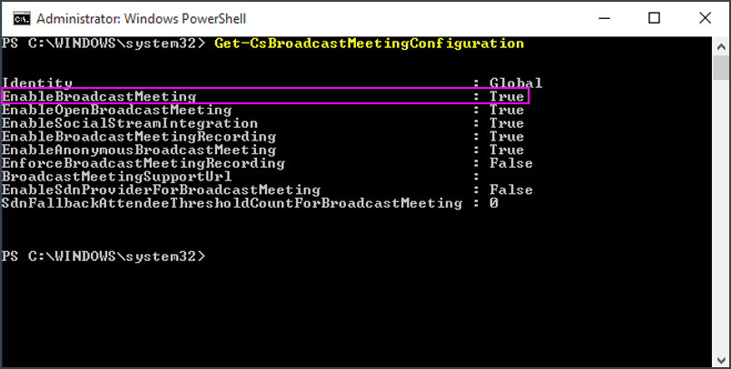

# Enable Skype Meeting Broadcast

Before the people in your organization can use Skype Meeting Broadcast, you need to enable it. To do this, you need to know how to use Windows PowerShell. If you don't know Windows PowerShell, consider hiring a [Microsoft partner](https://go.microsoft.com/fwlink/?linkid=391089) to do this step for you.

  
## Enable Skype Meeting Broadcast using the Skype for Business admin center

 **Using the Skype for Business admin center**

1. Sign in with your Office 365 global admin account or Skype for Business admin account at [https://portal.office.com/adminportal/home](https://portal.office.com/adminportal/home).
    
2. In the admin center, go to **Admin centers** > **Teams**.
    
3. In the **Teams admin center**, go to **Legacy portal** > **Online meetings** > **Broadcast meetings**, and then select **Enable Skype Meeting Broadcast**.
    
## Enable Skype Meeting Broadcast using PowerShell

1. Verify that you are running version 3.0 or higher of Windows PowerShell.
    
2. To verify that you are running version 3.0 or higher: **Start Menu** > **Windows PowerShell**.
    
3. Check the version by typing  _Get-Host_ in the **Windows PowerShell** window.
    
4. If you don't have version 3.0 or higher, you need to download and install updates to Windows PowerShell. See [Windows Management Framework 4.0](https://go.microsoft.com/fwlink/?LinkId=716845) to download and update Windows PowerShell to version 4.0. Restart your computer when you are prompted.
    
5. You will also need to install the Windows PowerShell module for Skype for Business Online that enables you to create a remote Windows PowerShell session that connects to Skype for Business Online. This module, which is supported only on 64-bit computers, can be downloaded from the Microsoft Download Center at [Windows PowerShell Module for Skype for Business Online](https://go.microsoft.com/fwlink/?LinkId=294688). Restart your computer if you are prompted.
    
6. From the **Start Menu**, choose **Windows PowerShell**.
    
7. In the **Windows PowerShell** window, connect to your Office 365 organization by running:
    
   ```
   $Credential = get-credential
   $O365Session = New-CsOnlineSession -Credential $credential
   Import-PSSession $O365Session
   ```

8. Confirm your current Skype Meeting Broadcast configuration by running:
    
   ```
   Get-CsBroadcastMeetingConfiguration
   ```

    Verify that the parameter  _EnableBroadcastMeeting_ is set to `False`.
    
     
  
9. Enable Skype Meeting Broadcast for your organization by running:
    
   ```
   Set-CsBroadcastMeetingConfiguration -EnableBroadcastMeeting $True
   ```

    You can confirm that the setting is enabled by running  `Get-CsBroadcastMeetingConfiguration` again.
    
     
  
    > [!TIP]
    > After you make the change, it may take up to an hour to take effect in the Skype Meeting Broadcast portal. 
  
10. Your users can now hold broadcast meetings with other users in your business. To get them started, point them to [What is a Skype Meeting Broadcast?](https://support.office.com/en-us/article/c472c76b-21f1-4e4b-ab58-329a6c33757d)
    
## Configure your network to broadcast meetings with external attendees

If you have a firewall, and you want to hold broadcasts with people outside of your business (who are not a federated business), you need to configure your network using these instructions: [Set up your network for Skype Meeting Broadcast](set-up-your-network-for-skype-meeting-broadcast.md). 
  
If you aren't experienced with configuring your firewall, consider hiring a [Microsoft partner](https://go.microsoft.com/fwlink/?linkid=391089) to do this step for you.
  
To skip this step and instead add another business to your federation, see [Allow users to contact external Skype for Business users](../set-up-skype-for-business-online/allow-users-to-contact-external-skype-for-business-users.md). 
  
## Related topics

[An introduction to Windows PowerShell and Skype for Business Online](https://go.microsoft.com/fwlink/?LinkId=525039)
  
[Set up Skype for Business Online](../set-up-skype-for-business-online/set-up-skype-for-business-online.md)

  
 
