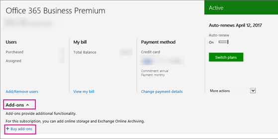
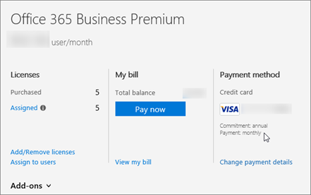

# Office 365 Enterprise E1, E3, and E4

If you have already purchased the [Office 365 Enterprise E1](https://products.office.com/en-us/business/office-365-enterprise-e1-business-software), [E3](https://products.office.com/en-us/business/office-365-enterprise-e3-business-software), or E4 plan, here are the add-on licenses you need to buy to get more Skype for Business features.

|||
|:-----|:-----|
|**To add this feature**   |**Here's what you need to buy**   |
|**Audio Conferencing**   Buy 1 **Audio Conferencing** license for each person who is going to schedule or host a dial-in meeting. Attendees do not need licenses.   |**Audio Conferencing** add-on  Once you buy the license, Microsoft will be your audio conferencing provider. |
|**Toll-free numbers for dial-in access to your meetings, and the ability to dial out from a meeting to add someone by calling any telephone number in the world**   |[Communications Credits](/microsoftteams/add-funds-and-manage-communications-credits)|
|**Phone System**   |1. **Office 365 Phone System** add-on   2. Calling Plans: buy a [Calling Plan](/MicrosoftTeams/calling-plans-for-office-365) from Office 365.    Or, use the [telephone service from your existing provider](../../skype-for-business-and-microsoft-teams-add-on-licensing/skype-for-business-and-microsoft-teams-add-on-licensing.md#bkmk_existing).    |
|**Cloud Voicemail**   |For E1 and E4 plans, buy Exchange Online Plan 2.  Or, switch to an Office Suite that comes with Exchange Online Plan 2, such as Office 365 E3. |
|**Calling Plans**   |1. **Phone System** add-on   2. [Calling Plan](/MicrosoftTeams/calling-plans-for-office-365): you can only buy this after you buy the **Phone System** add-on.   |
   
  
## E1 and E3 customers: How to see prices and buy

1. Sign in to the Office 365 admin center.

2. Go to **Billing** > **Subscriptions** > **Add-ons** > **Buy add-ons**.

   

3. After you buy a **Phone System** license, you'll see the price and option to buy a Calling Plan.

### Partners: How to see prices and buy

The E3 plan is part of your Action Pack. To buy the **Phone System** and **Audio Conferencing** add-ons:

1. Buy one seat of E3 from our [marketing website](https://go.microsoft.com/fwlink/?LinkId=24393). Choose the option to add the seat to your existing tenant.

2. Sign in to the Office 365 admin center and go to **Billing** > **Subscriptions** > **Add-ons**.

    Now you'll see the prices and option to buy the **Phone System** and **Audio Conferencing** add-ons.

## Why don't I see the option to buy add-ons?

In a few situations, you won't see the option to buy Skype for Business add-ons in the Office 365 admin center.

- **You purchased Office 365 Business Premium through GoDaddy**. In this case, you can't buy Skype for Business add-ons. You need to switch to the E3 plan (which GoDaddy doesn't sell), and then you can buy them. [Contact support for business products - Admin Help](https://support.office.com/article/32a17ca7-6fa0-4870-8a8d-e25ba4ccfd4b).

- **You have a monthly commitment instead of an annual commitment**. In some cases, customers who have a monthly commitment can't buy the add-ons (this is different from the payment method, which can be monthly). This is a known issue that we are fixing. [Contact support for business products - Admin Help](https://support.office.com/article/32a17ca7-6fa0-4870-8a8d-e25ba4ccfd4b).

    
