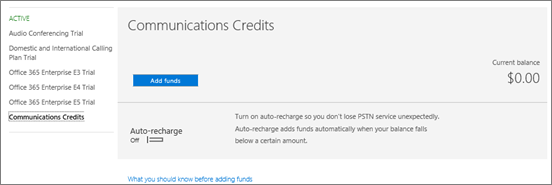
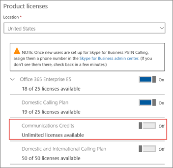

# Skype for Business and Microsoft Teams add-on licensing

Need to talk to someone about all the add-on options? [Contact support for business products - Admin Help](http://support.office.com/article/32a17ca7-6fa0-4870-8a8d-e25ba4ccfd4b).
  
Skype for Business and Microsoft Teams licensing is designed to give you the maximum amount of flexibility. For example, after using basic Skype for Business features for a while, you can buy add-on licenses when you're ready to use more features, such as Audio Conferencing, or the Phone System in Office 365.
  
 **Looking for prices?** See [How to see prices and buy add-on licenses](skype-for-business-and-microsoft-teams-add-on-licensing.md#bkmk_how) or one of the following:
  
- [Pricing for Audio Conferencing](https://products.office.com/en-us/skype-for-business/audio-conferencing#requirements)
    
- [Pricing for Phone System](https://products.office.com/en-us/skype-for-business/phone-system#requirements)
    
- [Pricing for Calling Plans](https://products.office.com/en-us/skype-for-business/calling-plans#requirements)
    
## What are add-on licenses?

Add-on licenses are licenses for specific Skype for Business and Microsoft Teams features. Some businesses want the flexibility of purchasing only specific features at a competitive price. To add a feature, buy one add-on license for each user who is going to use it.
  
 **How does add-on licensing affect cost?** For most businesses, buying a bundle of software in an Enterprise plan will result in lower overall cost. Typically when you buy several add-on licenses individually instead of as part of a plan, you may end up with higher combined cost.
  
## What features can I get with add-on licenses?

Depending on which plan you already have, you can buy add-on licenses for the following Skype for Business and Microsoft Teams features:
  
|||
|:-----|:-----|
|**Feature**   |**Description**   |
|**Audio Conferencing**   |Sometimes people in your organization will need to use a phone to call in to a Skype for Business or Microsoft Teams meeting, instead of using their computer. Use the Audio Conferencing feature for this situation.    To find out whether Audio Conferencing is available in your country or region, see [Country and region availability for Audio Conferencing and Calling Plans](../country-and-region-availability-for-audio-conferencing-and-calling-plans/country-and-region-availability-for-audio-conferencing-and-calling-plans.md).   If you are looking for how much it costs, see [Requirements for Audio Conferencing](https://products.office.com/en-us/skype-for-business/audio-conferencing#requirements).    |
|**Toll free numbers for dial-in access to your conferences, and the ability to dial out from a conference to add someone by calling any telephone number in the world**   |If you add Audio Conferencing, we recommend that you [Set up Communications Credits](skype-for-business-and-microsoft-teams-add-on-licensing.md#bkmk_billing).   |
|**Phone System**   |A PBX is a telephone system in a business. Phone System in Office 365 is a hosted telephone service in Office 365. It gives you both traditional and innovative PBX capabilities, but without the complicated and expensive equipment. [Here's what you get with Phone System in Office 365](../what-is-phone-system-in-office-365/here-s-what-you-get-with-phone-system.md).    If you are looking for how much it costs, see [Requirements for Phone System](https://products.office.com/en-us/skype-for-business/cloud-pbx#requirements).    |
|**Calling Plans**   |Calls to other Skype for Business users are free, but if you want your users to be able to call any phone numbers outside of your business, get a [Calling Plan](calling-plans-for-office-365.md). There are Domestic Calling Plans and Domestic and International Calling Plans in Office 365.    If you are looking for how much it costs, see [Requirements for Calling Plans](https://products.office.com/en-us/skype-for-business/pstn-calling-plans#requirements).    |
|**Skype Room Systems v2**   |This isn't an add-on, but a feature that brings video, audio, and content sharing to conference rooms. See [Licensing for Skype Room Systems v2](skype-for-business-and-microsoft-teams-add-on-licensing.md#bkmk_srs).    |
   
## Guidance for Office 365 Business Premium Plan customers

If you have [Office 365 Business Premium](https://products.office.com/en-us/business/office-365-business-premium), you can use Skype for Business to make calls to other people in your business who are on your subscription. For example, if your business has 10 people, you can call and IM each other using Skype for Business.
  
 **To make and receive calls from people external to your business, you have two options**:
  
- **Option 1. Use the free [Skype app](https://www.skype.com/)**. If you have a very small business (for example, 1-2 people), using the Skype app is the better way to go. It's less expensive to use for domestic and international calls. You can still hold conference calls, make video calls, and share your desktop for presentations. [Check out the rates and payment options](https://secure.skype.com/en/calling-rates?wt.mc_id=legacy&amp;expo365=bundled).
    
    Note that the Skype app isn't part of the Office 365 suite, so it won't be integrated with Outlook 2016 the way Skype for Business is. This means your contacts in Outlook 2016 won't show up in Skype; you'll need to add your contacts to Skype.
    
    We recommend starting with the Skype app to see if it meets your needs. If it doesn't, then consider the next option, to upgrade your plan.
    
    **IMPORTANT**: You have to set a toggle to allow your employees to use Skype for Business to search for Skype users. See [Let Skype for Business users add Skype contacts](../set-up-skype-for-business-online/let-skype-for-business-users-add-skype-contacts.md).
    
- **Option 2. Upgrade your plan, and buy a Phone System and a Domestic or Domestic and International Calling Plan**.

    > [!Important]
    > Although Skype for Business Online Plan 2 is included with the Office Business Premium subscription, **you can’t add cloud voice calling features**. So, we recommend that you evaluate an Enterprise E5 (or Enterprise E3) plan to see if it is more cost effective.
    
1. [Switch to a different Office 365 for business plan](http://support.office.com/article/73318661-8f33-478b-bcc7-fb8d69dbb22a). We recommend that you evaluate an Enterprise E5 plan to see if it is more cost effective.
    
2. Buy the **Phone System** add-on.
    
3. Buy a [Calling Plan for Office 365](calling-plans-for-office-365.md): you can only buy this after you buy the **Phone System** add-on.
    
    This second option is ideal for businesses with several people who make and receive external phone calls.
    
## Which add-on licenses do I need to buy to get more features?

With add-on licenses you have a lot of options, which can be really confusing. [Contact support for business products - Admin Help](http://support.office.com/article/32a17ca7-6fa0-4870-8a8d-e25ba4ccfd4b) and we'll walk you through the options.
  
Choose the plan you have below to see the add-on licenses you can buy to get additional Skype for Business and Microsoft Teams features.
  
### Office 365 Premium, Office 365 ProPlus, or Skype for Business Online Plan 2

If you have already purchased the [Office 365 Business Premium](https://products.office.com/en-us/business/office-365-business-premium), [Office 365 ProPlus](https://products.office.com/en-us/business/office-365-proplus-business-software), or [Skype for Business Online Plan 2](https://products.office.com/en-us/skype-for-business/online) plan, here are the add-on licenses you need to buy to get more Skype for Business features.

> [!IMPORTANT] 
> Although Audio Conferencing, Phone System and Calling Plans can be purchased with Skype for Business Online Plan 2 to enable voice calling features, we recommend that you evaluate an Enterprise E5 plan to see if it is more cost effective.

|||
|:-----|:-----|
|**To add this feature**   |**Here's what you need to buy**   |
|**Audio Conferencing**   Buy 1 **Audio Conferencing** license for each person who is going to schedule or host a dial-in meeting. Attendees do not need licenses.   |**Audio Conferencing** add-on  Once you buy the license, Microsoft will be your audio conferencing provider. |
|**Toll-free numbers for dial-in access to your conferences, and the ability to dial out from a conference to add someone by calling any telephone number in the world**   |[Communications Credits](skype-for-business-and-microsoft-teams-add-on-licensing.md#bkmk_billing)|
|**Phone System**   |1. [Switch to a different Office 365 for business plan](http://support.office.com/article/73318661-8f33-478b-bcc7-fb8d69dbb22a). If you have Office 365 ProPlus, or Skype for Business Online Plan 2 we recommend upgrading your plan to an Enterprise E5 plan to get cloud voice features. If you upgrade to an Enterprise E1 or E3 plan, you'll see the option to buy the **Phone System** add-on.   2. **Phone System** add-on    3. Calling Plans: buy a [Calling Plan](calling-plans-for-office-365.md) from Office 365.    Or, use the [telephone service from your existing provider](skype-for-business-and-microsoft-teams-add-on-licensing.md#bkmk_existing).    |
|**Calling Plans**   |1. [Switch to a different Office 365 for business plan](http://support.office.com/article/73318661-8f33-478b-bcc7-fb8d69dbb22a).    2. **Phone System** add-on   3. [Calling Plan](calling-plans-for-office-365.md): you can only buy this after you buy the **Phone System** add-on.   |
   
> [!NOTE]
> If you're using Skype for Business Online Plan 2 or an Enterprise plan, instead of purchasing the **Audio Conferencing** add-on, you can choose to use a third-party audio conferencing provider. That provider will also host your audio conferencing bridge.
  
### Office 365 Enterprise E1, E3, and E4

If you have already purchased the [Office 365 Enterprise E1](https://products.office.com/en-us/business/office-365-enterprise-e1-business-software), [E3](https://products.office.com/en-us/business/office-365-enterprise-e3-business-software), or E4 plan, here are the add-on licenses you need to buy to get more Skype for Business and Microsoft Teams features.
  
|||
|:-----|:-----|
|**To add this feature**   |**Here's what you need to buy**   |
|**Audio Conferencing**   Buy 1 **Audio Conferencing** license for each person who is going to schedule or host a dial-in meeting. Attendees do not need licenses.   |**Audio Conferencing** add-on  Once you buy the license, Microsoft will be your audio conferencing provider. |
|**Toll-free numbers for dial-in access to your meetings, and the ability to dial out from a meeting to add someone by calling any telephone number in the world**   |[Communications Credits](skype-for-business-and-microsoft-teams-add-on-licensing.md#bkmk_billing)|
|**Phone System**   |1. **Office 365 Phone System** add-on   2. Calling Plans: buy a [Calling Plan](calling-plans-for-office-365.md) from Office 365.    Or, use the [telephone service from your existing provider](skype-for-business-and-microsoft-teams-add-on-licensing.md#bkmk_existing).    |
|**Phone System voicemail**   |For E1 and E4 plans, buy Exchange Online Plan 2.  Or, switch to an Office Suite that comes with Exchange Online Plan 2, such as Office 365 E3. |
|**Calling Plans**   |1. **Phone System** add-on   2. [Calling Plan](calling-plans-for-office-365.md): you can only buy this after you buy the **Phone System** add-on.   |
   
> [!NOTE]
> For Enterprise plans that include Skype for Business Online Plan 2, instead of purchasing the **Audio Conferencing** add-on, you can choose to use a third-party audio conferencing provider. That provider will also host your conferencing bridge.
  
### Office 365 Enterprise E5 (without Audio Conferencing)

If you have already purchased the Office 365 Enterprise E5 (without Audio Conferencing) plan, here are the Skype for Business and Microsoft Teams add-on licenses you need to buy to get more features.
  
|||
|:-----|:-----|
|**To add this feature**   |**Here's what you need to buy**   |
|**Audio Conferencing**   | To get this add-on, do the following:    1. If you have already bought an E5 plan but the Audio Conferencing feature isn't available in your country or region, you will need to use a third-party audio conferencing provider. Find a third-party audio conferencing provider at [Microsoft PinPoint](https://go.microsoft.com/fwlink/?LinkId=797530).      Check this article to see if Audio Conferencing is available in your country or region: [Country and region availability for Audio Conferencing and Calling Plans](../country-and-region-availability-for-audio-conferencing-and-calling-plans/country-and-region-availability-for-audio-conferencing-and-calling-plans.md)    2. If it is available, use the  [Switch plans button](http://support.office.com/article/73318661-8f33-478b-bcc7-fb8d69dbb22a) to move to the Office 365 Enterprise E5 that includes it. You'll get more features, too!   |
|**Phone System is included!**   | Calling Plans: buy a [Calling Plan](calling-plans-for-office-365.md) from Office 365.    Or, use the [telephone service from your existing provider](skype-for-business-and-microsoft-teams-add-on-licensing.md#bkmk_existing).    |
|**Phone System voicemail is included!**   |You don't need anything else.    |
   
### Office 365 Enterprise E5

The [Office 365 Enterprise E5](https://products.office.com/en-us/business/office-365-enterprise-e5-business-software) plan includes most Skype for Business and Microsoft Teams features. There are just a few additional options.
  
|||
|:-----|:-----|
|**To add this feature**   |**Here's what you need to buy**   |
|**Audio Conferencing is included!**   |Once you buy the license, Microsoft will be your audio conferencing provider.    |
|**Toll-free numbers for dial-in access to your meetings, and the ability to dial out from a meeting to add someone by calling any telephone number in the world.**   |[Communications Credits](skype-for-business-and-microsoft-teams-add-on-licensing.md#bkmk_billing)|
|**Phone System and voicemail is included!**   |Calling Plans: buy a [Calling Plan](calling-plans-for-office-365.md) from Office 365.    Or, use the [telephone service from your existing provider](skype-for-business-and-microsoft-teams-add-on-licensing.md#bkmk_existing). |
   
## How to see prices and buy add-on licenses

 **After you buy an Office 365 plan, you see prices and buy add-ons through the Office 365 admin center**.
  
Depending on the add-ons you want, we recommend [comparing whether it's more cost effective](https://go.microsoft.com/fwlink/?linkid=844053) for you to switch to a plan that includes those features already.
  
Expand the following sections to learn how to see the prices and get the add-ons for your plan.
  
### Office 365 Business Premium customers: How to see prices and buy

 **To get Audio Conferencing and Communication Credits:**
  
1. Sign in to the Office 365 admin center.
    
2. Go to **Billing** > **Subscriptions** > **Add-ons** > **Buy add-ons**.
    
    
  
3. You'll now see the prices and option to buy Audio Conferencing, and setup Communications Credits.
    
**To get Phone System and a Calling Plan:**
  
1. Switch to the E1 or E3 plan.
    
2. Go to Office 365 admin center > **Billing** > **Subscriptions**.
    
3. Choose **Add-ons**. You'll now see the prices for Phone System, and the option to buy it.
    
4. After you buy a **Phone System** license, you'll see the price and option to buy a Calling Plan.
    
### E1 and E3 customers: How to see prices and buy

1. Sign in to the Office 365 admin center.
    
2. Go to **Billing** > **Subscriptions** > **Add-ons** > **Buy add-ons**.
    
    
  
3. After you buy a **Phone System** license, you'll see the price and option to buy a Calling Plan.
    
### Partners: How to see prices and buy

The E3 plan is part of your Action Pack. To buy the **Phone System** and **Audio Conferencing** add-ons:
  
1. Buy one seat of E3 from our [marketing website](https://go.microsoft.com/fwlink/?LinkId=24393). Choose the option to add the seat to your existing tenant.
    
2. Sign in to the Office 365 admin center and go to **Billing** > **Subscriptions** > **Add-ons**.
    
    Now you'll see the prices and option to buy the **Phone System** and **Audio Conferencing** add-ons.
    
## Why don't I see the option to buy add-ons?

In a few situations, you won't see the option to buy Skype for Business and Microsoft Teams add-ons in the Office 365 admin center.
  
- **You purchased Office 365 Business Premium through GoDaddy**. In this case, you can't buy Skype for Business and Microsoft Teams add-ons. You need to switch to the E3 plan (which GoDaddy doesn't sell), and then you can buy them. [Contact support for business products - Admin Help](http://support.office.com/article/32a17ca7-6fa0-4870-8a8d-e25ba4ccfd4b).
    
- **You have a monthly commitment instead of an annual commitment**. In some cases, customers who have a monthly commitment can't buy the add-ons (this is different from the payment method, which can be monthly). This is a known issue that we are fixing. [Contact support for business products - Admin Help](http://support.office.com/article/32a17ca7-6fa0-4870-8a8d-e25ba4ccfd4b).
    
    
  
## How to set up Communications Credits

Before you can sign up for Communications Credits, you need the following add-ons as minimum prerequisites:
  
- Phone System and a Calling Plan
    
- Or, Audio Conferencing
    
Once you have those, here's how you sign up:
  
1. Sign in to the Office 365 admin center.
    
2. Go to **Billing** > **Subscriptions** > **Communications Credits**.
    
    
  
3. Choose **Add funds**. We strongly recommend setting up **auto-charge** so you don't run out of funds, which will block your users from making calls.
    
4. After you sign up for Communications Credits billing, you'll need to assign a Communications Credits license to each user in your business who makes calls. You'll have an unlimited number of licenses available.
    
    
  
## Licensing for Skype Room Systems v2

The following table lists the features that are available in [Skype Room Systems version 2 help](https://support.office.com/article/e667f40e-5aab-40c1-bd68-611fe0002ba2) and what licenses you need to buy to get them.
  
> [!NOTE]
> The room that is being set up needs to be a user object and have these licenses assigned to it. 
  
|||||
|:-----|:-----|:-----|:-----|
|**Skype Room System scenario**   |**You currently have Office 365 Premium, Office 365 ProPlus0, or Skype for Business Standalone Plan 2.**   **Here's what you need to buy:**   |**You currently have an Enterprise-based plan.**   **Here's what you need to buy:**   |**You have Skype for Business Server 2015 (on-premises or hybrid).**   **Here's what you need to buy:**   |
|Join a scheduled meeting.    |Skype for Business Standalone Plan 1    |E1, 3, 4, or 5    |Skype for Business Server Standard CAL    |
|Initiate an ad-hoc meeting.    |Skype for Business Standalone Plan 2    |E1, 3, 4, or 5    |Skype for Business Server Standard CAL    Skype for Business Server Enterprise CAL    |
|Initiate an ad-hoc meeting and dial out from a meeting to phone numbers.    |Skype for Business Standalone Plan 2 with Audio Conferencing    **Note:** Communications Credits are optional.           |E1 or E3 with Audio Conferencing    OR    E5    |Skype for Business Standard CAL    Skype for Business Server Enterprise CAL    |
|Give the room a phone number and make or receive a calls from the room or join an audio conference using a phone number.    |Skype for Business Standalone Plan 2 with Office 365 Phone System and a Calling Plan    **Note:** Communications Credits are optional.           |E1 or E3 with Office 365 Phone System and a Office 365 Calling Plan    OR    E5    |Skype for Business Server Standard CAL    Skype for Business Server Plus CAL    |
   
 **Use the right version of Windows 10**: For customers who want to deploy Windows 10 images to their devices, a specific version of Windows 10 is required, and this version is only available to volume licensing customers. You need to use **Windows 10 Enterprise version 1607 or later** for imaging Skype Room System v2.0 devices. You can get a copy from the [Volume Licensing Service Center](https://www.microsoft.com/Licensing/servicecenter/).
  
## Pricing for plans and Communications Credits rates

- [Prices for Office 365 Enterprise Plans](https://go.microsoft.com/fwlink/?LinkId=716844)
    
- [Prices for Calling Plans](https://go.microsoft.com/fwlink/?LinkId=799761). The info is at the bottom of that page.
    
- [Consumption rates for Audio Conferencing](https://go.microsoft.com/fwlink/?LinkId=799762). The info is at the bottom of that page.
    
- [Phone System marketing site for feature details](https://go.microsoft.com/fwlink/?LinkId=799763)
    
## How do I use my existing Calling Plans with Skype for Business?

If you want to use your existing Calling Plan, buy the **Phone System** add-on and use it with the **[free Cloud connector](https://technet.microsoft.com/en-us/library/mt605227.aspx)**.
  
If you are using on-premises PSTN connectivity for hybrid users, you  *only*  assign **Phone System** licenses to your users. **DO NOT** also assign a Calling Plan.
  
For extensive documentation on planning your deployment, including Phone System with on-premises PSTN connectivity, see [Plan your Phone System in Office 365 (Cloud PBX) solution](https://technet.microsoft.com/en-us/library/mt612869.aspx).
  
## Plan Details

For a detailed list of features in each Skype for Business plan, see the [Skype for Business Online Service Description](https://go.microsoft.com/fwlink/?LinkId=730729).
  
## What features are available to GOV, EDU, and non-profit organizations?

|**Skype for Business feature**|**Available to .GOV (GCC)**|**Available to .GOV (non-GCC)**|**Available to .EDU**|**Available to non-profit organizations**|
|:-----|:-----|:-----|:-----|:-----|
|Skype Meeting Broadcast    |Yes    |Yes    |No    |Yes    |
|Skype for Business Audio Conferencing    |Yes    |Yes    |Yes    |Yes    |
|Office 365 Phone System    |Yes    |Yes    |Yes    |Yes    |
|Office 365 Calling Plan    |Yes    |Yes    |Yes    |Yes    |
   
Please see this blog post: [Advanced Office 365 capabilities now available to U.S. Government Community Cloud customers](https://blogs.office.com/2017/01/17/advanced-office-365-capabilities-now-available-to-u-s-government-community-customers/).
  
## What features are available for Office 365 operated by 21Vianet?

Some but not all Skype for Business features are available to customers using Office 365 operated by 21Vianet in China. For a list of what is and isn't available, see [Learn about Office 365 operated by 21Vianet](http://support.office.com/article/A8AB5061-3346-4DA0-BB7C-5260822B53AE).
  

[!INCLUDE [LinkedIn Learning Info](../../common/office/linkedin-learning-info.md)]
   
## Related topics

- [Set up Skype for Business Online](../set-up-skype-for-business-online/set-up-skype-for-business-online.md)
    
- [Set up Phone System voicemail - Admin help](../what-is-phone-system-in-office-365/phone-system-voicemail/set-up-phone-system-voicemail.md)
    
- [Set up Calling Plans](../what-are-calling-plans-in-office-365/set-up-calling-plans.md) and [Calling Plans for Office 365](calling-plans-for-office-365.md)
    
- [Add funds and manage Communications Credits](add-funds-and-manage-communications-credits.md)
    
- [Configure the Cloud Connector](https://technet.microsoft.com/en-us/library/mt605228.aspx) and [Download the Cloud Connector](https://aka.ms/CloudConnectorInstaller)
    
## Feedback?
To provide product feedback or to let us know how we're doing, see [Skype for Business Feedback](https://www.skypefeedback.com).